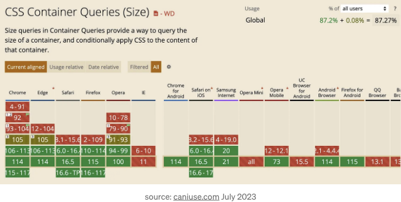
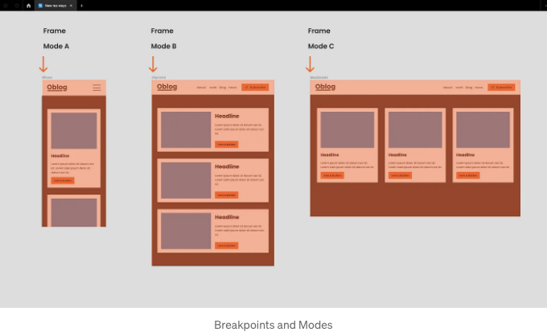
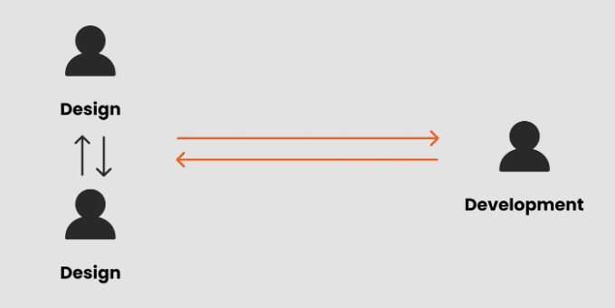
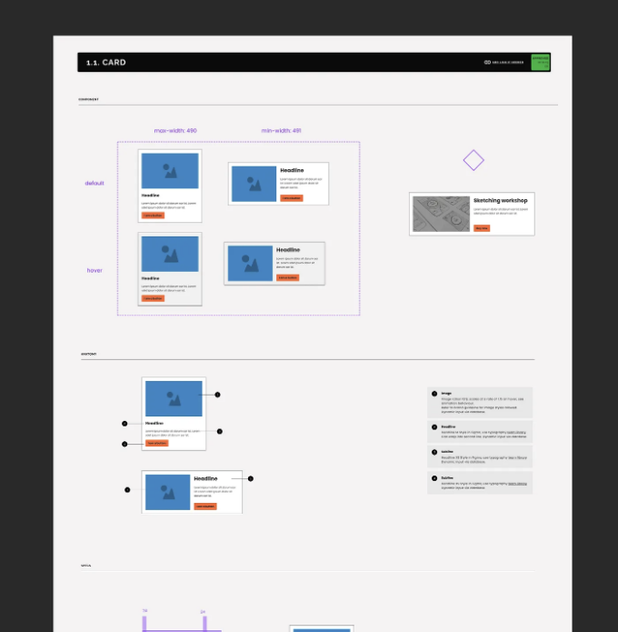
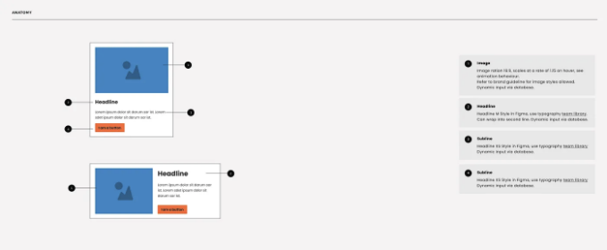
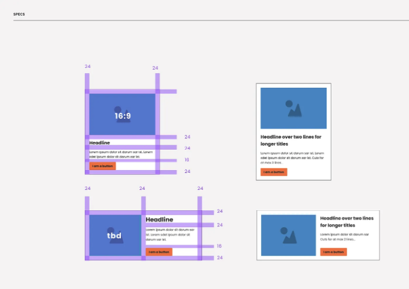
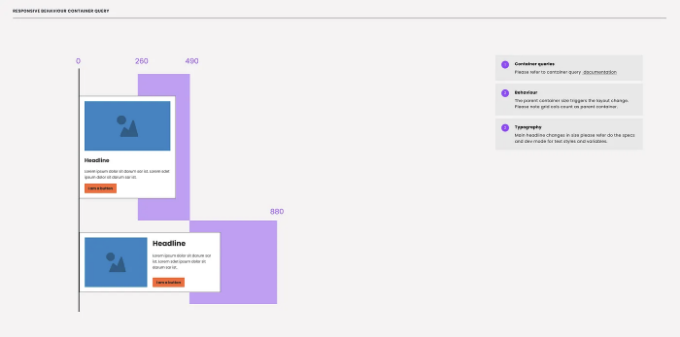
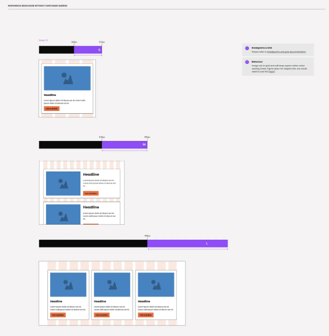

컨테이너 쿼리는 웹 디자인 세계에서 혁신적인 개념으로, 반응형 디자인 방식을 근본적으로 바꿀 잠재력을 갖고 있어요. 디자인 환경이 진화함에 따라, Figma에서 컨테이너 쿼리가 디자인 프로세스에 어떤 영향을 미칠지 상상하는 것이 중요해졌어요.

이 안내서에서는 현재의 브레이크포인트를 사용한 디자인 접근 방식을 살펴보고, 이를 컨테이너 쿼리로 어떻게 바꿀 수 있는지 탐구할 거에요. 또한 컨테이너 쿼리를 위해 기존 Figma 기능을 활용하여 유동적이고 적응형 사용자 경험을 만들어내는 방법도 살펴볼 거에요.

참고: 실제 숫자를 정확히 말하기는 조금 어렵습니다. 왜냐하면 사용 가능성과 널리 지원됨 사이에 큰 차이가 있기 때문이에요.

<!-- ui-log 수평형 -->
<ins class="adsbygoogle"
  style="display:block"
  data-ad-client="ca-pub-4877378276818686"
  data-ad-slot="9743150776"
  data-ad-format="auto"
  data-full-width-responsive="true"></ins>
<component is="script">
(adsbygoogle = window.adsbygoogle || []).push({});
</component>

# 먼저 하는 것: 미디어 쿼리와 브레이크포인트를 활용한 반응형 웹 디자인

우리는 기본을 이해하고 현재 상황을 확인하며 시작해볼까요? 미디어 쿼리가 무엇인지 알아볼까요?

📍참고: 브레이크포인트를 활용하지 않고 반응형 디자인을 달성하는 대안적인 기술들도 있습니다. 예를 들어 순수한 플렉스박스나 CSS 그리드 설정을 사용하는 것 등이 있습니다. 또한 텍스트 크기를 조정할 때는 clamp() 함수를 활용하여 타이포그래피를 동적으로 제어하는 훌륭한 방법이 있습니다. 그러나 컨테이너 쿼리를 이해하기 위해서는 먼저 미디어 쿼리 설정에 대한 탄탄한 이해가 필수적입니다. 이러한 대안이 있음에도 불구하고, 미디어 쿼리와 브레이크포인트는 현재에서도 널리 사용되고 가장 많이 활용되는 반응형 디자인 방법입니다.

미디어 쿼리는 뷰포트 크기에 따라 웹사이트가 외관을 어떻게 조정할지 알려줍니다. 브레이크포인트는 변화가 발생하는 특정 지점이거나 임계점입니다. 이를 통해 웹사이트는 다양한 화면 크기에 맞게 레이아웃과 스타일을 조정하여 다양한 기기에서 좋아보이고 올바르게 작동할 수 있도록 합니다.

<!-- ui-log 수평형 -->
<ins class="adsbygoogle"
  style="display:block"
  data-ad-client="ca-pub-4877378276818686"
  data-ad-slot="9743150776"
  data-ad-format="auto"
  data-full-width-responsive="true"></ins>
<component is="script">
(adsbygoogle = window.adsbygoogle || []).push({});
</component>

CSS에서 미디어 쿼리의 간단한 예제입니다:

@media 규칙은 특정 조건이 충족될 때에만 웹페이지에 특정 스타일을 적용하는 방법입니다. 이 경우에는 조건이 "만약 화면 너비가 768픽셀 이상이면"인 min-width: 768px입니다. 따라서 중괄호 { ... }안에 있는 모든 것은 화면 너비가 768픽셀 이상인 기기에서만 적용됩니다.

사용해야 하는 브레이크포인트의 정확한 개수에 대한 명확한 규칙은 없습니다. 일반적으로 세 개에서 다섯 개 수준이 표준이지만(예: Tailwind의 기본 설정), 필요에 따라 필요한 만큼 많거나 적게 사용할 수 있습니다.

<!-- ui-log 수평형 -->
<ins class="adsbygoogle"
  style="display:block"
  data-ad-client="ca-pub-4877378276818686"
  data-ad-slot="9743150776"
  data-ad-format="auto"
  data-full-width-responsive="true"></ins>
<component is="script">
(adsbygoogle = window.adsbygoogle || []).push({});
</component>

작은 코드 펜을 만들어서 여러분이 직접 미디어 쿼리를 사용하여 브레이크포인트를 조절해보세요.

# Figma에서는 어떻게 동작하나요?

Figma에는 미디어 쿼리나 브레이크포인트가 명시적으로 존재하지는 않지만, 오토 레이아웃과 min-max 설정, 변수를 사용하여 유사한 효과를 낼 수 있습니다. Figma에서 반응형 디자인에 대한 자세한 튜토리얼에서 더 많은 정보를 얻을 수 있습니다.

# 컨테이너 쿼리란 무엇인가요?

<!-- ui-log 수평형 -->
<ins class="adsbygoogle"
  style="display:block"
  data-ad-client="ca-pub-4877378276818686"
  data-ad-slot="9743150776"
  data-ad-format="auto"
  data-full-width-responsive="true"></ins>
<component is="script">
(adsbygoogle = window.adsbygoogle || []).push({});
</component>

한편 컨테이너 쿼리는 웹 개발에서의 기능으로, 컨테이너 엘리먼트의 스타일과 레이아웃이 전체 뷰포트(화면)의 크기가 아닌 해당 컨테이너의 크기에 따라 변경되도록 허용하는 것입니다. 다시 말해, 컨테이너 내 요소들이 특정 컨테이너의 사용 가능한 공간에 따라 외관과 동작을 조절할 수 있게 합니다.

컨테이너 쿼리는 미디어 쿼리와 매우 유사해요. min-width: 300px를 갖는 @container 규칙은 중괄호 내의 스타일이 컨테이너의 너비가 300픽셀 이상일 때 적용된다는 뜻이에요.

이를 통해 요소는 전체 뷰포트가 아닌 부모 컨테이너의 크기에 따라 외관을 조절할 수 있게 되어요. 컨테이너 쿼리는 컨테이너 크기에 따른 엘리먼트 스타일링을 더 정교하게 제어할 수 있어 더 모듈식과 유연한 디자인을 가능하게 합니다.

<!-- ui-log 수평형 -->
<ins class="adsbygoogle"
  style="display:block"
  data-ad-client="ca-pub-4877378276818686"
  data-ad-slot="9743150776"
  data-ad-format="auto"
  data-full-width-responsive="true"></ins>
<component is="script">
(adsbygoogle = window.adsbygoogle || []).push({});
</component>

Smashing Magazine의 Charis가 작은 컨테이너 쿼리 코드 펜을 설정해 주셨어요. Charis에게 감사드려요!

## 📚추가로 읽을 거리

저는 Ahmad Shadeed의 모든 것을 강력히 추천합니다. 반응형 디자인 및 컨테이너 쿼리 주변의 예제들과 함께 읽을만한 굉장히 상세한 기사가 있어요.

<!-- ui-log 수평형 -->
<ins class="adsbygoogle"
  style="display:block"
  data-ad-client="ca-pub-4877378276818686"
  data-ad-slot="9743150776"
  data-ad-format="auto"
  data-full-width-responsive="true"></ins>
<component is="script">
(adsbygoogle = window.adsbygoogle || []).push({});
</component>

# 이미 컨테이너 쿼리를 사용할 수 있을까요?

이 글에서는 명확하게 사이즈 컨테이너 쿼리에 대해 언급하고 있습니다. 아직 개발 중이며 현재 널리 지원되지 않는 스타일 컨테이너 쿼리와 같은 다른 유형의 컨테이너 쿼리도 있음을 언급할 가치가 있습니다.

아직 초기 단계이지만, 사이즈 컨테이너 쿼리는 매우 유망해 보입니다. 그러나 더 오래된 브라우저 버전은 지원하지 않을 것입니다. 확실한 대체 옵션이 있는지 확인해야 하지만, 우리는 동일한 결과를 제공하지는 않을 것이라는 것을 받아들여야 합니다. 그래도, 우리는 반드시 컨테이너 쿼리를 위한 길을 준비할 준비가 되어 있습니다!

<!-- ui-log 수평형 -->
<ins class="adsbygoogle"
  style="display:block"
  data-ad-client="ca-pub-4877378276818686"
  data-ad-slot="9743150776"
  data-ad-format="auto"
  data-full-width-responsive="true"></ins>
<component is="script">
(adsbygoogle = window.adsbygoogle || []).push({});
</component>

# 컨테이너 쿼리용 Figma UI 디자인 설정하기.

Figma에서는 미디어 쿼리나 컨테이너 쿼리와 같은 것은 없습니다. 현재는 컨테이너의 크기를 알 수 있는 방법도 없고, 간단히 말해서: 쿼리를 할 수 없습니다! 하지만 여전히 개발에 디자인 의도를 전달할 수 있는 풍부한 도구가 있습니다. 저희가 사용할 수 있는 몇 가지 옵션을 보여드릴게요. 참고로, 이는 초기 단계의 탐색입니다.

## Figma 변수 모드! 죄송하지만 이 부분은 실제로 작동하지 않아요.

변수 모드는 먼저 떠오를 수 있는 것일 수 있습니다. 모드는 브레이크포인트와 그에 해당하는 변형이나 부울 값을 할당할 때 훌륭합니다. 그렇지만 각각 다른 설정 브레이크포인트가 있고 각 프레임은 모드가 할당된 것을 나타냅니다.

<!-- ui-log 수평형 -->
<ins class="adsbygoogle"
  style="display:block"
  data-ad-client="ca-pub-4877378276818686"
  data-ad-slot="9743150776"
  data-ad-format="auto"
  data-full-width-responsive="true"></ins>
<component is="script">
(adsbygoogle = window.adsbygoogle || []).push({});
</component>

그래서 컨테이너에 모드를 추가하는 것은 간단해 보일 수 있습니다. 그러나 몇 가지 장애물에 직면했습니다:

- 앞서 언급한대로 크기를 직접 쿼리할 수 없으므로 수동 전환이 필요하며, 이는 오류의 원인이 되어 매우 귀찮고 작업하기 어렵습니다.
- Figma는 중첩을 많이 사용하므로 모든 하위 프레임을 훑어야 합니다. 매우 귀찮고 오류의 원인이 됩니다.
- 컨테이너 쿼리는 주로 CSS 그리드와 함께 작동하며, Figma에는 CSS 그리드가 없습니다.

<!-- ui-log 수평형 -->
<ins class="adsbygoogle"
  style="display:block"
  data-ad-client="ca-pub-4877378276818686"
  data-ad-slot="9743150776"
  data-ad-format="auto"
  data-full-width-responsive="true"></ins>
<component is="script">
(adsbygoogle = window.adsbygoogle || []).push({});
</component>

하지만 이러한 도전에도 불구하고, 피그마는 여전히 개발자에게 디자인 의도를 효과적으로 전달하는 다양한 도구를 제공합니다. 함께 살펴보죠:

# 피그마에서 variant를 사용하여 컨테이너 쿼리와 유사한 효과 얻기

피그마에서는 부모 컨테이너(일반적으로 프레임)가 컨테이너 쿼리를 사용해야 할 수도 있습니다. 그러나 현재 피그마는 쿼리를 지원하지 않습니다. 하지만 걱정하지 마세요. 컨테이너 쿼리에서 나오는 반응형 정보는 구성 요소 자체에 저장되어 있고, 이를 피그마에서 구현할 수 있습니다. 다양한 컨테이너 크기에 대한 variant를 만들어주면, 해당 컴포넌트가 다른 크기에서 어떻게 보일지 디자인할 수 있습니다.

요컨대, 컴포넌트의 다른 버전을 원하고(레이아웃 변경, 타이포그래피 변경, 요소 표시/숨김 등이 포함될 수 있음) 어떤 지점 X에서 한 버전에서 다른 버전으로 전환되는 것을 찾아야 합니다. 그런 다음 이를 문서화하여 모두가 인식할 수 있도록 해야 합니다.

<!-- ui-log 수평형 -->
<ins class="adsbygoogle"
  style="display:block"
  data-ad-client="ca-pub-4877378276818686"
  data-ad-slot="9743150776"
  data-ad-format="auto"
  data-full-width-responsive="true"></ins>
<component is="script">
(adsbygoogle = window.adsbygoogle || []).push({});
</component>

좋아요! 그럼 필요한 도구를 살펴보겠습니다. 반응형 동작을 위해 변형을 가진 구성 세트를 설정하고 자동 레이아웃을 적용하며 최소 및 최대 너비를 설정할 것입니다.

## 단계 1: 두 가지 변형을 가진 구성 세트를 설정해봐요.

<!-- ui-log 수평형 -->
<ins class="adsbygoogle"
  style="display:block"
  data-ad-client="ca-pub-4877378276818686"
  data-ad-slot="9743150776"
  data-ad-format="auto"
  data-full-width-responsive="true"></ins>
<component is="script">
(adsbygoogle = window.adsbygoogle || []).push({});
</component>

저는 두 가지 변형을 갖춘 구성 요소 세트를 설정했어요. 이미 "max-width: X"와 "min-width: X"로 이름을 지었음을 보실 수 있어요. 특정한 요구에 맞게 이 이름들을 자유롭게 조정해보세요. 또한 `보다 큰` 혹은 다른 방법으로 속성을 설명하는 이름들을 사용할 수도 있어요.

## 단계 2: 전환 지점 찾기

첫 번째 변형이 멈추고 두 번째 변형이 대신 나타날 구체적인 지점을 결정합시다. 이를 위해 테스트 페이지를 설정하고 있어요.

<!-- ui-log 수평형 -->
<ins class="adsbygoogle"
  style="display:block"
  data-ad-client="ca-pub-4877378276818686"
  data-ad-slot="9743150776"
  data-ad-format="auto"
  data-full-width-responsive="true"></ins>
<component is="script">
(adsbygoogle = window.adsbygoogle || []).push({});
</component>

🚩중요: 이는 디자인 팀의 실험 및 테스트 목적으로만 사용됩니다. 앞으로 이 컴포넌트를 사용하거나 코드를 작성하는 사람들에게는 보이지 않을 것입니다. 이는 "지점 X"를 식별하는 것이 주된 목표이므로 어색하고 실험적일 것으로 예상됩니다.

## 단계 3: 자동 레이아웃 및 최소 및 최대 값 추가.

<!-- ui-log 수평형 -->
<ins class="adsbygoogle"
  style="display:block"
  data-ad-client="ca-pub-4877378276818686"
  data-ad-slot="9743150776"
  data-ad-format="auto"
  data-full-width-responsive="true"></ins>
<component is="script">
(adsbygoogle = window.adsbygoogle || []).push({});
</component>

당신의 컴포넌트는 자동 레이아웃 컴포넌트로 설정해야 합니다. 그런 다음 메뉴를 통해 방금 찾은 최소값과 최대값을 이 컴포넌트에 추가할 수 있습니다. 또한 명확성을 위해 설명으로 추가하는 것을 권장합니다. 필수 사항은 아니지만요.

## 단계 4: 모든 속성 명명이 일치하는지 확인합니다.

이 컴포넌트의 인스턴스를 사용하는 누구에게나 또는 개발 모드에서 이를 검사하는 사람에게 명확하게 하기 위해, 발견한 전환 지점을 변형 속성의 이름에 추가합시다. 이렇게 함으로써 속성의 목적이 명시적으로 표시됩니다. 추가로, 속성 이름 자체를 "container"로 변경하는 것을 제안합니다. 기능에는 영향을 미치지 않지만 목적을 나타냅니다. 아직 테스트 중인 제안이지만, 여기서 동의하고 당신의 팀 규칙에 따라 따르셔도 좋습니다.

<!-- ui-log 수평형 -->
<ins class="adsbygoogle"
  style="display:block"
  data-ad-client="ca-pub-4877378276818686"
  data-ad-slot="9743150776"
  data-ad-format="auto"
  data-full-width-responsive="true"></ins>
<component is="script">
(adsbygoogle = window.adsbygoogle || []).push({});
</component>

## 단계 5: 다른 사람들이 볼 것은 무엇인지 살펴봅시다.

이제 컴포넌트의 인스턴스를 끄집어내 봅시다. "container"라는 속성이 있다는 것을 알 수 있습니다. 이는 바꿔야 할 지점을 나타냅니다. 이 프로세스는 아직 수동으로 번거로울 수 있습니다. (그 점은 죄송합니다!). 그리고 부가적으로 "XY"라는 속성으로 이름을 지을 수도 있습니다. 중요한 것은 네이밍 규칙을 일관성 있게 유지하는 것입니다.

<!-- ui-log 수평형 -->
<ins class="adsbygoogle"
  style="display:block"
  data-ad-client="ca-pub-4877378276818686"
  data-ad-slot="9743150776"
  data-ad-format="auto"
  data-full-width-responsive="true"></ins>
<component is="script">
(adsbygoogle = window.adsbygoogle || []).push({});
</component>

개발 모드에서는 개발자들이 보게 되는 것이며, 이 속성을 확인할 수 있고 속성의 플레이그라운드를 열어 두 가지 버전을 볼 수 있습니다. 생성되는 CSS는 정확하지 않을 수 있지만, 우리가 달성하려는 바를 효과적으로 전달합니다. 그러나 더 많은 상세 내용을 문서화 하는 것을 추천합니다. 곧 이에 대해 다루겠습니다.

# 더 나아갈 수 있을까요? 네, 가능합니다! 중첩 프레임에 min을 추가하고 wrap으로 설정해 보세요! (어떤 경우에는 작동함)

음, 조금 더 가능합니다! 하지만 이것은 특정한 경우에만 작동하며, 텍스트 크기를 동적으로 바꾸거나 요소를 숨기거나 표시하는 기능이 아닌 방향만 변경하는 경우에만 작동합니다.

변형 대신에, 이미지(왼쪽의 파란색 사각형)와 내용(오른쪽의 텍스트와 버튼)을 포함하는 중첩 자동 레이아웃 프레임에 최소값을 추가할 수 있습니다. 이제 부모 컨테이너를 wrap으로 변경하면, 오른쪽 콘텐츠를 감쌀 것이고, 최소 너비에 도달하면 이미지 아래에 오른쪽 콘텐츠를 배치할 것입니다. 부모에 최소 및 최대 너비를 추가하고 코드를 정리할 수도 있습니다. 그러면 뚜렷한 컨테이너 쿼리와 거의 동일한 것을 만들 수 있고, 컴포넌트 세트를 제거할 수 있습니다.

<!-- ui-log 수평형 -->
<ins class="adsbygoogle"
  style="display:block"
  data-ad-client="ca-pub-4877378276818686"
  data-ad-slot="9743150776"
  data-ad-format="auto"
  data-full-width-responsive="true"></ins>
<component is="script">
(adsbygoogle = window.adsbygoogle || []).push({});
</component>

## 조심해요, CSS 그리드가 아니라 개발 모드에서 플렉스박스 설정이에요!

지금은 우리가 목표로 하는 것을 꽤 잘 흉내내고 있어요. 그러나 개발 모드로 전환하면 플렉스박스 레이아웃으로 설정되어 있음을 볼 수 있어요 (이제 픽셀과 rems 사이를 전환할 수 있어서 멋진 기능이에요).

<!-- ui-log 수평형 -->
<ins class="adsbygoogle"
  style="display:block"
  data-ad-client="ca-pub-4877378276818686"
  data-ad-slot="9743150776"
  data-ad-format="auto"
  data-full-width-responsive="true"></ins>
<component is="script">
(adsbygoogle = window.adsbygoogle || []).push({});
</component>

CSS 컨테이너 쿼리에서는 이러한 종류의 배열을 자주 CSS 그리드를 사용하여 달성하는 경우가 많습니다. Charis의 이전 코드펜 예제에서 보는 것과 같습니다. 유감스럽게도 Figma에는 CSS 그리드 기능이 없으므로 생성된 코드가 그 예제와 정확히 일치하지는 않을 것입니다. 그러나 올바른 문서화를 통해 개념은 효과적으로 전달될 것이며, 곧 달성할 수 있을 것입니다.

# 그렇지만 여전히 수동으로 인스턴스를 교체하고 있다고 말할 수 있습니다.

정말 그렇습니다. Figma에 더 많은 논리와 쿼리를 추가할 수 없는 것이 안타깝습니다(그것이 곧 나올 것이라고 확신합니다). 그러나 지금은 우리가 실제로 원하는 목표에 집중해 봅시다.

<!-- ui-log 수평형 -->
<ins class="adsbygoogle"
  style="display:block"
  data-ad-client="ca-pub-4877378276818686"
  data-ad-slot="9743150776"
  data-ad-format="auto"
  data-full-width-responsive="true"></ins>
<component is="script">
(adsbygoogle = window.adsbygoogle || []).push({});
</component>

그럼, 한 가지 단계를 추가해 보겠습니다! 바로... 예, 아마 이미 알아챘을 거에요, 제가 가장 좋아하는 것! 우리가 무엇을 시도하고 소통하려는지 다른 디자이너와 개발자들, 즉 모두가 이해할 수 있도록 모든 것을 문서화합시다. 물론 디자인과 개발 사이에 정기적인 확인이 동반되어야 합니다.

# 컨테이너 쿼리 컴포넌트 문서 작성

이번에는 우리의 변형 예제를 사용하겠습니다. 또한, 여러분의 문서는 다를 수 있습니다. 파일, 라이브러리, 또는 별도의 페이지/디자인 시스템에서 더 길거나 짧을 수 있습니다 — 이는 괜찮습니다. 문서는 여러 형태로 제공될 수 있으며, 중요한 것은 모든 팀원에게 중요한 정보를 일관되게 전달하여 모두에게 도움이 되는 것입니다. 그래서 여기 저의 카드 예제가 있습니다. 함께 살펴봅시다:

<!-- ui-log 수평형 -->
<ins class="adsbygoogle"
  style="display:block"
  data-ad-client="ca-pub-4877378276818686"
  data-ad-slot="9743150776"
  data-ad-format="auto"
  data-full-width-responsive="true"></ins>
<component is="script">
(adsbygoogle = window.adsbygoogle || []).push({});
</component>

## 단계 1: 컴포넌트 문서화에는 항상 섹션을 사용하세요!

단순히 Shift+S를 눌러 섹션을 그릴 수 있습니다. 항상 프레임이 아닌 섹션에 컴포넌트를 배치하세요 (우리가 사용했던 대로). 아이콘을 빠르게 식별할 수 있고 에셋 패널에 폴더를 만들 수 있는 등 여러 이점이 있습니다. 서브 조직화를 위해 섹션에 프레임을 배치하거나 빠르게 대화식 동작을 데모하기 위해서도 프레임을 섹션에 배치할 수 있습니다. Figama Config 23에서 섹션과 그 이점에 대해 이야기했었는데, 정말 좋아해요! 게다가 Config 23 이후로 섹션을 개발 준비 상태로 표시할 수도 있어요, 멋지죠!

나의 컴포넌트나 컴포넌트 세트를 추가하는 것 외에도, 더 현실적인 버전을 보여주기 위해 내용이 들어간 인스턴스를 포함시키는 것이 좋아요.

<!-- ui-log 수평형 -->
<ins class="adsbygoogle"
  style="display:block"
  data-ad-client="ca-pub-4877378276818686"
  data-ad-slot="9743150776"
  data-ad-format="auto"
  data-full-width-responsive="true"></ins>
<component is="script">
(adsbygoogle = window.adsbygoogle || []).push({});
</component>

## 2. 구조

피그마에서 컴포넌트 구조를 문서화하는 것은 디자이너와 개발자 모두가 피그마 디자인 파일 내에서 컴포넌트의 내부 구조와 동작을 이해하는 데 도움이 됩니다.

## 3. 스펙

<!-- ui-log 수평형 -->
<ins class="adsbygoogle"
  style="display:block"
  data-ad-client="ca-pub-4877378276818686"
  data-ad-slot="9743150776"
  data-ad-format="auto"
  data-full-width-responsive="true"></ins>
<component is="script">
(adsbygoogle = window.adsbygoogle || []).push({});
</component>

아직 컴포넌트 스펙을 추가하는 것을 좋아하지만 새로운 개발 모드로 인해 더 이상 관련이 없습니다. 타당한 의견이네요. 여기에 더 많거나 덜 많은 내용으로 버전을 보여주는 것도 좋아해요.

## 4. 상호작용 행동

이 부분에서 다시 섹션이 유용하게 사용됩니다. 이제 섹션에 인스턴스가 있는 프레임을 배치하여 사용 가능한 경우 상호작용 행동을 데모할 수 있습니다. 예를 들어, 호버 상태와 같은 것들을 보여줄 수 있어요.

<!-- ui-log 수평형 -->
<ins class="adsbygoogle"
  style="display:block"
  data-ad-client="ca-pub-4877378276818686"
  data-ad-slot="9743150776"
  data-ad-format="auto"
  data-full-width-responsive="true"></ins>
<component is="script">
(adsbygoogle = window.adsbygoogle || []).push({});
</component>

## 5. 반응형 동작

시작해 봅시다. 이 부분이 우리가 찾고 있는 문서의 일부입니다. Figma에서 만든 컨테이너 쿼리 컴포넌트에 대한 개요를 제공할 수 있습니다. 이를 통해 최소 및 최대 너비를 보여주고, 컨테이너 쿼리가 어디에서 시작되며 디자인이 변경되는 지 명확히 설명할 수 있습니다.

<!-- ui-log 수평형 -->
<ins class="adsbygoogle"
  style="display:block"
  data-ad-client="ca-pub-4877378276818686"
  data-ad-slot="9743150776"
  data-ad-format="auto"
  data-full-width-responsive="true"></ins>
<component is="script">
(adsbygoogle = window.adsbygoogle || []).push({});
</component>

## 추가 정보: 그런데, 전통적인 그리드와 미디어 쿼리를 사용하는 경우, 반응형 정보는 다음과 같이 보일 수 있습니다:

만약 그리드와 미디어 쿼리를 함께 사용한다면, 여기에 추가해주세요.

## 그리고 개발자 모드에서는 무엇을 볼까요:

<!-- ui-log 수평형 -->
<ins class="adsbygoogle"
  style="display:block"
  data-ad-client="ca-pub-4877378276818686"
  data-ad-slot="9743150776"
  data-ad-format="auto"
  data-full-width-responsive="true"></ins>
<component is="script">
(adsbygoogle = window.adsbygoogle || []).push({});
</component>

만약 섹션을 "개발 준비 완료"로 표시하면, 개발 모드에서 파일을 보는 사람들이 왼쪽 상단에 표시됩니다. 우리는 단위를 조정할 수 있어요, 예를 들어 px에서 rem으로 변경하고, 모든 사양을 확인하고 컴포넌트를 검사할 수 있어요. 또한 저는 속성 playground를 좋아해요, 여기서 속성 간에 전환하고 더 많은 정보를 얻을 수 있어요.

# 팁: Figma에서 문서 자동화하세요.

문서 작업은 시간이 많이 소요될 수 있지만, Eight Shapes Specs 플러그인을 사용하여 문서 작업을 자동화할 수 있어요.

<!-- ui-log 수평형 -->
<ins class="adsbygoogle"
  style="display:block"
  data-ad-client="ca-pub-4877378276818686"
  data-ad-slot="9743150776"
  data-ad-format="auto"
  data-full-width-responsive="true"></ins>
<component is="script">
(adsbygoogle = window.adsbygoogle || []).push({});
</component>

프레임을 생성하여 필요한 모든 정보를 제공하며, 주요 구성 요소 아래 섹션으로 쉽게 끌어다 놓을 수 있습니다. 이를 통해 문서를 정리하고 최신 상태로 유지하는 데 시간과 노력을 절약할 수 있습니다. 그러나 이 플러그인은 반응형 부분을 다루지 않기 때문에 표준 미디어 쿼리 또는 컨테이너 쿼리 정보를 처리해야 합니다.

# 더 많은 정보가 있습니다..

컨테이너 쿼리에 대한 매우 간단하고 간략한 소개였지만, 탐색할 많은 부분이 있습니다! 주목해야 할 몇 가지 중요한 포인트:

<!-- ui-log 수평형 -->
<ins class="adsbygoogle"
  style="display:block"
  data-ad-client="ca-pub-4877378276818686"
  data-ad-slot="9743150776"
  data-ad-format="auto"
  data-full-width-responsive="true"></ins>
<component is="script">
(adsbygoogle = window.adsbygoogle || []).push({});
</component>

- 컨테이너 쿼리를 중첩할 수 있어요 (예: 카드 안에 버튼).
- 당연히 브레이크포인트와 결합할 수 있어요.
- CSS 그리드와도 결합할 수 있어요.
- 컨테이너 쿼리 단위가 있어요 (cqw, cqh, cqi, cqb, cqmin, cqmax).
- CSS에서 컨테이너가 컨테이너 쿼리 컨테이너가 되는지 여부를 표시할 수 있어요 — 이건 당신이 결정하는 거예요, 자동으로 결정되는 게 아니에요!
- 컨테이너 스타일 쿼리는 개발 중이지만 아직 널리 지원되지 않아요.

# 결론

컨테이너 쿼리는 현대 CSS에서 가장 흥미 진진한 발전 중 하나로, 반응형 디자인 접근 방식을 흔들어 놓을 준비가 됐어요.

현재 Figma는 이러한 동작을 모방하지는 않지만, 이 글에서 보듯이 우리는 매우 근접할 수 있어요. 컴포넌트와 문서를 신중하게 설정하여 디자이너들이 배경에 컨테이너 쿼리 설정을 고려하여 인스턴스를 올바르게 활용할 수 있어요. 무엇보다도, 개발팀과 효과적으로 소통하여 다음 반응형 단계를 함께 계획할 수 있어요.

<!-- ui-log 수평형 -->
<ins class="adsbygoogle"
  style="display:block"
  data-ad-client="ca-pub-4877378276818686"
  data-ad-slot="9743150776"
  data-ad-format="auto"
  data-full-width-responsive="true"></ins>
<component is="script">
(adsbygoogle = window.adsbygoogle || []).push({});
</component>

## 추가 자료:

- [Miriam Suzanne: CSS 컨테이너, 어떻게 사용하나요? CSS Day 2023 🔥 놀라운 토크!](https://example.com)
- [Una Kravets: 컨테이너 쿼리 - 브라우저에서 디자인하기](https://example.com)
- [컨테이너 쿼리 폴리필](https://example.com)
- [ishadeed.com](https://example.com)
- [CSS 컨테이너 쿼리: 사용 사례 및 이주 전략](https://example.com)
- [CSS 컨테이너 쿼리에 대한 기본 지식](https://example.com)
- [Figma에서 브레이크포인트 작업: 반응형 디자인 테스트 및 문서화하기](https://example.com)

# 계속 연락하고 싶으세요!

이 글이 유용했기를 바랍니다. 만약 그렇다면 클랩(clap)을 눌러주세요! 미디엄(Medium)에서 제 게시물을 구독하고, moonlearning.io, 트위터, LinkedIn에서 저와 함께 UI 디자인, Figma + 코드에 대해 가르치고 이야기하는 모습을 지켜봐주세요.