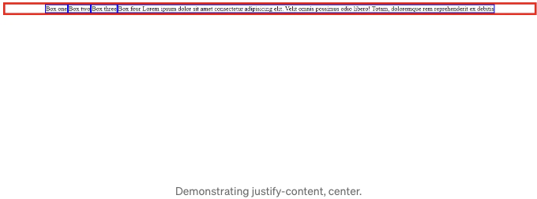

안녕하세요!

이번 포스트에서는 CSS flexbox를 자세히 설명하겠습니다.

먼저 display를 flex로 설정하여 container 클래스가 있는 div를 만들어 보겠습니다.

```js
.container {
      display: flex;
}
```

<!-- ui-log 수평형 -->

<ins class="adsbygoogle"
  style="display:block"
  data-ad-client="ca-pub-4877378276818686"
  data-ad-slot="9743150776"
  data-ad-format="auto"
  data-full-width-responsive="true"></ins>
<component is="script">
(adsbygoogle = window.adsbygoogle || []).push({});
</component>

그럼 html에서 container 클래스를 가진 div를 만들어보죠. 이 div 안에 "Box one", "Box two", "Box three", "Box four"라는 텍스트가 있는 4개의 더 많은 div를 넣을 수 있어요.

```js
<div class="container">
  <div>Box one</div>
  <div>Box two</div>
  <div>Box three</div>
  <div>Box four</div>
</div>
```

다음으로 위의 네 개의 div에서 찾은 텍스트가 수평으로 표시됩니다. 이것은 display flex rule 때문입니다.


<!-- ui-log 수평형 -->

<ins class="adsbygoogle"
  style="display:block"
  data-ad-client="ca-pub-4877378276818686"
  data-ad-slot="9743150776"
  data-ad-format="auto"
  data-full-width-responsive="true"></ins>
<component is="script">
(adsbygoogle = window.adsbygoogle || []).push({});
</component>

그 외의 요소들과 마찬가지로 디브에는 패딩, 마진, 테두리, 높이, 너비 등을 설정할 수 있지만, 우리는 플렉스박스에 파란 테두리를 줄 것입니다.

```js
.container div {
      border: 1px solid blue;
}
```

플렉스박스의 자식에도 테두리를 적용하여 각각의 상자에 배치합니다. 그래서 부모 요소의 모든 자식을 선택하는 space요소 선택기 클래스를 사용하고 있습니다.

CSS FLEXBOX 속성 및 플렉스 컨테이너 속성입니다.

<!-- ui-log 수평형 -->

<ins class="adsbygoogle"
  style="display:block"
  data-ad-client="ca-pub-4877378276818686"
  data-ad-slot="9743150776"
  data-ad-format="auto"
  data-full-width-responsive="true"></ins>
<component is="script">
(adsbygoogle = window.adsbygoogle || []).push({});
</component>

앞으로는 CSS 플렉스박스 속성과 플렉스 컨테이너 속성에 대해 이야기하겠습니다. CSS 플렉스박스 속성은 flex-grow, flex-shrink 및 flex-basis가 있습니다. 플렉스 컨테이너는 flex-wrap, flex-flow, flex-direction, writing-mode, gap, justify-content, align-content, place-content, align-self, align-items와 같은 속성을 갖습니다.

CSS 플렉스박스 속성

- Flex-grow

flex-grow 속성은 해당 항목이 같은 컨테이너 내의 다른 유연한 항목과 비교하여 얼마나 커질지를 지정합니다. 중요한 점은 flex-grow 속성이 유연한 항목에만 적용된다는 것입니다. 따라서 스타일링 중인 요소가 유연한 항목이 아닌 경우 flex-grow 속성이 효과가 없습니다. 기본값은 0으로 설정됩니다.

<!-- ui-log 수평형 -->

<ins class="adsbygoogle"
  style="display:block"
  data-ad-client="ca-pub-4877378276818686"
  data-ad-slot="9743150776"
  data-ad-format="auto"
  data-full-width-responsive="true"></ins>
<component is="script">
(adsbygoogle = window.adsbygoogle || []).push({});
</component>

예를 들어

```js
div:nth-child(3) {
  flex-grow: 3;
}
```

이렇게하면 부모 div에서 찾은 세 번째 상자를 키울 수 있습니다. 다른 상자들에는 영향을 주지 않습니다. 아래 이미지를 참조하세요


<!-- ui-log 수평형 -->

<ins class="adsbygoogle"
  style="display:block"
  data-ad-client="ca-pub-4877378276818686"
  data-ad-slot="9743150776"
  data-ad-format="auto"
  data-full-width-responsive="true"></ins>
<component is="script">
(adsbygoogle = window.adsbygoogle || []).push({});
</component>

위에서 볼 수 있듯이 상자 세 가지가 남은 공간이 있을 때 상대적으로 세 번째 상자가 더 커졌습니다.

- Flex-shrink

이제 flex-grow의 반대로 이해합시다. flex-shrink는 연결한 요소의 길이를 줄이는 것입니다. 다시 말해, 충분한 공간이 없을 때 컨테이너 내 다른 항목에 비해 상대적으로 줄어듭니다. flex-shrink의 기본 값은 오버플로우를 방지하기 위해 일반적으로 1입니다. 이제 할 일을 보겠습니다. 먼저 상자 네 가지에 더 많은 텍스트를 추가하고 상자 네 가지의 flex-shrink를 0으로 설정하여 페이지 크기를 조정해 보겠습니다.

```js
div:nth-child(4) {
    flex-shrink: 0;
}
```

<!-- ui-log 수평형 -->

<ins class="adsbygoogle"
  style="display:block"
  data-ad-client="ca-pub-4877378276818686"
  data-ad-slot="9743150776"
  data-ad-format="auto"
  data-full-width-responsive="true"></ins>
<component is="script">
(adsbygoogle = window.adsbygoogle || []).push({});
</component>


이미지를 보면 상자 네 개에서 텍스트가 오버플로우되어 수평 스크롤 바가 아래에 생성되어 나머지 텍스트를 볼 수 있게 되었다는 것을 알 수 있습니다. 많은 사람들이 아직 수직과 수평을 혼동하는 경우가 많기 때문에 여기에 도움이 될 만한 간단한 팁이 있습니다. 수평에 대해 이야기할 때는 왼쪽에서 오른쪽으로 생각하고 수직은 위에서 아래로 표시됩니다.

다음으로, 상자 1에서 flex-shrink의 기본값을 사용하여 flex-shrink가 무엇을 하는지 설명하겠습니다.

```js
div:nth-child(4) {
    flex-shrink: 1;
}
```

<!-- ui-log 수평형 -->

<ins class="adsbygoogle"
  style="display:block"
  data-ad-client="ca-pub-4877378276818686"
  data-ad-slot="9743150776"
  data-ad-format="auto"
  data-full-width-responsive="true"></ins>
<component is="script">
(adsbygoogle = window.adsbygoogle || []).push({});
</component>


알아봤나요? 우리의 가로 스크롤 막대가 사라지고 상자 네 안에 넘치는 텍스트가 아래로 줄어들어 보입니다.

- Flex-basis

CSS에서 flexbox의 세 번째 속성은 flex-basis입니다. Flex-basis는 남은 공간이 분배되기 전에 항목의 초기 크기를 지정합니다. 이 속성은 기본값으로 auto를 가지고 있어 항목은 내용에 따라 크기가 결정됩니다. 픽셀이나 백분율을 사용하여 크기를 조정할 수 있으며, 단위 없는 값으로 설정되는 flex-grow 및 shrink와는 다릅니다.

<!-- ui-log 수평형 -->

<ins class="adsbygoogle"
  style="display:block"
  data-ad-client="ca-pub-4877378276818686"
  data-ad-slot="9743150776"
  data-ad-format="auto"
  data-full-width-responsive="true"></ins>
<component is="script">
(adsbygoogle = window.adsbygoogle || []).push({});
</component>

우리의 div들에게 flex-basis를 0으로 지정해 봅시다!

```js
.container div {
      flex-basis: 0;
    }
```


flex-basis가 0이라고 해서 실제로 0이 되는 것은 아닙니다. 대신 최소 내용 크기(min-content intrinsic size)로 작아집니다.

<!-- ui-log 수평형 -->

<ins class="adsbygoogle"
  style="display:block"
  data-ad-client="ca-pub-4877378276818686"
  data-ad-slot="9743150776"
  data-ad-format="auto"
  data-full-width-responsive="true"></ins>
<component is="script">
(adsbygoogle = window.adsbygoogle || []).push({});
</component>

포함된 내용은 `flex-grow`, `flex-shrink`, `flex-basis`를 일일이 작성하는 대신에 `flex` CSS 속성을 사용하여 모두 처리할 수 있습니다.

```js
.container div {
    flex: 1;
}
```

이는 다음과 같이 해독될 수 있습니다.

```js
.container div {
    flex-grow: 1;
    flex-shrink: 1;
    flex-basis: 0;
}
```

<!-- ui-log 수평형 -->

<ins class="adsbygoogle"
  style="display:block"
  data-ad-client="ca-pub-4877378276818686"
  data-ad-slot="9743150776"
  data-ad-format="auto"
  data-full-width-responsive="true"></ins>
<component is="script">
(adsbygoogle = window.adsbygoogle || []).push({});
</component>

이것을 사용하면 각 상자에 1의 flex grow가 지정되어 사용 가능한 공간에 맞게 크기를 조정하지만, shrink가 되어 오버플로우가 발생하지 않도록하며, flex-basis는 가장 큰 콘텐츠가 들어있는 상자의 크기를 가지게 하는 것이다. 즉, 콘텐츠가 작을지라도 모든 상자인 상자 하나, 둘, 셋이 상자 넷의 크기를 가지게 됩니다.

아래를 보면 상자 한 개, 둘, 셋이 콘텐츠가 적더라도 상자 넷과 크기가 같음을 알 수 있습니다.


플렉스 컨테이너 속성들

<!-- ui-log 수평형 -->

<ins class="adsbygoogle"
  style="display:block"
  data-ad-client="ca-pub-4877378276818686"
  data-ad-slot="9743150776"
  data-ad-format="auto"
  data-full-width-responsive="true"></ins>
<component is="script">
(adsbygoogle = window.adsbygoogle || []).push({});
</component>

이전에 언급한대로, 플렉스 컨테이너는 유연한 레이아웃을 가지며, flex-wrap, flex-direction, justify-content, align-items 및 align-self와 같은 속성을 가지고 있습니다.

- Flex-wrap

Flex-wrap은 flex 아이템이 컨테이너의 크기를 초과하는 경우 flex 아이템이 줄바꿈해야 하는지 여부를 결정합니다. 여기서 기본값은 nowrap(하이픈 없이)으로 설정되어 있으며, 이는 flex-shrink에 대해 이야기할 때 우리가 보았던 것처럼 줄바꿈을 하지 않고 오히려 컨테이너를 넘어가도록 합니다. 여기서 해야 할 일은 값이 wrap으로 설정되도록하여 화면 크기가 조정될 때 어떤 일이 발생하는지를 보여주는 것입니다.

```js
.container div {
    flex-wrap: wrap;
}
```

<!-- ui-log 수평형 -->

<ins class="adsbygoogle"
  style="display:block"
  data-ad-client="ca-pub-4877378276818686"
  data-ad-slot="9743150776"
  data-ad-format="auto"
  data-full-width-responsive="true"></ins>
<component is="script">
(adsbygoogle = window.adsbygoogle || []).push({});
</component>


이 속성은 다양한 화면 크기와 디바이스에 적응하는 반응형 및 유연한 디자인을 만들 때 매우 유용합니다.

2. Flex-direction.

여기서 우리는 유연한 항목들이 취해야 할 방향을 지정합니다. 기본 flex-direction은 보통 행(row)이지만, 아래에 보면 열(columns)이 있고 행(rows)이 아닙니다. 이는 부모 요소가 메인 축인 행(row)이기 때문에 위에서 아래로 또는 위쪽에서 아래쪽으로 우리의 교차 축(cross axis)이 됩니다.

<!-- ui-log 수평형 -->

<ins class="adsbygoogle"
  style="display:block"
  data-ad-client="ca-pub-4877378276818686"
  data-ad-slot="9743150776"
  data-ad-format="auto"
  data-full-width-responsive="true"></ins>
<component is="script">
(adsbygoogle = window.adsbygoogle || []).push({});
</component>


메인 축은 항상 flex-direction을 보고 있습니다. 그래서 flex-direction을 column으로 변경하여 어떤 일이 일어나는지 살펴봅시다.


이제 메인 축은 열로 되고 교차 축은 행으로 됩니다. 다음 속성으로 넘어가면 메인 축과 교차 축을 이해해야 하는 이유를 볼 것입니다.

<!-- ui-log 수평형 -->

<ins class="adsbygoogle"
  style="display:block"
  data-ad-client="ca-pub-4877378276818686"
  data-ad-slot="9743150776"
  data-ad-format="auto"
  data-full-width-responsive="true"></ins>
<component is="script">
(adsbygoogle = window.adsbygoogle || []).push({});
</component>

3. 정렬 내용.

정렬 내용은 행의 주 축인 주축과 함께 작동합니다. justify-content는 적용하는 행에 여분 공간이 있을 때에만 작동합니다. justify-content를 가운데 정렬로 시작해 봅시다.

```js
.container {
    justify-content: center;
}
```



<!-- ui-log 수평형 -->

<ins class="adsbygoogle"
  style="display:block"
  data-ad-client="ca-pub-4877378276818686"
  data-ad-slot="9743150776"
  data-ad-format="auto"
  data-full-width-responsive="true"></ins>
<component is="script">
(adsbygoogle = window.adsbygoogle || []).push({});
</component>

우리는 기본적으로 flex-start라는 것도 있습니다. 그리고는 반대로 작용하는 flex-end도 있어서 행의 끝까지 모든 것을 밀어내게 하는 효과를 줄 수 있습니다.

```js
.container{
    justify-content: flex-end;
    }
```


우리는 또한 공간을 다루는데 사용하는 것도 있습니다. 그것은; space-between, space-around 그리고 space-evenly입니다.

<!-- ui-log 수평형 -->

<ins class="adsbygoogle"
  style="display:block"
  data-ad-client="ca-pub-4877378276818686"
  data-ad-slot="9743150776"
  data-ad-format="auto"
  data-full-width-responsive="true"></ins>
<component is="script">
(adsbygoogle = window.adsbygoogle || []).push({});
</component>

```js
.container{
      justify-content: space-between;
    }
```


```js
.container{
      justify-content: space-around;
    }
```


<!-- ui-log 수평형 -->
<ins class="adsbygoogle"
  style="display:block"
  data-ad-client="ca-pub-4877378276818686"
  data-ad-slot="9743150776"
  data-ad-format="auto"
  data-full-width-responsive="true"></ins>
<component is="script">
(adsbygoogle = window.adsbygoogle || []).push({});
</component>

공간 주변에 space-around은 공간을 균등하게 분배하지 않기 때문에, 아마 space-evenly가 만들어졌다고 생각합니다.

```js
.container {
      justify-content: space-evenly;
    }
````


위에서 볼 수 있듯이 상자 사이의 공간이 균등하게 분배되었습니다.

<!-- ui-log 수평형 -->

<ins class="adsbygoogle"
  style="display:block"
  data-ad-client="ca-pub-4877378276818686"
  data-ad-slot="9743150776"
  data-ad-format="auto"
  data-full-width-responsive="true"></ins>
<component is="script">
(adsbygoogle = window.adsbygoogle || []).push({});
</component>

이전에 언급한 대로, justify-content는 주축과 함께 작동합니다. 따라서 flex-direction을 column으로 변경하면 justify-content가 수직으로 작동하게 됩니다. 그러나 이렇게 해도 변화가 없음을 알게 될 것입니다. 그 이유는 콘텐츠를 정렬할 추가 공간이 없기 때문에 작동하기 위해 높이를 추가해야 합니다.

4. Align-items

Align-items는 크로스 축인 세로 방향에서 작동합니다. 사용 중인 flex-direction이 행(row)인 경우입니다. flexbox의 기본 align-items는 stretch입니다. 이를 flex-start로 변경하면 각 상자가 페이지의 시작부터 시작되는 것을 볼 수 있습니다. 차이를 알아보기 위해 높이에 100픽셀을 추가하겠습니다.

```js
.container {
    align-items: flex-start;
    height: 100px;
}
```

<!-- ui-log 수평형 -->

<ins class="adsbygoogle"
  style="display:block"
  data-ad-client="ca-pub-4877378276818686"
  data-ad-slot="9743150776"
  data-ad-format="auto"
  data-full-width-responsive="true"></ins>
<component is="script">
(adsbygoogle = window.adsbygoogle || []).push({});
</component>


다음에는 align-items, flex-end를 추가하고 물론 align-items, center를 추가할 거에요.

```js
.container {
    align-items: flex-end;
}
```


<!-- ui-log 수평형 -->

<ins class="adsbygoogle"
  style="display:block"
  data-ad-client="ca-pub-4877378276818686"
  data-ad-slot="9743150776"
  data-ad-format="auto"
  data-full-width-responsive="true"></ins>
<component is="script">
(adsbygoogle = window.adsbygoogle || []).push({});
</component>

```css
.container {
    align-items: center;
```


여기서 작동하는 이유는 상자 1이 다른 3개 상자보다 더 많은 텍스트를 가지고 있기 때문에 다른 세 항목을 가운데로 정렬할 공간을 제공합니다. align-items와 justify-content의 차이점은 항목을 개별적으로 정렬할 수 있다는 것입니다. 이것이 우리를 align-self라는 다음 속성으로 이끕니다.

5. Align-self

<!-- ui-log 수평형 -->

<ins class="adsbygoogle"
  style="display:block"
  data-ad-client="ca-pub-4877378276818686"
  data-ad-slot="9743150776"
  data-ad-format="auto"
  data-full-width-responsive="true"></ins>
<component is="script">
(adsbygoogle = window.adsbygoogle || []).push({});
</component>

`align-self`가 작동하는 방식은 개별 항목을 정렬하는 기회를 제공합니다. 예를 들어 상자 세 개를 가운데 정렬해 봅시다.

```js
div:nth-child(3) {
    align-self: center;
}
```


위 이미지에서 볼 수 있듯이, 상자 3가 가운데로 정렬되었습니다.

<!-- ui-log 수평형 -->

<ins class="adsbygoogle"
  style="display:block"
  data-ad-client="ca-pub-4877378276818686"
  data-ad-slot="9743150776"
  data-ad-format="auto"
  data-full-width-responsive="true"></ins>
<component is="script">
(adsbygoogle = window.adsbygoogle || []).push({});
</component>

딱껴쨌어????

더 많은 정보를 위해 팔로우 해주세요
