웹 디자인 분야에서 반응형 레이아웃을 구현하는 것은 매우 중요한 요소이며, 이 과정을 간단하게 만들어주는 솔루션이 있습니다. 바로 Flexbox입니다. Flexbox는 웹 페이지 내 요소를 배치하고 정렬하는 과정을 단순화하는 현대적인 솔루션입니다. 경험 많은 개발자이거나 웹 디자인 세계로 첫 발을 내딛는 분이라도, Flexbox는 멋진 작업 가능한 레이아웃을 쉽게 만들 수 있게 도와주는 필수 도구입니다.

본 문서에서는 Flexbox의 기본 개념, 속성 및 기술에 대해 다뤄보겠습니다. 이를 통해 Flexbox의 가능성을 끌어올리고 웹 디자인 스킬을 한층 강화할 수 있도록 해드립니다.

# Flex Container와 Flex Items

특정 요소에 display: flex 속성을 적용하면 해당 요소가 일반적으로 말하는 Flex 컨테이너로 변환됩니다. "컨테이너"는 내용물을 담는 용도로 설계된 것이며, 이 경우에도 마찬가지입니다. Flex 컨테이너 안에는 "자식 요소"라고도 불리는 다른 중첩된 요소를 넣어야 합니다. 이들의 자식 요소는 Flex 아이템으로 불리기도 합니다.

<!-- ui-log 수평형 -->
<ins class="adsbygoogle"
  style="display:block"
  data-ad-client="ca-pub-4877378276818686"
  data-ad-slot="9743150776"
  data-ad-format="auto"
  data-full-width-responsive="true"></ins>
<component is="script">
(adsbygoogle = window.adsbygoogle || []).push({});
</component>

컨테이너에 대해 이야기할 때는 flex-flow, justify-content, align-content 및 align-items와 같은 다양한 속성을 사용할 수 있습니다. 마찬가지로,이 컨테이너 내부의 항목을 처리할 때도 order, flex 및 align-self와 같은 특정 속성을 사용할 수 있습니다.

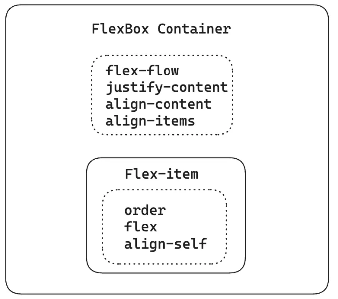

## Display 속성

flex를 적용하기 위해 display 속성으로 flex 값을 사용할 때의 모습을 자세히 살펴보겠습니다.

<!-- ui-log 수평형 -->
<ins class="adsbygoogle"
  style="display:block"
  data-ad-client="ca-pub-4877378276818686"
  data-ad-slot="9743150776"
  data-ad-format="auto"
  data-full-width-responsive="true"></ins>
<component is="script">
(adsbygoogle = window.adsbygoogle || []).push({});
</component>

가정해보죠. 블록 수준 요소로 시작하는 경우가 있습니다. 예를 들어 div 요소는 기본적으로 display 값이 block입니다. 이 부모 div 내부에는 특정 너비와 높이 속성이 적용된 각각의 추가 블록 수준 요소를 자식으로 배치할 수 있습니다.

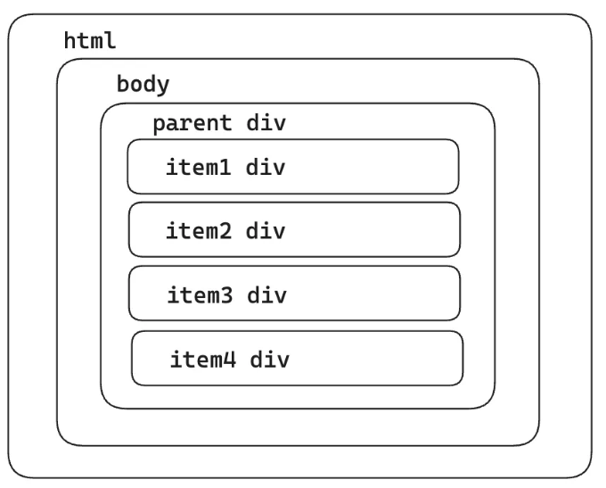

우리는 다음과 같은 결과물을 얻게 됩니다.

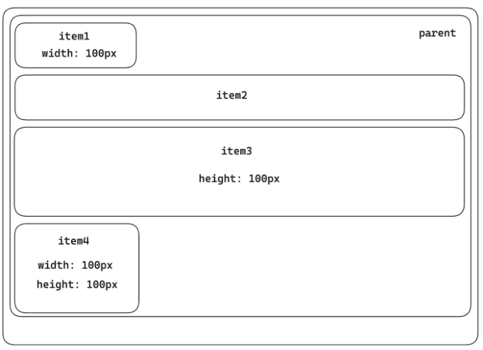

<!-- ui-log 수평형 -->
<ins class="adsbygoogle"
  style="display:block"
  data-ad-client="ca-pub-4877378276818686"
  data-ad-slot="9743150776"
  data-ad-format="auto"
  data-full-width-responsive="true"></ins>
<component is="script">
(adsbygoogle = window.adsbygoogle || []).push({});
</component>

부모 div 요소의 display 속성을 "flex"로 설정하면 결과는 다음과 같습니다.

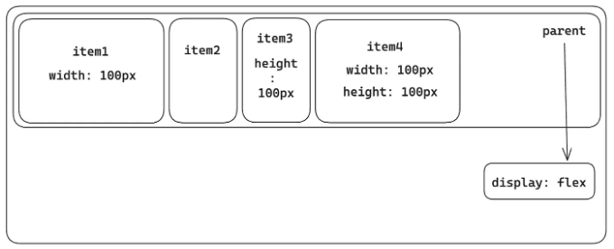

따라서 여기서 높이 속성이 정의되지 않은 자식 요소 (플렉스 항목)는 형제 중에서 최대 높이를 채택합니다. 반대로 명시적으로 정의된 높이 속성을 갖는 자식 요소는 지정된 높이를 유지합니다.

간단히 말해, 이제 플렉스 컨테이너인 부모 요소는 일반적인 웹 페이지 레이아웃 규칙을 따르는 블록 수준 요소처럼 행동합니다. 한편에는 그 자식 요소들이 유연한 레이아웃 속성을 적용받은 플렉스 컨테이너의 유연하고 적응 가능한 위치 지정을 허용합니다.

<!-- ui-log 수평형 -->
<ins class="adsbygoogle"
  style="display:block"
  data-ad-client="ca-pub-4877378276818686"
  data-ad-slot="9743150776"
  data-ad-format="auto"
  data-full-width-responsive="true"></ins>
<component is="script">
(adsbygoogle = window.adsbygoogle || []).push({});
</component>

만약 부모 요소가 자식 요소를 플렉스 아이템으로 구성하면서도 인라인과 같은 동작을 유지하길 원한다면 "display: inline-flex"를 선택할 수 있습니다.

그러면 결과물은 다음과 같을 것입니다

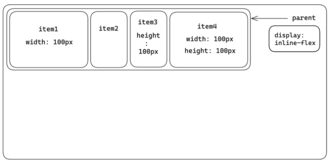

# FlexBox 컨테이너

<!-- ui-log 수평형 -->
<ins class="adsbygoogle"
  style="display:block"
  data-ad-client="ca-pub-4877378276818686"
  data-ad-slot="9743150776"
  data-ad-format="auto"
  data-full-width-responsive="true"></ins>
<component is="script">
(adsbygoogle = window.adsbygoogle || []).push({});
</component>

지금 display 속성을 flex로 설정하면 기본적으로 두 가지 속성이 작용합니다.
첫 번째는 기본값이 행(row)인 flex-direction입니다.
두 번째 속성은 기본값이 nowrap인 flex-wrap입니다.

## flex-direction

flex-direction 속성은 CSS Flexbox의 기본 구성 요소로, 플렉스 아이템들의 배열 방향을 제어할 수 있게 합니다. 

flex-direction에는 네 가지 가능한 값이 있습니다:

<!-- ui-log 수평형 -->
<ins class="adsbygoogle"
  style="display:block"
  data-ad-client="ca-pub-4877378276818686"
  data-ad-slot="9743150776"
  data-ad-format="auto"
  data-full-width-responsive="true"></ins>
<component is="script">
(adsbygoogle = window.adsbygoogle || []).push({});
</component>

행 (기본값): 이 값은 플렉스 항목을 가로로 정렬하여 왼쪽에서 오른쪽으로 이동합니다.

row-reverse: 이 값은 행 값과 유사하지만 반대로, 플렉스 항목이 오른쪽에서 시작하여 왼쪽으로 이동합니다.

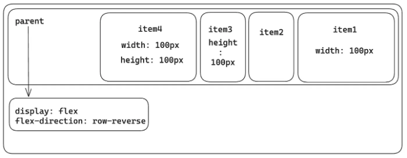

열: 열로 설정하면 플렉스 항목이 수직으로 정렬되어 위에서 아래로 쌓입니다.

<!-- ui-log 수평형 -->
<ins class="adsbygoogle"
  style="display:block"
  data-ad-client="ca-pub-4877378276818686"
  data-ad-slot="9743150776"
  data-ad-format="auto"
  data-full-width-responsive="true"></ins>
<component is="script">
(adsbygoogle = window.adsbygoogle || []).push({});
</component>

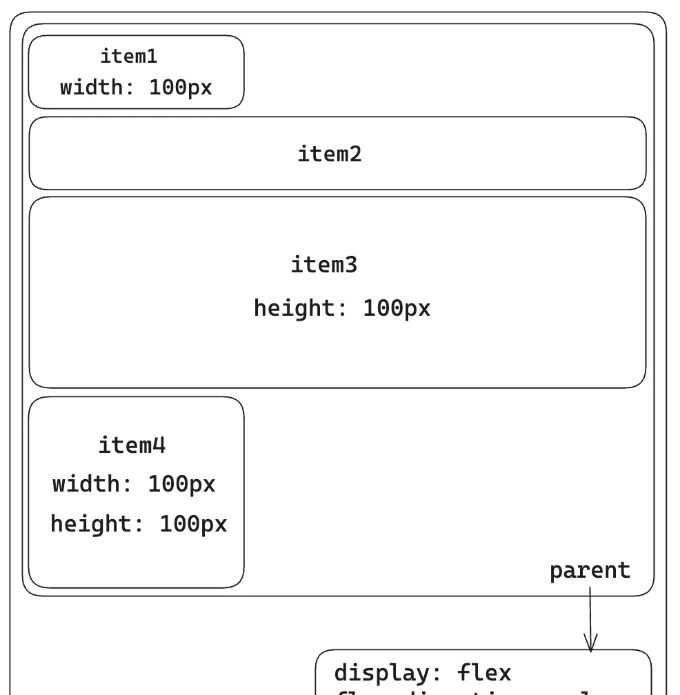

**column-reverse**: column 값과 유사하지만 반대 순서로, flex 항목이 아래에서 위로 쌓입니다.

## flex-wrap

CSS 속성 flex-wrap은 flex 항목이 한 줄에 있어야 하는지 여러 줄로 래핑될 수 있는지를 제어합니다.

<!-- ui-log 수평형 -->
<ins class="adsbygoogle"
  style="display:block"
  data-ad-client="ca-pub-4877378276818686"
  data-ad-slot="9743150776"
  data-ad-format="auto"
  data-full-width-responsive="true"></ins>
<component is="script">
(adsbygoogle = window.adsbygoogle || []).push({});
</component>

flex-wrap에는 3가지 가능한 값이 있습니다:

- nowrap: flex 항목은 단일 행에 배치되어 flex 컨테이너가 오버플로우될 수 있습니다. 이것은 기본값입니다.

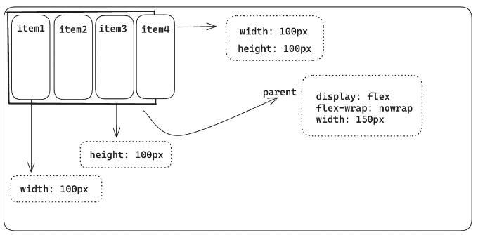

참고: 너비가 100px로 지정된 flex 항목은 할당된 너비에 엄격하게 준수하지 않을 수 있습니다. 이는 flex 항목의 기본 동작에 기인하는데, 이는 기본값이 1인 flex-shrink 속성을 포함합니다. 결과적으로 이러한 flex 항목은 내용을 수용하기 위해 너비를 줄이려고 시도하지만, 축소할 수 있는 한계가 있습니다. 나중에 이 기사에서 이 flex-shrink 속성을 자세히 알아볼 것입니다.

<!-- ui-log 수평형 -->
<ins class="adsbygoogle"
  style="display:block"
  data-ad-client="ca-pub-4877378276818686"
  data-ad-slot="9743150776"
  data-ad-format="auto"
  data-full-width-responsive="true"></ins>
<component is="script">
(adsbygoogle = window.adsbygoogle || []).push({});
</component>

wrap: flex 항목은 flex-direction 속성에 지정된 값에 따라 여러 줄 또는 여러 열로 나뉩니다.

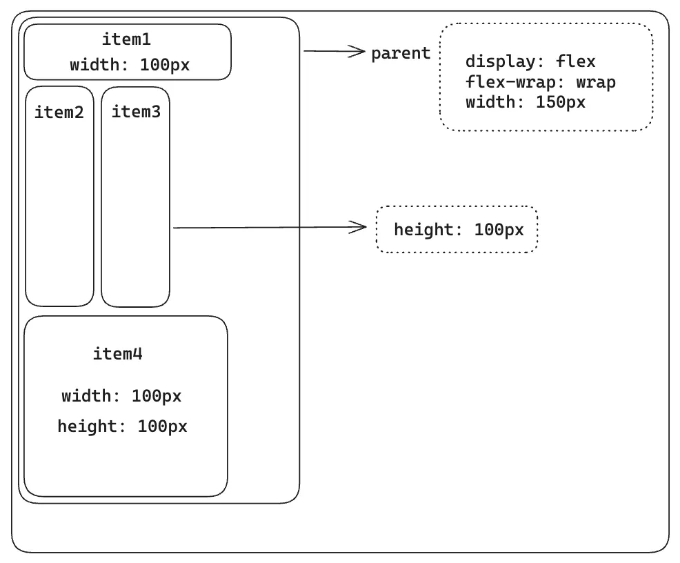

wrap-reverse: wrap 값과 동일하지만 반대 방향으로 동작합니다.

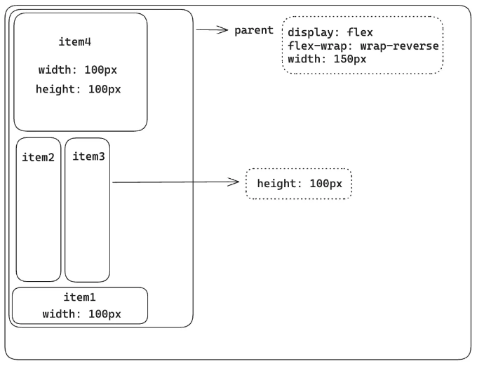

<!-- ui-log 수평형 -->
<ins class="adsbygoogle"
  style="display:block"
  data-ad-client="ca-pub-4877378276818686"
  data-ad-slot="9743150776"
  data-ad-format="auto"
  data-full-width-responsive="true"></ins>
<component is="script">
(adsbygoogle = window.adsbygoogle || []).push({});
</component>

다양한 속성을 탐색하기 전에 주축(Main Axis) 및 교차축(Cross Axis) 개념을 잡는 것이 중요합니다. 이 용어들에 대해 자세히 알아보겠습니다.

# 주축과 교차축

부모 컴포넌트에 display: flex를 사용하면 flex-direction 속성의 기본 설정은 행(row)입니다. 이는 주축이 부모 컴포넌트의 왼쪽 위 모서리에서 시작하여 왼쪽 위에서 오른쪽 위 방향으로 확장된다는 것을 의미합니다. 따라서 교차축은 주축과 시작점을 공유하여 왼쪽 위에서 시작하여 아래쪽 왼쪽 모서리까지 확장되며 수직축을 형성합니다.

요컨대, 주축과 교차축은 서로 수직이며, 시작점과 방향은 flex-direction 속성에 의해 결정됩니다.

<!-- ui-log 수평형 -->
<ins class="adsbygoogle"
  style="display:block"
  data-ad-client="ca-pub-4877378276818686"
  data-ad-slot="9743150776"
  data-ad-format="auto"
  data-full-width-responsive="true"></ins>
<component is="script">
(adsbygoogle = window.adsbygoogle || []).push({});
</component>

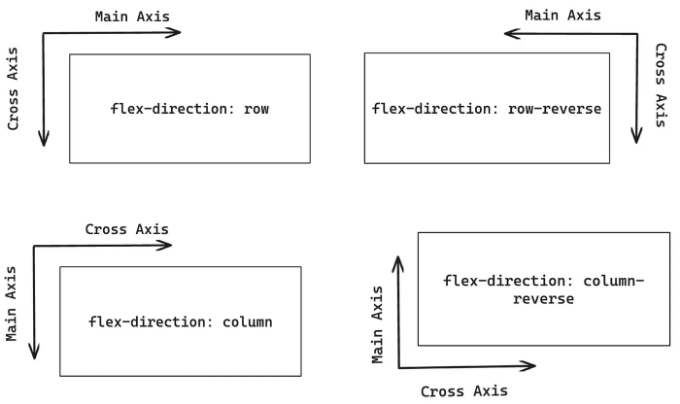

# FlexBox 속성

## flex-flow

flex-flow는 flex 컨테이너의 방향과 감싸기 동작을 지정하는 CSS 단축 속성입니다.

<!-- ui-log 수평형 -->
<ins class="adsbygoogle"
  style="display:block"
  data-ad-client="ca-pub-4877378276818686"
  data-ad-slot="9743150776"
  data-ad-format="auto"
  data-full-width-responsive="true"></ins>
<component is="script">
(adsbygoogle = window.adsbygoogle || []).push({});
</component>

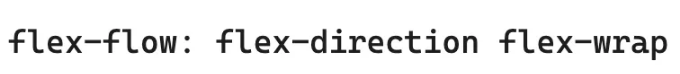

## align-items

`align-items` 속성은 플렉스박스 내에서 플렉스 항목의 기본 정렬을 지정합니다. 이 속성은 플렉스 항목 정렬에 대해 교차 축을 참조합니다.

가장 일반적으로 사용되는 속성 값은 다음과 같습니다:

<!-- ui-log 수평형 -->
<ins class="adsbygoogle"
  style="display:block"
  data-ad-client="ca-pub-4877378276818686"
  data-ad-slot="9743150776"
  data-ad-format="auto"
  data-full-width-responsive="true"></ins>
<component is="script">
(adsbygoogle = window.adsbygoogle || []).push({});
</component>

stretch: 이것이 기본값입니다. 플렉스 항목은 플렉스 컨테이너 요소에 맞게 늘어납니다.

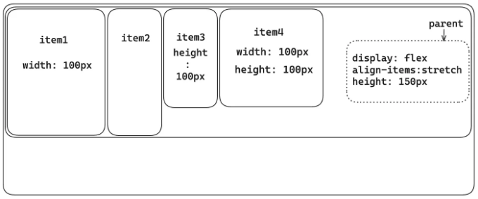

center: 플렉스 항목은 플렉스 컨테이너 요소의 중앙에 위치합니다. 교차 축을 따라 플렉스 항목을 가운데로 정렬합니다.

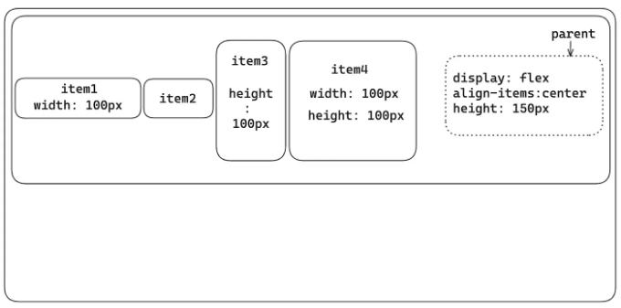

<!-- ui-log 수평형 -->
<ins class="adsbygoogle"
  style="display:block"
  data-ad-client="ca-pub-4877378276818686"
  data-ad-slot="9743150776"
  data-ad-format="auto"
  data-full-width-responsive="true"></ins>
<component is="script">
(adsbygoogle = window.adsbygoogle || []).push({});
</component>

flex-start: Flex items are positioned at the beginning of the flex container element.

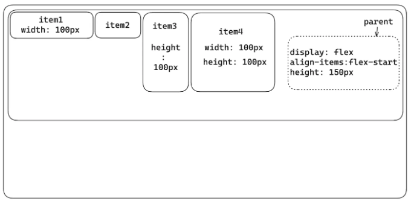

flex-end: Flex items are positioned at the end of the flex container element.

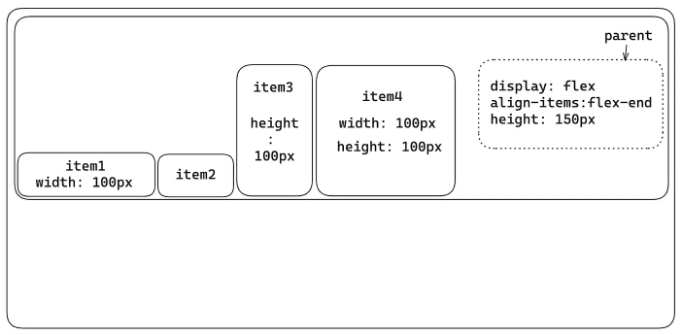

<!-- ui-log 수평형 -->
<ins class="adsbygoogle"
  style="display:block"
  data-ad-client="ca-pub-4877378276818686"
  data-ad-slot="9743150776"
  data-ad-format="auto"
  data-full-width-responsive="true"></ins>
<component is="script">
(adsbygoogle = window.adsbygoogle || []).push({});
</component>

## justify-content

`justify-content` 속성은 flexbox 컨테이너의 Main Axis를 따라 flex 항목을 정렬하는 데 사용됩니다.

가장 일반적으로 사용되는 속성 값은 다음과 같습니다:

- `flex-start`: 이 값은 기본 값입니다. Flex 항목은 flex 컨테이너 요소의 시작 부분에 배치됩니다.

<!-- ui-log 수평형 -->
<ins class="adsbygoogle"
  style="display:block"
  data-ad-client="ca-pub-4877378276818686"
  data-ad-slot="9743150776"
  data-ad-format="auto"
  data-full-width-responsive="true"></ins>
<component is="script">
(adsbygoogle = window.adsbygoogle || []).push({});
</component>

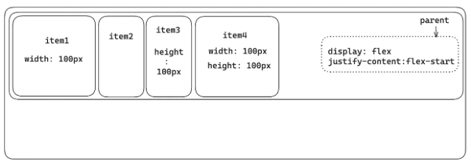

center: Flex 항목은 플렉스 컨테이너 요소의 중앙에 위치합니다. 메인 축을 따라 플렉스 항목을 가운데 정렬했습니다.

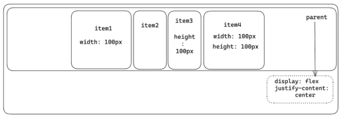

flex-end: Flex 항목은 플렉스 컨테이너 요소의 끝에 위치합니다.

<!-- ui-log 수평형 -->
<ins class="adsbygoogle"
  style="display:block"
  data-ad-client="ca-pub-4877378276818686"
  data-ad-slot="9743150776"
  data-ad-format="auto"
  data-full-width-responsive="true"></ins>
<component is="script">
(adsbygoogle = window.adsbygoogle || []).push({});
</component>

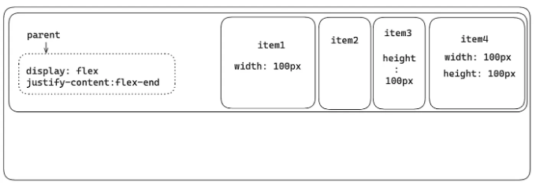

space-between: Flex 아이템은 플렉스 컨테이너 요소 사이에 공간이 생깁니다.

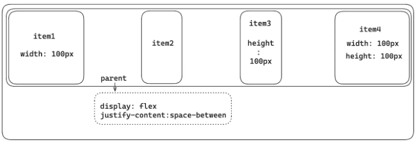

space-around: Flex 아이템은 플렉스 컨테이너 요소 전후로 공간이 생깁니다.

<!-- ui-log 수평형 -->
<ins class="adsbygoogle"
  style="display:block"
  data-ad-client="ca-pub-4877378276818686"
  data-ad-slot="9743150776"
  data-ad-format="auto"
  data-full-width-responsive="true"></ins>
<component is="script">
(adsbygoogle = window.adsbygoogle || []).push({});
</component>

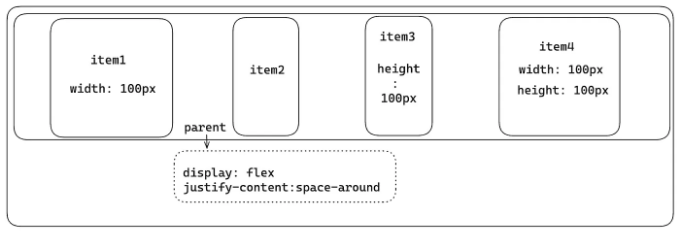

space-evenly: Flex 아이템은 플렉스 컨테이너 요소 주변에 동일한 공간을 가집니다.

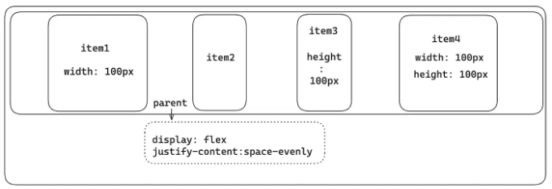

## align-content

<!-- ui-log 수평형 -->
<ins class="adsbygoogle"
  style="display:block"
  data-ad-client="ca-pub-4877378276818686"
  data-ad-slot="9743150776"
  data-ad-format="auto"
  data-full-width-responsive="true"></ins>
<component is="script">
(adsbygoogle = window.adsbygoogle || []).push({});
</component>

`align-content` 속성은 여러 줄의 플렉스 아이템에 사용됩니다. 플렉스 아이템이 한 줄에 있는 경우에는 아무 효과가 없습니다. 이 속성을 사용하면 플렉스 아이템을 교차 축인 따라 정렬할 수 있습니다.

가장 일반적으로 사용되는 값은 다음과 같습니다:

- stretch: 이 값은 기본 값입니다. 플렉스 아이템이 남은 공간을 채우도록 늘어납니다.

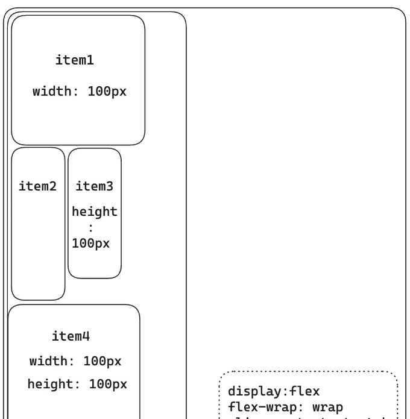

<!-- ui-log 수평형 -->
<ins class="adsbygoogle"
  style="display:block"
  data-ad-client="ca-pub-4877378276818686"
  data-ad-slot="9743150776"
  data-ad-format="auto"
  data-full-width-responsive="true"></ins>
<component is="script">
(adsbygoogle = window.adsbygoogle || []).push({});
</component>

가운데: Flex 아이템은 플렉스 컨테이너 요소의 중앙 쪽으로 정렬됩니다. 이것은 Cross Axis를 따라 플렉스 아이템을 가운데 정렬합니다.

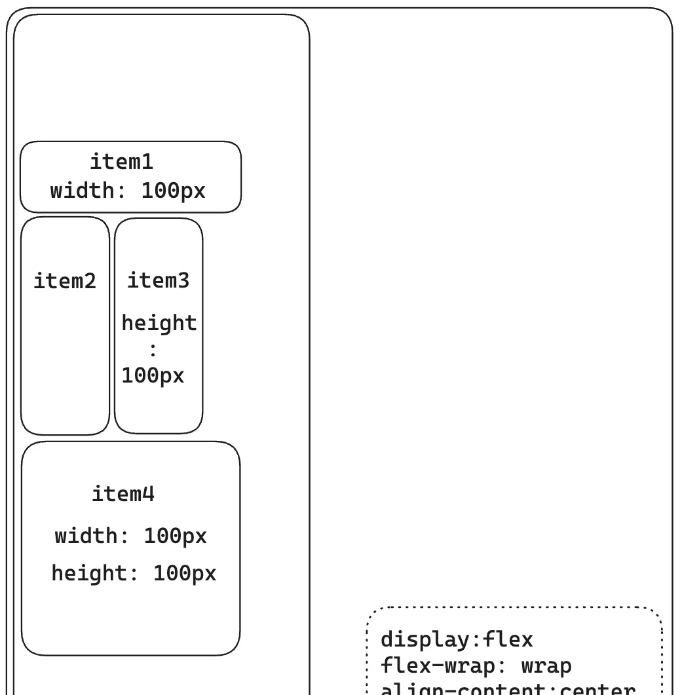

시작: Flex 아이템은 플렉스 컨테이너 요소의 시작 부분 쪽으로 정렬됩니다.

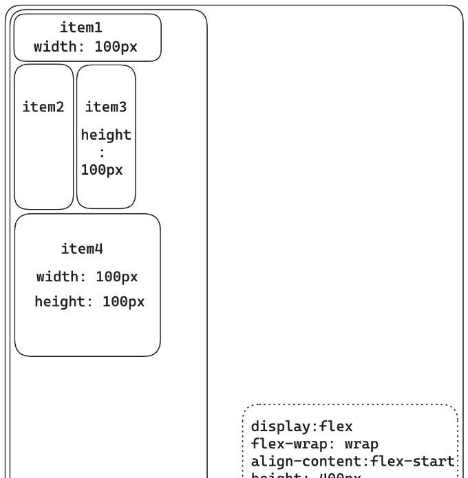

<!-- ui-log 수평형 -->
<ins class="adsbygoogle"
  style="display:block"
  data-ad-client="ca-pub-4877378276818686"
  data-ad-slot="9743150776"
  data-ad-format="auto"
  data-full-width-responsive="true"></ins>
<component is="script">
(adsbygoogle = window.adsbygoogle || []).push({});
</component>

flex-end: Flex 항목은 flex 컨테이너 요소의 끝 쪽으로 정렬됩니다.

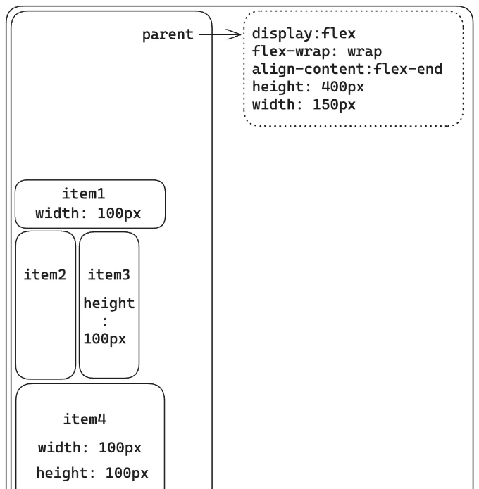

space-between: Flex 항목은 flex 컨테이너 요소에서 고르게 분배됩니다.

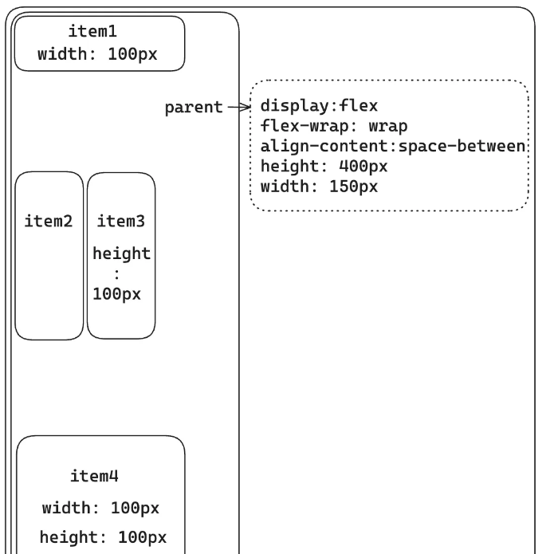

<!-- ui-log 수평형 -->
<ins class="adsbygoogle"
  style="display:block"
  data-ad-client="ca-pub-4877378276818686"
  data-ad-slot="9743150776"
  data-ad-format="auto"
  data-full-width-responsive="true"></ins>
<component is="script">
(adsbygoogle = window.adsbygoogle || []).push({});
</component>

아래는 Markdown 형식에 맞게 수정된 내용입니다.

space-around: Flex 아이템은 flex 컨테이너 요소 안에서 고르게 분포됩니다.

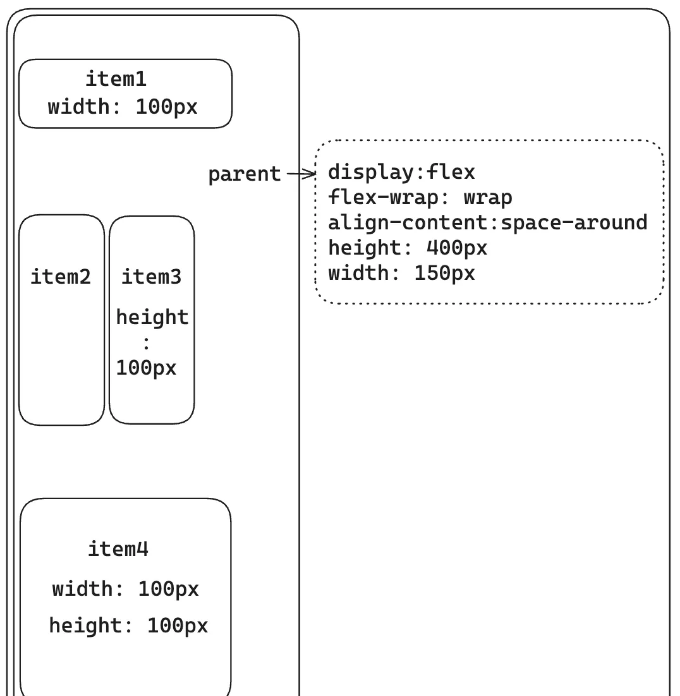

space-evenly: Flex 아이템은 flex 컨테이너 요소 안에서 고르게 분포되며, 주위에 동일한 공간이 있습니다.

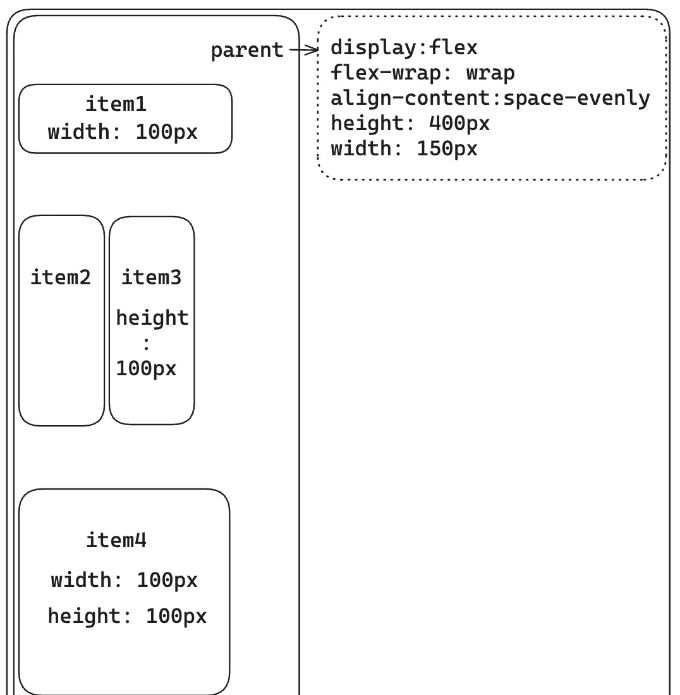

<!-- ui-log 수평형 -->
<ins class="adsbygoogle"
  style="display:block"
  data-ad-client="ca-pub-4877378276818686"
  data-ad-slot="9743150776"
  data-ad-format="auto"
  data-full-width-responsive="true"></ins>
<component is="script">
(adsbygoogle = window.adsbygoogle || []).push({});
</component>

# 플렉스 아이템 속성

## order

order 속성은 플렉스 아이템을 순서대로 그룹화하는 데 사용됩니다. 다시 말해, 플렉스 아이템에는 그룹을 나타내는 정수가 할당됩니다. 그런 다음 해당 정수에 따라 플렉스 아이템이 시각적으로 정렬됩니다. 동일한 정수 값을 갖는 항목이 여러 개인 경우 해당 그룹 내에서 플렉스 아이템이 소스 순서에 따라 배치됩니다. order 속성에는 다양한 값이 할당될 수 있으며, order의 기본값은 단순히 0(영)입니다.

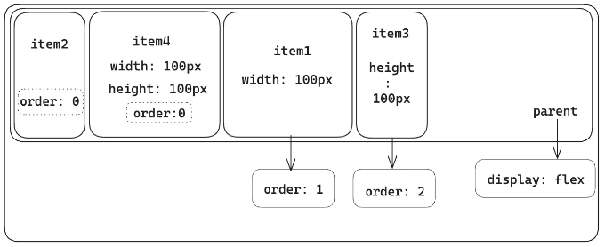

<!-- ui-log 수평형 -->
<ins class="adsbygoogle"
  style="display:block"
  data-ad-client="ca-pub-4877378276818686"
  data-ad-slot="9743150776"
  data-ad-format="auto"
  data-full-width-responsive="true"></ins>
<component is="script">
(adsbygoogle = window.adsbygoogle || []).push({});
</component>

## align-self

align-self은 플렉스 컨테이너 내 개별 플렉스 아이템의 정렬을 정밀하게 제어할 수 있는 속성입니다. align-items 속성은 모든 플렉스 아이템에 정렬을 적용하지만, align-self 속성을 사용하면 단일 플렉스 아이템의 정렬을 지정하여 플렉스박스 컨테이너 내 위치를 세밀하게 제어할 수 있습니다. 이는 플렉스 아이템을 교차 축에서 정렬합니다.

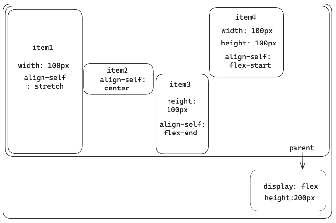

## flex-grow

<!-- ui-log 수평형 -->
<ins class="adsbygoogle"
  style="display:block"
  data-ad-client="ca-pub-4877378276818686"
  data-ad-slot="9743150776"
  data-ad-format="auto"
  data-full-width-responsive="true"></ins>
<component is="script">
(adsbygoogle = window.adsbygoogle || []).push({});
</component>

`flex-grow` 속성은 플렉스 아이템이 플렉스박스 컨테이너 내에서 얼마나 확장될 수 있는지를 결정합니다. 이는 플렉스박스 컨테이너 내에서 남은 사용 가능한 공간 중 일부가 플렉스 아이템에 할당되어야 하는 비율으로 표현됩니다.

플렉스 아이템의 초기 크기를 고려한 후에 플렉스박스 컨테이너에 여분의 공간이 있는 경우, 이 추가 공간은 각각의 개별적인 `flex-grow` 값에 따라 플렉스 아이템들 사이에 분배됩니다. `flex-grow`의 초기 값은 0(제로)입니다.

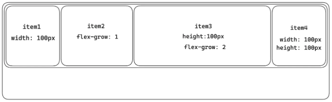

## flex-shrink

<!-- ui-log 수평형 -->
<ins class="adsbygoogle"
  style="display:block"
  data-ad-client="ca-pub-4877378276818686"
  data-ad-slot="9743150776"
  data-ad-format="auto"
  data-full-width-responsive="true"></ins>
<component is="script">
(adsbygoogle = window.adsbygoogle || []).push({});
</component>

flex-shrink 속성은 플렉스박스 컨테이너 내의 플렉스 항목에서 축소 계수를 지정합니다. 모든 플렉스 항목의 결합된 크기가 플렉스박스 컨테이너 내의 사용 가능한 공간을 초과하는 경우, flex-shrink 속성이 작용합니다. 이는 각 플렉스 항목이 사용 가능한 공간에 맞게 크기를 얼마나 축소할 수 있는지를 결정합니다. flex-shrink의 초기 값은 1(one)입니다.

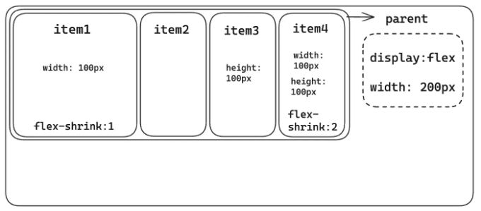

## flex-basis

flex-basis 속성은 플렉스 컨테이너의 주 축을 따라 플렉스 항목의 크기를 결정합니다. flex-basis는 너비나 높이를 명확히 지정하지 않고, 대신 주 축의 방향에 따라 플렉스 항목의 초기 크기를 설정하는 것이 중요합니다.

<!-- ui-log 수평형 -->
<ins class="adsbygoogle"
  style="display:block"
  data-ad-client="ca-pub-4877378276818686"
  data-ad-slot="9743150776"
  data-ad-format="auto"
  data-full-width-responsive="true"></ins>
<component is="script">
(adsbygoogle = window.adsbygoogle || []).push({});
</component>

Main Axis가 좌에서 우로 뻗어나갈 경우, flex-basis 값은 flex 항목의 너비에 영향을 미칩니다. 반대로, Main Axis가 위에서 아래로 뻗어나갈 경우, flex-basis 값은 flex 항목의 높이를 결정합니다.

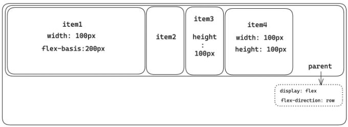

flexbox 컨테이너의 경우, 부모는 flex-direction 속성을 row로 설정합니다. 따라서 item1(플렉스 항목)의 경우, flex-basis 속성이 이전에 할당된 어떤 너비 속성보다 우선 순위가 있어 200 픽셀의 너비가 결과로 나옵니다.

반면, item4의 경우, flex-basis가 자동으로 설정된 기본값의 auto로 되어있기 때문에, 본질적으로 이전에 정의된 너비 값으로 되돌아가, 적용된 너비를 유지하게 됩니다. 이 동작은 flex-basis가 명시적으로 설정된 너비 값으로 되돌아가기 때문에 발생하는 것입니다.

<!-- ui-log 수평형 -->
<ins class="adsbygoogle"
  style="display:block"
  data-ad-client="ca-pub-4877378276818686"
  data-ad-slot="9743150776"
  data-ad-format="auto"
  data-full-width-responsive="true"></ins>
<component is="script">
(adsbygoogle = window.adsbygoogle || []).push({});
</component>

## flex

CSS에서의 flex 속성은 flexbox 컨테이너 내의 flex 항목에 대한 세 가지 핵심 속성인 flex-grow, flex-shrink 및 flex-basis를 결합하고 지정하는 단축 속성입니다. 이를 통해 flex 항목이 flexbox 컨테이너 요소 내에서 어떻게 성장하고 축소되며 초기 크기를 설정하는지 제어할 수 있습니다.

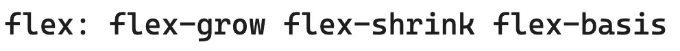

이 글은 여기서 마칩니다. Flexbox 레이아웃의 flex 컨테이너와 flex 항목에 대한 핵심 원칙과 필수 속성에 대한 견고한 이해를 제공해 드렸기를 바랍니다.

<!-- ui-log 수평형 -->
<ins class="adsbygoogle"
  style="display:block"
  data-ad-client="ca-pub-4877378276818686"
  data-ad-slot="9743150776"
  data-ad-format="auto"
  data-full-width-responsive="true"></ins>
<component is="script">
(adsbygoogle = window.adsbygoogle || []).push({});
</component>

CSS의 세계를 계속 탐험하면서 연습과 실험이 당신의 최고의 동반자가 될 것을 기억해 주세요. Flexbox의 세계에 몰두하여 그 기능을 두려움 없이 탐험하고, 정확하고 유연한 레이아웃으로 여러분의 웹 디자인이 살아있는 것을 확인해 보세요. 코딩을 즐기세요!

# 참고 자료

- Mozilla 개발자 네트워크 (MDN) — https://developer.mozilla.org/en-US/docs/Learn/CSS/CSS_layout/Flexbox
- W3Schools — https://www.w3schools.com/css/css3_flexbox.asp
- Udemy — https://www.udemy.com/course/css-the-complete-guide-incl-flexbox-grid-sass/