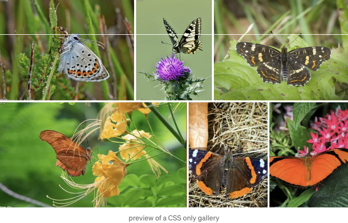

간단한 CSS만으로 정렬된 이미지 그리드



HTML과 CSS만으로 반응형이며 정렬된 이미지 그리드 갤러리를 만들 수 있습니다. 이 글에서는 어떻게 하는지 배워보세요.

# HTML

<!-- ui-log 수평형 -->
<ins class="adsbygoogle"
  style="display:block"
  data-ad-client="ca-pub-4877378276818686"
  data-ad-slot="9743150776"
  data-ad-format="auto"
  data-full-width-responsive="true"></ins>
<component is="script">
(adsbygoogle = window.adsbygoogle || []).push({});
</component>

먼저 HTML이 필요합니다. 이를 위해 `section` 태그를 사용하며 클래스는 justified-grid-gallery를 지정합니다. 이 섹션 요소 안에 이미지를 배치합니다. 다음 예제 코드에서는 7개의 이미지가 있습니다.

```js
<section class="justified-grid-gallery">
  <figure style="--width: 640; --height: 520; ">
    
  </figure>
  <figure style="--width: 500; --height: 420; ">
    
  </figure>
  <figure style="--width: 710; --height: 580; ">
    
  </figure>
  <figure style="--width: 760; --height: 540; ">
    
  </figure>
  <figure style="--width: 690; --height: 570; ">
    
  </figure>
  <figure style="--width: 540; --height: 340; ">
    
  </figure>
  <figure style="--width: 340; --height: 550; ">
    
  </figure>
  <!-- 더 화려한 것이 필요하다면 https://gridzy.gallery/를 확인해보세요. -->
</section>
```

`figure` 태그 모두에 style 속성이 있는 것을 보실 수 있습니다. 그리드가 작동하려면 이미지 크기를 명시적으로 지정해야 합니다.

따라서 이 스타일 속성에서 사용자 정의 속성 --width와 --height를 정의합니다. 사용자 정의 속성의 값은 단위 없이 숫자만 사용하므로 예를 들어 640px가 아닌 640을 사용합니다. 너비와 높이의 값은 이미지의 원래 너비와 높이에 해당합니다.

<!-- ui-log 수평형 -->
<ins class="adsbygoogle"
  style="display:block"
  data-ad-client="ca-pub-4877378276818686"
  data-ad-slot="9743150776"
  data-ad-format="auto"
  data-full-width-responsive="true"></ins>
<component is="script">
(adsbygoogle = window.adsbygoogle || []).push({});
</component>

# CSS

CSS 부분은 꽤 간단합니다. 아래 CSS 코드 조각을 복사하여 자신의 프로젝트에 붙여넣기하면 됩니다.

```js
/* 설정 시작 */
.justified-grid-gallery {
  --space: 4px;
  --min-height: 190px;
  --last-row-background: rgb(188 234 153);
}
/* 설정 끝 */

.justified-grid-gallery {
  display: flex;
  flex-wrap: wrap;
  grid-gap: var(--space);
  list-style: none;
  margin: 0 !important; /* 어떤 환경에서 공백을 피하기 위해 !important를 사용합니다. */
  padding: 0 !important; /* 어떤 환경에서 공백을 피하기 위해 !important를 사용합니다. */
}

.justified-grid-gallery > * {
  flex-grow: calc(var(--width) * (100000 / var(--height)));
  flex-basis: calc(var(--min-height) * (var(--width) / var(--height)));
  aspect-ratio: var(--width) / var(--height);
  position: relative;
  overflow: hidden;
  margin: 0 !important; /* 어떤 환경에서 공백을 피하기 위해 !important를 사용합니다. */
  padding: 0 !important; /* 어떤 환경에서 공백을 피하기 위해 !important를 사용합니다. */
}

.justified-grid-gallery > * > img {
  position: absolute;
  width: 100%;
  height: 100%;
}

.justified-grid-gallery::after {
  content: " ";
  flex-grow: 1000000000;
  background: var(--last-row-background);
}

/* 더 화려한 효과를 원하시면 https://gridzy.gallery/ 을 확인해보세요 */
```

이제 현재 상태에서 어떻게 보이는지 살펴보겠습니다:

<!-- ui-log 수평형 -->
<ins class="adsbygoogle"
  style="display:block"
  data-ad-client="ca-pub-4877378276818686"
  data-ad-slot="9743150776"
  data-ad-format="auto"
  data-full-width-responsive="true"></ins>
<component is="script">
(adsbygoogle = window.adsbygoogle || []).push({});
</component>

보시는대로, 마지막 행의 나머지 부분은 녹색 영역으로 채워져 있습니다. 기술적인 이유로 항상 이 "빈" 영역이 마지막 행에 존재합니다.

그러나 이 영역에서 색상을 제거하거나 다른 CSS 배경으로 채우는 것도 가능합니다. 추가로 몇 가지 다른 항목들도 변경할 수 있습니다.

# 설정

CSS 부분에 설정이 몇 가지 있음을 보았을 것입니다. 함께 살펴보도록 합시다:

<!-- ui-log 수평형 -->
<ins class="adsbygoogle"
  style="display:block"
  data-ad-client="ca-pub-4877378276818686"
  data-ad-slot="9743150776"
  data-ad-format="auto"
  data-full-width-responsive="true"></ins>
<component is="script">
(adsbygoogle = window.adsbygoogle || []).push({});
</component>

```js
/* 설정 시작 */
.justified-grid-gallery {
  --space: 4px;
  --min-height: 190px;
  --last-row-background: rgb(188 234 153);
}
/* 설정 끝 */
```

## 간격

--space는 항목 간의 간격을 정의합니다. CSS 부분에서 값을 간단히 변경하거나 다음과 같이 HTML 부분에서 정의할 수 있습니다:

```js
<ul class="justified-grid-gallery" style="--space: 1px; ">
...
```

<!-- ui-log 수평형 -->
<ins class="adsbygoogle"
  style="display:block"
  data-ad-client="ca-pub-4877378276818686"
  data-ad-slot="9743150776"
  data-ad-format="auto"
  data-full-width-responsive="true"></ins>
<component is="script">
(adsbygoogle = window.adsbygoogle || []).push({});
</component>

## 최소 높이

--min-height은 이미지 라인의 최소 높이를 정의합니다. 이를 CSS 부분이나 다음과 같이 HTML 부분에서 변경할 수 있습니다:

```js
<ul class="justified-grid-gallery" style="--min-height: 200px; ">
...
```

## 마지막 행 배경

<!-- ui-log 수평형 -->
<ins class="adsbygoogle"
  style="display:block"
  data-ad-client="ca-pub-4877378276818686"
  data-ad-slot="9743150776"
  data-ad-format="auto"
  data-full-width-responsive="true"></ins>
<component is="script">
(adsbygoogle = window.adsbygoogle || []).push({});
</component>

--last-row-background는 마지막 행의 빈 공간의 배경을 정의합니다. 이는 CSS 색상 또는 다른 CSS 배경일 수 있습니다.

--last-row-background: none;을 사용하여 어떤 배경도 없이 공백을 남길 수 있습니다.

# 결론

현대 CSS를 사용하면 아름답고 간단한 정렬된 이미지 그리드 갤러리를 만들 수 있으며 설정도 제공합니다. 그러나 더 쉬운 것이나 화려한 것이 필요하다면 Gridzy.Gallery를 선택할 수도 있습니다.