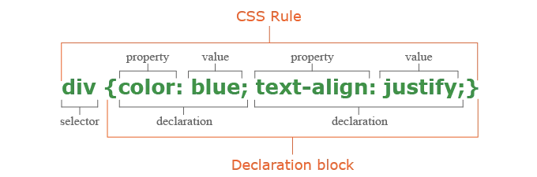
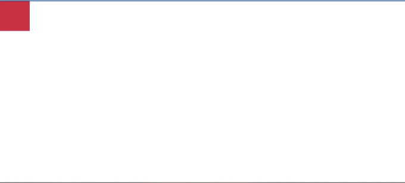
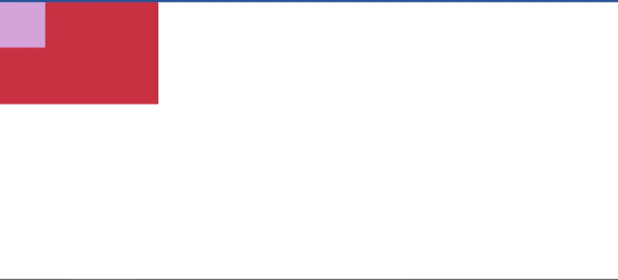
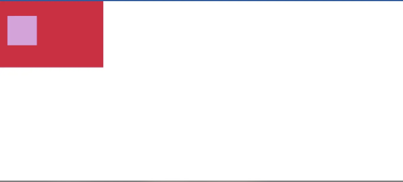

모두가 알다시피 CSS는 HTML 요소를 스타일링하는 데 사용되는 스타일 시트 언어입니다. CSS는 Cascading Style Sheets의 약자입니다. ‘Cascade’는 동일한 HTML 요소에 둘 이상의 CSS 규칙을 할당할 때 발생하는 충돌을 의미합니다. CSS 규칙은 다음과 같이 설명될 수 있습니다.

여기서 CSS 위치 지정에 대해 간단히 설명하겠습니다. CSS 위치 지정이란, 위치 지정하는 방법 및 위치 지정의 유형에 대해 설명하겠습니다...

<!-- ui-log 수평형 -->
<ins class="adsbygoogle"
  style="display:block"
  data-ad-client="ca-pub-4877378276818686"
  data-ad-slot="9743150776"
  data-ad-format="auto"
  data-full-width-responsive="true"></ins>
<component is="script">
(adsbygoogle = window.adsbygoogle || []).push({});
</component>

CSS Positioning...
CSS에서의 위치 지정은 필요에 따라 요소를 배치하는 데 사용되는 매우 중요한 부분입니다. CSS 위치 지정을 사용하여 요소의 위치를 제어할 수 있습니다. 이 글을 끝까지 읽으면 이에 대해 명확한 이해가 생길 것입니다.

CSS 위치 지정의 종류...
하나씩 CSS 위치 지정 유형에 대해 알아봅시다.

01. Static
이것은 요소의 기본 위치입니다.
요소는 페이지의 흐름에 따라 배치됩니다.

<!-- ui-log 수평형 -->
<ins class="adsbygoogle"
  style="display:block"
  data-ad-client="ca-pub-4877378276818686"
  data-ad-slot="9743150776"
  data-ad-format="auto"
  data-full-width-responsive="true"></ins>
<component is="script">
(adsbygoogle = window.adsbygoogle || []).push({});
</component>

02. 상대적 위치
요소들은 원래 위치를 기준으로 배치됩니다.

03. 절대적 위치
요소들은 부모 요소의 위치를 기준으로 배치됩니다.

<!-- ui-log 수평형 -->
<ins class="adsbygoogle"
  style="display:block"
  data-ad-client="ca-pub-4877378276818686"
  data-ad-slot="9743150776"
  data-ad-format="auto"
  data-full-width-responsive="true"></ins>
<component is="script">
(adsbygoogle = window.adsbygoogle || []).push({});
</component>

04. 고정된
이러한 요소들은 뷰포트에 상대적인 위치에 배치되어 있습니다. 페이지를 스크롤해도 요소들이 움직이지 않습니다.

05. 스티키
이러한 요소들은 페이지의 상단이나 하단에 도달할 때까지 상대적인 요소로 작동하다가 고정된 요소로 동작합니다.

만약 제 글에서 어떠한 지식을 얻을 수 있다면 저도 기쁩니다.
제 블로그 글을 읽어주셔서 감사합니다. 만약 여기까지 와 주셨다면 좋아요와 코멘트를 잊지 마세요.😉

새로운 블로그 글로 다시 찾아 뵙겠습니다.🍀👍