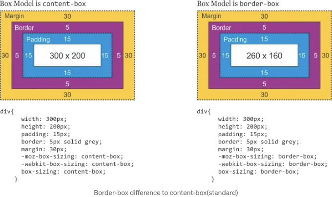
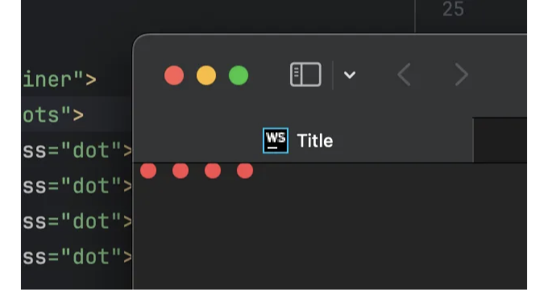
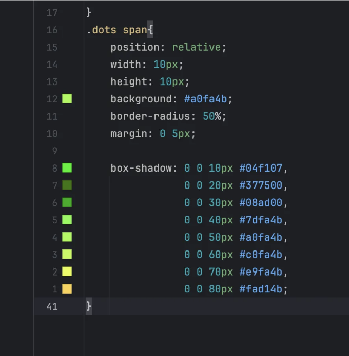
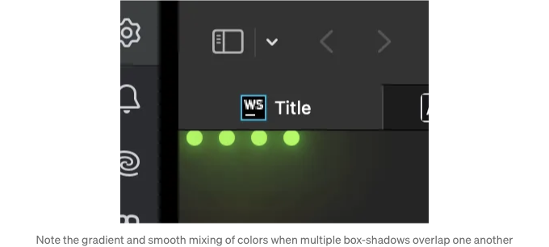

매혹적인 CSS 배경을 만들면 웹사이트의 미적 매력이 크게 향상될 수 있어요. 사용자의 주의를 즉시 사로 잡거나, 오랜 기억을 남길 수도 있고, 올바르게 처리하면 전반적인 사용자 경험을 향상시킬 수도 있어요. 정적 이미지나 단색 배경 이상으로 상호작용하는 애니메이션과 동적 효과는 사용자와의 상호작용을 높이고 디자인에 깊이를 더할 수 있어요. 이 글에서는 CSS 배경의 세계를 깊게 탐구하고 웹 디자인을 한 단계 업그레이드할 수 있는 생생하고 상호작용적 배경을 만드는 기술을 소개할 거에요.

그러나 콘텐츠 뒤에서 떠다니다 변형되는 애니메이션 헥사곤 패턴 같은 소화되지 않은 효과를 얻기 위해서는 그라데이션, 트랜지션, 애니메이션, 그리고 키프레임과 같은 CSS 기능을 탐색해야 해요.

예를 들어 그라데이션은 무척 다재다능해요. CSS로 선형 또는 방사형 그라데이션을 만들 수 있을 뿐만 아니라, 반복 그라데이션을 사용하여 더 복잡한 모양을 만들 수도 있어요. 이 그라데이션에 애니메이션을 적용하여 색상 집합에서 다른 색상 집합으로 부드럽게 전환시켜, 맥박이 느껴지는 파동 효과 등을 만들어 매우 시각적으로 매력적인 배경을 만들 수 있어요.

더 정교한 상호작용과 움직임을 만들려면 CSS 애니메이션이 필수에요. `@keyframes` 규칙을 사용하여 애니메이션의 단계를 정의하고, 요소들이 시간이 지남에 따라 어떻게 이동하거나 색상을 변경하고, 크기를 조정하거나 회전하는지를 지정할 수 있어요. `animation` 속성과 결합하여 애니메이션의 지속 시간, 타이밍 함수, 지연 등을 제어할 수 있어요.

<!-- ui-log 수평형 -->
<ins class="adsbygoogle"
  style="display:block"
  data-ad-client="ca-pub-4877378276818686"
  data-ad-slot="9743150776"
  data-ad-format="auto"
  data-full-width-responsive="true"></ins>
<component is="script">
(adsbygoogle = window.adsbygoogle || []).push({});
</component>

더 복잡한 기하학적 모양인 육각형 같은 경우에는 CSS clip-path나 SVG를 사용하는 것이 매우 효과적일 수 있어요. Clip-path를 사용하면 요소의 특정 영역을 정의하여 모양으로 "클리핑"하는 효과를 줄 수 있어요. 이 클리핑된 요소에 애니메이션을 결합하면 클리핑된 요소가 변형되고 변할 수 있어 사용자 상호작용에 반응하거나 계속된 반복 루프에서 실행되는 최면적인 배경 패턴을 만들 수 있어요.

또 다른 강력한 기술은 CSS 3D 변형을 사용하는 것이에요. 이를 사용하면 배경 요소에 깊이와 원근감을 제공할 수 있어요. 2D와 3D 요소를 이동, 회전, 확대/축소하여 2D 및 3D 요소를 조작함으로써 공간과 깊이의 환상을 만들어낼 수 있어요. 그 결과로 매혹적인 3D 배경 효과를 얻을 수 있어요.

결론적으로, CSS 배경은 웹 디자인에서 창조성과 혁신의 캔버스가 되어요. 단순한 그라데이션부터 복잡한 애니메이션된 모양까지, 적절한 배경은 웹사이트를 흔들림 없는 것부터 대담한 것으로 변신시킬 수 있어요. 다양한 CSS 속성을 실험하고 애니메이션과 상호작용을 통합함으로써 시각적으로 매력적이면서 동적인 사용자 경험에 기여하는 배경을 만들 수 있어요. 미래적인 CSS로 디자인을 할 때는 미적인 요소와 기능성을 균형 있게 유지하고 성능과 접근성을 염두에 두는 것을 기억해주세요.

모든 것을 초기화해 주세요!

<!-- ui-log 수평형 -->
<ins class="adsbygoogle"
  style="display:block"
  data-ad-client="ca-pub-4877378276818686"
  data-ad-slot="9743150776"
  data-ad-format="auto"
  data-full-width-responsive="true"></ins>
<component is="script">
(adsbygoogle = window.adsbygoogle || []).push({});
</component>

웹 개발 프로젝트를 시작할 때는 깨끗한 상태에서 출발하는 것이 중요합니다. 이 과정 중 일부로는 브라우저가 다양한 요소에 적용하는 기본 여백과 패딩을 초기화하는 작업이 포함됩니다. 이를 통해 디자인이 모든 브라우저와 플랫폼에서 일관성을 유지할 수 있습니다.

먼저 우리는 주어진 여백을 '초기화'해야 합니다. 자세한 내용은 아래 예제를 참고해주세요. https://learnlayout.com/box-sizing.html

```js
// 모든 표준 패딩과 여백을 초기화합니다.
*{
 margin: 0;
 padding: 0;
 box-sizing: border-box;
}
```

1. `margin: 0;` — 이 명령은 브라우저 사용자 에이전트 스타일시트에서 요소 주변에 설정된 기본 여백을 제거합니다. 여백은 각 요소마다 다를 수 있으므로 이를 제로로 설정하면 일관된 시작점을 얻을 수 있습니다.

<!-- ui-log 수평형 -->
<ins class="adsbygoogle"
  style="display:block"
  data-ad-client="ca-pub-4877378276818686"
  data-ad-slot="9743150776"
  data-ad-format="auto"
  data-full-width-responsive="true"></ins>
<component is="script">
(adsbygoogle = window.adsbygoogle || []).push({});
</component>

2. `padding: 0;` — 마진과 비슷하게, 브라우저는 문단, 제목, 목록 등 특정 요소에 기본 패딩을 적용합니다. 패딩을 제로로 설정하면 요소 내부의 공간을 제어하고 예상치 못한 간격 없이 레이아웃을 디자인할 수 있습니다.

3. `box-sizing: border-box;` — 이 CSS 속성은 요소의 너비와 높이를 계산하는 데 사용되는 기본 CSS 박스 모델을 변경합니다. `content-box`로 기본 설정된 것 대신, `border-box`는 너비와 높이에 테두리와 패딩을 포함하라고 브라우저에 지시합니다. 이렇게 하면 요소의 크기를 조절하는 일이 훨씬 쉬워져 반응형 레이아웃을 설계하는 과정이 간단해집니다.



CSS 시작 시 이러한 간단한 리셋을 적용함으로써 모든 디자인 요소에 대해 예측 가능하고 일관된 캔버스를 만들 수 있습니다. 이는 널리 사용되는 모범 사례이자 정밀하고 세심하게 스타일을 적용하고자 하는 웹 개발자에게 필수적인 단계입니다.

<!-- ui-log 수평형 -->
<ins class="adsbygoogle"
  style="display:block"
  data-ad-client="ca-pub-4877378276818686"
  data-ad-slot="9743150776"
  data-ad-format="auto"
  data-full-width-responsive="true"></ins>
<component is="script">
(adsbygoogle = window.adsbygoogle || []).push({});
</component>

HTML

```js
<!DOCTYPE html>
<html lang="en">
<head>
    <link rel="stylesheet" href="style.css">
    <meta charset="UTF-8">
    <title>CSS 배경</title>
</head>
<body>
<div class="container">
    <div class="dots">
        <span class="dot"></span>
        <span class="dot"></span>
        <span class="dot"></span>
        <span class="dot"></span>
    </div>
</div>
</body>
</html>
```

CSS

```js
*{
    margin: 0;
    padding: 0;
    box-sizing: border-box;
}

body{
    min-height: 100vh;
    background: #252525;
}

.container{
    width: 100%;
    min-height: 100vh;
    display: flex;
    position: relative;
    overflow: hidden;
}

.dots{
    position: relative;
    display: flex;
}

.dots span{
    position: relative;
    width: 10px;
    height: 10px;
    background: #fa4b4b;
    border-radius: 50%;
    margin: 0 5px;
}
```

<!-- ui-log 수평형 -->
<ins class="adsbygoogle"
  style="display:block"
  data-ad-client="ca-pub-4877378276818686"
  data-ad-slot="9743150776"
  data-ad-format="auto"
  data-full-width-responsive="true"></ins>
<component is="script">
(adsbygoogle = window.adsbygoogle || []).push({});
</component>

다음은 네 개의 스타일이 없는 점으로 나타납니다.



Box-shadow

CSS의 box-shadow 속성은 요소 뒤에 그림자를 투영하는 것을 넘어서서 매우 다재다능한 도구입니다. 디자이너들에게 그림자 효과의 미학적인 부분에 대해 세세하게 제어할 수 있도록 해주어, 레이어별로, 그라디언트와 같은 시각적 효과를 만들어 디자인에 깊이와 복잡성을 더할 수 있습니다.

<!-- ui-log 수평형 -->
<ins class="adsbygoogle"
  style="display:block"
  data-ad-client="ca-pub-4877378276818686"
  data-ad-slot="9743150776"
  data-ad-format="auto"
  data-full-width-responsive="true"></ins>
<component is="script">
(adsbygoogle = window.adsbygoogle || []).push({});
</component>

상자 그림자의 크기를 전략적으로 늘리고 층을 이룰 색상 범위를 선택하여 부드럽게 이어지는 색조를 조화롭게 조합할 수 있습니다. 이 기술을 사용하면 요소에 3차원적이고 촉감있는 외관을 부여하여, 평면 색상만으로는 이룰 수 없는 현실적인 감각을 디자인에 불어넣을 수 있습니다.

상자 그림자를 사용하는 아름다움은 그것의 섬세함과 질감 및 형태를 함축하는 능력에 있습니다. 이것은 복잡한 그래픽이나 이미지 파일이 필요하지 않고도 인터페이스의 시각적 관심을 높일 수 있는 간단하면서도 강력한 방법입니다. 그것이 숙련되게 수행될 때, 이는 페이지에서 떠오르고 자신의 생명을 살아가는 듯한 요소로서, 더 매력적이고 동적인 사용자 경험을 만들어낼 수 있습니다.

```js
    box-shadow: 0 0 10px #04f107,
                0 0 20px #377500,
                0 0 30px #08ad00,
                0 0 40px #7dfa4b,
                0 0 50px #a0fa4b,
                0 0 60px #c0fa4b,
                0 0 70px #e9fa4b,
                0 0 80px #fad14b;
}
```



<!-- ui-log 수평형 -->
<ins class="adsbygoogle"
  style="display:block"
  data-ad-client="ca-pub-4877378276818686"
  data-ad-slot="9743150776"
  data-ad-format="auto"
  data-full-width-responsive="true"></ins>
<component is="script">
(adsbygoogle = window.adsbygoogle || []).push({});
</component>

지금까지의 결과



애니메이션!

모션은 배경에 생명을 불어넣을 것입니다. 모션을 그라데이션 색상과 결합하면 매우 생동감 있고 미래적인 느낌을 줄 수 있습니다. 이를 구현하기 위해 키프레임을 사용할 것입니다. 일단 점들을 화면 아래에서 시작하여 곧바로 위로 움직이게 만들어 봅시다.

<!-- ui-log 수평형 -->
<ins class="adsbygoogle"
  style="display:block"
  data-ad-client="ca-pub-4877378276818686"
  data-ad-slot="9743150776"
  data-ad-format="auto"
  data-full-width-responsive="true"></ins>
<component is="script">
(adsbygoogle = window.adsbygoogle || []).push({});
</component>

```js
// .dots span 요소에서 애니메이션의 이름, 지속 시간 및 유형을 정의합니다
animation: moveUp 10s linear infinite;  
```

```js
@keyframes moveUp{
    0%{
        transform: translateY(100vh) scale(1);
    }
    100%{
        transform: translateY(-10vh) scale(1);
    }
}
```


다양성 추가하기

<!-- ui-log 수평형 -->
<ins class="adsbygoogle"
  style="display:block"
  data-ad-client="ca-pub-4877378276818686"
  data-ad-slot="9743150776"
  data-ad-format="auto"
  data-full-width-responsive="true"></ins>
<component is="script">
(adsbygoogle = window.adsbygoogle || []).push({});
</component>

모션을 만드는 기본 설정은 완료되었습니다. 그러나 아직은 다소 지루하기 때문에 점들에 다양성을 추가해 보겠습니다. 홀수 인덱스를 가진 점들은 약간 다른 색상과 애니메이션 지속 시간을 부여하여 다른 효과를 줄 것입니다.

```js
.dots span{
    position: relative;
    width: 10px;
    height: 10px;
    background: #a0fa4b;
    border-radius: 50%;
    margin: 0 20px;
    box-shadow: 0 0 10px #04f107,
    0 0 20px #377500,
    0 0 30px #08ad00,
    0 0 40px #7dfa4b,
    0 0 50px #a0fa4b,
    0 0 60px #c0fa4b,
    0 0 70px #e9fa4b,
    0 0 80px #fad14b;
    animation: moveUp 10s linear infinite;
}
.dots span:nth-child(even){
//애니메이션에 약간의 지연을 추가하여 점들이 비동기적으로 움직이도록 함
    animation-delay: 0.2s;
    animation: moveUp 9.8s linear infinite;
    background: #fab44b;
//다른 색상
    box-shadow: 0 0 10px #e7f80a,
    0 0 20px #b0f872,
    0 0 30px #fffd8b,
    0 0 40px #dafa4b,
    0 0 50px #fad14b,
    0 0 60px #e9fa4b,
    0 0 70px #fad14b,
    0 0 80px ##fa4b4b;
}

@keyframes moveUp{
//위로 이동하고 이동하는 동안 스케일 변경
  0%{
        transform: translateY(100vh) scale(0.5);
    }
    100%{
        transform: translateY(-10vh) scale(1);
    }
}
```

또한 더 많은 점들을 추가해 봅시다.

```js
<div class="dots">
    <span class="dot"></span>
    <span class="dot"></span>
    <span class="dot"></span>
    <span class="dot"></span>
    <span class="dot"></span>
    <span class="dot"></span>
    <span class="dot"></span>
    <span class="dot"></span>
    <span class="dot"></span>
    <span class="dot"></span>
    <span class="dot"></span>
    <span class="dot"></span>
</div>
```

<!-- ui-log 수평형 -->
<ins class="adsbygoogle"
  style="display:block"
  data-ad-client="ca-pub-4877378276818686"
  data-ad-slot="9743150776"
  data-ad-format="auto"
  data-full-width-responsive="true"></ins>
<component is="script">
(adsbygoogle = window.adsbygoogle || []).push({});
</component>


변수 사용

일반적으로 HTML에서 개별 항목을 더 잘 제어하기 위해 JavaScript를 사용합니다. 그러나 CSS/HTML만을 사용하여 동일한 결과를 얻을 수도 있습니다. 우리의 HTML에서는 다음과 같이 style 태그에서 값을 정의할 수 있습니다:

```js
<span class="dot" style="--i:16"></span>
```

<!-- ui-log 수평형 -->
<ins class="adsbygoogle"
  style="display:block"
  data-ad-client="ca-pub-4877378276818686"
  data-ad-slot="9743150776"
  data-ad-format="auto"
  data-full-width-responsive="true"></ins>
<component is="script">
(adsbygoogle = window.adsbygoogle || []).push({});
</component>

그리고 다음과 같이 var() 함수를 사용하여 CSS에서 이 값을 액세스합니다.

```js
animation-duration: calc( 100s / var(--i));
```

각 도트에 고유하게 정의된 애니메이션 지속 시간을 제공합니다. 이러한 간단한 개념을 모두 합치면 CSS 렌더링의 특성으로 인해 매우 효율적인 자원을 활용하면서 부드럽고 자세한 애니메이션을 만들 수 있습니다.

모두 함께 적용합시다.

<!-- ui-log 수평형 -->
<ins class="adsbygoogle"
  style="display:block"
  data-ad-client="ca-pub-4877378276818686"
  data-ad-slot="9743150776"
  data-ad-format="auto"
  data-full-width-responsive="true"></ins>
<component is="script">
(adsbygoogle = window.adsbygoogle || []).push({});
</component>

이 시점에서 모든 개별 요소 - 변수, 애니메이션, 그리고 키프레임을 하나로 합칩니다. 이러한 기본적인 조각들은 건물 블록으로 작용합니다; 여기서부터 당신은 더 복잡하고 창의적인 디자인으로 발전시킬 수 있습니다.

우리 예시에서는 `translateY`와 `scale`과 같은 간단한 변환을 사용하여 움직임과 차원을 만들었습니다. 그러나 CSS 환경은 다양한 가능성으로 가득합니다. `translate3d`와 같은 함수를 활용함으로써 더 복잡한 애니메이션과 변환을 만들어냄으로써 자원에 미치는 영향을 최소화하면서 부드럽고 효율적으로 작동할 수 있습니다.

시험을 해볼 수 있는 영역은 광활합니다. 여러 개의 키프레임을 혼합하고 다양한 변환을 이끌어내며, 궁극적으로 이러한 기본적인 개념들을 아름답고 성능이 우수한 디자인으로 편집해야 합니다. 기본 원칙으로 시작하는 것이 당신의 한계를 설정하는 것이 아니라, 당신이 참으로 매력적이고 눈에 띄는 무언가를 구축하는 데 도움을 주고 있음을 기억하십시오.

```js
<!DOCTYPE html>
<html lang="en">
<head>
    <link rel="stylesheet" href="style.css">
    <meta charset="UTF-8">
    <title>Title</title>
</head>
<body>
<div class="container">
    <div class="dots">
        <span class="dot" style="--i:15;"></span>
        <span class="dot" style="--i:19;"></span>
        <span class="dot" style="--i:17;"></span>
        <span class="dot" style="--i:11;"></span>
        <span class="dot" style="--i:12"></span>
        <span class="dot" style="--i:14"></span>
        <span class="dot" style="--i:15"></span>
        <span class="dot" style="--i:17"></span>
        <span class="dot" style="--i:16"></span>
        <span class="dot" style="--i:14"></span>
        <span class="dot" style="--i:15"></span>
        <span class="dot" style="--i:16"></span>
        <span class="dot" style="--i:14"></span>
        <span class="dot" style="--i:15"></span>
        <span class="dot" style="--i:17"></span>
        <span class="dot" style="--i:16"></span>
        <span class="dot" style="--i:19"></span>
        <span class="dot" style="--i:5"></span>
        <span class="dot" style="--i:8"></span>
        <span class="dot" style="--i:11"></span>
        <span class="dot" style="--i:5"></span>
        <span class="dot" style="--i:8"></span>
        <span class="dot" style="--i:11"></span>
        <span class="dot" style="--i:14"></span>
        <span class="dot" style="--i:17"></span>
        <span class="dot" style="--i:16"></span>
        <span class="dot" style="--i:19"></span>
        <span class="dot" style="--i:5"></span>
        <span class="dot" style="--i:8"></span>
        <span class="dot" style="--i:11"></span>
        <span class="dot" style="--i:5"></span>
        <span class="dot" style="--i:8"></span>
        <span class="dot" style="--i:11"></span>
        <span class="dot" style="--i:14"></span>
    </div>
</div>
</body>
</html>
```

<!-- ui-log 수평형 -->
<ins class="adsbygoogle"
  style="display:block"
  data-ad-client="ca-pub-4877378276818686"
  data-ad-slot="9743150776"
  data-ad-format="auto"
  data-full-width-responsive="true"></ins>
<component is="script">
(adsbygoogle = window.adsbygoogle || []).push({});
</component>

```js
*{
    margin: 0;
    padding: 0;
    box-sizing: border-box;
}

body{
    min-height: 100vh;
    background: #252525;
}

.container{
    width: 100%;
    min-height: 100vh;
    display: flex;
    position: relative;
    overflow: hidden;
}

.dots{
    position: relative;
    display: flex;

}
.dots span{
    position: relative;
    width: 10px;
    height: 10px;
    background: #fa4b4b;
    border-radius: 50%;
    margin: 0 20px;
    box-shadow: 0 0 10px #ff7f50,
    0 0 20px #ff6347,
    0 0 30px #ff4500,
    0 0 40px #ff6347,
    0 0 50px #ff7f50,
    0 0 60px #ff6347,
    0 0 70px #ff4500,
    0 0 80px #ff6347;
    animation: moveUp linear infinite;
    animation-duration: calc( 100s / var(--i));
}
.dots span:nth-child(even){
    animation-delay: 0.2s;
    background: #4dcbfa;
    box-shadow: 0 0 10px #1e90ff,
    0 0 20px #00bfff,
    0 0 30px #87cefa,
    0 0 40px #00bfff,
    0 0 50px #1e90ff,
    0 0 60px #00bfff,
    0 0 70px #87cefa,
    0 0 80px #00bfff;
}

@keyframes moveUp{
    0%{
        transform: translateY(100vh) scale(0.5);
    }
    25%{
        transform: translateY(75vh) scale(0.7);
    }
    50%{
        transform: translateY(50vh) scale(1.5);
    }
    75%{
        transform: translateY(25vh) scale(0.7);
    }
    100%{
        transform: translateY(-10vh) scale(0.5);
    }
}
```

결과


마침내, 매력적인 CSS 배경을 만드는 것은 예술과 기술의 균형입니다. 그라데이션 조작, 애니메이션 및 자원을 효율적으로 활용한 변형의 기본 원리를 갖춘다면 창의성의 가능성은 무한합니다. 우리가 보았듯이, 가장 기본적인 요소라도 서로 조화를 이루어 아름답고 기능적으로 매끄러운 배경을 만들어낼 수 있습니다. 이러한 개념을 받아들이고 여러분만의 스타일을 자유롭게 가미하여 웹 디자인에 적용해 보세요. CSS의 매력은 그 유연성과 여러분이 스스로 만들어내는 능력에 있습니다. 즐거운 디자인하세요!```