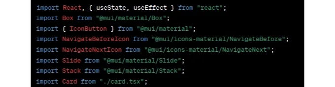
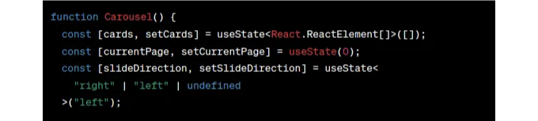
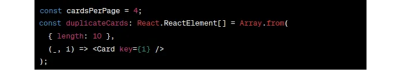
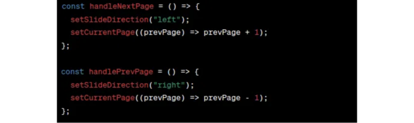
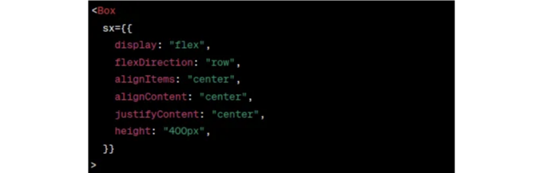
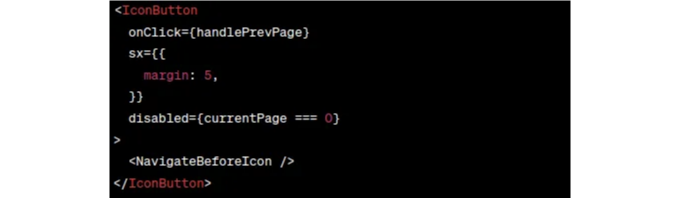
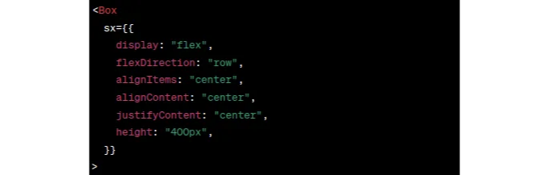
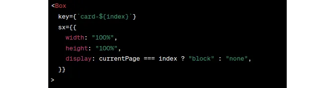
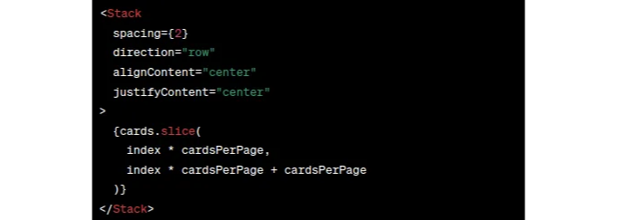
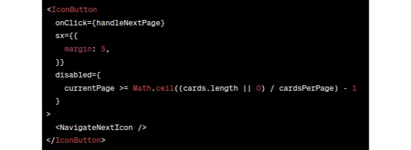

### Part 1

MUI의 기존 카드 구성요소를 사용한 매우 기본적인 정적 예제

# 프로페셔널 웹 앱을 위한 여정

<!-- ui-log 수평형 -->
<ins class="adsbygoogle"
  style="display:block"
  data-ad-client="ca-pub-4877378276818686"
  data-ad-slot="9743150776"
  data-ad-format="auto"
  data-full-width-responsive="true"></ins>
<component is="script">
(adsbygoogle = window.adsbygoogle || []).push({});
</component>

나의 첫 번째 중요한 애플리케이션을 만들기 시작할 때 명백한 것이 한 가지 있었습니다: 아름다움과 사용자 경험은 극도로 중요했습니다. 멋진 반응형 디자인은 단순한 호화로운 것이 아니라 필수품이었습니다. 나는 Airbnb, Netflix, Apple TV 등을 존경하는 플랫폼들의 우아함과 기능성을 흉내 내고자 했습니다. 이들의 사용자 인터페이스는 "캐로셀"과 "카드"라는 두 가지 도구를 자주 활용합니다. 이 디자인 요소들은 단순한 장식에 그치는 것이 아니라 정보를 효율적이고 매력적으로 그리고 반응적으로 표시하는 데 사용되는 기본 구성 요소입니다.

# 왜 React와 MUI를 선택했나요?

React는 나에게 자연스러운 선택이었습니다. 그의 컴포넌트 기반 아키텍처는 모듈식, 확장 가능하고 유지 관리가 쉬운 응용 프로그램을 구축할 수 있게 해줍니다. 가상 DOM은 최적화된 효율적인 업데이트를 보장하여 동적 사용자 인터페이스에 늘 훌륭한 선택이 됩니다.

반면에 Material-UI 또는 MUI는 구글의 Material Design을 구현하는 React 컴포넌트 모음을 제공하는 인기 있는 라이브러리입니다. 이는 스타일링 프로세스를 가속화하고 앱이 현대적으로 보이고 상호 작용적인 느낌을 제공하도록 약속합니다.

<!-- ui-log 수평형 -->
<ins class="adsbygoogle"
  style="display:block"
  data-ad-client="ca-pub-4877378276818686"
  data-ad-slot="9743150776"
  data-ad-format="auto"
  data-full-width-responsive="true"></ins>
<component is="script">
(adsbygoogle = window.adsbygoogle || []).push({});
</component>

# 예상치 못한 도전

놀랍게도 MUI의 방대한 컴포넌트 라이브러리를 살펴보니 미리 만들어진 '캐러셀' 컴포넌트가 없었습니다. 이것은 놀라운 일이자 도전이었습니다. 캐러셀 - 현대 웹 디자인에서 널리 사용되는 요소인 만큼 쉽게 사용할 수 있을 것으로 생각되었습니다. 또한 MUI API를 사용하는 튜토리얼이나 제3자 컴포넌트도 찾을 수 없었습니다.

그러나 개발자로서 이러한 도전은 진정한 실패가 아닌 기회입니다. 나에게는 내가 직접 만들어 보는 시간이었습니다.

# 캐러셀 작성 여정에 나서다

<!-- ui-log 수평형 -->
<ins class="adsbygoogle"
  style="display:block"
  data-ad-client="ca-pub-4877378276818686"
  data-ad-slot="9743150776"
  data-ad-format="auto"
  data-full-width-responsive="true"></ins>
<component is="script">
(adsbygoogle = window.adsbygoogle || []).push({});
</component>

이 튜토리얼은 React와 MUI를 사용하여 캐러셀 컴포넌트를 만드는 과정을 안내하는 시리즈의 첫 번째 부분입니다. 이번 편에서는 간단히 시작하겠습니다. MUI의 "card" 컴포넌트 데모에서 직접 가져온 정적 카드를 활용할 것입니다. 동적이거나 데이터베이스 기반 접근 방식 대신 이 카드들의 배열을 생성하고 이들을 매끄럽게 표시하는 캐러셀 기능을 구현할 것입니다.

우리의 캐러셀의 세세한 부분에 대해 깊이 들어가기 전에, 필요한 것들을 명확히 해보겠습니다:

준비물:

- React의 기본적인 이해.
- MUI에 대한 친숙함.
- https://github.com/tweezerchef/carousel 에서 저장소를 클론하여 레포지토리를 받아옵니다. 이 레포지토리에는 모든 파일이 포함되어 있으며, 이를 클론하여 따라할 수 있는 모든 것이 준비됩니다.

<!-- ui-log 수평형 -->
<ins class="adsbygoogle"
  style="display:block"
  data-ad-client="ca-pub-4877378276818686"
  data-ad-slot="9743150776"
  data-ad-format="auto"
  data-full-width-responsive="true"></ins>
<component is="script">
(adsbygoogle = window.adsbygoogle || []).push({});
</component>

Node.js, React, 및 npm에 익숙한 경우, 필요한 MUI 라이브러리만 추가 설치하면 됩니다. 이를 통해 스타일링 및 컴포넌트 구조가 Material Design 원칙과 일관되도록 보장됩니다.

준비가 끝났으니, 이번 개발 여정을 함께 떠나봅시다. 도전을 기회로 변화시킬 차례입니다. 마지막에는 산업의 선두 플랫폼에서 볼 수 있는 것과 유사한 우아한 캐러셀 컴포넌트를 만드는 지식을 습득할 것입니다.

아래 배포된 버전을 확인해보세요

http://3.128.189.242:3000/

<!-- ui-log 수평형 -->
<ins class="adsbygoogle"
  style="display:block"
  data-ad-client="ca-pub-4877378276818686"
  data-ad-slot="9743150776"
  data-ad-format="auto"
  data-full-width-responsive="true"></ins>
<component is="script">
(adsbygoogle = window.adsbygoogle || []).push({});
</component>

# 캐러셀 컴포넌트의 내용을 살펴보기

## 1. Imports: 준비 작업 설정

## 이 부분에서 무슨 일이 벌어지고 있을까요?

<!-- ui-log 수평형 -->
<ins class="adsbygoogle"
  style="display:block"
  data-ad-client="ca-pub-4877378276818686"
  data-ad-slot="9743150776"
  data-ad-format="auto"
  data-full-width-responsive="true"></ins>
<component is="script">
(adsbygoogle = window.adsbygoogle || []).push({});
</component>

- React, useState, useEffect: 이것들은 React의 기본 훅입니다. useState는 컴포넌트에서 상태를 유지하는 데 사용되고, useEffect는 데이터를 가져오거나 DOM을 업데이트하는 등의 사이드 이펙트를 실행할 수 있게 해줍니다.
- Box, IconButton, Slide, Stack: 이것들은 MUI에서 제공하는 컴포넌트입니다. Box는 스타일링을 위한 다목적 컴포넌트입니다. IconButton은 자식으로 아이콘을 사용하는 버튼입니다. Slide는 애니메이션 컴포넌트이며, Stack은 자식 컴포넌트를 쌓을 때 사용됩니다.
- NavigateBeforeIcon & NavigateNextIcon: 이것들은 MUI에서 제공하는 아이콘으로 뒤로 이동과 앞으로 이동을 상징합니다.
- Card: 이것은 우리가 가져오는 카드 컴포넌트입니다. 캐러셀에 표시될 내용입니다

## 2. 컴포넌트 상태 설정하기

## 세부 내용:

<!-- ui-log 수평형 -->
<ins class="adsbygoogle"
  style="display:block"
  data-ad-client="ca-pub-4877378276818686"
  data-ad-slot="9743150776"
  data-ad-format="auto"
  data-full-width-responsive="true"></ins>
<component is="script">
(adsbygoogle = window.adsbygoogle || []).push({});
</component>

- cards: 캐러셀에 표시할 카드를 저장하는 배열입니다.
- currentPage: 현재 페이지나 표시된 카드 세트를 나타내는 숫자입니다.
- slideDirection: 슬라이드 애니메이션 방향을 결정하는 문자열 값으로, "left" 또는 "right"일 수 있습니다.

## 3. 캐러셀 동작 구성하기

- cardsPerPage: 페이지 당 표시할 카드 수를 정의하는 상수입니다.
- duplicateCards: Card 컴포넌트를 사용하여 10개의 중복된 카드 배열을 생성합니다. 이는 데모용 더미 세트입니다.

<!-- ui-log 수평형 -->
<ins class="adsbygoogle"
  style="display:block"
  data-ad-client="ca-pub-4877378276818686"
  data-ad-slot="9743150776"
  data-ad-format="auto"
  data-full-width-responsive="true"></ins>
<component is="script">
(adsbygoogle = window.adsbygoogle || []).push({});
</component>

## 4. 캐러셀을 탐색하는 함수들

- handleNextPage와 handlePrevPage: 다음 또는 이전 버튼이 눌렸을 때 호출되는 함수들입니다. 현재 페이지와 슬라이드 방향을 업데이트합니다.

## 5. useEffect: 초기 데이터 설정

<!-- ui-log 수평형 -->
<ins class="adsbygoogle"
  style="display:block"
  data-ad-client="ca-pub-4877378276818686"
  data-ad-slot="9743150776"
  data-ad-format="auto"
  data-full-width-responsive="true"></ins>
<component is="script">
(adsbygoogle = window.adsbygoogle || []).push({});
</component>

여기서는 useEffect 훅을 사용하여 컴포넌트가 마운트될 때 초기에 카드를 duplicateCards 배열로 설정합니다. 빈 배열 []은 이 효과가 한 번만 실행되며 클래스 컴포넌트의 componentDidMount와 유사합니다. 좀 더 동적인 사이트를 만들 때, 다른 튜토리얼에서 다루게 되는 것이지만 해당 데이터를 수집하고 "cards" 배열의 상태를 설정하는 호출과 관련됩니다.

이어서 컴포넌트의 "return" 부분으로 진행하여 렌더링이 발생하는 부분을 살펴보겠습니다.

# 캐러셀 렌더링

<!-- ui-log 수평형 -->
<ins class="adsbygoogle"
  style="display:block"
  data-ad-client="ca-pub-4877378276818686"
  data-ad-slot="9743150776"
  data-ad-format="auto"
  data-full-width-responsive="true"></ins>
<component is="script">
(adsbygoogle = window.adsbygoogle || []).push({});
</component>

## 1. 캐러셀을 위한 컨테이너:

- 이것은 캐러셀을 위한 가장 바깥의 상자 또는 컨테이너입니다. 이 컨테이너에는 네비게이션 버튼과 카드를 포함한 모든 캐러셀 관련 항목이 포함될 것입니다.
- 스타일 이해하기:
  - display: "flex": 이 컨테이너를 플렉스박스 컨테이너로 초기화합니다. 플렉스박스는 CSS 레이아웃 방법으로, 아이템의 크기가 알려지지 않은 경우에도 한 줄이나 열에 따라 공간을 분배할 수 있도록 설계되었습니다.
  - flexDirection: "row": 이것은 주축을 수평으로 만들어주어, 자식 요소(이 컨테이너 내부의 항목들)이 행으로 배치되도록 합니다.
  - alignItems: "center" & alignContent: "center": 이들은 아이템(카드 및 버튼과 같은 요소)이 수직으로 가운데 정렬되도록 합니다.
  - justifyContent: "center": 이것은 아이템을 수평으로 가운데 정렬합니다.
  - height: "400px": 컨테이너에 고정된 높이를 설정합니다.

## 2. 이전 페이지 버튼:

<!-- ui-log 수평형 -->
<ins class="adsbygoogle"
  style="display:block"
  data-ad-client="ca-pub-4877378276818686"
  data-ad-slot="9743150776"
  data-ad-format="auto"
  data-full-width-responsive="true"></ins>
<component is="script">
(adsbygoogle = window.adsbygoogle || []).push({});
</component>

- 이 버튼은 캐로셀에서 이전 페이지나 카드 세트로 이동할 수 있도록 디자인되었습니다.
- onClick={handlePrevPage}: 버튼을 클릭하면 handlePrevPage 함수를 실행합니다. 이 함수는 현재 페이지를 이전 페이지로 업데이트하는 역할을 합니다.
- disabled={currentPage === 0}: 현재 페이지가 첫 페이지 (0)인 경우 버튼을 비활성화하는 조건입니다. 사용자가 존재하지 않는 이전 페이지로 이동하는 것을 방지합니다.
- `NavigateBeforeIcon /`: 이 아이콘은 "뒤로 가기"나 "이전"을 시각적으로 나타내는 것으로 MUI 라이브러리에서 제공됩니다.

## 3. 카드와 애니메이션을 위한 컨테이너:

<!-- ui-log 수평형 -->
<ins class="adsbygoogle"
  style="display:block"
  data-ad-client="ca-pub-4877378276818686"
  data-ad-slot="9743150776"
  data-ad-format="auto"
  data-full-width-responsive="true"></ins>
<component is="script">
(adsbygoogle = window.adsbygoogle || []).push({});
</component>

이 상자는 카드를 담는 컨테이너 역할을 합니다. 카드에 지정된 공간이 항상 부모 컨테이너의 전체 너비와 높이를 차지하도록 보장합니다.

## 4. 각 카드 렌더링:

.map 함수를 사용하여 cards 상태의 각 카드를 반복합니다. 각 카드에 대해 현재 페이지를 기준으로 표시 여부를 결정하고 싶습니다.

<!-- ui-log 수평형 -->
<ins class="adsbygoogle"
  style="display:block"
  data-ad-client="ca-pub-4877378276818686"
  data-ad-slot="9743150776"
  data-ad-format="auto"
  data-full-width-responsive="true"></ins>
<component is="script">
(adsbygoogle = window.adsbygoogle || []).push({});
</component>

## 5. 카드에 대한 표시 논리:

- 위 상자는 각 카드 또는 카드 세트 주위에 둘러싸여 있습니다.
- key={card-${index}}: 각 카드에 대한 고유 식별자를 제공하며, React의 조정 프로세스에 중요합니다.
- display: currentPage === index ? "block" : "none"을 사용한 스타일링이 중요합니다. 이렇게 함으로써 현재 페이지의 카드만 표시되고 나머지는 숨겨집니다.

## 6. 카드에 대한 슬라이드 애니메이션:

<!-- ui-log 수평형 -->
<ins class="adsbygoogle"
  style="display:block"
  data-ad-client="ca-pub-4877378276818686"
  data-ad-slot="9743150776"
  data-ad-format="auto"
  data-full-width-responsive="true"></ins>
<component is="script">
(adsbygoogle = window.adsbygoogle || []).push({});
</component>

- 이것은 슬라이드 애니메이션을 제공하는 MUI Slide 구성 요소입니다.
- direction={slideDirection}: slideDirection 상태를 기반으로 한 슬라이드 방향을 지정합니다.
- in={currentPage === index}:이 속성은 콘텐츠(예: 카드)가 화면에 들어가야 하는지를 결정합니다. 참이면 카드가 슬라이드됩니다.

## 7. 일부 카드의 쌓이고 표시하기:

<!-- ui-log 수평형 -->
<ins class="adsbygoogle"
  style="display:block"
  data-ad-client="ca-pub-4877378276818686"
  data-ad-slot="9743150776"
  data-ad-format="auto"
  data-full-width-responsive="true"></ins>
<component is="script">
(adsbygoogle = window.adsbygoogle || []).push({});
</component>

- 스택(Stack)은 항목들을 쌓는 MUI 구성 요소입니다. 여기서는 카드의 하위 집합을 가로로 쌓기 위해 사용하고 있습니다.
- cards.slice(...) 함수는 중요합니다. 현재 페이지에 해당하는 카드의 하위 집합만 가져와서 표시하도록 보장합니다. 현재 페이지(인덱스)와 페이지당 카드 수(cardsPerPage)를 기반으로 어떤 카드를 표시할지를 계산합니다.

## 8. 다음 페이지 버튼:

- 이 버튼은 다음 페이지나 카드 세트로 이동하기 위해 설계되었습니다.
- 이곳에서의 비활성화 로직은 이전 버튼보다 약간 복잡합니다. 카드의 마지막 페이지에 있는지 계산하고, 그렇다면 더 이상 탐색할 수 없도록 버튼을 비활성화합니다.

<!-- ui-log 수평형 -->
<ins class="adsbygoogle"
  style="display:block"
  data-ad-client="ca-pub-4877378276818686"
  data-ad-slot="9743150776"
  data-ad-format="auto"
  data-full-width-responsive="true"></ins>
<component is="script">
(adsbygoogle = window.adsbygoogle || []).push({});
</component>

이 코딩 튜토리얼의 이 부분이 마무리되었습니다. 다음에는 이 코드를 여러분의 필요에 맞게 사용자 정의하는 방법과 다음 단계에 대해 간략히 살펴보겠습니다.

# 캐러셀 사용자 정의하기

캐러셀을 사용자 정의할 때, 특정 필요에 맞게 수정하거나 독특한 터치를 더할 수 있는 다양한 방법이 있습니다:

- 표시되는 카드 수:
  - 현재 페이지당 표시되는 카드 수는 cardsPerPage 상수를 통해 설정됩니다. 이 숫자를 조정하여 각 슬라이드에 더 많은 카드 또는 더 적은 카드를 표시할 수 있습니다.
- 스타일링과 테마:
  - Material-UI의 테마 기능을 활용하여 캐러셀의 모양을 바꿀 수 있습니다. 이는 색상, 글꼴, 그리고 카드의 크기를 변경하는 것을 포함할 수 있습니다.
- 카드 콘텐츠:
  - 카드(`Card /` 컴포넌트)의 콘텐츠를 풍부하게 만들 수 있습니다. 제공된 더미 콘텐츠 대신 이미지, 텍스트, 링크 또는 표현하고 싶은 모든 다른 콘텐츠를 포함시킬 수 있습니다.
- 내비게이션 아이콘:
  - 현재 구현에서는 내비게이션에 NavigateBeforeIcon 및 NavigateNextIcon이 사용되지만, Material-UI는 다양한 아이콘을 제공합니다. 미적 또는 사용성 목표에 맞는 다른 아이콘으로 이들을 자유롭게 교체할 수 있습니다.
- 애니메이션 & 전환:
  - Material-UI의 Slide 컴포넌트는 간단한 슬라이딩 애니메이션을 제공합니다. 그러나 페이드, 줌 또는 심지어 사용자 정의 애니메이션과 같은 다른 애니메이션을 탐험하여 캐러셀 전환을 더 매력적으로 만들 수 있습니다.
- 동적 데이터 로딩:
  - 주어진 코드에서는 duplicateCards 배열을 사용해 시연 목적으로 카드를 복제했습니다. 실제 시나리오에서는 API 또는 데이터베이스에서 데이터를 동적으로로드하고 정적 데이터 초기화를 대체할 수 있습니다.

<!-- ui-log 수평형 -->
<ins class="adsbygoogle"
  style="display:block"
  data-ad-client="ca-pub-4877378276818686"
  data-ad-slot="9743150776"
  data-ad-format="auto"
  data-full-width-responsive="true"></ins>
<component is="script">
(adsbygoogle = window.adsbygoogle || []).push({});
</component>

# 결론

지금까지 살펴본 Carousel 컴포넌트는 React와 Material-UI가 함께 사용되어 상호작용하는 UI 컴포넌트를 만드는 기본적인 예제입니다. 이 데모는 기본적인 구현을 제공하지만, React와 Material-UI의 장점은 그들의 유연성과 확장 가능성에 있습니다.

다음 데모에서는 Carousel에 더 다이내믹한 요소를 추가하는 데 더 깊이 파고들 것입니다. 특히, 다음 데모에서는 원격 PostgreSQL 데이터베이스에서 카드에 표시된 정보를 가져와 더 현실적인 사용 사례 시나리오를 제공할 것입니다. 발전함에 따라, React가 다양한 백엔드 시스템과 얼마나 매끄럽게 통합되며 컴포넌트가 실시간 데이터로 풍부해질 수 있는지 알게 되실 것입니다.

포트폴리오 쇼케이스, 전자상거래 제품 슬라이더 또는 기타 콘텐츠 디스플레이를 구축하고 있다면, 이 Carousel은 다목적 시작점으로 기능합니다. 항상 핵심 개념을 이해하고 그것들을 여러분의 특정 요구에 맞게 반복적으로 발전시키는 것이 중요합니다. 즐거운 코딩되세요!