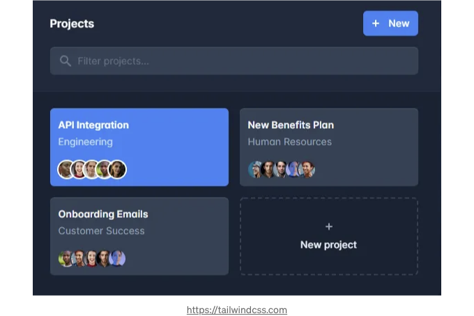
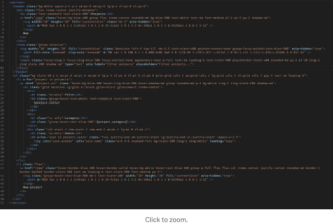
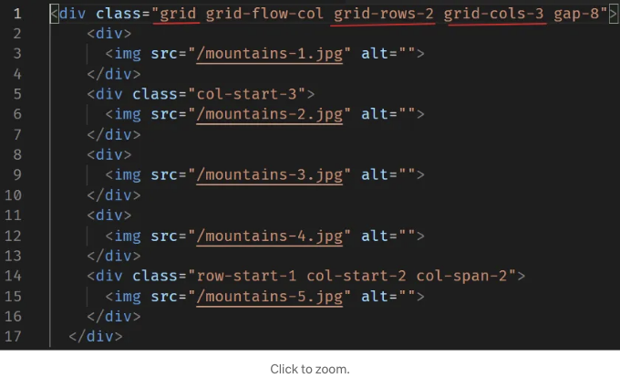
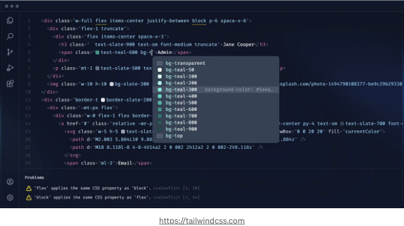
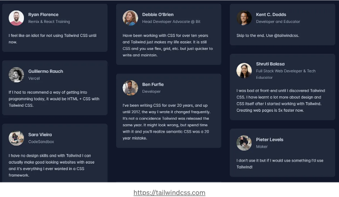

## 안녕하세요, 놀라운 Tailwind CSS에 관한 정보입니다. 출발!

## 🤔

Tailwind CSS는 매우 유연하고 저수준의 CSS 구조로, 당신이 직접 디자인을 원하는 구조 블록을 모두 제공하는데 뜻을 두고 있어요. 고집스런 스타일을 뛰어넘기 위해 싸울 필요가 없는 독특한 디자인을 가능하게 해줘요. 이는 유틸리티-우선 CSS 시스템으로, 우리는 유틸리티 클래스를 사용하여 기존의 CSS를 작성하지 않고도 사용자 정의 레이아웃을 만들 수 있다는 것을 의미해요.

<!-- ui-log 수평형 -->

<ins class="adsbygoogle"
  style="display:block"
  data-ad-client="ca-pub-4877378276818686"
  data-ad-slot="9743150776"
  data-ad-format="auto"
  data-full-width-responsive="true"></ins>
<component is="script">
(adsbygoogle = window.adsbygoogle || []).push({});
</component>

이들은 여러분이 시작부터 빠르게 이동하는 데 도움이 되는 단추, 카드 및 알림과 같은 다양한 사전 설계된 구성 요소와 함께 제공됩니다. 그러나 맞춤 디자인으로 사이트를 돋보이게 만들 때 고통보다는 해결책이 되기보다 많을 수 있습니다.

## 실제 예시

위의 레이아웃은 외부 스타일 없이 생성되었으며 Tailwind CSS 클래스만 사용되었습니다. 코드는 다음과 같습니다:

<!-- ui-log 수평형 -->

<ins class="adsbygoogle"
  style="display:block"
  data-ad-client="ca-pub-4877378276818686"
  data-ad-slot="9743150776"
  data-ad-format="auto"
  data-full-width-responsive="true"></ins>
<component is="script">
(adsbygoogle = window.adsbygoogle || []).push({});
</component>

만약 그리드 시스템 구조를 만들고 싶다면 어떻게 해야 할까요?

이것은 매우 간단한데, 우리가 사용하는 부트스트랩과 매우 유사합니다 (하지만 업그레이드된 버전 lol):

<!-- ui-log 수평형 -->

<ins class="adsbygoogle"
  style="display:block"
  data-ad-client="ca-pub-4877378276818686"
  data-ad-slot="9743150776"
  data-ad-format="auto"
  data-full-width-responsive="true"></ins>
<component is="script">
(adsbygoogle = window.adsbygoogle || []).push({});
</component>

문서: Tailwind CSS 그리드 시스템

## 커뮤니티에서 애용하는 이유는?

사용자: +782,800명; 기여자: +202명

<!-- ui-log 수평형 -->

<ins class="adsbygoogle"
  style="display:block"
  data-ad-client="ca-pub-4877378276818686"
  data-ad-slot="9743150776"
  data-ad-format="auto"
  data-full-width-responsive="true"></ins>
<component is="script">
(adsbygoogle = window.adsbygoogle || []).push({});
</component>

VS Code에서 Tailwind CSS IntelliSense를 사용합니다. 이 확장프로그램을 사용하는 이점은 다음과 같습니다: - 자동완성 (CSS 함수 및 지시문) -
린팅 - 호버 미리보기 - 구문 강조 GitHub과 확장프로그램 Marketplace를 이용해보세요.

<!-- ui-log 수평형 -->

<ins class="adsbygoogle"
  style="display:block"
  data-ad-client="ca-pub-4877378276818686"
  data-ad-slot="9743150776"
  data-ad-format="auto"
  data-full-width-responsive="true"></ins>
<component is="script">
(adsbygoogle = window.adsbygoogle || []).push({});
</component>

## 상담을 위한 링크

- 문서: [Tailwind CSS](https://tailwindcss.com)
- GitHub: [tailwindlabs/tailwindcss](https://github.com/tailwindlabs/tailwindcss)
- 설치가 매우 간단합니다: [설치 안내](https://tailwindcss.com/docs/installation)
- Tailwind CSS UI에 대해: [Tailwind UI](https://tailwindui.com)
- Tailwind Labs에서 제작한 이 재생목록(From Zero to Production)도 확인해보세요:

## 그래서...

아직 사용해보지 않았다면, 지금 사용해보세요!
HTML을 벗어나지 않고 현대적인 웹사이트를 빠르게 만들어보고 행복해지세요 :-)

<!-- ui-log 수평형 -->

<ins class="adsbygoogle"
  style="display:block"
  data-ad-client="ca-pub-4877378276818686"
  data-ad-slot="9743150776"
  data-ad-format="auto"
  data-full-width-responsive="true"></ins>
<component is="script">
(adsbygoogle = window.adsbygoogle || []).push({});
</component>

사람들의 의견:

