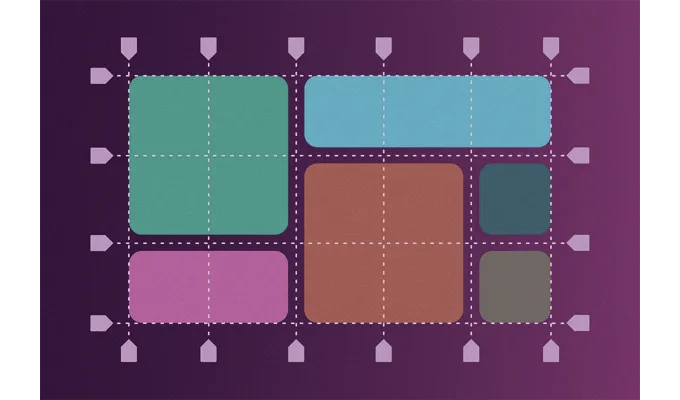
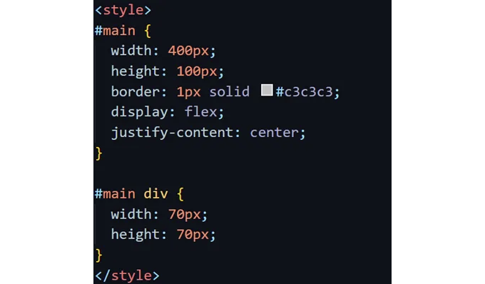
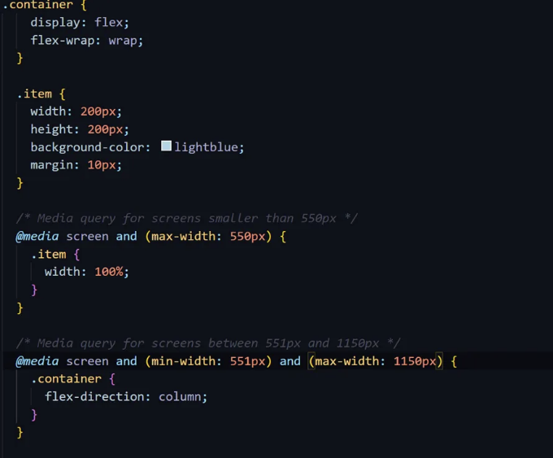
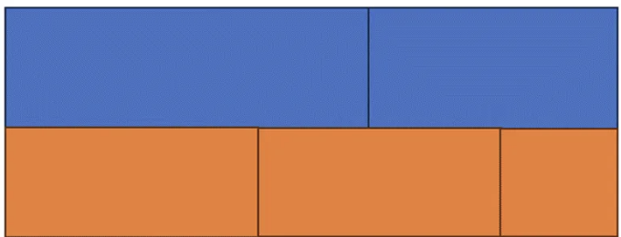
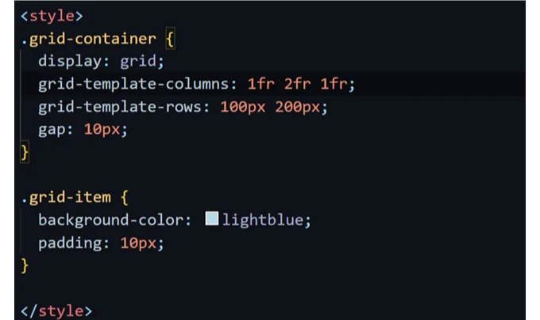
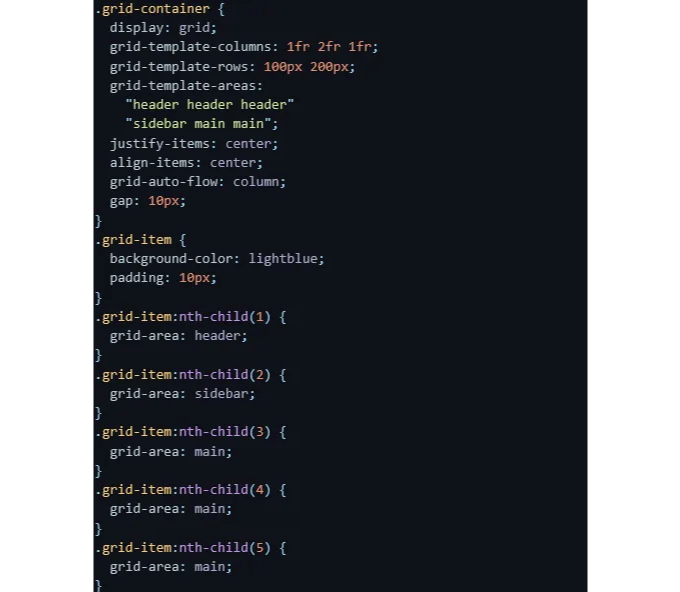

소개:

웹 디자인의 계속 발전하는 세계에서 유연하고 반응형 레이아웃을 만드는 것이 매우 중요해졌습니다. 프론트엔드 개발을 혁신시킨 두 가지 강력한 레이아웃 도구는 Flexbox와 CSS Grid Layout입니다. 이 블로그 글에서는 Flexbox와 CSS Grid Layout의 가능성과 이점을 살펴보고, 기능, 사용 사례, 그리고 이 두 가지를 조합하여 동적이고 시각적으로 멋진 웹 디자인을 만들 수 있는 방법을 탐구해 보겠습니다.

1. Flexbox의 이해:

<!-- ui-log 수평형 -->
<ins class="adsbygoogle"
  style="display:block"
  data-ad-client="ca-pub-4877378276818686"
  data-ad-slot="9743150776"
  data-ad-format="auto"
  data-full-width-responsive="true"></ins>
<component is="script">
(adsbygoogle = window.adsbygoogle || []).push({});
</component>

플렉스박스는 Flexible Box Layout의 줄임말로, 컨테이너 내 요소들을 쉽게 배치하고 정렬할 수 있는 1차원 레이아웃 모델입니다. 반응형 레이아웃을 만드는 강력한 도구로, 모든 주요 브라우저에서 지원됩니다.

a. 플렉스 컨테이너와 플렉스 아이템:

플렉스박스의 기본 구성 요소는 플렉스 컨테이너와 플렉스 아이템입니다.

<!-- ui-log 수평형 -->
<ins class="adsbygoogle"
  style="display:block"
  data-ad-client="ca-pub-4877378276818686"
  data-ad-slot="9743150776"
  data-ad-format="auto"
  data-full-width-responsive="true"></ins>
<component is="script">
(adsbygoogle = window.adsbygoogle || []).push({});
</component>

플렉스 컨테이너는 display: flex 속성이 적용된 요소입니다.

플렉스 항목은 플렉스 컨테이너 내에 포함된 요소들입니다.

플렉스 컨테이너는 플렉스 항목들의 전체적인 레이아웃을 정의합니다. flex-direction 속성의 값에 따라 행이나 열로 정렬될 수 있습니다.

플렉스 항목은 플렉스 컨테이너 내에 배치된 요소들입니다. flex-grow, flex-shrink, flex-basis 속성의 값에 따라 크기를 조절하고 정렬할 수 있습니다.

<!-- ui-log 수평형 -->
<ins class="adsbygoogle"
  style="display:block"
  data-ad-client="ca-pub-4877378276818686"
  data-ad-slot="9743150776"
  data-ad-format="auto"
  data-full-width-responsive="true"></ins>
<component is="script">
(adsbygoogle = window.adsbygoogle || []).push({});
</component>

b. 유연한 크기 조절과 정렬:

Flexbox는 유연한 크기 조절과 정렬을 제어하는 여러 속성을 제공합니다. 이러한 속성에는 다음이 포함됩니다:

- flex-grow: 이 속성은 플렉스 컨테이너의 크기가 조절될 때 플렉스 항목이 차지해야 할 공간을 제어합니다.

<!-- ui-log 수평형 -->
<ins class="adsbygoogle"
  style="display:block"
  data-ad-client="ca-pub-4877378276818686"
  data-ad-slot="9743150776"
  data-ad-format="auto"
  data-full-width-responsive="true"></ins>
<component is="script">
(adsbygoogle = window.adsbygoogle || []).push({});
</component>

flex-shrink: 이 속성은 flex 컨테이너의 크기가 조절될 때 flex 항목이 얼마나 줄어들어야 하는지를 제어합니다.

flex-basis: 이 속성은 flex 항목의 초기 크기를 제어합니다.

<!-- ui-log 수평형 -->
<ins class="adsbygoogle"
  style="display:block"
  data-ad-client="ca-pub-4877378276818686"
  data-ad-slot="9743150776"
  data-ad-format="auto"
  data-full-width-responsive="true"></ins>
<component is="script">
(adsbygoogle = window.adsbygoogle || []).push({});
</component>

세 번째 아이템은 다른 아이템에 비해 상대적으로 숫자 3으로 축소됩니다.

justify-content: 이 속성은 플렉스 아이템이 플렉스 컨테이너 내에서 수평으로 정렬되는 방식을 제어합니다.

<!-- ui-log 수평형 -->
<ins class="adsbygoogle"
  style="display:block"
  data-ad-client="ca-pub-4877378276818686"
  data-ad-slot="9743150776"
  data-ad-format="auto"
  data-full-width-responsive="true"></ins>
<component is="script">
(adsbygoogle = window.adsbygoogle || []).push({});
</component>

align-items: 이 속성은 플렉스 아이템이 플렉스 컨테이너 내에서 수직으로 정렬되는 방식을 제어합니다.

C. Flexbox를 사용한 반응형 디자인:

<!-- ui-log 수평형 -->
<ins class="adsbygoogle"
  style="display:block"
  data-ad-client="ca-pub-4877378276818686"
  data-ad-slot="9743150776"
  data-ad-format="auto"
  data-full-width-responsive="true"></ins>
<component is="script">
(adsbygoogle = window.adsbygoogle || []).push({});
</component>

Flexbox는 반응형 레이아웃을 만들기 위한 강력한 도구입니다. Flexbox를 미디어 쿼리와 다른 CSS 속성과 결합하여 서로 다른 화면 크기와 장치에 대응하는 디자인을 구축할 수 있습니다.

미디어 쿼리를 사용하면 사용자의 장치나 뷰포트 크기에 따라 특정 스타일을 적용할 수 있습니다. 미디어 쿼리 내에서 플렉스 컨테이너 속성을 변경하거나 항목의 스타일을 덮어쓰면 레이아웃을 재배치하거나 항목 크기를 수정하거나 플렉스 컨테이너의 방향을 변경하여 반응형 디자인을 만들 수 있습니다.

Flexbox는 "max-width"나 "min-width"와 같은 다른 CSS 속성과 결합하여 서로 다른 화면 크기에서 플렉스 항목의 동작을 제어할 수도 있습니다. 미디어 쿼리를 사용하면 다양한 화면 크기에 대응하는 유동적이고 적응형 레이아웃을 만들기 위해 다른 플렉스 컨테이너 속성을 정의하거나 플렉스 항목 크기를 조절할 수 있습니다.

아래 예시를 살펴보세요:

<!-- ui-log 수평형 -->
<ins class="adsbygoogle"
  style="display:block"
  data-ad-client="ca-pub-4877378276818686"
  data-ad-slot="9743150776"
  data-ad-format="auto"
  data-full-width-responsive="true"></ins>
<component is="script">
(adsbygoogle = window.adsbygoogle || []).push({});
</component>

이 예시에서는 클래스가 `.container`인 플렉스 컨테이너와 클래스가 `.item`인 플렉스 아이템이 있습니다. Flex 아이템은 너비와 높이가 200픽셀인 고정된 크기이며 연한 파란색 배경색을 가지고 있습니다. 또한 간격을 만들기 위해 10픽셀의 마진을 가지고 있습니다.

첫 번째 미디어 쿼리는 너비가 550픽셀 미만인 화면을 대상으로 합니다. 이 미디어 쿼리 내에서 우리는 flex 아이템의 너비를 100%로 재지정하여 컨테이너의 전체 너비를 차지하고 수직으로 쌓이도록 합니다.

두 번째 미디어 쿼리는 너비가 551픽셀에서 1150픽셀 사이인 화면을 대상으로 합니다. 이 미디어 쿼리 내에서는 flex 컨테이너의 flex-direction 속성을 column으로 변경하여 flex 아이템이 가로로 쌓이는 대신 세로로 쌓이도록 변경합니다.

<!-- ui-log 수평형 -->
<ins class="adsbygoogle"
  style="display:block"
  data-ad-client="ca-pub-4877378276818686"
  data-ad-slot="9743150776"
  data-ad-format="auto"
  data-full-width-responsive="true"></ins>
<component is="script">
(adsbygoogle = window.adsbygoogle || []).push({});
</component>

미디어 쿼리와 플렉스박스를 함께 사용하면 사용자의 기기나 뷰포트 크기에 따라 레이아웃과 요소 크기를 동적으로 조절할 수 있어서 디자인을 다양한 화면 크기에 대응할 수 있게 만들어줍니다. 최적화되었습니다.

2. CSS 그리드 레이아웃의 강점을 활용하기:

CSS 그리드 레이아웃은 복잡한 그리드 기반 디자인을 가능하게 하는 2차원 레이아웃 시스템입니다. 이는 레이아웃의 행과 열을 정밀하게 제어하여 동적이고 반응형 디자인을 만들 수 있도록 해줍니다. CSS 그리드 레이아웃에 관한 주요 포인트를 살펴보겠습니다:

<!-- ui-log 수평형 -->
<ins class="adsbygoogle"
  style="display:block"
  data-ad-client="ca-pub-4877378276818686"
  data-ad-slot="9743150776"
  data-ad-format="auto"
  data-full-width-responsive="true"></ins>
<component is="script">
(adsbygoogle = window.adsbygoogle || []).push({});
</component>

a. 그리드 컨테이너와 그리드 항목:

CSS 그리드 레이아웃에서는 그리드 컨테이너와 그리드 항목이 있습니다.

그리드 컨테이너는 그리드 레이아웃의 부모 역할을 하는 요소입니다. 컨테이너에 CSS 속성 "display: grid"를 적용하여 CSS 그리드 레이아웃을 활성화합니다. 이렇게 하면 컨테이너가 그리드 컨테이너로 변환됩니다.

그리드 항목은 그리드 컨테이너 내에 포함된 개별 요소입니다. 어떤 HTML 요소라도 그리드 항목이 될 수 있습니다. 각 그리드 항목은 그리드 내의 하나 이상의 셀을 차지합니다. 기본적으로 그리드 항목은 소스 코드에서 나타난 순서대로 그리드 내에 흐르지만, 그리드 라인과 그리드 셀을 사용하여 명시적으로 위치를 지정할 수 있습니다.

<!-- ui-log 수평형 -->
<ins class="adsbygoogle"
  style="display:block"
  data-ad-client="ca-pub-4877378276818686"
  data-ad-slot="9743150776"
  data-ad-format="auto"
  data-full-width-responsive="true"></ins>
<component is="script">
(adsbygoogle = window.adsbygoogle || []).push({});
</component>

위 내용을 더 잘 이해하기 위해 예시를 살펴봅시다:

위 코드를 통해 다음과 같은 그리드를 얻을 수 있습니다:

<!-- ui-log 수평형 -->
<ins class="adsbygoogle"
  style="display:block"
  data-ad-client="ca-pub-4877378276818686"
  data-ad-slot="9743150776"
  data-ad-format="auto"
  data-full-width-responsive="true"></ins>
<component is="script">
(adsbygoogle = window.adsbygoogle || []).push({});
</component>

이 예제에서는 grid-template-columns 속성을 사용하여 세 개의 열이 정의된 그리드 컨테이너가 있습니다. 이 속성은 각 열이 사용 가능한 공간의 일부(1fr 2fr 1fr)를 차지하도록 지정하며, 이는 첫 번째와 세 번째 열이 각각 1/4의 부분을 차지하고 두 번째 열이 2/4의 부분을 차지한다는 것을 의미합니다. 컨테이너는 grid-template-rows 속성을 사용하여 두 개의 행을 정의하고, 첫 번째 행의 높이는 100px, 두 번째 행의 높이는 200px로 설정합니다. gap 속성은 그리드 항목간의 간격을 10px로 지정합니다.

그리드 항목(클래스 grid-item을 가진 div 요소)은 그리드 컨테이너 내에 포함된 개별 요소입니다. 이 경우 1부터 5까지 번호가 매겨진 다섯 개의 그리드 항목이 있습니다. 명시적 위치 지정이 없는 경우, 그리드 항목은 소스 코드에서 나타나는 순서대로 그리드로 흘러들어갑니다.

그리드 트랙은 그리드 라인 사이의 공간입니다. grid-template-columns 속성은 각 열이 사용 가능한 공간의 동일한 부분(1fr)을 차지하도록 지정하여 세 개의 같은 폭 열을 생성합니다. grid-template-rows 속성은 행의 높이를 각각 100px와 200px로 설정합니다.

<!-- ui-log 수평형 -->
<ins class="adsbygoogle"
  style="display:block"
  data-ad-client="ca-pub-4877378276818686"
  data-ad-slot="9743150776"
  data-ad-format="auto"
  data-full-width-responsive="true"></ins>
<component is="script">
(adsbygoogle = window.adsbygoogle || []).push({});
</component>

b. 그리드 배치 및 정렬:

CSS 그리드 레이아웃은 그리드 컨테이너 내 그리드 항목의 정확한 배치와 정렬을 위한 다양한 속성을 제공합니다:

- “grid-template-columns” 및 “grid-template-rows”: 이러한 속성은 열과 행의 크기를 지정하여 그리드의 구조를 정의할 수 있게 합니다. 고정된 값, 퍼센트, 또는 "fr" 단위를 사용하여 유연하고 반응형 그리드를 만들 수 있습니다.
- “grid-template-areas”: 이 속성을 사용하면 그리드 컨테이너 내에서 명명된 그리드 영역을 정의할 수 있습니다. 각 영역에 이름을 할당하고 그리드 항목에 "grid-area" 속성을 사용하여 항목을 그리드 내에서 쉽게 배치할 수 있습니다.
- “justify-items” 및 “align-items”: 이러한 속성은 각각 그리드 셀 내 그리드 항목의 정렬을 제어합니다. “justify-items”는 항목을 수평으로 정렬하고, “align-items”는 항목을 수직으로 정렬합니다. 사용 가능한 값으로는 “start”, “end”, “center”, “stretch”, “baseline” 등이 있습니다.
- “grid-auto-flow”: 이 속성은 명시적인 위치가 정의되지 않은 경우 그리드 항목의 자동 배치를 제어합니다. "row" (기본값), "column", "row dense", "column dense" 등의 값이 있으며, 흐름 방향과 빈 셀을 채울지 여부를 결정합니다.

이러한 속성들을 샘플 코드를 통해 이해해보겠습니다:

<!-- ui-log 수평형 -->
<ins class="adsbygoogle"
  style="display:block"
  data-ad-client="ca-pub-4877378276818686"
  data-ad-slot="9743150776"
  data-ad-format="auto"
  data-full-width-responsive="true"></ins>
<component is="script">
(adsbygoogle = window.adsbygoogle || []).push({});
</component>

그리드 템플릿 열 속성은 사용 가능한 공간의 일부로 설정된 세 개의 열을 정의합니다(1fr, 2fr 및 1fr).

그리드 템플릿 행 속성은 100px와 200px의 고정 높이로 두 개의 행을 정의합니다.

그리드 템플릿 영역 속성은 그리드 컨테이너 내의 영역에 이름을 할당합니다. 세 개의 열과 하나의 행을 포괄하는 헤더 영역, 그리고 하나의 열과 두 개의 행을 포괄하는 사이드바 및 메인 영역이 있습니다.

<!-- ui-log 수평형 -->
<ins class="adsbygoogle"
  style="display:block"
  data-ad-client="ca-pub-4877378276818686"
  data-ad-slot="9743150776"
  data-ad-format="auto"
  data-full-width-responsive="true"></ins>
<component is="script">
(adsbygoogle = window.adsbygoogle || []).push({});
</component>

저리를 가운데로 설정하면 세로 방향으로 그리드 항목을 해당 셀 내에서 정렬합니다.

가운데로 설정된 정렬 항목은 가로 방향으로 그리드 항목을 해당 셀 내에서 수직으로 정렬합니다.

grid-auto-flow 속성은 열로 설정되어 있으며, 명시적 위치가 지정되지 않은 추가 그리드 항목은 새 열에 배치되어 수직으로 흐르게 됩니다.

gap 속성은 그리드 항목 사이에 10px의 간격을 설정합니다.

<!-- ui-log 수평형 -->
<ins class="adsbygoogle"
  style="display:block"
  data-ad-client="ca-pub-4877378276818686"
  data-ad-slot="9743150776"
  data-ad-format="auto"
  data-full-width-responsive="true"></ins>
<component is="script">
(adsbygoogle = window.adsbygoogle || []).push({});
</component>

CSS Grid Layout에서는 grid-area 속성을 사용하여 grid 항목을 그리드 템플릿 영역에 배치합니다.

이 예제는 헤더 영역이 상단 행을 가로지르고, 왼쪽에는 사이드바가 있으며, 나머지 열과 행을 차지하는 주요 콘텐츠 영역을 만드는 그리드 레이아웃을 생성합니다. 격자 항목들은 각 셀 내에서 수평 및 수직 정렬됩니다.

반응형 그리드 만들기:

CSS Grid Layout은 반응형 디자인을 만드는 데 뛰어납니다. 미디어 쿼리와 몇 가지 추가적인 기술을 사용하여 그리드를 다양한 화면 크기에 맞게 조정할 수 있습니다.

<!-- ui-log 수평형 -->
<ins class="adsbygoogle"
  style="display:block"
  data-ad-client="ca-pub-4877378276818686"
  data-ad-slot="9743150776"
  data-ad-format="auto"
  data-full-width-responsive="true"></ins>
<component is="script">
(adsbygoogle = window.adsbygoogle || []).push({});
</component>

- 미디어 쿼리: 미디어 쿼리를 사용하여 특정 브레이크포인트에서 그리드의 구조를 바꿀 수 있습니다. 열의 개수를 수정하거나 너비를 변경하거나 완전히 다른 그리드 레이아웃으로 전환할 수 있습니다.
- "minmax()" 함수: 이 함수를 사용하면 사용 가능한 공간에 맞게 유연하게 그리드 트랙을 생성할 수 있습니다. 트랙의 최소 및 최대 크기를 정의함으로써 트랙이 반응형으로 확장됨을 보장합니다.

각 열은 "minmax()" 함수로 정의되며, 이는 트랙의 최소 너비를 100px로, 최대 너비를 사용 가능한 공간의 분수값(1fr)으로 지정합니다. 이렇게 하면 열이 반응형으로 조절되지만 너비가 100px 미만으로 줄어들지 않도록 보장됩니다.

- "repeat()" 표기법: "repeat()" 함수는 반복적인 그리드 구조를 생성하는 것을 간소화합니다. 반복 횟수와 각 반복의 크기를 정의할 수 있으며, 이는 수동으로 트랙을 정의하는 필요성을 줄입니다.

grid-template-columns 속성은 "repeat()" 표기법을 사용하여 세 개의 열을 생성합니다.

<!-- ui-log 수평형 -->
<ins class="adsbygoogle"
  style="display:block"
  data-ad-client="ca-pub-4877378276818686"
  data-ad-slot="9743150776"
  data-ad-format="auto"
  data-full-width-responsive="true"></ins>
<component is="script">
(adsbygoogle = window.adsbygoogle || []).push({});
</component>

- “fr” 단위: “fr” 단위는 이용 가능한 공간을 트랙들 사이에 비례적으로 분배합니다. 이를 통해 다양한 화면 크기에 맞게 조절되는 유연한 그리드를 만들 수 있습니다. 추가 콘텐츠를 수용하거나 항목 크기를 조정할 수 있습니다.

이러한 기술을 결합하여 다양한 장치와 화면 크기에 맞게 신축성 있게 적응하는 그리드를 만들 수 있습니다. 반응형이며 최적의 사용자 경험을 제공합니다.

3. Flexbox와 CSS Grid 레이아웃 결합:

Flexbox와 CSS Grid 레이아웃을 함께 사용하여 두 레이아웃 시스템의 전체 잠재력을 활용하고 강력하고 유연한 디자인을 만들 수 있습니다. 각 레이아웃 시스템은 강점을 가지고 있으며 언제 어느 것을 사용해야 하는지 또는 결합해야 하는지를 알면 최상의 결과를 얻을 수 있습니다. 아래는 고려해야 할 중요한 요점들입니다:

<!-- ui-log 수평형 -->
<ins class="adsbygoogle"
  style="display:block"
  data-ad-client="ca-pub-4877378276818686"
  data-ad-slot="9743150776"
  data-ad-format="auto"
  data-full-width-responsive="true"></ins>
<component is="script">
(adsbygoogle = window.adsbygoogle || []).push({});
</component>

- 플렉스박스는 항목을 단일 축을 따라 배열하는 데 좋습니다(수평 또는 수직으로). 동일한 높이의 열, 수직 가운데 정렬 및 항목 순서를 쉽게 제어하여 유연하고 동적인 레이아웃을 만드는 데 능숙합니다. 플렉스박스는 특히 컨테이너 내에서 복잡한 정렬 및 간격 요구 사항을 처리하는 데 유용합니다.
- 반면에 CSS 그리드 레이아웃은 2차원 레이아웃을 위해 설계되었으며 그리드 기반 디자인을 만드는 데 능숙합니다. 행과 열에 대해 정밀한 제어를 제공하여 복잡하고 다재다능한 레이아웃을 가능하게 합니다. 그리드 레이아웃은 이미지 갤러리, 가격표, 잡지 스타일 레이아웃과 같은 그리드 형태의 구조를 다룰 때 특히 유용합니다.

플렉스박스와 CSS 그리드 레이아웃을 결합하여 각 시스템의 장점을 활용하여 강력하고 유연한 디자인을 만들 수 있습니다. 예를 들어:

- CSS 그리드 컨테이너 내에서 플렉스박스를 사용하여 각각의 그리드 셀 내에서 항목을 정렬하고 위치시킬 수 있습니다. 이를 통해 항목 배치와 정렬에 대해 보다 정교한 제어가 가능해집니다.
- 플렉스박스를 사용하여 CSS 그리드 레이아웃 내에서 유연하고 반응형 네비게이션 메뉴나 헤더 섹션을 만들 수 있습니다.
- CSS 그리드 레이아웃을 사용하여 페이지 레이아웃을 위한 그리드 구조를 만든 다음, 각 그리드 영역 내의 요소를 정렬하고 배치하기 위해 플렉스박스를 사용할 수 있습니다.

플렉스박스와 CSS 그리드 레이아웃의 결합은 현대적이고 반응형 웹 레이아웃을 만드는 많은 가능성을 엽니다. 이를 통해 디자이너와 개발자는 각 시스템의 장점을 활용하고 견고하고 시각적으로 매력적인 인터페이스를 구축할 수 있습니다. 플렉스박스와 CSS 그리드 레이아웃의 기능을 이해함으로써 각 디자인 시나리오에 가장 적합한 레이아웃 시스템을 선택하고 최상의 결과를 얻을 수 있습니다.

<!-- ui-log 수평형 -->
<ins class="adsbygoogle"
  style="display:block"
  data-ad-client="ca-pub-4877378276818686"
  data-ad-slot="9743150776"
  data-ad-format="auto"
  data-full-width-responsive="true"></ins>
<component is="script">
(adsbygoogle = window.adsbygoogle || []).push({});
</component>

결론:

플렉스박스와 CSS 그리드 레이아웃은 웹 디자이너가 레이아웃을 다루는 방식을 바꿨습니다. 이들의 가능성을 이해하면 개발자들이 반응형, 시각적으로 매력적이며 효율적인 웹 디자인을 만들 수 있습니다. 플렉스박스로 유연한 컨테이너를 만들거나 CSS 그리드 레이아웃으로 복잡한 그리드 구조를 만드는 경우, 이러한 도구들은 현대 프론트엔드 개발에 필수적입니다. 이 도구들의 장점을 개별적으로 혹은 함께 활용함으로써 개발자들은 웹에서 사용자 경험을 향상시키는 매력적이고 적응 가능한 레이아웃을 만들 수 있습니다.

플렉스박스와 CSS 그리드 레이아웃을 마스터하면 동적이고 시각적으로 멋진 웹 디자인을 만들 수 있는 무한한 가능성이 열립니다. 그러니 이 강력한 레이아웃 도구들을 활용하여 프론트엔드 개발 스킬을 한 단계 끌어올려보세요.

좋은 코딩 하세요!