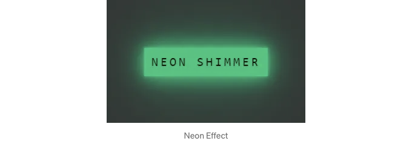

이야기에서는 버튼에 환상적인 네온 효과를 만들어볼 거에요.

시작해봅시다!

## 기본 버튼 만들기

먼저 버튼을 준비해주세요. div나 button 요소 중 하나를 사용할 수 있어요. 버튼 요소를 선택한다면 기본 스타일을 재정의해야 합니다.

<!-- ui-log 수평형 -->
<ins class="adsbygoogle"
  style="display:block"
  data-ad-client="ca-pub-4877378276818686"
  data-ad-slot="9743150776"
  data-ad-format="auto"
  data-full-width-responsive="true"></ins>
<component is="script">
(adsbygoogle = window.adsbygoogle || []).push({});
</component>

| 속성            | 값               |
| --------------- | ---------------- |
| display         | inline-block     |
| padding         | 12px 12px        |
| font-size       | 20px             |
| width           | fit-content      |
| box-sizing      | border-box       |
| font-family     | consolas         |
| color           | #03e9f4          |
| text-transform  | uppercase        |
| background-color| transparent      |
| transition      | 0.5s             |
| letter-spacing  | 4px              |
| border          | none             |


<!-- ui-log 수평형 -->
<ins class="adsbygoogle"
  style="display:block"
  data-ad-client="ca-pub-4877378276818686"
  data-ad-slot="9743150776"
  data-ad-format="auto"
  data-full-width-responsive="true"></ins>
<component is="script">
(adsbygoogle = window.adsbygoogle || []).push({});
</component>

저희는 기본 투명 버튼을 정의했어요. 네온 효과는 사이버펑크 스타일을 떠올리게 할 거에요. 그래서 Consolas와 같이 현대적으로 보이는 폰트 패밀리가 선택되었어요.

HTML 및 CSS를 표준 HTML 파일에 복사하면 이미지와 유사한 버튼 — 일반적인 네온 버튼이 나타날 거에요.

# 네온 효과 추가

이제 버튼에 호버 상태를 추가하여 box-shadow를 사용해 네온 효과를 만들어보세요.

<!-- ui-log 수평형 -->
<ins class="adsbygoogle"
  style="display:block"
  data-ad-client="ca-pub-4877378276818686"
  data-ad-slot="9743150776"
  data-ad-format="auto"
  data-full-width-responsive="true"></ins>
<component is="script">
(adsbygoogle = window.adsbygoogle || []).push({});
</component>

```js
.neonShimmerButton:hover {
  background-color: #17c47c;
  color: #050801;
  box-shadow:
    0 0 5px #17c47c,
    0 0 25px #17c47c,
    0 0 50px #17c47c,
    0 0 200px #17c47c;
}
```

이 버튼에 커서를 올리면 네온 효과가 보입니다.



여기에서 box-shadow 속성을 사용하여 버튼 주위에 광효과를 만듭니다. 이는 버튼을 뒤에서 조명을 받고 있는 것처럼 돋보이도록 만드는 빛의 후광 같은 효과입니다.

<!-- ui-log 수평형 -->
<ins class="adsbygoogle"
  style="display:block"
  data-ad-client="ca-pub-4877378276818686"
  data-ad-slot="9743150776"
  data-ad-format="auto"
  data-full-width-responsive="true"></ins>
<component is="script">
(adsbygoogle = window.adsbygoogle || []).push({});
</component>

# 사이버펑크 분위기

지금 네온 효과가 생겼지만, 진정한 사이버펑크 느낌을 내기 위해서는 충분히 기술적으로 보이지 않을 수 있습니다. 걱정하지 마세요. 깜박거리는 효과로 더 업그레이드할 것입니다. 색상을 여러 번 반복해서 선언하는 것을 피하기 위해 CSS 변수를 사용할 것입니다.

# 깜박이는 애니메이션

```js
.neonShimmerButton:hover {
    --neon-blink-color : #a4d3be;
    --neon-color : #17c47c;
    background-color: var(--neon-color);
    color: #050801;
    animation: blink 2s infinite linear;

    @keyframes blink {
        0%, 100% {
            background-color: var(--neon-color);
            color: #050801;
            box-shadow:
                0 0 5px var(--neon-color),
                0 0 25px var(--neon-color),
                0 0 50px var(--neon-color),
                0 0 200px var(--neon-color);
        }
        50% {
            background-color: var(--neon-blink-color);
            color: #040701;
            box-shadow:
                0 0 5px var(--neon-blink-color),
                0 0 25px var(--neon-blink-color),
                0 0 50px var(--neon-blink-color),
                0 0 200px var(--neon-blink-color);
        }
    }
}
```

<!-- ui-log 수평형 -->
<ins class="adsbygoogle"
  style="display:block"
  data-ad-client="ca-pub-4877378276818686"
  data-ad-slot="9743150776"
  data-ad-format="auto"
  data-full-width-responsive="true"></ins>
<component is="script">
(adsbygoogle = window.adsbygoogle || []).push({});
</component>

이 추가로 버튼이 현재 네온 빛으로 깜박거리며 사이버펑크 영감을 받은 네온 깜박이 버튼을 완성했습니다.

그리고 바로 그렇게, 네온 효과가 완성되었습니다. 이 빛나는 버튼은 사이버펑크 스타일로 어떤 사용자 인터페이스도 화려하게 밝힐 것입니다.


이 버튼 위에 디지털 눈부심을 한층 증폭시켰네요! box-shadow와 조금의 애니메이션 효과로 우리는 사이버펑크 우주 속에서 빛나는 네온 버튼을 만들었습니다. 여러분의 인터페이스에 이 기술적인 터치로 화사함을 불어넣을 준비가 되셨나요? 함께 코드로 만들어내어 그 네온 빛을 감상해봅시다!

<!-- ui-log 수평형 -->
<ins class="adsbygoogle"
  style="display:block"
  data-ad-client="ca-pub-4877378276818686"
  data-ad-slot="9743150776"
  data-ad-format="auto"
  data-full-width-responsive="true"></ins>
<component is="script">
(adsbygoogle = window.adsbygoogle || []).push({});
</component>

# 다음 효과

다음에는 일부 shimming 효과를 만들겠습니다. 지금은 피곤해서 이야기를 진행하지 않겠습니다. 아래에는 효과의 미리보기가 있습니다.

