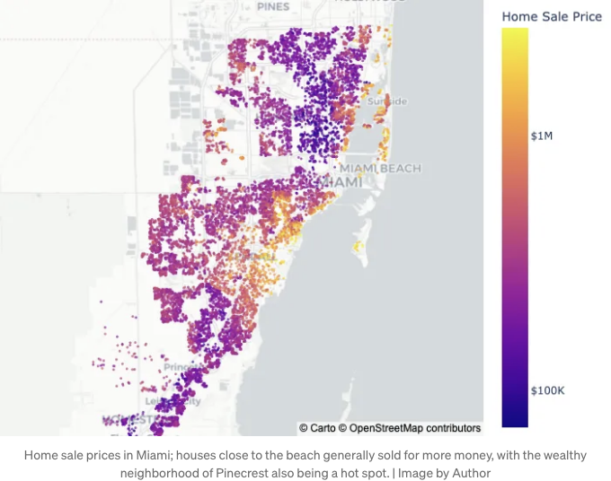
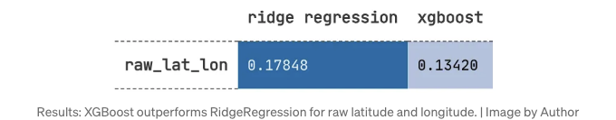
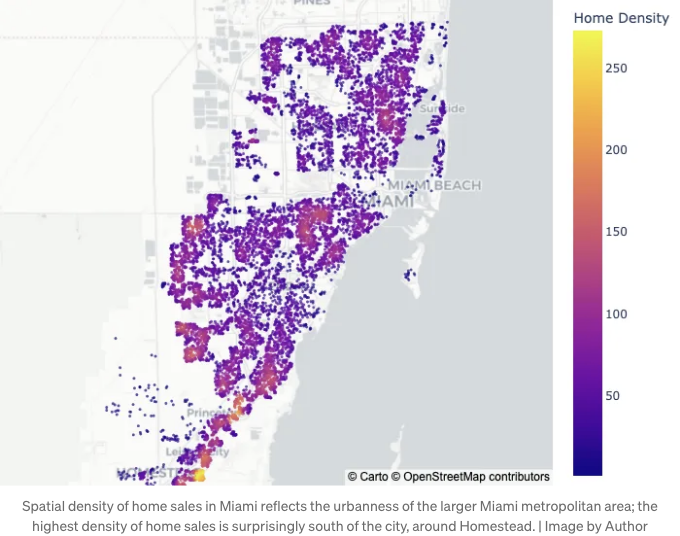
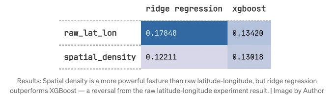
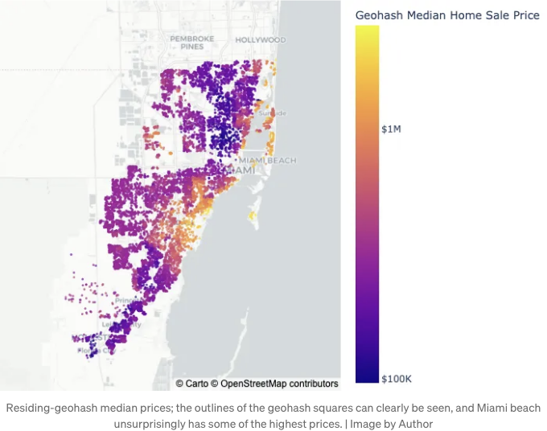
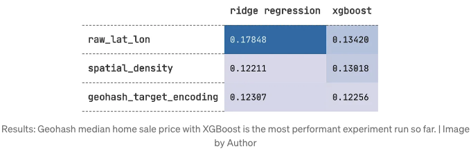
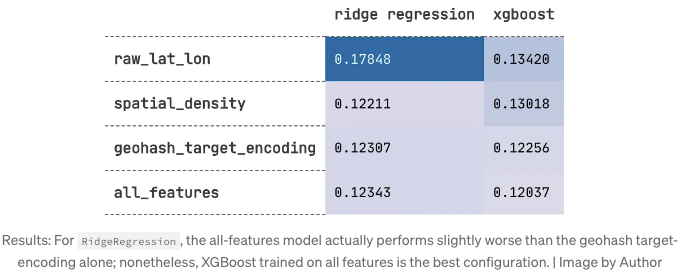

오늘날 가장 치열한 기술 시장 중 많은 곳에서 지도 상의 점들이 움직입니다: 라이드 쉐어링 서비스 (Uber, Lyft, Grab), 마이크로 모빌리티 서비스 (Lime, Bird), 음식 배달 서비스 (Delivery Hero, Postmates, Doordash) 등이 있습니다. 게다가, 고객의 위치를 제품 사용 사례의 중심에 두지 않는 많은 서비스도 고객의 위치를 알아야 합니다. 그렇게 하면 고객이 어디에 있으며 주변에서 무슨 일이 일어나고 있는지에 따라 더 나은 맞춤형 경험을 제공할 수 있습니다.

이 모든 것이 데이터 과학자들에게 의미하는 바는 데이터 레이크에 많은 위도와 경도가 떠다니고 있다는 것임을 말해줍니다. 그리고 이 두 변수만으로도 많은 정보가 숨겨져 있습니다!

창의적이고 효과적인 방법으로 위도와 경도를 활용하면 기계 학습 응용 프로그램에 상당한 예측력을 가져다줄 뿐만 아니라 분석 노력에 차원이 추가되어 기업 및 고객에게 더 많은 가치를 제공할 수 있습니다.

이 기사의 목표는 미국 마이애미 주택가의 판매 가격 예측 문제에 대해 단지 위도와 경도만을 사용하는 몇 가지 특성 공학 기술을 소개하고 그들의 예측력을 비교하는 것입니다. 구조는 다음과 같습니다:

<!-- ui-log 수평형 -->
<ins class="adsbygoogle"
  style="display:block"
  data-ad-client="ca-pub-4877378276818686"
  data-ad-slot="9743150776"
  data-ad-format="auto"
  data-full-width-responsive="true"></ins>
<component is="script">
(adsbygoogle = window.adsbygoogle || []).push({});
</component>

- 마이애미 주택 판매 가격 예측 문제 설정
- 특성 공학 실험
2.1. 원시 위도 및 경도
2.2. 공간 밀도
2.3. 지오해시 타겟 인코딩
2.4. 모든 특성의 조합
- 토론
- 결론

이 포스트의 주요 내용은 특성 공학에 있으므로 모델 평가는 간결함과 명확성을 위해 매우 직접적일 것입니다. (즉, 교차 검증 및 하이퍼파라미터 최적화 미포함).

또한, 이 포스트에서는 데이터 조작 라이브러리로 Pandas 대신 Polars를 사용할 것입니다. 만약 여러분이 Polars에 익숙하지 않거나 아직 Panda 환경에서 갇혀있는 경우, 이전 게시물 "팬더에서 폴라로 영원히 전환한 3가지 이유"를 먼저 확인해보세요.

그리고 이제 출발합시다! 🚀

<!-- ui-log 수평형 -->
<ins class="adsbygoogle"
  style="display:block"
  data-ad-client="ca-pub-4877378276818686"
  data-ad-slot="9743150776"
  data-ad-format="auto"
  data-full-width-responsive="true"></ins>
<component is="script">
(adsbygoogle = window.adsbygoogle || []).push({});
</component>

# 마이애미 주택 판매 가격 예측: 문제 설정

이 게시물 전체를 통해 테스트될 다양한 피쳐 엔지니어링 기술에 대한 문제는 마이애미의 주택 판매 가격 예측입니다. 이 데이터는 공개 데이터 세트 "마이애미 주택 2016"에서 가져왔습니다 [1]. 사용된 원시 피쳐는 "위도"와 "경도"뿐이며, 이를 사용하여 "가격"을 예측합니다. 피쳐 엔지니어링 기술은 두 가지 다른 머신러닝 모델인 RidgeRegression과 XGBoost를 통해 서로 비교됩니다 (두 모델이 고려된 다양한 기술에 어떻게 반응하는지를 보여주기 위해 회귀 모델과 트리 기반 모델을 한 가지씩 사용했습니다).

```js
import polars as pl
from xgboost import XGBRegressor
from sklearn.linear_model import Ridge

# 데이터: https://www.openml.org/search?type=data&id=43093
df = (
    pl.scan_csv("../data/miami-housing.csv")
    .with_columns([
        pl.col("SALE_PRC").alias("price"),
        pl.col(["LATITUDE", "LONGITUDE"]).name.to_lowercase()
    ])
    .select(pl.col(["latitude", "longitude", "price"]))
)
```

그러나 어떤 머신러닝 예측을 시작하기 전에, 목표 변수를 조사하는 것이 중요합니다. 결국, "가격"이나 "수입"과 같은 금전적 변수는 종종 로그 정규 분포를 가지거나 적어도 매우 우측으로 치우친 경향이 있습니다. 그러므로 목표 변수를 먼저 로그 공간으로 변환하는 것이 좋을 수 있습니다.

<!-- ui-log 수평형 -->
<ins class="adsbygoogle"
  style="display:block"
  data-ad-client="ca-pub-4877378276818686"
  data-ad-slot="9743150776"
  data-ad-format="auto"
  data-full-width-responsive="true"></ins>
<component is="script">
(adsbygoogle = window.adsbygoogle || []).push({});
</component>

```js
# 일반적으로 가격에 로그를 취하는 것이 필요하며 1을 더하기 위한, log(0) 오류를 고려해야 합니다. 하지만 집이 $0에 판매되는 경우는 없겠죠 :P
df = df.with_columns(pl.col("price").log10().suffix("_log10"))
```

로그 변환 후에도 대상값은 약간 오른쪽으로 치우쳐 있습니다. 그래도 우리의 use-case에 충분해 보입니다.



이제 column을 추가해서 train과 test 데이터를 구분할 수 있으면 이 모든 것이 잘 될 것 같습니다.```

<!-- ui-log 수평형 -->
<ins class="adsbygoogle"
  style="display:block"
  data-ad-client="ca-pub-4877378276818686"
  data-ad-slot="9743150776"
  data-ad-format="auto"
  data-full-width-responsive="true"></ins>
<component is="script">
(adsbygoogle = window.adsbygoogle || []).push({});
</component>

```js
TRAIN_TEST_SPLIT_FRACTION = 0.8

df = (
    df

    # 데이터가 미리 정렬되어 있어서 발생할 수 있는 문제를 피하기 위해 데이터를 섞습니다.
    .sample(fraction=1, shuffle=True)
    
    # 그 후 행 번호를 분리된 학습 및 테스트 데이터의 인덱스로 사용합니다.
    .with_row_count(name="row_number")
    .with_columns([
        (pl.col("row_number") < TRAIN_TEST_SPLIT_FRACTION * len(df)).alias("is_train")
    ])
)
```

그리고 이제 모든 준비가 끝났어요! 그러니 더 이상 말을 길게 할 필요 없이, 피쳐 엔지니어링을 시작해봅시다 🧑‍💻

# 피처 엔지니어링 실험

## 1. 위도와 경도 (Raw Latitude and Longitude)

<!-- ui-log 수평형 -->
<ins class="adsbygoogle"
  style="display:block"
  data-ad-client="ca-pub-4877378276818686"
  data-ad-slot="9743150776"
  data-ad-format="auto"
  data-full-width-responsive="true"></ins>
<component is="script">
(adsbygoogle = window.adsbygoogle || []).push({});
</component>

첫 번째 특성 엔지니어링 기법은... 맞죠 — 특성 엔지니어링이 없는 것! 위도와 경도는 그 자체로 꽤 강력한 특성일 수 있지만, 그 특성은 모델에 따라 매우 달라집니다. 특히 위도나 경도가 목표 변수와 선형 관계를 갖는 것을 기대하기 어렵습니다. 이들은 주로 "온도"나 "습도"와 같이 지구적인 성질을 가진 목표 변수일 때 예측이 가능하지만, 이러한 상황에서 경위도가 RidgeRegression과 같은 선형 모델과 적합하지 않을 수 있습니다. 그러나 이들은 XGBoost와 같은 의사 결정 트리 기반 모델에서 이미 강력한 성능을 발휘할 수 있습니다: 

```js
MODEL_FEATURE_LIST_NAME = "raw_lat_lon"
MODEL_FEATURE_LIST = ["latitude", "longitude"]

X_train = df.filter(pl.col("is_train")).select(MODEL_FEATURE_LIST)
y_train = df.filter(pl.col("is_train")).select(MODEL_TARGET)
X_test = df.filter(~pl.col("is_train")).select(MODEL_FEATURE_LIST)
y_test = df.filter(~pl.col("is_train")).select(MODEL_TARGET).to_numpy()
model_performance_list = []
for model_name, model_class in zip(
    ["xgboost", "ridge regression"],
    [XGBRegressor, Ridge]
):
    model = model_class().fit(X_train, y_train)
    y_predicted = model.predict(X_test)
    model_performance = root_mean_squared_error(y_test, y_predicted)
```



직관이 맞았어요: XGBoost가 RidgeRegression보다 낮은 root_mean_squared_error를 보여줍니다.

<!-- ui-log 수평형 -->
<ins class="adsbygoogle"
  style="display:block"
  data-ad-client="ca-pub-4877378276818686"
  data-ad-slot="9743150776"
  data-ad-format="auto"
  data-full-width-responsive="true"></ins>
<component is="script">
(adsbygoogle = window.adsbygoogle || []).push({});
</component>

## 2. 공간 밀도

도시 지역의 주택은 시골 지역의 주택보다 높은 가격에 팔릴까요?

인구 밀도는 다양한 인구 통계 과정과 관련이 있으며, 이는 임대료와 소득에도 마찬가지입니다 (예: 도시에서 사람들이 시골보다 더 높은 급여를 받습니다). 이 문제는 마이애미에 중점을 두고 있지만, 해당 지역은 도시 지역과 조금 덜 한 도시 지역이 있을 뿐이며, 공간 밀도 기능은 여전히 유용할 수 있습니다.

주택 주변의 공간 밀도를 측정하기 위한 다양한 방법을 사용할 수 있습니다: 각 주택 매매 지점 주변의 다른 주택 매매 건수를 세는 방법; 각 주택 매매 위치에 대한 커널 밀도 추정치를 계산하고 샘플링하는 방법; 또는 인구 밀도에 대한 서드 파티 인구조사 데이터를 가져 오는 방법도 있습니다. 이 경우, 나는 scipy의 cKDtree를 사용하여 각 주택 주변의 주택 매매 건수를 공간 밀도로 측정합니다:

<!-- ui-log 수평형 -->
<ins class="adsbygoogle"
  style="display:block"
  data-ad-client="ca-pub-4877378276818686"
  data-ad-slot="9743150776"
  data-ad-format="auto"
  data-full-width-responsive="true"></ins>
<component is="script">
(adsbygoogle = window.adsbygoogle || []).push({});
</component>

```python
def add_density_feature_columns_to_dataframe(geo_df: pl.DataFrame) -> pl.DataFrame:
    tree = spatial.cKDTree(df.select(["latitude", "longitude"]))
    result = geo_df.with_columns(
        pl.Series(
            "공간 밀도",
            tree.query_ball_point(geo_df.select(["latitude", "longitude"]), .005, return_length=True)
        )
    )
    return result


df_w_density = add_density_feature_columns_to_dataframe(df)
```



이제 이 새로운 특성을 모델 훈련에 적용합니다...



<!-- ui-log 수평형 -->
<ins class="adsbygoogle"
  style="display:block"
  data-ad-client="ca-pub-4877378276818686"
  data-ad-slot="9743150776"
  data-ad-format="auto"
  data-full-width-responsive="true"></ins>
<component is="script">
(adsbygoogle = window.adsbygoogle || []).push({});
</component>

공간 밀도는 RidgeRegression 및 XGBoost 모두의 원시 위도와 경도보다 우수한 성능을 보여줍니다. 신기하게도 이 기능에 대해 RidgeRegression이 XGBoost보다 약간 우수한 성능을 보입니다. 

## 3. Geohash Target Encoding

알려진 사실 — 어떤 지역은 다른 지역보다 더 비싸다는 것입니다. 따라서 각 집의 지역에 대한 정보 (및 해당 지역에서 기대할 수 있는 매매 가격)를 모델에 제공하면 예측 능력을 높일 수 있습니다.

하지만 이를 어떻게 할까요? 혹은 더 중요한 질문은 무엇이 동네인가요?

<!-- ui-log 수평형 -->
<ins class="adsbygoogle"
  style="display:block"
  data-ad-client="ca-pub-4877378276818686"
  data-ad-slot="9743150776"
  data-ad-format="auto"
  data-full-width-responsive="true"></ins>
<component is="script">
(adsbygoogle = window.adsbygoogle || []).push({});
</component>

이웃은 어떤 것이든 될 수 있어요 — 우편번호, 거리, 또는 우리의 경우 Geohash코드일 수 있어요. (최근 Geohash 및 다른 지리적 인덱싱 도구에 대해 기사를 작성했어요 — 이 도구들이 어떻게 작동하며, 어떻게 사용하는지, 그리고 Geohash를 두 가지 다른 인기있는 지리적 인덱싱 도구와 비교한 내용이에요. 자세한 내용은 확인해보세요!)

간단히 말해서, Geohash는 위도 경도 지점을 고정 이웃으로 변환하여 주택 이웃을 범주 변수로 제공해줘요. 그리고 이제, 주택의 이웃을 나타내는 범주 변수를 갖추었기 때문에, 모델에 각 이웃의 예상 가격에 대해 전달하기 위해 타겟 인코딩을 사용하고 있어요.

```python
def add_geohash_column_to_df(geo_df: pl.DataFrame) -> pl.DataFrame:
    result = (
        df
        .with_columns(
            df
            .select("latitude", "longitude")
            .map_rows(
                lambda x: geohash2.encode(x[0], x[1], precision=5),
                return_dtype=pl.Utf8
            )
            .rename({"map": "geohash"})
        )
    )
    return result

def add_target_encoding_to_df(
    dataframe: pl.DataFrame,
    categorical_column: str = "geohash"
) -> pl.DataFrame:
    category_target_means = (
        dataframe
        .filter(pl.col("is_train"))  # 테스트 데이터 누출 방지를 위해 훈련 데이터만 포함합니다.
        .group_by(categorical_column)
        .agg(
            pl.col(MODEL_TARGET).mean().alias(f"{categorical_column}_{MODEL_TARGET}_mean")
        )
    )
    result = (
        dataframe
        .join(
            category_target_means,
            how="left",
            on=categorical_column
        )
    )
    return result


df_w_geohash = add_geohash_column_to_df(df)
df_w_geohash_target_encoded = add_target_encoding_to_df(df_w_geohash)
```



<!-- ui-log 수평형 -->
<ins class="adsbygoogle"
  style="display:block"
  data-ad-client="ca-pub-4877378276818686"
  data-ad-slot="9743150776"
  data-ad-format="auto"
  data-full-width-responsive="true"></ins>
<component is="script">
(adsbygoogle = window.adsbygoogle || []).push({});
</component>

이제 내 아이디어에 대해 모델이 무엇을 생각하는지 알아보자:

```js
MODEL_FEATURE_LIST_NAME = "geohash target encoding"
MODEL_FEATURE_LIST = [
    "geohash_price_log10_mean",
]

X_train = df_w_geohash_target_encoded.filter(pl.col("is_train")).select(MODEL_FEATURE_LIST)
y_train = df_w_geohash_target_encoded.filter(pl.col("is_train")).select(MODEL_TARGET)
X_test = df_w_geohash_target_encoded.filter(~pl.col("is_train")).select(MODEL_FEATURE_LIST)
y_test = df_w_geohash_target_encoded.filter(~pl.col("is_train")).select(MODEL_TARGET).to_numpy()
model_performance_list = []
for model_name, model_class in zip(
    ["xgboost", "ridge regression"],
    [XGBRegressor, Ridge]
):
    model = model_class().fit(X_train, y_train)
    y_predicted = model.predict(X_test)
    model_performance = root_mean_squared_error(y_test, y_predicted)
```



지오해시 타겟 인코딩은 공간 밀도보다 약간 더 성능이 우수하다!

<!-- ui-log 수평형 -->
<ins class="adsbygoogle"
  style="display:block"
  data-ad-client="ca-pub-4877378276818686"
  data-ad-slot="9743150776"
  data-ad-format="auto"
  data-full-width-responsive="true"></ins>
<component is="script">
(adsbygoogle = window.adsbygoogle || []).push({});
</component>

## 4. 모든 것을 합치기

마침내, 모든 기능을 함께 사용해보지 않으면 데이터 과학자가 될 수 있을까요? 한번 해 봅시다:

```js
df_w_all_features = add_density_feature_columns_to_dataframe(
    add_target_encoding_to_df(
        add_geohash_column_to_df(df)
    )
)

MODEL_FEATURE_LIST_NAME = "all_features"
MODEL_FEATURE_LIST = [
    "latitude",
    "longitude",
    "spatial_density",
    "geohash_price_log10_mean",
]

X_train = df_w_all_features.filter(pl.col("is_train")).select(MODEL_FEATURE_LIST)
y_train = df_w_all_features.filter(pl.col("is_train")).select(MODEL_TARGET)
X_test = df_w_all_features.filter(~pl.col("is_train")).select(MODEL_FEATURE_LIST)
y_test = df_w_all_features.filter(~pl.col("is_train")).select(MODEL_TARGET).to_numpy()

for model_name, model_class in zip(
    ["xgboost", "ridge regression"],
    [XGBRegressor, Ridge]
):
    model = model_class().fit(X_train, y_train)
    y_predicted = model.predict(X_test)
    model_performance = root_mean_squared_error(y_test, y_predicted)
```



<!-- ui-log 수평형 -->
<ins class="adsbygoogle"
  style="display:block"
  data-ad-client="ca-pub-4877378276818686"
  data-ad-slot="9743150776"
  data-ad-format="auto"
  data-full-width-responsive="true"></ins>
<component is="script">
(adsbygoogle = window.adsbygoogle || []).push({});
</component>

그리고 우승자는... 모든 피처의 조합으로 학습된 XGBoost입니다!

# 토론

물론, 데이터 과학 문제에서 재미는 방금 시작됐을 뿐입니다. 개선할 수 있는 여러 가능성이 이미 존재합니다.

- 하이퍼파라미터 튜닝: 공간 밀도 계산을 위한 검색 반경에 더 나은 선택지가 있을까요? 지오해시 타겟 인코딩 생성을 위한 더 나은 지오해시 정밀도가 있을까요?
- 타겟 인코딩: 여기에 제시된 것은 매우 기본적인 타겟 인코딩 접근 방식이지만, Bayesian Target Encoding과 같이 모델 일반화를 개선하는 다른 방법을 채택할 수 있을까요? 또한, 평균 이외의 중간값, 최대값 또는 최소값과 같은 다른 집계 함수를 타겟 인코딩에 사용할 수 있을까요? 또한, 공간 밀도의 다른 대리자로서 카운트도 흥미로운 선택일 것입니다.
- 모델 앙상블: 왜 XGBoost와 RidgeRegression만 사용해야 하며, 두 모델의 조합은 어떨까요? 아니면, 각각의 다른 지오해시에 대해 다른 모델을 학습할 충분한 데이터가 있는지도 확인해볼 가치가 있습니다.

<!-- ui-log 수평형 -->
<ins class="adsbygoogle"
  style="display:block"
  data-ad-client="ca-pub-4877378276818686"
  data-ad-slot="9743150776"
  data-ad-format="auto"
  data-full-width-responsive="true"></ins>
<component is="script">
(adsbygoogle = window.adsbygoogle || []).push({});
</component>

그리고 물론, 전체 기계 학습 접근 방식은 k-fold 교차 검증을 포함하거나 대상 변수의 두터운 꼬리 특성을 보다 풍부하게 반영하는 모델이나 비용 함수를 포함하여 개선될 수 있습니다.

더욱이, 여기서 연구된 데이터셋은 "집 판매 가격"의 기록이었는데, 이는 "집 가격"과는 명백히 다른 것입니다: 전자에서 하나의 레코드는 거래를 나타내지만, 후자에서는 하나의 레코드가 실제 집을 나타냅니다. 따라서 여기에서 계산된 공간 밀도 특징은 도시적 요소보다는 "동네 구매 인기"를 더 많이 나타낼 수 있습니다. 모든 데이터 과학 문제와 마찬가지로, 이러한 기술들의 유효성은 데이터의 성격에 따라 다를 수 있습니다.

마지막으로, 두 가지 다른 모델인 RidgeRegression과 XGBoost가 서로 다른 특성 엔지니어링 기술에 어떻게 반응하는지 본 것이 흥미로웠습니다. XGBoost는 원시 위도-경도, Geohash 타겟 인코딩 및 모든 특성의 결합에 대해 RidgeRegression보다 우수한 성능을 보였으나, 공간 밀도에 대해서는 RidgeRegression이 더 우수했습니다. 이를 염두에 두고, ML 실험은 구성 기반 접근 방식으로 항상 접근하는 것이 중요합니다. 예를 들어, 현재 모델과 함께 나빠지는 새로운 특성 엔지니어링 기술을 시도할 수 있지만, 몇 달 전에 포기했던 모델과 결합하면 현재까지 가장 성능이 우수한 구성이 될 수 있습니다.

<!-- ui-log 수평형 -->
<ins class="adsbygoogle"
  style="display:block"
  data-ad-client="ca-pub-4877378276818686"
  data-ad-slot="9743150776"
  data-ad-format="auto"
  data-full-width-responsive="true"></ins>
<component is="script">
(adsbygoogle = window.adsbygoogle || []).push({});
</component>

기계 학습 문제를 다룰 때 위도와 경도가 포함된 데이터를 사용할 때 할 수 있는 몇 가지 아이디어를 소개했어요; 이를 통해 시작 지점을 제공해 드릴 수 있기를 바라요. 제 Github에서 코드를 확인해 보세요 (링크). 항상 읽어 주셔서 감사합니다 🙂 다음에 또 만나요!

# 참고 자료

[1]: https://www.openml.org/search?type=data&id=43093

# 연락처

<!-- ui-log 수평형 -->
<ins class="adsbygoogle"
  style="display:block"
  data-ad-client="ca-pub-4877378276818686"
  data-ad-slot="9743150776"
  data-ad-format="auto"
  data-full-width-responsive="true"></ins>
<component is="script">
(adsbygoogle = window.adsbygoogle || []).push({});
</component>
