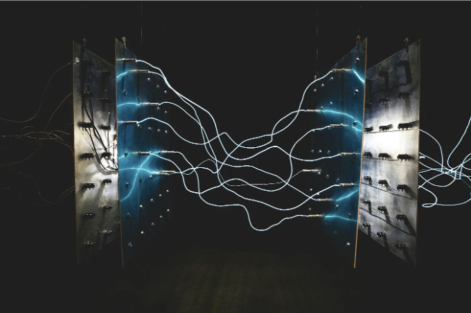
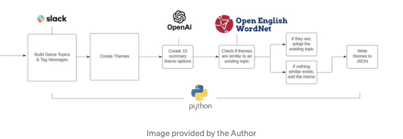

## Slack과 생성 적 AI를 결합하여 팀 간 연결을 촉진하는 방법



# 배경

매년 Q3 초반, Slalom Build는 글로벌 해커톤 대회를 개최하여 혁신적인 기술 가능성을 고객 및 커뮤니티에게 relevan한 것으로 만드는 것을 목표로 합니다. 2023년 테마는 그 어느 때보다도 생성 적인 인공 지능이었습니다. 2023년 해커톤의 전반적인 임무는 기본적으로 다음 질문에 대한 답을 찾는 것이었습니다:

<!-- ui-log 수평형 -->
<ins class="adsbygoogle"
  style="display:block"
  data-ad-client="ca-pub-4877378276818686"
  data-ad-slot="9743150776"
  data-ad-format="auto"
  data-full-width-responsive="true"></ins>
<component is="script">
(adsbygoogle = window.adsbygoogle || []).push({});
</component>

핵톤 대회에서는 매년 치열한 경쟁이 벌어지지만, 2023년에는 GenAI에게 추가적인 바람이 불었습니다. 21세기 우주 경주처럼, 우리는 GenAI에 관해 여행하면서 도로맵을 정의하고 있었습니다. 우리 팀이 프로젝트 목표와 아키텍처를 개발할 때 고려한 몇 가지 중요한 요소가 있었습니다.

# 핵톤 기획

일반적으로 생성 모델을 사용할 때 중요한 요소 중 하나는 모델이 데이터를 필요로 한다는 것입니다. 모델은 유용한 결과를 제공하기 위해 정보로 프롬프트되어야 합니다. 그렇다면, 우리의 데이터는 어디에서 얻을 것인가요?

대회를 위해 무엇을 구축할지 결정할 때 우리 팀이 고려한 또 다른 요소는 연결이었습니다. 팬데믹이 발생한 이후로 사람들이 고립되었다는 사실은 비밀이 아닙니다. 그러므로, 우리는 Slalom Build 팀 내에서 연결을 촉진하는 데 GenAI를 활용할 수 있을까요?

<!-- ui-log 수평형 -->
<ins class="adsbygoogle"
  style="display:block"
  data-ad-client="ca-pub-4877378276818686"
  data-ad-slot="9743150776"
  data-ad-format="auto"
  data-full-width-responsive="true"></ins>
<component is="script">
(adsbygoogle = window.adsbygoogle || []).push({});
</component>

위 요소들을 고려하며, 우리 팀의 목표는 ChatGPT의 능력을 활용하여 만나서 더 많은 연결과 재미를 제공할 수 있는 앱을 만드는 것이었습니다. 팀 구성원의 관심사를 충족시키는 게임을 만들어 실제로 만난 팀들에게 기회를 제공하는 것이 목표였죠.

물론 ChatGPT에 "실제로 만나는 일곱 명의 동료를 위한 게임 만들기"라고 요청할 수도 있었지만, 우리는 더 많이 원했습니다. 우리는 깊고 의미 있는 연결을 원했습니다. 게임이 게임 참가자들에게 관련되고 흥미로운 것들이 되기를 원했죠.

우리 해커톤 팀(BuildPlay)은 Slack 채널 데이터를 모델의 원본으로 활용하기로 결정했습니다. 기본적으로, Slack 채널에서 데이터를 수집하여 GenAI 모델에 공급한 다음 AI가 사용자 프로필과 성격을 생성하도록 했어요. 그러면 해당 프로필과 채널에서 논의된 인기 있는 "주제"에 따라, GenAI는 사용자가 플레이하고 연결할 수 있는 관련 게임을 만들었습니다.

스포일러 경고: 저희 팀은 대회의 상위 16팀 중에 결선에 진출했어요!

<!-- ui-log 수평형 -->
<ins class="adsbygoogle"
  style="display:block"
  data-ad-client="ca-pub-4877378276818686"
  data-ad-slot="9743150776"
  data-ad-format="auto"
  data-full-width-responsive="true"></ins>
<component is="script">
(adsbygoogle = window.adsbygoogle || []).push({});
</component>

슬라럼 빌드팀에서는 상황-행동-영향 피드백 모델을 기반으로 합니다. 그래서 저는 우리 팀이 GenAI 모델에 슬랙 데이터를 공급하기 위해 만든 Proof of Concept 작품을 소개하는 데 그 템플릿을 활용할 것입니다.

# 상황

BuildPlay에서 질문했습니다: "어떻게 생성적 AI를 활용하여 빌더들을 위해 연결과 재미를 만들 수 있을까요?" 그리고 우리는 이 질문에 답하기 위해 공개 Slack 채널을 활용하여 아이디어와 개인을 연관시키는 응용 프로그램을 상상했습니다. 동시에 팀 구성원들 사이의 주요 요인, 성격, 그리고 유머를 포착하기도 했습니다. 우리의 접근 방식은 생성적 AI의 힘을 중심으로 설정되었으며 공개 Slack 데이터를 의미 있는 연결 순간으로 변환하는 것에 초점을 맞췄습니다.

게임의 생성은 생성적 AI를 통해 태깅, 요약, 그리고 필터링 요청의 연속을 통해 이뤄졌을 것입니다. Slack 데이터를 성격 프로필로 변환함으로써, 우리는 게임 개발을 위한 문맥적 입력으로 활용할 수 있었습니다.

<!-- ui-log 수평형 -->
<ins class="adsbygoogle"
  style="display:block"
  data-ad-client="ca-pub-4877378276818686"
  data-ad-slot="9743150776"
  data-ad-format="auto"
  data-full-width-responsive="true"></ins>
<component is="script">
(adsbygoogle = window.adsbygoogle || []).push({});
</component>



그래서 현재 상황은, 어떻게 공개 Slack 채널에서 데이터를 우리 AI 모델로 공급할 수 있을까요?

참고로, 지금까지 강조된 BuildPlay 애플리케이션에 대한 추가 아키텍처가 있습니다. 하지만, 이 글에서는 아키텍처의 첫 부분만 언급하고 있습니다.

# 행동

<!-- ui-log 수평형 -->
<ins class="adsbygoogle"
  style="display:block"
  data-ad-client="ca-pub-4877378276818686"
  data-ad-slot="9743150776"
  data-ad-format="auto"
  data-full-width-responsive="true"></ins>
<component is="script">
(adsbygoogle = window.adsbygoogle || []).push({});
</component>

저는 Slack API를 활용하여 우리 애플리케이션에 Slack 데이터 통합 Proof of Concept를 구축하기 시작했어요. API는 무료로 제공되는 거예요. 저는 Slack API 토큰을 받아와서 conversations.history 메소드를 발견하고 난 이후에는 나머지 설정이 매끄럽게 마무리되었고, 핵심 기능은 하나로 줄어들었어요.  

```js
def extract_messages(channel_id):
    try:
        response = client.conversations_history(channel=channel_id)
        messages = response['messages']
        while response['has_more']:
            response = client.conversations_history(
                channel=channel_id,
                cursor=response['response_metadata']['next_cursor']
            )
            messages.extend(response['messages'])
    except SlackApiError as e:
        print(f"메시지 검색 중 오류 발생: {e.response['error']}")
        return []

    extracted_messages = []
    for i, message in enumerate(messages, start=1):
        user_info = client.users_info(user=message['user'])
        user_name = user_info['user']['real_name']

        # 메시지 내 사용자 ID를 실제 이름으로 대체
        tagged_users = re.findall(r'<@(.*?)>', message['text'])
        for user_id in tagged_users:
            user_info = client.users_info(user=user_id)
            user_name = user_info['user']['real_name']
            message['text'] = message['text'].replace(f'<@{user_id}>', 
            user_name)

        timestamp = float(message['ts'])
        dt_object = dt.fromtimestamp(timestamp)
        formatted_datetime = dt_object.strftime('%Y-%m-%d %I:%M %p')

        extracted_messages.append({
            "id": i,
            "person": user_name,
            "datetime": formatted_datetime,
            "message": message['text'],
            "reactions": extract_reactions(message.get('reactions', [])),
            "replies": message.get('reply_count', 0)
        })
    return extracted_messages
```

extract_messages 함수 내에서 사용자 이름과 일시 표시를 위해 데이터를 조금 조작해야 했지만, Slack API를 통해 우리 애플리케이션에서 개성 프로필을 생성하는 데 필요한 모든 데이터를 가져올 수 있었어요. 함수의 끝에 있는 extracted_messages.append() 부분을 중점적으로 살펴보면, 공개 Slack 채널 메시지에서 다음 데이터를 추출했다는 것을 나타내요:

<!-- ui-log 수평형 -->
<ins class="adsbygoogle"
  style="display:block"
  data-ad-client="ca-pub-4877378276818686"
  data-ad-slot="9743150776"
  data-ad-format="auto"
  data-full-width-responsive="true"></ins>
<component is="script">
(adsbygoogle = window.adsbygoogle || []).push({});
</component>

- 메시지 작성자 이름
- 메시지 날짜와 시간
- 메시지 내용
- 메시지에 대한 반응 정보: 이모지 유형 및 해당 이모지에 대한 반응 수
- 메시지에 대한 답글 수

공개 Slack 채널의 데이터는 언제든지 실행할 수 있는 간단한 스크립트를 통해 생성적 AI 모델에 공급될 수 있어요. 이를 통해 Slack 채널에서의 사건들을 계속 추적하여 AI 모델을 최신 상태로 유지할 수 있어요.

스크립트 내용을 더 자세히 살펴보려면 이 POC의 공개 저장소를 참조하실 수 있어요.

# 영향

<!-- ui-log 수평형 -->
<ins class="adsbygoogle"
  style="display:block"
  data-ad-client="ca-pub-4877378276818686"
  data-ad-slot="9743150776"
  data-ad-format="auto"
  data-full-width-responsive="true"></ins>
<component is="script">
(adsbygoogle = window.adsbygoogle || []).push({});
</component>

이 스크립트가 당사 애플리케이션에 미친 영향은 일반적이고 단조로운 경험보다 BuildPlay의 게임에서 더 많은 개인화를 유도했습니다.

예를 들어, 한 팀의 Slack 채널에서는 음식에 대해 많이 이야기했습니다 (어떤 팀이 그렇지 않겠어요?!); 따라서 생성적 AI가 게임 플레이어들이 지금까지 먹어 본 최악의 음식 그림을 그려야 하는 게임을 제안했습니다. 다른 게임에서는 플레이어들이 팀으로 나누어 녹색 포도와 빨강 포도 중 어떤 것이 더 맛있는지 토의해야 했습니다. 이러한 게임들은 더 깊은 연결 가능성을 제공하며 모델이 스스로 만들 것인 "모르는" 무작위로 놀이하는 게임보다 더 주의 깊은 참여와 영감을 가져올 수 있습니다.

생성적 AI는 기술 업계 종사자들을 포함한 많은 사람들에게 두려움을 주는 주제입니다. 이 때 많은 사람들이 생각하고 의문을 품는 것: 생성적 AI가 우리를 대체하고 사람들의 일자리를 없앨까요?

Slalom Build에서는 생성적 인공지능이 새로운 일자리의 기회를 제공한다고 믿습니다. 특히, 2023 해커톤 대회의 주제에 나타난 것처럼 성장하고 발전하는 데 사용하는 방법을 배운 사람들에게 특히 그렇습니다. 그리고 BuildPlay의 어떤 구성원에게 물어봐도, 우리는 GenAI가 연결할 수 있는 기회도 제공한다고 믿습니다!

<!-- ui-log 수평형 -->
<ins class="adsbygoogle"
  style="display:block"
  data-ad-client="ca-pub-4877378276818686"
  data-ad-slot="9743150776"
  data-ad-format="auto"
  data-full-width-responsive="true"></ins>
<component is="script">
(adsbygoogle = window.adsbygoogle || []).push({});
</component>

# 감사합니다

슬랄럼 빌드에서 핵톤을 진행하는 데 헌신하는 전체 팀에게 감사드립니다. 당신들의 노력은 쉽게 복제할 수 없으며, 우리의 재능을 무한히 향상시키는 사랑의 결과입니다!

빌드플레이 팀인 킴 아담스, 스리자야 수레쉬, 주베어 칸, 제이 파텔, 샘 맥클라나한에게 감사드립니다. 여러분과 함께 해킹하는 것은 정말 즐거운 경험이었습니다!

# 자원

<!-- ui-log 수평형 -->
<ins class="adsbygoogle"
  style="display:block"
  data-ad-client="ca-pub-4877378276818686"
  data-ad-slot="9743150776"
  data-ad-format="auto"
  data-full-width-responsive="true"></ins>
<component is="script">
(adsbygoogle = window.adsbygoogle || []).push({});
</component>

- 상황-행동-영향 피드백 도구
- Slack API 문서
- Slack API 문서의 Conversations.history 메서드
- Python에서 Slack Reader의 GitHub 저장소 POC