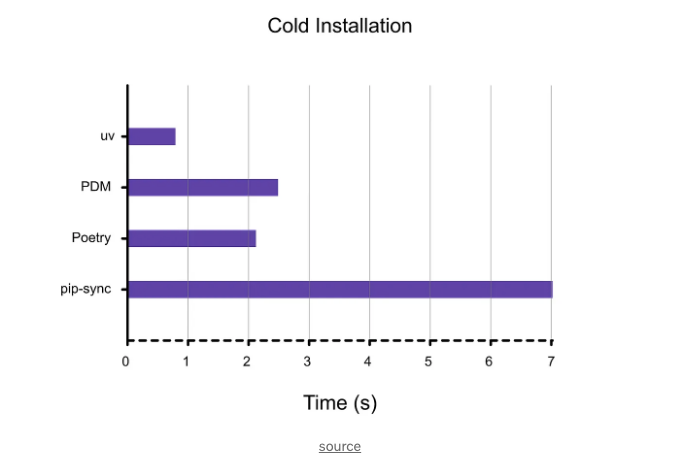

## 파이썬


<!-- ui-log 수평형 -->
<ins class="adsbygoogle"
  style="display:block"
  data-ad-client="ca-pub-4877378276818686"
  data-ad-slot="9743150776"
  data-ad-format="auto"
  data-full-width-responsive="true"></ins>
<component is="script">
(adsbygoogle = window.adsbygoogle || []).push({});
</component>


<!-- ui-log 수평형 -->
<ins class="adsbygoogle"
  style="display:block"
  data-ad-client="ca-pub-4877378276818686"
  data-ad-slot="9743150776"
  data-ad-format="auto"
  data-full-width-responsive="true"></ins>
<component is="script">
(adsbygoogle = window.adsbygoogle || []).push({});
</component>

# 러프

처음으로 출시된 러프는 Flake8와 블랙과 같은 기존 린터 및 형식 지정 도구에 비해 10~100배 빠른 속도 향상을 제공합니다.

모든 파이썬 프로젝트에 러프로 전환했는데, 반드시 필요한 도구입니다.

럼의 러프에 관한 내 기사를 여기에서 읽어보세요 👇

<!-- ui-log 수평형 -->
<ins class="adsbygoogle"
  style="display:block"
  data-ad-client="ca-pub-4877378276818686"
  data-ad-slot="9743150776"
  data-ad-format="auto"
  data-full-width-responsive="true"></ins>
<component is="script">
(adsbygoogle = window.adsbygoogle || []).push({});
</component>

자, 이제 uv로 돌아왔어요.

## uv가 뭐죠?

uv는 Rust로 작성된 초고속 Python 패키지 설치 및 해결 프로그램으로, pip, pip-tools 및 virtualenv를 대체하는 빠른 대체품으로 사용됩니다.

따뜻한 캐시로, uv는 pip 및 pip-tools보다 10~100배 빠르며 거의 즉시 설치가 완료됩니다.

<!-- ui-log 수평형 -->
<ins class="adsbygoogle"
  style="display:block"
  data-ad-client="ca-pub-4877378276818686"
  data-ad-slot="9743150776"
  data-ad-format="auto"
  data-full-width-responsive="true"></ins>
<component is="script">
(adsbygoogle = window.adsbygoogle || []).push({});
</component>

몇 가지 더 강조할 점

- 디스크 공간 저장: 중복 종속성을 방지하기 위해 전역 캐시를 사용합니다.
- 어디서든 동작: macOS, Linux 및 Windows를 지원합니다.
- 쉬운 설치: Python이나 Rust를 설치할 필요가 없습니다. curl, pip 또는 brew를 사용할 수 있습니다.
- 고급 기능: 종속성 버전 재정의 및 대체 해결 전략을 지원합니다.
- 더 나은 오류 메시지: 충돌 추적 리졸버와 함께 최고 수준의 오류 메시지
- 고급 pip: 편집 가능 설치, git 종속성, 로컬 종속성, 소스 배포

# 빠른 이유:

- Rust: Rust는 속도와 안정성으로 유명합니다.
- "resolver": 패키지가 함께 작동할 수 있는 버전을 찾는 스마트한 방법.
- 전역 모듈 캐시: 이미 본 파일을 기억하여 종속성을 다시 다운로드하거나 다시 빌드하지 않습니다.
- Copy-on-Write 및 하드 링크: 이는 디스크 공간 사용량을 최소화하는 데 도움이 됩니다.

<!-- ui-log 수평형 -->
<ins class="adsbygoogle"
  style="display:block"
  data-ad-client="ca-pub-4877378276818686"
  data-ad-slot="9743150776"
  data-ad-format="auto"
  data-full-width-responsive="true"></ins>
<component is="script">
(adsbygoogle = window.adsbygoogle || []).push({});
</component>

uv의 큰 비전은 그 속도와 신뢰성으로 Python 패키지 관리를 변화시키는 것입니다.

# 다음으로 나올 Poetry인가요?

만약 Python 에코시스템에 충분한 시간 동안 있었다면, Python 환경을 설정하거나 패키지를 만드는 것이 얼마나 고통스러운지 알고 계실 것입니다.


<!-- ui-log 수평형 -->
<ins class="adsbygoogle"
  style="display:block"
  data-ad-client="ca-pub-4877378276818686"
  data-ad-slot="9743150776"
  data-ad-format="auto"
  data-full-width-responsive="true"></ins>
<component is="script">
(adsbygoogle = window.adsbygoogle || []).push({});
</component>

UV는 매우 빠르고 신뢰할 수 있으며 사용하기 쉬운 통합 Python 패키지 및 프로젝트 관리자 'Python용 Cargo'를 설립할 계획이 있습니다.

UV가 Python 개발 경험을 크게 향상시키는 것을 기대하고 있어요!

## 성능 평가

그들의 벤치마크에서 몇 가지 숫자를 살펴보겠습니다.

<!-- ui-log 수평형 -->
<ins class="adsbygoogle"
  style="display:block"
  data-ad-client="ca-pub-4877378276818686"
  data-ad-slot="9743150776"
  data-ad-format="auto"
  data-full-width-responsive="true"></ins>
<component is="script">
(adsbygoogle = window.adsbygoogle || []).push({});
</component>

## 콜드 설치 (8–10배 빠름)

이는 새로운 기기에서 uv pip sync를 실행하는 것과 동일합니다.

uv는 캐싱 없이 pip 및 pip-tools보다 8–10배 빠릅니다.



<!-- ui-log 수평형 -->
<ins class="adsbygoogle"
  style="display:block"
  data-ad-client="ca-pub-4877378276818686"
  data-ad-slot="9743150776"
  data-ad-format="auto"
  data-full-width-responsive="true"></ins>
<component is="script">
(adsbygoogle = window.adsbygoogle || []).push({});
</component>

## 따뜻한 설치 (80–115배 빠름)

웜 캐시를 사용할 때 실행 시 80–115배 빠릅니다 (가상 환경을 다시 만들거나 종속성을 업데이트하는 경우)


## 가상 환경 만들기

<!-- ui-log 수평형 -->
<ins class="adsbygoogle"
  style="display:block"
  data-ad-client="ca-pub-4877378276818686"
  data-ad-slot="9743150776"
  data-ad-format="auto"
  data-full-width-responsive="true"></ins>
<component is="script">
(adsbygoogle = window.adsbygoogle || []).push({});
</component>

이 표는 Python -m venv보다 약 80배, virtualenv보다 약 7배 빠릅니다.


이 벤치마크에서 더 많은 정보 확인하기

# 트랜스포머 설치하기

<!-- ui-log 수평형 -->
<ins class="adsbygoogle"
  style="display:block"
  data-ad-client="ca-pub-4877378276818686"
  data-ad-slot="9743150776"
  data-ad-format="auto"
  data-full-width-responsive="true"></ins>
<component is="script">
(adsbygoogle = window.adsbygoogle || []).push({});
</component>

나는 허깅페이스의 트랜스포머 패키지에 있는 uv를 시험해봤어.

그 속도 차이가 정말 분명하더라고.

# 어떻게 사용하나요?

## 설치

<!-- ui-log 수평형 -->
<ins class="adsbygoogle"
  style="display:block"
  data-ad-client="ca-pub-4877378276818686"
  data-ad-slot="9743150776"
  data-ad-format="auto"
  data-full-width-responsive="true"></ins>
<component is="script">
(adsbygoogle = window.adsbygoogle || []).push({});
</component>

```js
# macOS 및 Linux에서
curl -LsSf https://astral.sh/uv/install.sh | sh
# Homebrew로
brew install uv
# Windows에서
powershell -c "irm https://astral.sh/uv/install.ps1 | iex"
```

## 가상 환경 만들기

```js
uv venv  # .venv에 가상 환경을 만듭니다.
```

## 가상 환경 활성화

<!-- ui-log 수평형 -->
<ins class="adsbygoogle"
  style="display:block"
  data-ad-client="ca-pub-4877378276818686"
  data-ad-slot="9743150776"
  data-ad-format="auto"
  data-full-width-responsive="true"></ins>
<component is="script">
(adsbygoogle = window.adsbygoogle || []).push({});
</component>

```js
# macOS 및 Linux에서
source .venv/bin/activate

# Windows에서
.venv\Scripts\activate
```

## 패키지 설치

```js
uv pip install flask                # Flask 설치
uv pip install -r requirements.txt  # requirements.txt 파일에 있는 패키지 설치
uv pip install -e .                 # 현재 프로젝트를 편집 가능한 모드로 설치
uv pip install "package @ ."        # 디스크에서 현재 프로젝트 설치
uv pip install "flask[dotenv]"      # "dotenv" 추가 기능이 있는 Flask 설치
```

## 잠금된 종속성 생성하기

<!-- ui-log 수평형 -->
<ins class="adsbygoogle"
  style="display:block"
  data-ad-client="ca-pub-4877378276818686"
  data-ad-slot="9743150776"
  data-ad-format="auto"
  data-full-width-responsive="true"></ins>
<component is="script">
(adsbygoogle = window.adsbygoogle || []).push({});
</component>

```js
uv pip compile pyproject.toml -o requirements.txt   # pyproject.toml 파일을 읽습니다.
uv pip compile requirements.in -o requirements.txt  # requirements.in 파일을 읽습니다.
```

## 종속성 동기화

```js
uv pip sync requirements.txt  # requirements.txt 파일에서 설치합니다.
```

여기까지가 이 기사의 모든 내용입니다!

<!-- ui-log 수평형 -->
<ins class="adsbygoogle"
  style="display:block"
  data-ad-client="ca-pub-4877378276818686"
  data-ad-slot="9743150776"
  data-ad-format="auto"
  data-full-width-responsive="true"></ins>
<component is="script">
(adsbygoogle = window.adsbygoogle || []).push({});
</component>

# UV에 대해 더 알아보기

만약 UV에 대해 더 많은 정보를 원하시면, 아래 링크들을 확인해보세요:

- How to cut your Python Docker build times in half with uv
- uv: Python packaging in Rust
- astral-sh/uv: An extremely fast Python package installer and resolver, written in Rust.
- uv/BENCHMARKS.md

# 읽어주셔서 감사합니다

<!-- ui-log 수평형 -->
<ins class="adsbygoogle"
  style="display:block"
  data-ad-client="ca-pub-4877378276818686"
  data-ad-slot="9743150776"
  data-ad-format="auto"
  data-full-width-responsive="true"></ins>
<component is="script">
(adsbygoogle = window.adsbygoogle || []).push({});
</component>

bitgrit 데이터 과학 게시물을 구독해 보세요!

다른 데이터 과학자들과 최신 데이터 과학 및 AI 개발에 대해 토의하고 싶나요? 저희 디스코드 서버에 가입해보세요!

워크샵 및 다가오는 대회 소식을 받아보려면 아래의 Bitgrit을 팔로우해주세요!

- Discord
- Website
- Twitter
- LinkedIn
- Instagram
- Facebook
- YouTube