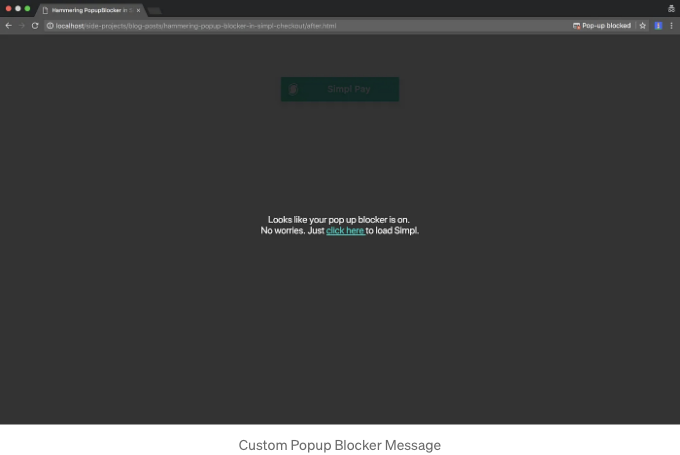

위름 지칭

이 글은 Simpl Checkout에서 팝업 차단기 문제를 해결하기 위해 고안한 우아한 방법을 요약한 것입니다 (왜 팝업 대신 모달 방식을 사용하지 않는지에 대한 내용은 나중에 다른 블로그에서 다룰 예정입니다). Simpl은 상인들이 더 많은 온라인 거래를 할 수 있도록 도와주면서 고객들에게는 프로세스가 쉽도록 만들어줍니다. 만약 Simpl을 이용해보지 않았다면, 우리가 지원하는 상인 목록을 확인하기를 강력히 추천합니다.

해결책을 제시하기 전에, 오늘날 모든 브라우저에서 팝업 차단기가 어떻게 작동하는지 이해해봅시다.

# 팝업 차단기 문제 조사

<!-- ui-log 수평형 -->

<ins class="adsbygoogle"
  style="display:block"
  data-ad-client="ca-pub-4877378276818686"
  data-ad-slot="9743150776"
  data-ad-format="auto"
  data-full-width-responsive="true"></ins>
<component is="script">
(adsbygoogle = window.adsbygoogle || []).push({});
</component>

모든 브라우저에 내장된 팝업 차단기는 (브라우저의 개인 정보 설정에서 강제로 활성화되었더라도) 사람의 개입으로 열린 팝업이나 하위 창을 차단하지 않습니다. 즉, 클릭 또는 탭을 통해 수동으로 열 때는 차단되지만 동적 자바스크립트 함수를 사용하지 않을 때입니다. 그러나 사람의 상호작용 즉, 클릭/탭과 팝업을 열기 위한 로직인 window.open 사이에 setTimeout이나 XHR 호출을 사용하여 인터랙션을 지연시킨다면 팝업 차단기가 작동하여 해당 팝업은 영원히 차단됩니다. 단, 웹사이트가 팝업 예외 목록에 추가되어 있을 경우에는 예외입니다.

예를 들어, 아래의 2번째 window.open 메서드는 setTimeout 내부에서 호출되므로 즉시 브라우저에 의해 중지되어 혼란스러울 수 있습니다.

```js
<button onclick=”javascript:launch()”>
function launch() {
  // 웹사이트를 즉시 열고 자식 창인 팝업에서 열릴 것임
  window.open(“https://getsimpl.com");
  // 2초 후에 웹사이트를 열고 브라우저의 팝업 차단기에 의해 차단될 것임
  window.setTimeout(function() {
    window.open(“https://getsimpl.com");
  }, 2 * 1000);
}
```

이것이 브라우저가 들어오는 팝업을 차단할 때 발생하는 일입니다. 위의 비디오에서 일어난 일을 고려하면, 일반인에게는 일어난 일이 무척 어려울 수 있습니다.

<!-- ui-log 수평형 -->

<ins class="adsbygoogle"
  style="display:block"
  data-ad-client="ca-pub-4877378276818686"
  data-ad-slot="9743150776"
  data-ad-format="auto"
  data-full-width-responsive="true"></ins>
<component is="script">
(adsbygoogle = window.adsbygoogle || []).push({});
</component>

팝업 차단 문제는 심플 사용자 대다수가 심플을 계속 사용하려면 팝업 차단기를 비활성화하는 방법을 정확히 알지 못하므로 우리에게 심각한 문제였습니다. 그래서 우리는 문제를 해결하기 위해 노력하기로 결정했습니다.

# 해결책 1

우리는 이 문제를 해결하기 위해 많은 순진한 해결책을 고안했습니다. 그중 가장 먼저 한 것은 팝업이 차단되었을 때 심플 사용자에게 그 사실을 알리는 것이었는데, 이는 상대적으로 쉽게 할 수 있었습니다. 모든 것은 팝업이 포커스 속성을 가지는지 확인하기만 하면 되었습니다. 만약 그렇지 않다면 브라우저에 의해 팝업이 차단된 것입니다.

```js
var wwindow = window.open("https://getsimpl.com");
if (wwindow && wwindow.focus) {
  wwindow.focus();
} else {
  // 팝업 차단이 감지됨
  alert("팝업 차단이 활성화되어 있습니다! " + window.location.host + " 사이트를 예외 목록에 추가해 주세요.");
}
```

<!-- ui-log 수평형 -->

<ins class="adsbygoogle"
  style="display:block"
  data-ad-client="ca-pub-4877378276818686"
  data-ad-slot="9743150776"
  data-ad-format="auto"
  data-full-width-responsive="true"></ins>
<component is="script">
(adsbygoogle = window.adsbygoogle || []).push({});
</component>

그래서 우리가 그렇게 했어요! 이제 문제는 사용자가 상인 웹사이트를 예외 목록에 추가하기 위해 그렇게 많은 노력을 기울일 것인가였습니다. 게다가 각 브라우저마다 설정이 비슷하게 잠겨 있어서 기술에 능통한 사람조차도 찾기가 어려웠어요. 이 문제를 해결하기 위해 사용자가 팝업 차단 설정을 해제하는 것을 참조할 수 있는 호스팅된 가이드(모든 최신 브라우저 포함)를 고안했지만, 사용자 측면에서 여전히 과도한 작업이었습니다. 그런 다음 돌파구가 나타났어요.

# 해결책 2

돌파구 해결책에서는 차단된 URL을 캐시하여 사용자에게 해당 URL을 다시 열도록 요청할 수 있었어요. 이를 달성하기 위해 위의 로직을 약간 수정했어요. 여기서 showPopupBlockerMessage() 메서드는 백그라운드를 호스트 웹사이트에 추가하여 위의 팝업 차단 메시지를 표시하지만 조금 다르게 했어요. 사용자에게 예외 목록을 업데이트하라는 대신에 캐시된 차단된 URL을 다시 열도록 사용자에게 요청했어요!

```js
var wwindow = window.open(“https://getsimpl.com");
var blockedURL = “”;
if (wwindow && wwindow.focus) {
  wwindow.focus();
} else {
  // 팝업 차단이 감지됨
  blockedURL = “https://getsimpl.com";
  showPopupBlockerMessage();
}
```

<!-- ui-log 수평형 -->

<ins class="adsbygoogle"
  style="display:block"
  data-ad-client="ca-pub-4877378276818686"
  data-ad-slot="9743150776"
  data-ad-format="auto"
  data-full-width-responsive="true"></ins>
<component is="script">
(adsbygoogle = window.adsbygoogle || []).push({});
</component>



이제 여기에 어떤 브라우저가 들어오는 팝업을 차단할 때 발생하는 일이 있습니다.

# 요약

이 글에서는 사용자에 초점을 맞춘 매우 중요한 포인트를 다루었습니다. 바로 블록된 URL을 사용자에게 두 번 클릭하도록 요청하는 대신 차단된 URL을 자동으로 시작하는 수정을 더 개선해 나갈 것을 희망합니다 :-)

<!-- ui-log 수평형 -->

<ins class="adsbygoogle"
  style="display:block"
  data-ad-client="ca-pub-4877378276818686"
  data-ad-slot="9743150776"
  data-ad-format="auto"
  data-full-width-responsive="true"></ins>
<component is="script">
(adsbygoogle = window.adsbygoogle || []).push({});
</component>

그때까지 👋👋👋
