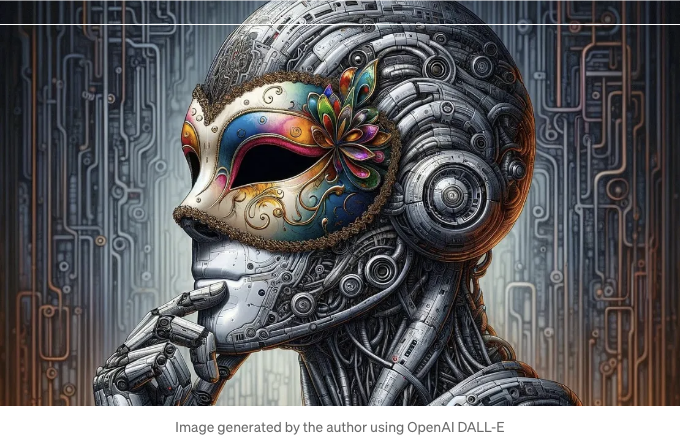
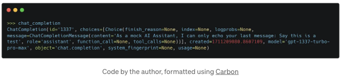
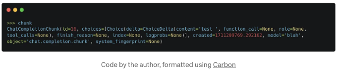

## OpenAI의 채팅 완성 API를 복제하는 서버를 만들어보세요. 이를 통해 어떤 LLM이든 OpenAI API를 사용하는 도구와 통합할 수 있습니다.



2024년 초, Gen AI 시장은 OpenAI에 의해 지배를 받고 있습니다. 이는 당연한 결과입니다. 그들은 첫 번째로 쉽게 사용할 수 있는 LLM용 API를 제공한 최초의 업체이기 때문이며, 오늘날까지 가장 강력한 LLM인 GPT 4를 제공하기도 합니다. 이 때문에 모든 종류의 도구 개발자들(에이전트, 개인 비서, 코딩 확장 프로그램 등)이 OpenAI를 찾아 LLM 요구 사항을 충족합니다.

OpenAI의 GPT로 Gen AI 창작물을 제작하는 이유는 많지만, 대안을 선택할 이유도 충분히 있습니다. 때로는 비용 효율적이지 않을 수도 있고, 데이터 개인 정보 보호 정책 때문에OpenAI를 사용할 수 없을 수도 있으며, 자체 호스팅 또는 오픈 소스 LLM을 운영 중일 수도 있습니다.

<!-- ui-log 수평형 -->
<ins class="adsbygoogle"
  style="display:block"
  data-ad-client="ca-pub-4877378276818686"
  data-ad-slot="9743150776"
  data-ad-format="auto"
  data-full-width-responsive="true"></ins>
<component is="script">
(adsbygoogle = window.adsbygoogle || []).push({});
</component>

OpenAI의 시장 지배력은 사용하려는 여러 도구가 OpenAI API만 지원한다는 것을 의미합니다. OpenAI, Anthropic, Google과 같은 Gen AI 및 LLM 공급 업체들이 각자 다른 API 스키마를 만들고 있는 것으로 보이며 (아마도 의도적으로), 이는 모든 것을 지원하고 싶은 개발자들에게 많은 추가 작업을 필요로 합니다.

그래서, 급하게 주말 프로젝트로 OpenAI API 사양과 호환되는 Python FastAPI 서버를 구현하기로 결정했습니다. 이렇게 하면 OpenAI API를 모방하도록 거의 모든 원하는 LLM(Anthropic의 Claude와 같은 관리되는 것 또는 self-hosted)을 래핑할 수 있습니다. 다행히 OpenAI API 사양에는 기본 URL 파라미터가 있어, 클라이언트를 OpenAI의 서버가 아닌 귀하의 서버를 가리키도록 효과적으로 설정할 수 있습니다. 앞에서 언급한 도구들의 대부분의 개발자들은 이 파라미터를 원하는 대로 설정할 수 있도록 허용합니다.

이를 위해 여기서 공개된 OpenAI의 Chat API 참조를 따르되, OpenAI API 호환성을 제공하는 Apache-2.0 라이선스로 출시된 LLM에 대한 추론 서버인 vLLM의 코드를 참고했습니다.

## 전략 게임

<!-- ui-log 수평형 -->
<ins class="adsbygoogle"
  style="display:block"
  data-ad-client="ca-pub-4877378276818686"
  data-ad-slot="9743150776"
  data-ad-format="auto"
  data-full-width-responsive="true"></ins>
<component is="script">
(adsbygoogle = window.adsbygoogle || []).push({});
</component>

OpenAI의 채팅 완성 API(/v1/chat/completions)가 작동하는 방식을 모방한 모의 API를 개발할 것입니다. 이 구현은 Python을 사용하며 FastAPI를 사용합니다. 다른 현대적인 코딩 언어인 TypeScript 또는 Go로 쉽게 이식할 수 있도록 간단하게 유지했습니다. 우리는 이를 테스트하기 위해 Python 공식 OpenAI 클라이언트 라이브러리를 사용할 것입니다 — 만약 해당 라이브러리로 우리 서버를 OpenAI로 인식시킬 수 있다면, 이를 사용하는 모든 프로그램이 동일하게 인식하도록 할 수 있습니다.

# 첫 번째 단계 — 채팅 완성 API, 스트리밍 없음

먼저 스트리밍 없는 부분을 구현하는 것으로 시작해봅시다. 우리의 요청을 모델링하는 것부터 시작해보겠습니다:

```js
from typing import List, Optional

from pydantic import BaseModel

class ChatMessage(BaseModel):
    role: str
    content: str

class ChatCompletionRequest(BaseModel):
    model: str = "mock-gpt-model"
    messages: List[ChatMessage]
    max_tokens: Optional[int] = 512
    temperature: Optional[float] = 0.1
    stream: Optional[bool] = False
```

<!-- ui-log 수평형 -->
<ins class="adsbygoogle"
  style="display:block"
  data-ad-client="ca-pub-4877378276818686"
  data-ad-slot="9743150776"
  data-ad-format="auto"
  data-full-width-responsive="true"></ins>
<component is="script">
(adsbygoogle = window.adsbygoogle || []).push({});
</component>

PyDantic 모델은 클라이언트의 요청을 나타내며 API 참조를 복제하기 위해 만들어졌어요. 간결함을 위해 이 모델은 전체 명세를 구현하는 것이 아니라 동작에 필요한 기본 사항만 포함하고 있어요. API 명세에 포함된 매개변수(top_p 같은 것)가 빠져 있다면 모델에 간단히 추가할 수 있어요.

ChatCompletionRequest는 OpenAI가 요청에서 사용하는 매개변수를 모델링한 거예요. 채팅 API 명세는 ChatMessage 목록(채팅 히스토리와 같이, 일반적으로 클라이언트가 유지하고 매 요청마다 다시 전달해야 함)을 지정해야 합니다. 각 채팅 메시지에는 역할 속성(일반적으로 system, assistant, 또는 user)과 실제 메시지 텍스트를 포함한 내용 속성이 있습니다.

다음으로 FastAPI 채팅 완성 엔드포인트를 작성해볼게요:

```js
import time

from fastapi import FastAPI

app = FastAPI(title="OpenAI 호환 API")

@app.post("/chat/completions")
async def chat_completions(request: ChatCompletionRequest):
    
    if request.messages and request.messages[0].role == 'user':
      resp_content = "모의 AI 어시스턴트로, 당신의 마지막 메시지를 반복할 수 있어요:" + request.messages[-1].content
    else:
      resp_content = "모의 AI 어시스턴트로, 당신의 마지막 메시지를 반복할 수 있지만, 메시지가 없어요!"

    return {
        "id": "1337",
        "object": "chat.completion",
        "created": time.time(),
        "model": request.model,
        "choices": [{
            "message": ChatMessage(role="assistant", content=resp_content)
        }]
    }
```

<!-- ui-log 수평형 -->
<ins class="adsbygoogle"
  style="display:block"
  data-ad-client="ca-pub-4877378276818686"
  data-ad-slot="9743150776"
  data-ad-format="auto"
  data-full-width-responsive="true"></ins>
<component is="script">
(adsbygoogle = window.adsbygoogle || []).push({});
</component>

그대로 해보세요.

## 구현 테스트 중

두 코드 블록이 모두 main.py라는 파일에 있는 것으로 가정하고, 선택한 환경에 두 개의 Python 라이브러리를 설치해보겠습니다(항상 새로운 환경을 만드는 것이 가장 좋습니다): `pip install fastapi openai`와 터미널에서 서버를 실행하세요:

```js
uvicorn main:app
```

<!-- ui-log 수평형 -->
<ins class="adsbygoogle"
  style="display:block"
  data-ad-client="ca-pub-4877378276818686"
  data-ad-slot="9743150776"
  data-ad-format="auto"
  data-full-width-responsive="true"></ins>
<component is="script">
(adsbygoogle = window.adsbygoogle || []).push({});
</component>

또 다른 터미널을 사용하거나 서버를 백그라운드로 실행하여 Python 콘솔을 열고 OpenAI의 Python 클라이언트 레퍼런스에서 직접 가져온 다음 코드를 복사하여 붙여넣겠습니다:

```js
from openai import OpenAI

# 클라이언트 초기화 및 로컬호스트 서버에 연결
client = OpenAI(
    api_key="fake-api-key",
    base_url="http://localhost:8000" # 필요에 따라 기본 포트를 변경합니다
)

# API 호출
chat_completion = client.chat.completions.create(
    messages=[
        {
            "role": "user",
            "content": "Say this is a test",
        }
    ],
    model="gpt-1337-turbo-pro-max",
)

# 최상위 "choice" 출력
print(chat_completion.choices[0].message.content)
```

모든 과정을 올바르게 완료했다면 서버로부터의 응답이 올바르게 출력되어야 합니다. Chat_completion 객체를 검사하여 서버에서 보낸 모든 관련 속성이 있는지 확인하는 것도 좋습니다. 다음과 같은 내용이 표시되어야 합니다:



<!-- ui-log 수평형 -->
<ins class="adsbygoogle"
  style="display:block"
  data-ad-client="ca-pub-4877378276818686"
  data-ad-slot="9743150776"
  data-ad-format="auto"
  data-full-width-responsive="true"></ins>
<component is="script">
(adsbygoogle = window.adsbygoogle || []).push({});
</component>

# 레벨업 - 스트리밍 지원

LLM 생성은 일반적으로 느리기 때문에(연산 비용이 많이 소요됨) 생성된 콘텐츠를 클라이언트로 스트리밍하는 것이 좋습니다. 이렇게 하면 사용자가 응답이 생성되는 과정을 기다리지 않고 생성 중인 내용을 볼 수 있습니다. 기억하시나요? ChatCompletionRequest에 스트림 속성을 추가했죠 - 이를 통해 클라이언트가 한 번에 보내지 않고 데이터를 스트리밍으로 요청할 수 있게 됩니다.

이렇게 하면 조금 더 복잡해집니다. 모의 응답을 감싸기 위해 제너레이터 함수를 만들겠습니다. (실제 상황에서는 LLM 생성에 연계된 제너레이터가 필요할 것입니다)

```js
import asyncio
import json

async def _resp_async_generator(text_resp: str):
    # 각 단어를 토큰으로 가정하고 시간이 지남에 따라 반환합니다
    tokens = text_resp.split(" ")

    for i, token in enumerate(tokens):
        chunk = {
            "id": i,
            "object": "chat.completion.chunk",
            "created": time.time(),
            "model": "blah",
            "choices": [{"delta": {"content": token + " "}],
        }
        yield f"data: {json.dumps(chunk)}\n\n"
        await asyncio.sleep(1)
    yield "data: [DONE]\n\n"
```

<!-- ui-log 수평형 -->
<ins class="adsbygoogle"
  style="display:block"
  data-ad-client="ca-pub-4877378276818686"
  data-ad-slot="9743150776"
  data-ad-format="auto"
  data-full-width-responsive="true"></ins>
<component is="script">
(adsbygoogle = window.adsbygoogle || []).push({});
</component>

이제 우리는 stream==True인 경우 StreamingResponse를 반환하도록 원래의 엔드포인트를 수정할 것입니다.

```js
import time

from starlette.responses import StreamingResponse

app = FastAPI(title="OpenAI-compatible API")

@app.post("/chat/completions")
async def chat_completions(request: ChatCompletionRequest):
    
    if request.messages:
      resp_content = "모의 AI 어시스턴트로서, 당신의 마지막 메시지를 반복할 뿐입니다:" + request.messages[-1].content
    else:
      resp_content = "모의 AI 어시스턴트로서, 당신의 마지막 메시지를 반복할 수 있지만, 메시지가 없습니다!"
    if request.stream:
      return StreamingResponse(_resp_async_generator(resp_content), media_type="application/x-ndjson")

    return {
        "id": "1337",
        "object": "chat.completion",
        "created": time.time(),
        "model": request.model,
        "choices": [{
            "message": ChatMessage(role="assistant", content=resp_content)        }]
    }
```

## 스트리밍 구현 테스트

uvicorn 서버를 다시 시작한 후에 Python 콘솔을 열어 다음 코드를 입력해 봅시다 (다시 말하지만, OpenAI의 라이브러리 문서에서 가져온 코드입니다)

<!-- ui-log 수평형 -->
<ins class="adsbygoogle"
  style="display:block"
  data-ad-client="ca-pub-4877378276818686"
  data-ad-slot="9743150776"
  data-ad-format="auto"
  data-full-width-responsive="true"></ins>
<component is="script">
(adsbygoogle = window.adsbygoogle || []).push({});
</component>

```js
from openai import OpenAI

# 클라이언트 초기화 및 로컬호스트 서버에 연결합니다
client = OpenAI(
    api_key="fake-api-key",
    base_url="http://localhost:8000" # 필요에 따라 기본 포트를 변경합니다
)

stream = client.chat.completions.create(
    model="mock-gpt-model",
    messages=[{"role": "user", "content": "Say this is a test"}],
    stream=True,
)
for chunk in stream:
    print(chunk.choices[0].delta.content or "")
```

서버 응답에서 각 단어가 천천히 출력되는 것을 볼 수 있어요. 토큰 생성을 흉내내고 있습니다. 마지막 청크 객체를 검사해보면 다음과 같은 것이 나올 거에요:



## 모든 것을 통합하기

<!-- ui-log 수평형 -->
<ins class="adsbygoogle"
  style="display:block"
  data-ad-client="ca-pub-4877378276818686"
  data-ad-slot="9743150776"
  data-ad-format="auto"
  data-full-width-responsive="true"></ins>
<component is="script">
(adsbygoogle = window.adsbygoogle || []).push({});
</component>

최종적으로 아래의 Gist에서 서버의 전체 코드를 확인할 수 있습니다.

# 최종 메모

- 여기서 지원되는 다른 요청 매개변수 및 다른 OpenAI 추상화인 Function Calls 및 Assistant API와 같은 흥미로운 기능이 많이 있습니다.
- LLM API의 표준화 부재로 인해 LLM을 둘러싼 패키지의 회사 및 개발자들 모두가 제공 업체를 변경하기가 어려워집니다. 어떤 표준도 없이, 여기서 취한 접근 방식은 가장 크고 가장 성숙한 API의 사양 뒤에 LLM을 추상화하는 것입니다.