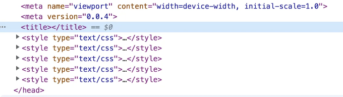

컨테이너화 시대에는 페이지에 문제가 발생할 때 새로운 버전이 이미 수정되었을 가능성이 높습니다. 따라서 문제 해결을 위해 고군분투할 필요가 없습니다.

왜 항상 최신 버전이 아닌가요? 한 가지 이유는 캐싱일 수 있고, 다른 이유로 운영팀 구성원이 버전을 원래대로 롤백했을 수도 있습니다. 문제가 발생한 버전을 어떻게 확인할 수 있을까요? 이를 확인하려면 페이지에 버전 번호를 삽입해야 합니다.

일반적으로 이 단계는 빌드를 패키징할 때 package.json에 있는 버전 필드를 html에 삽입하는 것입니다 (따라서 각 릴리스마다 해당 버전을 수정해야 하며, 이는 npm version 명령을 사용하여 하는 게 좋습니다). 저는 head에 meta를 추가하는 것을 선호하지만, 물론 화면에 출력해도 됩니다.

# vite

<!-- ui-log 수평형 -->
<ins class="adsbygoogle"
  style="display:block"
  data-ad-client="ca-pub-4877378276818686"
  data-ad-slot="9743150776"
  data-ad-format="auto"
  data-full-width-responsive="true"></ins>
<component is="script">
(adsbygoogle = window.adsbygoogle || []).push({});
</component>

vite 프로젝트에서는 vite-plugin-html-template 플러그인을 사용할 수 있어요. vite.config.ts 파일에 다음 코드를 추가해주세요:

```js
import htmlTemplate from 'vite-plugin-html-template'
import { version } from "./package.json";

// https://vitejs.dev/config/
export default defineConfig({
  plugins: [vue(), 
    htmlTemplate({
      data: {
        version
      },
    }),
  ],
  ...
})
```

하지만 국제화된 단어가 너무 많으면 문제가 발생할 수 있어요. 자원 파일이 너무 커지면 페이지에 접속할 때마다 모든 언어 자원을 로드해야 하며, 페이지에서 필요한 언어가 한 가지 뿐이라면 다른 언어의 자원은 사용되지 않아 웹사이트 첫 화면의 로딩 속도에 영향을 줄 수 있어요.

json 파일을 참조하기 때문에 기본 tsconfig.config.json 파일을 수정해야 해요. package.json을 포함하도록 "include"에 추가해주세요: 

```js
{
  "include": [xxx, "package.json"],
}
```

<!-- ui-log 수평형 -->
<ins class="adsbygoogle"
  style="display:block"
  data-ad-client="ca-pub-4877378276818686"
  data-ad-slot="9743150776"
  data-ad-format="auto"
  data-full-width-responsive="true"></ins>
<component is="script">
(adsbygoogle = window.adsbygoogle || []).push({});
</component>

`index.html` 파일을 `public` 디렉토리로 이동하고 `head`에 다음과 같은 문장을 추가해주세요:

```js
<head>
  <meta version="<%- version %>" />
  ...
</head>
```

이렇게 하면 페이지에서 버전 번호를 확인할 수 있습니다.

