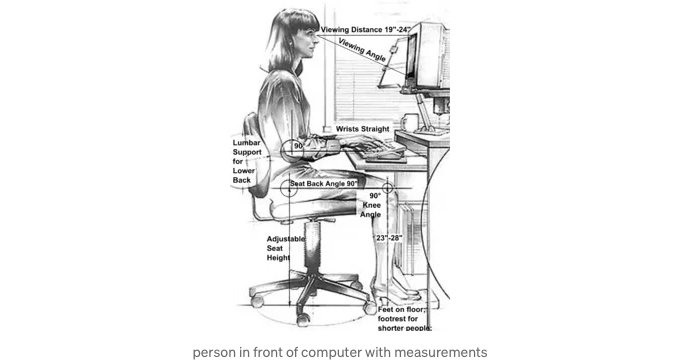

프론트엔드 개발에서는 새로운 기능을 구현하면서 생기는 고통을 경험함으로써만 배울 수 있는 주의할 점들이 많이 있어요. 안드로이드의 그림자는 iOS와 다를 뿐더러, 스크롤뷰 중첩은 잘못된 스크롤뷰를 스크롤할 수도 있고, 빠르게 누를 수 있는 컴포넌트를 누르면 원치 않는 요청으로 백엔드를 엄청나게 칠 수도 있어요.

마지막 예시는 굉장히 가까운 이야기예요. 나는 어떻게 사람 구성 요소를 만들지 몰랐어요. '사람'이란 말은 그 구성 요소가 인간의 행동을 기대한다는 의미에서, 그 행동이 얼마나 잘못된 것일지라도요.

새로운 기능을 코딩할 때 모든 세부 사항을 기억하는 것은 어렵지만, 이상한 인간 행동을 예상하는 것은 코드를 인간 중심으로 만드는 열쇠에요; 기기 흔들기, 버튼에 분노를 누르기, 포켓 속에서 화면을 켜놓기, 그리고 지금은 잊혀진 많은 다른 행동들도 있죠. 버튼을 만드는 것은 단순히 "버튼을 만드는 것"이 아니에요, 분노로 빨리 누르기를 피하기 위해 디바운스를 추가하는 것이고, 목표지 않은 터치를 피하기 위해 탭 가능한 영역을 10픽셀 더 늘리는 것이에요.

<!-- ui-log 수평형 -->

<ins class="adsbygoogle"
  style="display:block"
  data-ad-client="ca-pub-4877378276818686"
  data-ad-slot="9743150776"
  data-ad-format="auto"
  data-full-width-responsive="true"></ins>
<component is="script">
(adsbygoogle = window.adsbygoogle || []).push({});
</component>

다음에 사용자 상호작용을 기대하는 프론트엔드 컴포넌트를 개발할 때는 다음 팁을 고려해보세요:

- `onpress` 핸들러에 디바운스를 추가하여 사용자가 너무 빨리 누를 경우에도 한 번만 트리거되도록 해보세요. 저는 이 Stack Overflow 게시물에서 가장 높은 평점을 받은 답변이 매우 도움이 된다고 생각했어요.
- 검색 입력 또는 텍스트가 변경될 때 API 호출을 하는 다른 입력에 디바운스나 스로틀을 추가해보세요. 이렇게 하면 각 문자를 입력할 때마다 요청을 보내는 것을 방지할 수 있어요.
- 프레스 가능한 컴포넌트의 탭 가능한 영역을 늘려보세요. 사용자가 탭을 조금 놓쳐도 여전히 트리거되도록 해줍니다.
- 백엔드가 앱 상태를 수정할 수 있도록 해주세요. 프론트엔드는 백엔드에서 변경을 트리거할 수 있는 API를 가져야 합니다. 그래서 사용자가 여러 장치에서 로그인했을 때 업데이트가 모든 장치로 전달됩니다.
- 네트워크 요청을 로컬 스토리지에 저장하여 온라인으로 돌아왔을 때 요청을 다시 시도할 수 있게 해주세요. "큐에 요청이 있으면 호출을 실행하세요."
- 상태에 낙관적인 업데이트를 하고 백엔드 요청이 200을 반환했을 때 해당 변경사항을 '커밋'해주세요. 이 접근법은 오프라인 우선이라고도 불리며 5번 팁과 결합될 수 있습니다.

때로는 프론트엔드 개발을 배울 때, 우리가 기계가 아닌 다른 사람들을 위한 도구를 만든다는 것을 잊기 쉽습니다. 사용자들이 조급해할 것을 예상하고, 빠른 로딩 시간을 갖추는 것은 가장 빠른 앱을 갖고 싶어서가 아니라 인간들의 답답함을 줄여줘야 하는 이유입니다.

Slack은 사람들에게 친숙한 경험을 제공하는 데 아주 잘 지원하고 있습니다. 심지어 메시지 반응에서 모든 피부 톤이 표시되어 다양성을 인식하고 존중하는 데 큰 도움이 되는 기능이라고 생각해요. ‘자연스럽고’ 유기적인 경험에 진심으로 관심을 가지는 다른 회사로는 Apple이 있는데요, 구체적인 예시는 떠오르지 않지만 이 회사는 다양한 기기 간 최상의 경험을 개발한다는 점으로 유명합니다.

<!-- ui-log 수평형 -->

<ins class="adsbygoogle"
  style="display:block"
  data-ad-client="ca-pub-4877378276818686"
  data-ad-slot="9743150776"
  data-ad-format="auto"
  data-full-width-responsive="true"></ins>
<component is="script">
(adsbygoogle = window.adsbygoogle || []).push({});
</component>

제가 불평하는 것을 지금은 그만두려고 해요. 그렇지만 이 6가지 팁을 통해 여러분의 작업을 차별화시키고 Slack이나 Apple 제품과 더 비슷하게 만들 수 있을 거에요.

# 참고 자료:

이 참고 자료들은 직접적인 학술 자료는 아니지만 학술 자료에 연결되어 있는 소스들이 포함되어 있어요.
