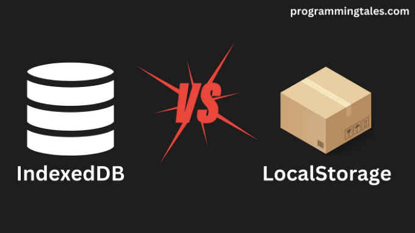

# 인덱스된 DB에 대해 알아볼까요?

그럼요! 기본부터 시작해볼게요.

인덱스된 DB는 "DB"로 표시되는 데이터베이스로, 웹에서 대량의 구조화된 데이터를 저장할 수 있게 해 줍니다.

이는 SQL 기반의 데이터베이스로, 고정된 열의 양이 아닌 자바스크립트 객체를 저장하고 검색할 수 있게 해 줍니다.

<!-- ui-log 수평형 -->
<ins class="adsbygoogle"
  style="display:block"
  data-ad-client="ca-pub-4877378276818686"
  data-ad-slot="9743150776"
  data-ad-format="auto"
  data-full-width-responsive="true"></ins>
<component is="script">
(adsbygoogle = window.adsbygoogle || []).push({});
</component>

대부분의 데이터베이스와 마찬가지로이 데이터베이스는 초고속 액세스 속도를 위해 데이터베이스 인덱스를 사용합니다.

# LocalStorage 대신 IndexedDB를 사용하는 이유는?



## 저장 용량 제한

<!-- ui-log 수평형 -->
<ins class="adsbygoogle"
  style="display:block"
  data-ad-client="ca-pub-4877378276818686"
  data-ad-slot="9743150776"
  data-ad-format="auto"
  data-full-width-responsive="true"></ins>
<component is="script">
(adsbygoogle = window.adsbygoogle || []).push({});
</component>

웹에서 저장소에 대해 이야기할 때 고려해야 할 첫 번째 사항은 저장할 수 있는 데이터의 양입니다.

LocalStorage의 기본 최대 저장 용량은 브라우저 및 버전에 따라 5MB에서 10MB 사이로 범위가 있습니다.

반면에 IndexedDB에서는 일반적으로 제한이 없거나 대부분의 경우 거의 걱정할 필요가 없을 정도로 높은 제한이 있습니다.

이렇게 보면 IndexedDB가 수천 개의 이미지를 로컬 사용자 지정 캐시에 저장하는 등 LocalStorage로는 일반적으로 불가능했던 새로운 가능성의 세계를 열어준다는 것을 이미 알 수 있습니다.

<!-- ui-log 수평형 -->
<ins class="adsbygoogle"
  style="display:block"
  data-ad-client="ca-pub-4877378276818686"
  data-ad-slot="9743150776"
  data-ad-format="auto"
  data-full-width-responsive="true"></ins>
<component is="script">
(adsbygoogle = window.adsbygoogle || []).push({});
</component>

## 작업 순서

이 내용은 간단합니다. LocalStorage의 작업은 동기적으로, 그러나 IndexedDB의 작업은 비동기적으로 처리됩니다.

예를 들어, React 18.2 애플리케이션에서 작은 데이터를 다루고 있다면, 현재 React는 비동기 컴포넌트를 지원하지 않기 때문에 작업이 필요한 경우 기다릴 수 없기 때문에 LocalStorage를 사용하는 것이 더 현명한 선택일 수 있습니다. 다만, React 19에서는 마침내 use hook이라는 다음으로 좋은 대안을 제공하게 될 것입니다.

## 브라우저 지원

<!-- ui-log 수평형 -->
<ins class="adsbygoogle"
  style="display:block"
  data-ad-client="ca-pub-4877378276818686"
  data-ad-slot="9743150776"
  data-ad-format="auto"
  data-full-width-responsive="true"></ins>
<component is="script">
(adsbygoogle = window.adsbygoogle || []).push({});
</component>

LocalStorage가 여기에서 분명한 우승자입니다.

브라우저에 가장 먼저 나온 저장소 API 중 하나이기 때문에 대부분의 브라우저에서 LocalStorage를 아주 초기 버전부터 지원하고 있습니다. 예를 들어 Chrome은 버전 4부터 지원합니다!

IndexedDB도 브라우저 지원이 훌륭하지만 일부 브라우저는 비교적 최근에 채택했습니다. Edge는 버전 79부터 완전한 지원을 제공하며 Safari는 버전 10부터 지원합니다. 그러나 버전 14.1에서 일부 기능이 부분적으로 동작하지 않는 버그가 있습니다.

# 사용 방법

<!-- ui-log 수평형 -->
<ins class="adsbygoogle"
  style="display:block"
  data-ad-client="ca-pub-4877378276818686"
  data-ad-slot="9743150776"
  data-ad-format="auto"
  data-full-width-responsive="true"></ins>
<component is="script">
(adsbygoogle = window.adsbygoogle || []).push({});
</component>

일부 웹 개발자는 IndexedDB를 별로 좋아하지 않을 수 있습니다. 왜냐하면 브라우저에서 실행되는 전체 SQL 데이터베이스이기 때문이죠! 하지만 그들이 생각하는 것과는 달리, 고급 API에 접근할 필요가 없다면 실제로는 IndexedDB를 사용하는 것이 정말 간단합니다.

먼저 데이터베이스를 만들어 보세요:

```js
const openRequest = window.indexedDB.open("MediumExampleDatabase");
```

그런 다음, IndexedDB 작업이 비동기적임을 감안하여, 성공/실패 이벤트를 청취해야 합니다:

<!-- ui-log 수평형 -->
<ins class="adsbygoogle"
  style="display:block"
  data-ad-client="ca-pub-4877378276818686"
  data-ad-slot="9743150776"
  data-ad-format="auto"
  data-full-width-responsive="true"></ins>
<component is="script">
(adsbygoogle = window.adsbygoogle || []).push({});
</component>

```js
openRequest.onerror = () => {
  console.log("Game Over 💀");
}

// 데이터베이스가 초기화되거나 버전이 업데이트 될 때 호출됩니다
openRequest.onupgradeneeded = (event) => {
  const db = event.target.result;
}
```

이제 IndexedDB에서 객체 저장소로 알려진 테이블을 생성해야 합니다:

```js
const objectStore = db.createObjectStore("users");
```

마지막으로 "users" 데이터베이스에서 데이터를 추가하고 검색해 봅시다:```

<!-- ui-log 수평형 -->
<ins class="adsbygoogle"
  style="display:block"
  data-ad-client="ca-pub-4877378276818686"
  data-ad-slot="9743150776"
  data-ad-format="auto"
  data-full-width-responsive="true"></ins>
<component is="script">
(adsbygoogle = window.adsbygoogle || []).push({});
</component>

```js
// 데이터 추가하기
const userId = "9bfe59ff-00a1-4170-8375-bf0c1bf92e94";
const addRequest = objectStore.add({
  firstName: "John",
  lastName: "Doe",
  age: 54,
  interests: "programmingtales.com 을 둘러보기"
}, userId);

// 데이터 가져오기
addRequest.onsuccess = () => {
  const getRequest = objectStore.get(userId);
  getRequest.onsuccess = (event) => {
    const result = event.target.result;
    
    console.log(result);
    // 출력:
    // {
    //   firstName: "John",
    //   lastName: "Doe",
    //   age: 54,
    //   interests: "programmingtales.com 을 둘러보기"
    // }
  }
}
```

그리고 예제의 전체 코드는 다음과 같습니다:

```js
const openRequest = window.indexedDB.open("MediumExampleDatabase");

openRequest.onerror = () => {
  console.log("Game Over 💀");
};

openRequest.onupgradeneeded = () => {
  const db = event.target.result;
  const objectStore = db.createObjectStore("users");
  
  // 데이터 추가하기
  const userId = "9bfe59ff-00a1-4170-8375-bf0c1bf92e94";
  const addRequest = objectStore.add({
    firstName: "John",
    lastName: "Doe",
    age: 54,
    interests: "programmingtales.com 을 둘러보기"
  }, userId);

  // 데이터 가져오기
  addRequest.onsuccess = () => {
    const getRequest = objectStore.get(userId);
    getRequest.onsuccess = (event) => {
      const result = event.target.result;

      console.log(result);
      // 출력:
      // {
      //   firstName: "John",
      //   lastName: "Doe",
      //   age: 54,
      //   interests: "programmingtales.com 을 둘러보기"
      // }
    }
  }
}
```

# IndexedDB Wrapper

<!-- ui-log 수평형 -->
<ins class="adsbygoogle"
  style="display:block"
  data-ad-client="ca-pub-4877378276818686"
  data-ad-slot="9743150776"
  data-ad-format="auto"
  data-full-width-responsive="true"></ins>
<component is="script">
(adsbygoogle = window.adsbygoogle || []).push({});
</component>

만약 IndexedDB 작업이 많은 보일러플레이트로 느껴진다거나 이벤트 기반 아키텍처를 싫어한다면, 나도 이해해요. 실제로 이는 매우 흔한 불평 중 하나라서 NPM에 약속 기반(IndexedDB) 래퍼가 많이 있답니다. 그러니 몇 가지 살펴봐 볼까요!

참고: 이 글은 IndexedDB 래퍼 목록과 함께 예시 코드가 포함되어 있어요. 이 코드는 제가 작성한 것이 아니라 각 래퍼의 공식 문서에서 가져온 것이에요.

## Dexie.js

```js
 /*
 |----------------------------|
 | 데이터베이스 선언          |
 |----------------------------|
 */

 const db = new Dexie('MyDatabase');

 // 테이블, ID 및 인덱스 선언
 db.version(1).stores({
  friends: '++id, name, age'
 });


 /*
 |-----------------------|
 | 쿼리 실행               |
 |-----------------------|
 */

 // 오래된 친구들 찾기
 const oldFriends = await db.friends
  .where('age').above(75)
  .toArray();

 // 혹은 새로운 친구 만들기
 await db.friends.add({
  name: 'Camilla',
  age: 25,
  street: 'East 13:th Street',
  picture: await getBlob('camilla.png')
 });
```

<!-- ui-log 수평형 -->
<ins class="adsbygoogle"
  style="display:block"
  data-ad-client="ca-pub-4877378276818686"
  data-ad-slot="9743150776"
  data-ad-format="auto"
  data-full-width-responsive="true"></ins>
<component is="script">
(adsbygoogle = window.adsbygoogle || []).push({});
</component>

## idb

```js
const db = await openDB(name, version);
const store = db.transaction(storeName).objectStore(storeName);

// 상점에서 값 가져오기:
const value = await db.get(storeName, key);
// 상점에 값 설정하기:
await db.put(storeName, value, key);
```

## jsstore

```js
var dbName ='JsStore_Demo';
var tblProduct = {
    name: 'Product',
    columns: {
        // 여기서 "Id"는 열의 이름입니다.
        id:{ primaryKey: true, autoIncrement: true },
        itemName:  { notNull: true, dataType: "string" },
        price:  { notNull: true, dataType: "number" },
        quantity : { notNull: true, dataType: "number" }
    }
};
var database = {
    name: dbName,
    tables: [tblProduct]
}

const isDbCreated = await connection.initDb(database);
if(isDbCreated === true){
    console.log("데이터베이스가 생성되었습니다.");
    // 여기에 데이터베이스를 일부 데이터로 미리 채울 수 있습니다.
}
else {
    console.log("데이터베이스가 열렸습니다.");
}

var value = {
    itemName: '청바지',
    price: 2000,
    quantity: 1000
}

var insertCount = await connection.insert({
    into: 'Product',
    values: [value]
});

console.log(`${insertCount} 행이 삽입되었습니다.`);

// 결과는 객체의 배열로 반환됩니다.
var results = await connection.select({
    from: 'Product',
    where: {
        id: 5
    }
});

alert(results.length + '개의 레코드 찾음');
```

<!-- ui-log 수평형 -->
<ins class="adsbygoogle"
  style="display:block"
  data-ad-client="ca-pub-4877378276818686"
  data-ad-slot="9743150776"
  data-ad-format="auto"
  data-full-width-responsive="true"></ins>
<component is="script">
(adsbygoogle = window.adsbygoogle || []).push({});
</component>

## 여기까지 입니다!

IndexedDB에 대해 하루 종일 이야기할 수 있어요. 많은 저수준 메소드들이 있어요. 그러나 이 소개/튜토리얼은 IndexedDB에서 간단한 작업을 수행하는 방법을 보여주기 위한 것이었기 때문에, 그로 인해 여기서 마치는 것이 최선일 것 같아요.