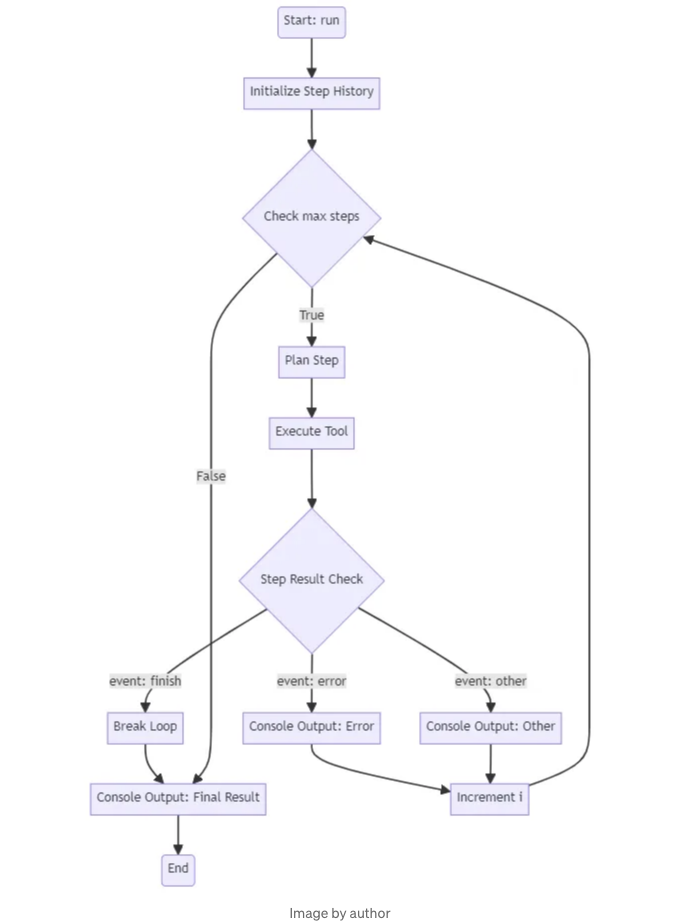

AI의 미래를 생각해 볼 때는, 우리의 작업 흐름에 매끄럽게 통합되어 복잡하고 반복적인 작업을 맡을 수 있는 직관적인 일상 도우미를 상상합니다. 우리는 모두, 우리를 일상적인 루틴 업무의 지루함으로부터 해방시켜주는 접촉점을 발견했습니다. 그러나 현재 주요 과제는 텍스트 생성, 수정, 그리고 고찰이며, 계속되는 발전에서 중요한 역할을 하는 RAG(검색 증강 생성) 파이프라인이 이를 보강합니다. 우리는 대형 언어 모델에 더 나은 맥락을 제공하여 더 가치 있는 콘텐츠를 생성하는 것을 목표로 합니다.

AI의 미래에 대해 생각하면 나에게는 아이언 맨의 자비스나 데스티니(게임)의 라스푸틴 같은 이미지들이 떠오릅니다. 두 예시 모두에서 AI는 복잡한 시스템에 대한 음성 제어 인터페이스 역할을 하여 고수준 추상화를 제공합니다. 예를 들어, 토니 스타크는 연구 관리, 계산 수행, 시뮬레이션 실행에 자비스를 사용합니다. 심지어 R2D2도 음성 명령에 응답하여 익숙하지 않은 컴퓨터 시스템과 상호 작용하거나 데이터 추출, 건축 시스템과 상호 작용할 수 있습니다.

이러한 시나리오에서 AI는 사용자가 그들을 깊게 이해하지 않아도 복잡한 시스템과 상호 작용할 수 있도록 합니다. 이것은 오늘날 대기업의 ERP 시스템과 유사하다고 할 수 있습니다. 대기업에서는 내부 ERP 시스템의 모든 측면을 완전히 알고 이해하는 사람을 찾기 어렵습니다. 머지않아 AI가 ERP 시스템과의 거의 모든 상호 작용을 지원할 수도 있다는 것은 생각해 보면 그리 멀지 않은 미래입니다. 최종 사용자가 고객 데이터를 관리하거나 주문을 기록하거나, 소프트웨어 개발자가 버그를 수정하거나 새로운 기능을 구현하는 등의 상호 작용이 ERP 시스템의 모든 측면과 프로세스에 익숙한 AI 도우미에 의해 곧 가능해질 수 있습니다. 이러한 AI 도우미는 어떤 데이터베이스에 고객 데이터를 입력해야 하는지, 버그와 관련이 있는 어떤 프로세스와 코드가 있는지를 알고 있을 것입니다.

<!-- ui-log 수평형 -->
<ins class="adsbygoogle"
  style="display:block"
  data-ad-client="ca-pub-4877378276818686"
  data-ad-slot="9743150776"
  data-ad-format="auto"
  data-full-width-responsive="true"></ins>
<component is="script">
(adsbygoogle = window.adsbygoogle || []).push({});
</component>

이를 이뤄내기 위해서는 여러 가지 과제와 혁신이 앞에 있습니다. 프로세스와 그 문서화를 재고해야 합니다. 현재의 ERP 프로세스는 특정 사용자를 위한 역할, 인간을 위한 문서화, 인간을 위한 입력 마스크, 직관적이고 오류 없는 사용자 상호작용을 고려하여 설계되어 있습니다. 이러한 측면들의 디자인은 AI 상호작용을 위해 다를 것입니다. AI 상호작용에 대한 특정 역할과 직관적이고 오류 없는 AI 상호작용을 가능하게 하는 다른 프로세스 디자인이 필요합니다. 우리는 이미 프롬프트와 함께 한 작업에서 이를 명백한 작업으로 간주할 때 종종 그것이 그렇게 간단하지 않다는 것을 알 수 있습니다.

# 개념에서 현실로: AI 에이전트를 위한 기초 구축

그러나 먼저 에이전트의 개념으로 한 발짝 물러서 보겠습니다. 에이전트, 즉 제공된 도구를 사용하여 작업을 수행하고 이러한 도구를 어떻게 사용할지 결정하는 AI 어시스턴트들은 결국 그러한 시스템을 가능하게 할 수 있는 구성 요소입니다. 그들은 복잡한 시스템의 모든 측면에 통합하고 싶은 프로세스 구성 요소입니다. 그러나 앞서 언급한 것처럼, 그들을 신뢰성 있게 배포하는 것은 어려운 일입니다. 이 글에서는 데이터베이스와 신뢰성 있게 상호작용할 수 있는 에이전트를 디자인하고 최적화하는 방법을 보여드리겠습니다.

AI의 미래 비전은 영감을 주지만, 이러한 비전을 실현하기 위해 실용적인 단계를 취하는 것이 중요합니다. 더 발전된 AI 시스템의 기초를 구축하는 방법을 보여주기 위해, 우리가 시작할 수 있는 프로토타입 에이전트를 만드는 데 초점을 맞추어 보겠습니다. 일상 업무 추적을 위한 프로토타입은 AI가 금융 거래를 효율적으로 관리하는 데 도움을 줄 수 있는 방법의 구체적인 예시로 제공되며, 데이터베이스와 매끄럽게 상호작용하는 AI 시스템을 디자인하는 데 관련된 도전과 고려 사항을 강조합니다. 구체적이고 관련성 있는 사용 사례로 시작함으로써, 우리는 앞으로 더 복잡한 AI 에이전트의 개발에 도움이 되는 유용한 통찰을 얻을 수 있을 것입니다.

<!-- ui-log 수평형 -->
<ins class="adsbygoogle"
  style="display:block"
  data-ad-client="ca-pub-4877378276818686"
  data-ad-slot="9743150776"
  data-ad-format="auto"
  data-full-width-responsive="true"></ins>
<component is="script">
(adsbygoogle = window.adsbygoogle || []).push({});
</component>

# 이 글의 목적

이 글은 작은 비즈니스를 지원하고 실행하기 위한 상호작용의 단일 지점으로 기능할 챗봇을 개발하는 시리즈의 기초를 마련할 것입니다. 또는 개인 생활에서 당신이 추적해야 할 모든 것을 조직하는 챗봇에 초점을 맞출 것입니다. 데이터, 루틴, 파일, 사진부터 단순히 우리 어시스턴트와 대화하여 당신의 데이터를 저장하고 검색할 위치를 찾도록 허용합니다.

AI의 미래의 비전에서 현실적인 응용 프로그램으로 이동하면서 프로토타입 에이전트를 만드는 데 중점을 둡시다. 이 에이전트는 이전에 논의된 야심찬 목표를 실현하기 위한 기초 단계로 기능할 것입니다. "경비 추적" 에이전트를 개발하기로 출발하겠습니다. 이것은 AI가 금융 거래를 효율적으로 관리하는 데 도움이 될 수 있는 방법을 보여줄 간단하지만 필수적인 작업입니다.

"경비 추적" 프로토타입은 루틴 업무 자동화의 AI 잠재력을 보여주는 것뿐만 아니라 데이터베이스와 원활하게 상호작용하는 AI 시스템을 설계하는 데 관련된 도전과 사항을 명확하게 보여줍니다. 이 예제에 집중함으로써, 에이전트 설계, 입력 유효성 검사, 기존 시스템과 AI의 통합의 복잡성을 탐구하며 미래에 더 복잡한 응용프로그램을 위한 견고한 기반을 마련할 수 있습니다.

<!-- ui-log 수평형 -->
<ins class="adsbygoogle"
  style="display:block"
  data-ad-client="ca-pub-4877378276818686"
  data-ad-slot="9743150776"
  data-ad-format="auto"
  data-full-width-responsive="true"></ins>
<component is="script">
(adsbygoogle = window.adsbygoogle || []).push({});
</component>

# 1. 직접 해보기: OpenAI 도구 호출 테스트

저희의 프로토 타입 에이전트를 구현하고 잠재적인 병목 현상을 식별하기 위해 OpenAI의 도구 호출 기능을 테스트하려 합니다. 비용 추적의 기본 예제를 시작으로 실제 응용 프로그램을 모방하는 기초적인 작업을 진행하고 있습니다. 이 단계는 기본 모델을 생성하고 이를 langchain 라이브러리의 convert_to_openai_tool 함수를 사용하여 OpenAI 도구 스키마로 변환하는 것을 포함합니다. 또한 report_tool을 만들어 우리의 미래 에이전트가 결과를 전달하거나 누락된 정보나 문제를 강조할 수 있도록 합니다.

```js
from pydantic.v1 import BaseModel, validator  
from datetime import datetime
from langchain_core.utils.function_calling import convert_to_openai_tool
  
  
class Expense(BaseModel):    
   description: str    
   net_amount: float    
   gross_amount: float    
   tax_rate: float    
   date: datetime


class Report(BaseModel):
   report: str

add_expense_tool = convert_to_openai_tool(Expense)
report_tool = convert_to_openai_tool(Report)
```

데이터 모델과 도구를 설정했으므로 다음 단계는 OpenAI 클라이언트 SDK를 사용하여 간단한 도구 호출을 시작하는 것입니다. 이 초기 테스트에서 모델에 충분한 정보를 제공하지 않고 의도적으로 누락된 정보를 올바르게 표시할 수 있는지 확인합니다. 이 접근 방식은 에이전트의 기능적 능력뿐만 아니라 상호작용 및 오류 처리 능력도 테스트합니다.

<!-- ui-log 수평형 -->
<ins class="adsbygoogle"
  style="display:block"
  data-ad-client="ca-pub-4877378276818686"
  data-ad-slot="9743150776"
  data-ad-format="auto"
  data-full-width-responsive="true"></ins>
<component is="script">
(adsbygoogle = window.adsbygoogle || []).push({});
</component>

# OpenAI API 호출

이제 OpenAI 클라이언트 SDK를 사용하여 간단한 도구 호출을 시작해 보겠습니다. 첫 번째 테스트에서 모델에 충분하지 않은 정보를 제공하여 누락된 세부 정보를 알려주는지 확인할 것입니다.

```js
from openai import OpenAI  
from langchain_core.utils.function_calling import convert_to_openai_tool  

SYSTEM_MESSAGE = """당신은 특정 목표를 완수해야 하며 결과를 보고해야 합니다. 여러분은 다양한 도구를 사용할 수 있으며, 각각이 특정 유형의 작업을 수행하는 데 특화되어 있습니다.

작업을 성공적으로 완료하기 위해서는:
생각: 주어진 작업을 고려하고, 해당 기능 및 작업의 성격을 고려하여 가장 적합한 도구를 결정하세요.

작업 결과에 대한 지침을 포함하여 report_tool을 사용하십시오.
문제가 발생하여 작업을 완료할 수 없는 경우:

report_tool을 사용하여 작업 완료의 이유 또는 도전을 알리세요.
각 도구의 작업 실행 결과에 따른 피드백이나 완료되지 못한 작업에 대한 설명을 받게 됩니다. 이 피드백 루프는 사용 가능한 도구를 전략적으로 활용하여 문제를 해결하기위한 핵심 요소입니다.
"""  
user_message = "오늘 커피에 5달러를 썼는데, 내 지출을 추적해주세요. 세율은 0.2입니다."

client = OpenAI()  
model_name = "gpt-3.5-turbo-0125"  

messages = [  
    {"role":"system", "content": SYSTEM_MESSAGE},  
    {"role":"user", "content": user_message}  
]  

response = client.chat.completions.create(  
            model=model_name,  
            messages=messages,  
            tools=[  
                convert_to_openai_tool(Expense),  
                convert_to_openai_tool(ReportTool)]  
        )
```

다음으로, 응답에서 함수 호출의 인수를 읽는 새로운 함수가 필요합니다:

<!-- ui-log 수평형 -->
<ins class="adsbygoogle"
  style="display:block"
  data-ad-client="ca-pub-4877378276818686"
  data-ad-slot="9743150776"
  data-ad-format="auto"
  data-full-width-responsive="true"></ins>
<component is="script">
(adsbygoogle = window.adsbygoogle || []).push({});
</component>

```js
def parse_function_args(response):
    message = response.choices[0].message
    return json.loads(message.tool_calls[0].function.arguments)

print(parse_function_args(response))
```

```js
{'description': '커피',
 'net_amount': 5,
 'gross_amount': None,
 'tax_rate': 0.2,
 'date': '2023-10-06T12:00:00Z'}
```

우리가 실행 중에 여러 문제를 발견했습니다:

- 총 금액이 계산되지 않았습니다.
- 날짜가 허구입니다.

<!-- ui-log 수평형 -->
<ins class="adsbygoogle"
  style="display:block"
  data-ad-client="ca-pub-4877378276818686"
  data-ad-slot="9743150776"
  data-ad-format="auto"
  data-full-width-responsive="true"></ins>
<component is="script">
(adsbygoogle = window.adsbygoogle || []).push({});
</component>

그것을 염두에 두고. 문제를 해결하고 에이전트 작업 흐름을 최적화해 봅시다.

## 2. 도구 처리 최적화

에이전트 작업 흐름을 최적화하기 위해, 우선적으로 작업 흐름을 증진시키는 것이 중요하다고 생각합니다. 에이전트가 제공된 도구를 완벽하게 사용하고 실수를 하지 않도록 조정하는 것이 유혹스러울 수 있지만, 먼저 도구와 프로세스를 조정하는 것이 더 나은 선택입니다. 전형적인 오류가 발생할 때, 초기 고려해야할 것은 코드 기반으로 어떻게 수정할지에 대한 것이어야 합니다.

## 누락된 정보 처리

<!-- ui-log 수평형 -->
<ins class="adsbygoogle"
  style="display:block"
  data-ad-client="ca-pub-4877378276818686"
  data-ad-slot="9743150776"
  data-ad-format="auto"
  data-full-width-responsive="true"></ins>
<component is="script">
(adsbygoogle = window.adsbygoogle || []).push({});
</component>

정보가 부족한 경우를 효과적으로 처리하는 것은 견고하고 믿을 수 있는 에이전트를 만드는 데 필수적인 주제입니다. 이전 예제에서는 "get_current_date"와 같은 도구를 에이전트에 제공하는 것이 특정 시나리오를 위한 해결책이었습니다. 그러나 우리는 다양한 맥락에서 정보가 부족해질 것을 예상해야 하며, 모델이 정보가 부족하다고 환각하는 것을 방지하기 위해 프롬프트 엔지니어링만을 의존해서는 안 된다는 것을 기억해야 합니다.

이러한 시나리오를 위한 간단한 해결책은 모든 매개변수를 선택 사항으로 취급하도록 도구 스키마를 수정하는 것입니다. 이 접근 방식은 에이전트가 알고 있는 매개변수만 제출하도록 하여 불필요한 환각을 방지합니다.

그러므로 openai 도구 스키마를 살펴봅시다:

```js
add_expense_tool = convert_to_openai_tool(Expense)
print(add_expense_tool)
```

<!-- ui-log 수평형 -->
<ins class="adsbygoogle"
  style="display:block"
  data-ad-client="ca-pub-4877378276818686"
  data-ad-slot="9743150776"
  data-ad-format="auto"
  data-full-width-responsive="true"></ins>
<component is="script">
(adsbygoogle = window.adsbygoogle || []).push({});
</component>

```js
{'type': 'function',
 'function': {'name': 'Expense',
  'description': '',
  'parameters': {'type': 'object',
    'properties': {'description': {'type': 'string'},
      'net_amount': {'type': 'number'},
      'gross_amount': {'type': 'number'},
      'tax_rate': {'type': 'number'},
      'date': {'type': 'string', 'format': 'date-time'}}}
```  

위에서 보듯이 우리는 필수 key를 삭제해야 합니다. 파라미터를 선택적으로 만들기 위해 required key를 제거하는 방법은 다음과 같습니다:

```js
del add_expense_tool["function"]["parameters"]["required"]
```

# 도구 클래스 디자인

<!-- ui-log 수평형 -->
<ins class="adsbygoogle"
  style="display:block"
  data-ad-client="ca-pub-4877378276818686"
  data-ad-slot="9743150776"
  data-ad-format="auto"
  data-full-width-responsive="true"></ins>
<component is="script">
(adsbygoogle = window.adsbygoogle || []).push({});
</component>

다음으로, 누락된 값이 있는지 초기에 입력 매개변수를 확인하는 Tool 클래스를 설계할 수 있습니다. Tool 클래스를 만들 때 .run(), .validate_input() 두 가지 메서드와 openai_tool_schema 속성을 생성합니다. openai_tool_schema 속성에서는 필요한 매개변수를 제거하여 도구 스키마를 조작합니다. 추가로, 각 도구 실행에 대한 출력 객체로 내용과 성공 필드를 포함하는 ToolResult BaseModel을 정의합니다.

```js
from pydantic import BaseModel
from typing import Type, Callable, Dict, Any, List

class ToolResult(BaseModel):  
    content: str  
    success: bool  
  
class Tool(BaseModel):  
    name: str  
    model: Type[BaseModel]  
    function: Callable  
    validate_missing: bool = False  
  
    class Config:  
        arbitrary_types_allowed = True  
  
    def run(self, **kwargs) -> ToolResult:
        if self.validate_missing:
            missing_values = self.validate_input(**kwargs)  
            if missing_values:  
                content = f"Missing values: {', '.join(missing_values)}"  
                return ToolResult(content=content, success=False)  
        result = self.function(**kwargs)  
        return ToolResult(content=str(result), success=True)  
      
    def validate_input(self, **kwargs) -> List[str]:  
        missing_values = []  
        for key in self.model.__fields__.keys():  
            if key not in kwargs:  
                missing_values.append(key)  
        return missing_values
    @property
    def openai_tool_schema(self) -> Dict[str, Any]:
        schema = convert_to_openai_tool(self.model)
        if "required" in schema["function"]["parameters"]:
            del schema["function"]["parameters"]["required"]
        return schema
```

Tool 클래스는 AI 에이전트의 작업 흐름에서 중요한 구성 요소로, 에이전트가 특정 작업을 수행하는 데 사용할 수 있는 다양한 도구를 생성하고 관리하는 청사진으로 기능합니다. 입력 유효성 검사를 처리하고, 도구 함수를 실행하며, 결과를 표준 형식으로 반환하는 것으로 설계되었습니다.

## Tool 클래스의 주요 구성 요소:

<!-- ui-log 수평형 -->
<ins class="adsbygoogle"
  style="display:block"
  data-ad-client="ca-pub-4877378276818686"
  data-ad-slot="9743150776"
  data-ad-format="auto"
  data-full-width-responsive="true"></ins>
<component is="script">
(adsbygoogle = window.adsbygoogle || []).push({});
</component>

- name: 도구의 이름.
- model: 도구에 대한 입력 스키마를 정의하는 Pydantic BaseModel.
- function: 도구가 실행하는 호출 가능한 함수.
- validate_missing: 누락된 입력 값은 유효성을 검사해야 하는지 여부를 나타내는 부울 플래그 (기본값은 False).

## Tool 클래스에는 두 가지 주요 메서드가 있습니다:

- run(self, **kwargs) -` ToolResult: 이 메서드는 제공된 입력 인수로 도구의 함수를 실행하는 역할을 합니다. 먼저 validate_missing이 True로 설정되어 있는지 확인합니다. 그렇다면 validate_input() 메서드를 호출하여 누락된 입력 값이 있는지 확인합니다. 누락된 값이 발견되면 에러 메시지와 success가 False로 설정된 ToolResult 객체를 반환합니다. 필요한 모든 입력 값이 있는 경우, 제공된 인수로 도구의 함수를 실행하고 결과와 success가 True로 설정된 ToolResult 객체를 반환합니다.
- validate_input(self, **kwargs) -` List[str]: 이 메서드는 도구에 전달된 입력 인수를 모델에서 정의된 예상 입력 스키마와 비교합니다. 모델에서 정의된 필드를 반복하고 각 필드가 입력 인수 내에 있는지 확인합니다. 필드가 누락된 경우, 해당 필드 이름을 누락된 값 목록에 추가합니다. 마지막으로 누락된 값을 나타내는 목록을 반환합니다.

Tool 클래스에는 도구의 OpenAI 도구 스키마를 반환하는 openai_tool_schema 속성도 있습니다. 이는 모델을 OpenAI 도구 스키마 형식으로 변환하기 위해 convert_to_openai_tool() 함수를 사용합니다. 또한 스키마에서 "required" 키를 제거하여 모든 입력 매개변수를 선택 사항으로 만듭니다. 이를 통해 에이전트는 누락된 값들을 가상으로 만들 필요 없이 제공 가능한 정보만 제공할 수 있게 됩니다.

<!-- ui-log 수평형 -->
<ins class="adsbygoogle"
  style="display:block"
  data-ad-client="ca-pub-4877378276818686"
  data-ad-slot="9743150776"
  data-ad-format="auto"
  data-full-width-responsive="true"></ins>
<component is="script">
(adsbygoogle = window.adsbygoogle || []).push({});
</component>

도구 클래스는 도구의 기능, 입력 유효성 검사 및 스키마 생성을 캡슐화하여 AI 에이전트의 워크플로우에서 도구를 만들고 관리하기 위한 깔끔하고 재사용 가능한 인터페이스를 제공합니다. 이는 누락된 값 처리의 복잡성을 추상화하고, 에이전트가 사용 가능한 입력을 기반으로 적절한 도구를 실행하는 동안 불완전한 정보를 우아하게 처리할 수 있도록 합니다.

# 누락된 정보 처리 테스트

다음으로 OpenAI API 호출을 확장해보겠습니다. 클라이언트가 우리의 도구를 활용하고 응답 객체를 직접 트리거하여 tool.run()을 실행하도록 원합니다. 이를 위해 우리는 새롭게 생성된 Tool 클래스에서 도구를 초기화해야 합니다. 성공 메시지 문자열을 반환하는 더미 함수 두 개를 정의합니다.

```js
def add_expense_func(**kwargs):  
    return f"비용 추가됨: {kwargs}을(를) 데이터베이스에 추가했습니다."

add_expense_tool = Tool(  
    name="add_expense_tool",  
    model=Expense,  
    function=add_expense_func  
)  
  
def report_func(report: str = None):  
    return f"보고서: {report}"  
  
report_tool = Tool(  
    name="report_tool",  
    model=ReportTool,  
    function=report_func  
)  
  
tools = [add_expense_tool, report_tool]
```

<!-- ui-log 수평형 -->
<ins class="adsbygoogle"
  style="display:block"
  data-ad-client="ca-pub-4877378276818686"
  data-ad-slot="9743150776"
  data-ad-format="auto"
  data-full-width-responsive="true"></ins>
<component is="script">
(adsbygoogle = window.adsbygoogle || []).push({});
</component>

이제 우리는 클라이언트 응답을 받아들이고 도구와 상호 작용하는 데 도움이 되는 헬퍼 함수를 정의합니다.

```js
def get_tool_from_response(response, tools=tools):  
    tool_name = response.choices[0].message.tool_calls[0].function.name  
    for t in tools:  
        if t.name == tool_name:  
            return t  
    raise ValueError(f"Tool {tool_name} not found in tools list.")

def parse_function_args(response):  
    message = response.choices[0].message  
    return json.loads(message.tool_calls[0].function.arguments)

def run_tool_from_response(response, tools=tools):  
    tool = get_tool_from_response(response, tools)  
    tool_kwargs = parse_function_args(response)  
    return tool.run(**tool_kwargs)
```

이제 새 도구로 클라이언트를 실행하고 run_tool_from_response 함수를 사용할 수 있습니다.

```js
response = client.chat.completions.create(  
            model=model_name,  
            messages=messages,  
            tools=[tool.openai_tool_schema for tool in tools]  
        )

tool_result = run_tool_from_response(response, tools=tools)
print(tool_result)
```

<!-- ui-log 수평형 -->
<ins class="adsbygoogle"
  style="display:block"
  data-ad-client="ca-pub-4877378276818686"
  data-ad-slot="9743150776"
  data-ad-format="auto"
  data-full-width-responsive="true"></ins>
<component is="script">
(adsbygoogle = window.adsbygoogle || []).push({});
</component>

```js
content='결측값: gross_amount, date' success=False
```

좋아요, 우리 도구가 결측값이 존재한다고 알려주고 있습니다. 모든 매개변수를 선택 사항으로 보내는 트릭 덕분에 환각적인 매개변수를 피할 수 있어요.

# 3. 에이전트 워크플로우 구축

현재의 프로세스는 아직 실제 에이전트를 대표하지 않습니다. 지금까지 우리는 단일 API 도구 호출만 실행했을 뿐입니다. 에이전트 워크플로우로 이것을 변환하려면, 도구 실행 결과를 클라이언트로 되돌려주는 반복 프로세스를 도입해야 합니다. 기본적인 프로세스는 다음과 같아야 합니다:```

<!-- ui-log 수평형 -->
<ins class="adsbygoogle"
  style="display:block"
  data-ad-client="ca-pub-4877378276818686"
  data-ad-slot="9743150776"
  data-ad-format="auto"
  data-full-width-responsive="true"></ins>
<component is="script">
(adsbygoogle = window.adsbygoogle || []).push({});
</component>



시작하기 전에 새로운 OpenAIAgent 클래스를 생성해 봅시다:

```js
class StepResult(BaseModel):  
    event: str   
    content: str  
    success: bool


class OpenAIAgent:  
      
    def __init__(  
            self,   
            tools: list[Tool],   
            client: OpenAI,   
            system_message: str = SYSTEM_MESSAGE,   
            model_name: str = "gpt-3.5-turbo-0125",  
            max_steps: int = 5,  
            verbose: bool = True  
    ):  
        self.tools = tools  
        self.client = client  
        self.model_name = model_name  
        self.system_message = system_message  
        self.step_history = []  
        self.max_steps = max_steps  
        self.verbose = verbose  
      
      
    def to_console(self, tag: str, message: str, color: str = "green"):  
        if self.verbose:  
            color_prefix = Fore.__dict__[color.upper()]  
            print(color_prefix + f"{tag}: {message}{Style.RESET_ALL}")
```

우리의 ToolResult 객체와 마찬가지로, 각각의 에이전트 단계를 위한 객체인 StepResult를 정의했습니다. 그리고 OpenAIAgent 클래스의 __init__ 메서드와 콘솔에 중간 단계와 도구 호출 내용을 출력하는 to_console() 메서드를 정의했습니다. 출력을 깔끔하게 보여주기 위해 colorama를 사용하였습니다. 그 다음으로, 에이전트의 핵심인 run() 및 run_step() 메서드를 정의했습니다.

<!-- ui-log 수평형 -->
<ins class="adsbygoogle"
  style="display:block"
  data-ad-client="ca-pub-4877378276818686"
  data-ad-slot="9743150776"
  data-ad-format="auto"
  data-full-width-responsive="true"></ins>
<component is="script">
(adsbygoogle = window.adsbygoogle || []).push({});
</component>

```js
class OpenAIAgent:

    # ... __init__...
    
    # ... to_console ...
    
    def run(self, user_input: str):  
        
        openai_tools = [tool.openai_tool_schema for tool in self.tools]    
        self.step_history = [    
            {"role":"system", "content":self.system_message},    
            {"role":"user", "content":user_input}    
        ]    
          
        step_result = None    
        i = 0
        
        self.to_console("시작", f"입력: {user_input}으로 에이전트 시작")
          
        while i < self.max_steps:  
            step_result = self.run_step(self.step_history, openai_tools)    
            
            if step_result.event == "finish":    
                break  
            elif step_result.event == "error":  
                self.to_console(step_result.event, step_result.content, "red")  
            else:  
                self.to_console(step_result.event, step_result.content, "yellow")  
            i += 1   
              
        self.to_console("최종 결과", step_result.content, "green")  
        return step_result.content
```

run() 메서드에서는 먼저 step_history를 초기화하고, 이는 미리 정의된 system_message와 user_input을 메시지 기억 공간으로 사용합니다. 그런 다음 반복문을 시작하여 각 반복에서 run_step을 호출하면 StepResult 객체가 반환됩니다. 에이전트가 작업을 완료했는지 또는 오류가 발생했는지를 확인하고, 해당 정보도 콘솔에 전달됩니다.

```js
class OpenAIAgent:

    # ... __init__...
    
    # ... to_console ...
    # ... run ...
    def run_step(self, messages: list[dict], tools):  
          
        # 다음 단계 계획  
        response = self.client.chat.completions.create(  
            model=self.model_name,  
            messages=messages,  
            tools=tools  
        )  
          
        # 메시지를 히스토리에 추가  
        self.step_history.append(response.choices[0].message)  
        
        # 도구 호출이 있는지 확인  
        if not response.choices[0].message.tool_calls:  
            return StepResult(
                event="에러",
                content="반환된 도구 호출이 없습니다.", 
                success=False
                )  
          
        tool_name = response.choices[0].message.tool_calls[0].function.name  
        tool_kwargs = parse_function_args(response)  
          
        # 도구 호출 실행  
        self.to_console(
        "도구 호출", f"이름: {tool_name}\n매개변수: {tool_kwargs}", "magenta"
        )  
        tool_result = run_tool_from_response(response, tools=self.tools)  
        tool_result_msg = self.tool_call_message(response, tool_result)  
        self.step_history.append(tool_result_msg)  
          
        if tool_result.success:  
            step_result = StepResult(  
                event="도구 결과",   
                content=tool_result.content,   
                success=True)  
        else:  
            step_result = StepResult(  
                event="에러",   
                content=tool_result.content,   
                success=False  
            )   
          
        return step_result  
          
      
    def tool_call_message(self, response, tool_result: ToolResult):  
        tool_call = response.choices[0].message.tool_calls[0]  
        return {  
            "tool_call_id": tool_call.id,  
            "role": "tool",  
            "name": tool_call.function.name,  
            "content": tool_result.content,  
        }
```

이제 각 단계의 로직을 정의했습니다. 먼저 이전에 테스트한 클라이언트 API 호출 및 도구로 응답 객체를 가져옵니다. 응답 메시지 객체를 step_history에 추가합니다. 그런 다음 응답 객체에 도구 호출이 포함되어 있는지 확인하고, 그렇지 않으면 StepResult에서 오류를 반환합니다. 다음으로 도구 호출을 콘솔에 로깅하고, run_tool_from_response() 메서드로 선택한 도구를 실행합니다. 또한 도구 결과를 메시지 기록에 추가해야 합니다. OpenAI는 모델이 어떤 도구 호출이 어떤 출력을 참조하는지 알 수 있도록 특정 형식을 정의하였습니다. 즉, 메시지 dict에 tool_call_id를 전달합니다. 이 작업은 response 객체와 tool_result를 인자로 받는 tool_call_message() 메서드로 처리됩니다. 각 단계의 끝에서 도구 결과를 StepResult 객체에 할당하고, 단계가 성공했는지 여부를 지시하며 run()에 반환됩니다.```

<!-- ui-log 수평형 -->
<ins class="adsbygoogle"
  style="display:block"
  data-ad-client="ca-pub-4877378276818686"
  data-ad-slot="9743150776"
  data-ad-format="auto"
  data-full-width-responsive="true"></ins>
<component is="script">
(adsbygoogle = window.adsbygoogle || []).push({});
</component>

# 4. 에이전트 실행하기

이제 이전 예시를 사용하여 에이전트를 테스트할 수 있습니다. get_current_date_tool을 사용하여 직접 에이전트를 적용해보세요. 여기서는 tool에 어떤 입력 인수도 필요하지 않기 때문에 이전에 정의한 validate_missing 속성을 False로 설정할 수 있습니다.

```js
class DateTool(BaseModel):  
    x: str = None  

get_date_tool = Tool(  
    name="get_current_date",  
    model=DateTool,  
    function=lambda: datetime.now().strftime("%Y-%m-%d"),  
    validate_missing=False  
)  
      
tools = [  
    add_expense_tool,   
    report_tool,  
    get_date_tool  
]  
  
agent = OpenAIAgent(tools, client)
agent.run("I have spent 5$ on a coffee today please track my expense. The tax rate is 0.2.")
```

```js
START: 에이전트 시작 - 입력: 
"I have spend 5$ on a coffee today please track my expense. The tax rate is 0.2."


Tool 호출: get_current_date
인수: {}
도구 결과: 2024-03-15


Tool 호출: add_expense_tool
인수: {'description': 'Coffee expense', 'net_amount': 5, 'tax_rate': 0.2, 'date': '2024-03-15'}
에러: 필수 값 부재: 총액(gross_amount)


Tool 호출: add_expense_tool
인수: {'description': 'Coffee expense', 'net_amount': 5, 'tax_rate': 0.2, 'date': '2024-03-15', 'gross_amount': 6}
도구 결과: {'description': 'Coffee expense', 'net_amount': 5, 'tax_rate': 0.2, 'date': '2024-03-15', 'gross_amount': 6}가 데이터베이스에 추가되었습니다.
에러: 반환된 도구 호출 없음.


Tool 호출: Name: report_tool
인수: {'report': 'Expense successfully tracked for coffee purchase.'}
도구 결과: '커피 구매를 위한 경비가 성공적으로 추적되었습니다.'로 보고되었습니다.


최종 결과: '커피 구매를 위한 경비가 성공적으로 추적되었습니다.'로 보고되었습니다.
```

<!-- ui-log 수평형 -->
<ins class="adsbygoogle"
  style="display:block"
  data-ad-client="ca-pub-4877378276818686"
  data-ad-slot="9743150776"
  data-ad-format="auto"
  data-full-width-responsive="true"></ins>
<component is="script">
(adsbygoogle = window.adsbygoogle || []).push({});
</component>

우리 프로토타입 에이전트가 성공적으로 실행된 후, 에이전트가 계획에 따라 지정된 도구를 효과적으로 활용한 점을 강조하는 것이 중요합니다. 처음으로, 그것은 get_current_date_tool을 호출하여 비용 항목을 위한 기초적인 타임스탬프를 설정했습니다. 이후, add_expense_tool을 통해 비용을 기록하려고 시도할 때, 우리가 지능적으로 설계된 도구 클래스는 중요한 재정 추적 정보인 순액을 결여했다고 판별했습니다. 인상적인 점은, 에이전트가 제공된 세율을 사용하여 순액을 계산함으로써 이를 자율적으로 해결했다는 것입니다.

우리의 시험 실행에서는 입력 비용의 성격 — 커피에 $5를 지출한 것이 순액인지 총액인지 — 가 명시적으로 명시되지 않았습니다. 이 단계에서는 에이전트가 작업을 성공적으로 수행하는 데 해당 세분성이 필요하지 않았습니다. 그러나 이는 초기 시스템 안내문에 이와 같은 상세 정보를 통합함으로써 에이전트의 정확도와 효율성을 크게 향상시킬 수 있는 중요한 통찰력을 드러내고 있습니다. 이러한 조정은 처음부터 재정 데이터에 대한 보다 포괄적인 이해를 보장할 것입니다.

# 주요 포인트

- 반복적인 개발: 이 프로젝트는 피드백을 통한 지속적인 개선을 통해 일관된 발전 주기의 중요성을 강조하며, 변동성이 정상인 AI 분야에서는 적응 가능하고 반응적인 개발 전략이 필수적입니다.
- 불확실성 다루기: 우리의 여정은 모호성과 오류를 세련되게 다루는 중요성을 강조했습니다. 선택적 매개변수와 엄격한 입력 유효성 검사와 같은 혁신은 에이전트의 신뢰성과 사용자 경험을 향상하는 데 중요한 역할을 했습니다.
- 특정 작업을 위한 맞춤형 에이전트 워크플로우: 이 작업에서의 핵심 통찰 중 하나는 특정 사용 사례에 적합한 에이전트 워크플로우를 맞춤 제작하는 중요성입니다. 도구 모음을 조합하는 것 이상으로, 도구 상호 작용과 응답의 전략적 설계가 중요합니다. 이러한 맞춤형 접근은 에이전트가 특정 도전에 효과적으로 대응하도록 보장하여 보다 집중된 및 효율적인 문제 해결 방법으로 이어집니다.

<!-- ui-log 수평형 -->
<ins class="adsbygoogle"
  style="display:block"
  data-ad-client="ca-pub-4877378276818686"
  data-ad-slot="9743150776"
  data-ad-format="auto"
  data-full-width-responsive="true"></ins>
<component is="script">
(adsbygoogle = window.adsbygoogle || []).push({});
</component>

우리가 시작한 여정은 AI 에이전트의 세계와 다양한 분야에서의 응용에 대한 더 큰 탐험의 시작에 불과합니다. 우리는 AI로 가능한 것의 한계를 끊임없이 뛰어넘으며, 이 흥미진진한 모험에 여러분을 초대합니다. 이 글의 기초를 더 토대로 쌓고 향후 개선 사항을 주시하며, 여러분께 AI 에이전트가 비즈니스와 개인이 데이터를 처리하고 복잡한 작업을 자동화하는 방식을 혁신할 수 있는 현장에 직접 참여하실 수 있습니다.

함께하며 AI의 힘을 받아들이고, 일하는 방식과 기술과 상호작용하는 방식을 변혁하는 AI의 잠재력을 풀어봅시다. AI의 미래는 밝으며, 우리는 한 가지 믿을 수 있는 에이전트마다 그것을 성장시키는 최전선에 서 있습니다.

# 전망

AI 에이전트의 잠재력을 탐색하는 여정을 계속하면서, 향후의 글은 우리의 프로토타입의 능력을 확장하고 실세계 시스템과 통합하는 데 초점을 맞추게 될 것입니다. 다음 글에서는 우리가 개발한 에이전트를 SQL 데이터베이스와 원활하게 상호작용할 수 있는 견고한 프로젝트 구조를 디자인하는 데 들어가겠습니다. 이 글에서 개발한 에이전트를 활용하여, 데이터베이스에 저장된 데이터를 효율적으로 관리하고 조작하는 방법을 보여드릴 것이며, 데이터 관련 작업을 자동화하는 데 열어줄 가능성의 세계를 열어보겠습니다.

<!-- ui-log 수평형 -->
<ins class="adsbygoogle"
  style="display:block"
  data-ad-client="ca-pub-4877378276818686"
  data-ad-slot="9743150776"
  data-ad-format="auto"
  data-full-width-responsive="true"></ins>
<component is="script">
(adsbygoogle = window.adsbygoogle || []).push({});
</component>

위 기반을 바탕으로, 시리즈의 세 번째 기사에서는 고급 쿼리 기능을 소개하여, 우리의 에이전트가 더 복잡한 데이터 검색 및 조작 작업을 처리할 수 있도록 할 것입니다. 또한, 라우팅 에이전트 개념을 탐구할 것인데, 이는 여러 하위 에이전트를 관리하는 중앙 허브 역할을 할 것입니다. 각각은 특정 데이터베이스 테이블과 상호 작용할 책임이 있는 서브 에이전트입니다. 이 계층 구조를 통해 사용자들은 자연어로 요청을 할 수 있게 되며, 라우팅 에이전트는 이를 해석하여 적절한 서브 에이전트로 전달하여 실행할 것입니다.

우리의 AI 기반 시스템의 실용성과 보안을 더욱 향상시키기 위해 역할 기반 액세스 제어 시스템을 도입할 것입니다. 이를 통해 사용자들이 할당된 역할에 기반하여 데이터에 액세스하고 수정할 적절한 권한을 갖도록 보장할 것입니다. 이 기능을 구현함으로써, AI 에이전트가 데이터 무결성과 보안을 유지하면서 현실 세계 시나리오에 배치될 수 있는 방법을 보여줄 수 있습니다.

이러한 다가오는 개선 사항을 통해, 데이터 관리 과정을 간소화하고 사용자가 데이터베이스와 상호 작용하는 것에 더 직관적이고 효율적인 방법을 제공하는 AI 에이전트의 진정한 잠재력을 소개하고자 합니다. 자연어 처리, 데이터베이스 관리 및 역할 기반 액세스 제어의 힘을 결합함으로써, 비즈니스 및 개인이 데이터를 처리하는 방식을 혁신할 수 있는 정교한 AI 어시스턴트 개발의 기밋을 마련할 것입니다.

AI 에이전트가 데이터 관리를 넘어서어 무엇이 가능한지를 계속해서 확장해 나가는 동안, 이러한 흥미로운 발전 사항을 기대해 주세요.

<!-- ui-log 수평형 -->
<ins class="adsbygoogle"
  style="display:block"
  data-ad-client="ca-pub-4877378276818686"
  data-ad-slot="9743150776"
  data-ad-format="auto"
  data-full-width-responsive="true"></ins>
<component is="script">
(adsbygoogle = window.adsbygoogle || []).push({});
</component>

## 소스 코드

또한, 해당 프로젝트에 대한 전체 소스 코드는 GitHub에서 제공됩니다. 아래 링크를 통해 확인할 수 있습니다.
https://github.com/elokus/AgentDemo