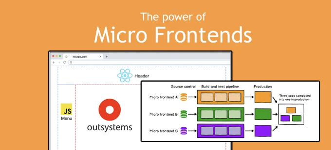
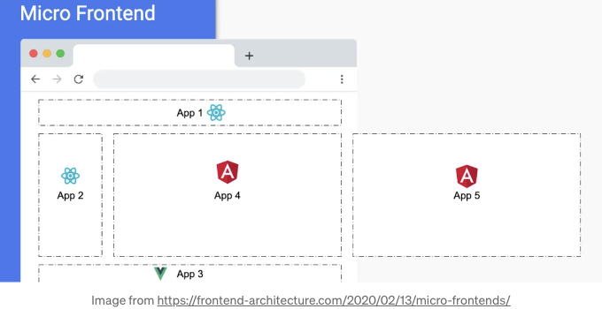
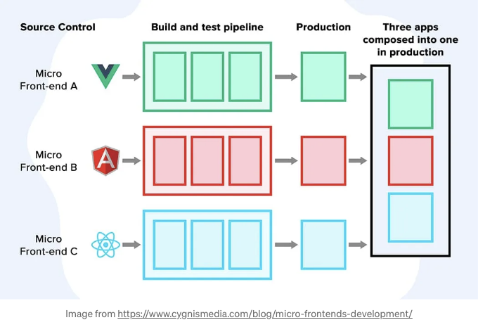

마이크로 프론트엔드란 무엇인지부터 정의하는 것부터 시작해봅시다. 이 용어는 2016년에 처음 언급되었으며 마이크로 서비스와 비교했을 때 아직 매우 최근한 개념입니다.

웹사이트 https://micro-frontends.org/ 에서는 다음과 같이 설명하고 있습니다:

글 https://martinfowler.com/articles/micro-frontends.html에서 다음을 강조할 수 있습니다:

<!-- ui-log 수평형 -->
<ins class="adsbygoogle"
  style="display:block"
  data-ad-client="ca-pub-4877378276818686"
  data-ad-slot="9743150776"
  data-ad-format="auto"
  data-full-width-responsive="true"></ins>
<component is="script">
(adsbygoogle = window.adsbygoogle || []).push({});
</component>

# 이것은 무엇을 뜻하나요?

이러한 개념들은 애플리케이션을 다음 이미지처럼 조립할 수 있게 해줍니다:

- React로 개발된 App1은 Team A에 의해 개발되고, 자체 배포 주기, 테스팅 등을 갖고 domainA에서 제공될 수 있습니다.
- Angular로 개발된 App 4는 Team B에 의해 개발되고, 자체 배포 주기, 테스팅 등을 갖고 domainB에서 제공될 수 있습니다.

검색 모듈은 Technology A로, 인증 모듈은 Technology B로 구현될 수 있습니다.

<!-- ui-log 수평형 -->
<ins class="adsbygoogle"
  style="display:block"
  data-ad-client="ca-pub-4877378276818686"
  data-ad-slot="9743150776"
  data-ad-format="auto"
  data-full-width-responsive="true"></ins>
<component is="script">
(adsbygoogle = window.adsbygoogle || []).push({});
</component>

아키텍처적인 측면에서 이 관심사의 분리는 명확한 범위와 책임을 정의하여 다른 팀이 더 빠르고 자주 전달할 수 있도록 합니다. 😎

좋은 E2E 테스트 전략으로 품질을 보장할 수 있고 모두가 함께 행복하게 일할 수 있으며 다른 팀들의 영역에 손대지 않아도 됩니다. 🧀

<!-- ui-log 수평형 -->
<ins class="adsbygoogle"
  style="display:block"
  data-ad-client="ca-pub-4877378276818686"
  data-ad-slot="9743150776"
  data-ad-format="auto"
  data-full-width-responsive="true"></ins>
<component is="script">
(adsbygoogle = window.adsbygoogle || []).push({});
</component>

(타 부서가 "이건 반드시 내일 공개하면 안돼요!"라고 말할 때마다, 이 책을 떠올리곤 해요.)

좋아요, 좋은 소식이네요.

# 아웃시스템은 어떠신가요?

가끔 이런 질문을 듣곤 해요:
- 아웃시스템에서 Tailwind를 사용할 수 있나요?
- 아웃시스템에서 Firebase를 사용해 푸시 알림을 받을 수 있나요?
- 아웃시스템에서 WebGL 및 Three.js와 같은 JavaScript 라이브러리를 구현할 수 있나요?
요런 식으로요...

<!-- ui-log 수평형 -->
<ins class="adsbygoogle"
  style="display:block"
  data-ad-client="ca-pub-4877378276818686"
  data-ad-slot="9743150776"
  data-ad-format="auto"
  data-full-width-responsive="true"></ins>
<component is="script">
(adsbygoogle = window.adsbygoogle || []).push({});
</component>

답은 간단해요: 만능 브라우저에서 실행된다면, 어떤 방식으로든, 사랑하는 플랫폼을 사용하여 구현할 수 있어요. 🥰
이를 염두에 두고 OutSystems에서 마이크로 프론트엔드와 유사한 것을 만들 수 있어요. 하지만 몇 가지 주의할 점이 있어요.

# 단일 페이지 응용 프로그램 (SPA)

현재 플랫폼에서 느낀 점 중 하나는 컴포넌트 대신 응용 프로그램을 생성할 수 있는 기회가 부족하다는 것이에요. 여기서 말하는 것은 브라우저에서 실행되는 웹 컴포넌트를 의미해요.

OutSystems Reactive Web App을 생성하면 사실상 단일 페이지 응용 프로그램 (SPA)이 생성되는데, 완전히 독립적이고 자체 라우팅이 포함되어 있어요. 
다른 기술에서 사용할 수 있는 구성 요소를 만들 방법이 없어요. 웹 블록(심지어 라이브러리 내부에 있는 것도)은 다른 OutSystems 자산에서만 사용할 수 있어요.

<!-- ui-log 수평형 -->
<ins class="adsbygoogle"
  style="display:block"
  data-ad-client="ca-pub-4877378276818686"
  data-ad-slot="9743150776"
  data-ad-format="auto"
  data-full-width-responsive="true"></ins>
<component is="script">
(adsbygoogle = window.adsbygoogle || []).push({});
</component>

아이프레임을 사용하는 다양한 기술을 섞고 거의 마이크로 프론트엔드처럼 보이는 유일한 예제들을 보았어요 😢.

🥳 해결책:
우리는 항상 하이 코드와 순수 자바스크립트(또는 타입스크립트 😍)를 사용하여 컴포넌트를 생성할 대체 방법을 갖고 있어요. Document.createElement()와 같은 메서드를 사용하여 많은 작업을 수행할 수 있어요.

스크립트는 다른 곳에 CDN으로 호스팅되어, 그리고 그런 다음 require이나 appendChild를 사용하여 우리의 Reactive Web App 내부에 "주입"될 수 있을 거예요.

# 소통

<!-- ui-log 수평형 -->
<ins class="adsbygoogle"
  style="display:block"
  data-ad-client="ca-pub-4877378276818686"
  data-ad-slot="9743150776"
  data-ad-format="auto"
  data-full-width-responsive="true"></ins>
<component is="script">
(adsbygoogle = window.adsbygoogle || []).push({});
</component>

정규 OutSystems Reactive Web App은 캡슐화되어 있으며 해당 컨텍스트/상태는 닫혀 있어 외부 소스가 변경할 수 없습니다. 심지어 다른 동료 Reactive Web App에서도 그렇습니다.

창 안에 HTML, JavaScript 및 CSS를 주입하는 것은 하나의 통일된 응용 프로그램을 구성하는 여러 개별 부분으로 상호 작용하도록 만드는 것입니다. 페이지의 다양한 부분은 사용자 작업이나 다른 이벤트로 서로 상호 작용해야 합니다.

🥳 솔루션:
다행히도 지난 몇 년 동안 웹 기술은 많이 발전했으며 사용할 수있는 다양한 Web API 및 설계 패턴이 있습니다. 사용자 정의 이벤트, Observables, 웹 워커 등을 통해 잘 알려진 PubSub 설계 패턴을 사용할 수 있습니다.

<!-- ui-log 수평형 -->
<ins class="adsbygoogle"
  style="display:block"
  data-ad-client="ca-pub-4877378276818686"
  data-ad-slot="9743150776"
  data-ad-format="auto"
  data-full-width-responsive="true"></ins>
<component is="script">
(adsbygoogle = window.adsbygoogle || []).push({});
</component>

내가 선호하는 옵션은 전역 창 내에서 서로 다른 객체 간 통신을 처리하는 postMessage입니다.

특히, 예를 들어 iframes와 같은 서로 다른 출처 간에 통신해야 할 때 매우 유용합니다. 네! 페이지와 iframe 간에도 통신할 수 있어요😉.

상태 처리는 이러한 애플리케이션을 개발할 때 항상 까다로울 것이고, 반응형 웹 앱이 모든 핵심 기능과 데이터를 가질 것으로 가정한다면, 모든 상태 관리를 중앙에서 처리하는 것이 합리적으로 보입니다.

이것들은 모두 고수준의 개념이지만, 더 심층적으로 이해하고 더 나은 수준으로 끌어올리고 싶다면 Redux를 확인해보세요.

<!-- ui-log 수평형 -->
<ins class="adsbygoogle"
  style="display:block"
  data-ad-client="ca-pub-4877378276818686"
  data-ad-slot="9743150776"
  data-ad-format="auto"
  data-full-width-responsive="true"></ins>
<component is="script">
(adsbygoogle = window.adsbygoogle || []).push({});
</component>

# CSS

애플리케이션이 “일체감”을 느끼게 하려면 모든 부분이 색상, 타이포그래피, 컨트롤 등과 같은 시각적 요소를 공유해야 합니다.

사용자들에게는 OutSystems Reactive Web App이나 네이티브 JavaScript에서 드롭다운이 제공되었는지 여부는 중요하지 않습니다. 동작과 외관이 동일하다면 항상 동일한 애플리케이션으로 인식됩니다.

의도하지 않은 충돌을 피하기 위해 CSS 로드 순서와 명확성을 이해하는 것이 중요합니다.

<!-- ui-log 수평형 -->
<ins class="adsbygoogle"
  style="display:block"
  data-ad-client="ca-pub-4877378276818686"
  data-ad-slot="9743150776"
  data-ad-format="auto"
  data-full-width-responsive="true"></ins>
<component is="script">
(adsbygoogle = window.adsbygoogle || []).push({});
</component>

🥳 해결책:

만약 완전한 분리와 캡슐화를 원한다면, 그림자 DOM을 사용할 수 있습니다. 이 방법을 통해 각 부분은 자체 DOM 트리를 가지고 있으며 외부 범위와 충돌하지 않고 완전히 독립되어 있습니다. 이 개념이 처음이라면 이 기사를 확인해보세요.

다른 대안은 CSS 클래스 네이밍에 BEM 방법론을 사용하는 것입니다. “Search”라는 컴포넌트와 “Aside 메뉴”라는 다른 컴포넌트가 있다고 가정했을 때, 각 컴포넌트가 “.search-title-lead-highlight”, “.search-subtitle-promotion-overlay”와 같은 클래스 내의 모든 CSS 클래스를 캡슐화한다고 가정합니다.
“.aside-menu-option-item”, “.aside-menu-overlay-promotional-title” 등이 있습니다.

결과적으로 클래스 이름은 더 길어질 수 있지만, 대상을 특정하고 상속 문제가 적어집니다. 모든 범위가 지정된 컴포넌트 내에서 제어되고 포함됩니다.

<!-- ui-log 수평형 -->
<ins class="adsbygoogle"
  style="display:block"
  data-ad-client="ca-pub-4877378276818686"
  data-ad-slot="9743150776"
  data-ad-format="auto"
  data-full-width-responsive="true"></ins>
<component is="script">
(adsbygoogle = window.adsbygoogle || []).push({});
</component>

이렇게 하면 CSS가 1개의 파일에 집중되어 있어서 색상이나 타이포그래피와 같은 일반적인 설정을 모든 구성 요소에서 공유할 수 있어 일관성을 유지할 수 있습니다.

# 결론

OutSystems에서 마이크로 프론트엔드를 구현할 수 있을까요? 네, 가능합니다.

그 과정에서 몇 가지 도전 과제가 있지만, 올바른 도구 세트를 사용하면 플랫폼이 제공하는 것을 최대한 활용하여 다른 팀에 의해 개발되고 독립적인 라이프사이클을 갖는 다양한 부분으로 구성된 애플리케이션을 제공할 수 있습니다.

<!-- ui-log 수평형 -->
<ins class="adsbygoogle"
  style="display:block"
  data-ad-client="ca-pub-4877378276818686"
  data-ad-slot="9743150776"
  data-ad-format="auto"
  data-full-width-responsive="true"></ins>
<component is="script">
(adsbygoogle = window.adsbygoogle || []).push({});
</component>

