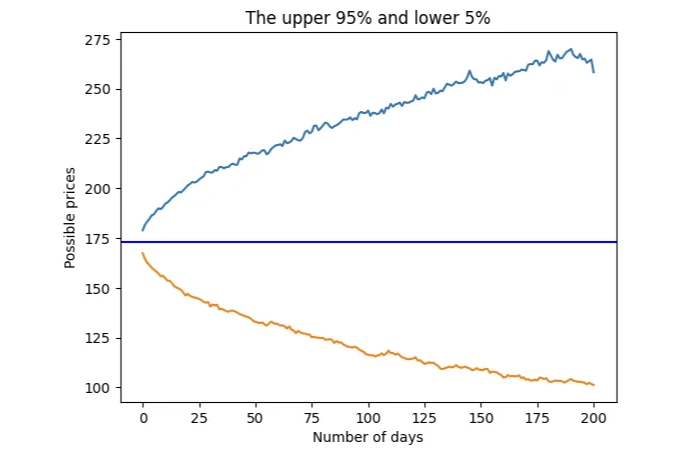

Monte Carlo 시뮬레이션은 복잡한 시스템의 행동을 모델링하는 데 사용되는 계산 기법입니다. 이는 시스템을 통해 확률 분포에서 무작위 샘플을 생성한 다음 결과를 분석합니다. Monte Carlo 시뮬레이션은 금융, 공학, 물리학, 운영 조사 및 여러 종류의 리스크 관리를 포함한 다양한 분야에서 적용됩니다. 시간 시리즈에서 확률적 예측을 생성하는 데 널리 사용됩니다. 여기서 배우고 나중에 "아마존의 DeepAR for RNN/LSTM"와 "시계열 모델링 기술의 진행"에서 그 실용적인 사용 사례를 볼 것입니다.

재미있는 사실부터 시작해 보죠. 왜 "Monte Carlo"라고 불리는지 궁금할 수 있습니다. "Monte Carlo"란 이름은 산 언덕에 위치한 도시의 이름에서 유래했습니다. "Carlo"는 찰스(Charles)이라는 이름의 이탈리아어 버전이며, "Monte"는 이탈리아어로 "산"을 의미합니다. 몬테 카를로 공국은 1856년부터 1889년까지 포편을 다스린 몽테 카를로 3세의 땅입니다. 이 곳은 몬테 카를로 카지노로 유명합니다.

1940년대, 제2차 세계대전이 벌어지던 시기이자 핵폭탄 "맨해튼" 프로젝트가 진행되던 시기였습니다. 수학자 울람(Ulam)과 폰 노이만(von Neumann)은 맨해튼 프로젝트에 참여했습니다. 그들은 핵 연쇄 반응에서 중성자의 행동과 관련된 수학적 문제를 해결해 보고 싶어했습니다. 그러나 중성자 확산을 규정하는 방정식은 매우 복잡하여 분석적으로 풀 수 없었습니다. 이 문제를 해결하기 위해 울람과 폰 노이만은 무작위 숫자를 사용하여 중성자 확산을 시뮬레이션할 수 있다는 것을 깨달았습니다. 그들은 몬테 카를로 카지노에서 카드로 하는 간단한 솔리테어 게임을 상상했습니다. 따라서 "Monte Carlo 시뮬레이션"이라는 용어가 탄생했고 그로부터 강력한 계산 기법이 되었습니다.

<!-- ui-log 수평형 -->
<ins class="adsbygoogle"
  style="display:block"
  data-ad-client="ca-pub-4877378276818686"
  data-ad-slot="9743150776"
  data-ad-format="auto"
  data-full-width-responsive="true"></ins>
<component is="script">
(adsbygoogle = window.adsbygoogle || []).push({});
</component>

Monte Carlo 시뮬레이션의 과정은 기본적으로 다음과 같습니다:

- 모델 정의: 먼저 시뮬레이션하고 싶은 시스템 또는 프로세스를 정의해야 합니다. 이는 방정식과 매개변수를 포함합니다.
- 무작위 표본 생성: 그런 다음 적합한 확률 분포에서 무작위 표본을 생성합니다.
- 시뮬레이션 수행: 각 무작위 표본 집합에 대해 모델을 실행하여 시스템의 동작을 모의 시뮬레이션합니다.
- 결과 분석: 다수의 시뮬레이션을 실행한 후 결과를 분석하여 시스템의 동작을 이해합니다.

이제 어떻게 작동하는지 설명해보겠습니다. 저는 미래 주식 가격을 가우시안 분포와 학생 t-분포 두 가지 분포를 이용해 시뮬레이션하는 방법을 적용할 것입니다. 이 두 분포는 주식 시장 데이터에 대해 양적 분석가들에 의해 흔히 사용됩니다. 파이썬 코드는 다음 Github 링크에서 다운로드할 수 있습니다.

여기서는 2020년부터 2024년까지의 애플의 일일 주식 가격을 불러옵니다.

<!-- ui-log 수평형 -->
<ins class="adsbygoogle"
  style="display:block"
  data-ad-client="ca-pub-4877378276818686"
  data-ad-slot="9743150776"
  data-ad-format="auto"
  data-full-width-responsive="true"></ins>
<component is="script">
(adsbygoogle = window.adsbygoogle || []).push({});
</component>

```js
import yfinance as yf
orig = yf.download(["AAPL"], start="2020-01-01", end="2024-12-31")
orig = orig[('Adj Close')]
orig.tail()
```


가격 시계열을 사용하여 간단한 일간 수익을 계산하고 히스토그램에 나타낼 수 있습니다.

```js
import pandas as pd
import numpy as np
import matplotlib.pyplot as plt
returns = orig.pct_change()
last_price = orig[-1]
returns.hist(bins=100)
```

<!-- ui-log 수평형 -->
<ins class="adsbygoogle"
  style="display:block"
  data-ad-client="ca-pub-4877378276818686"
  data-ad-slot="9743150776"
  data-ad-format="auto"
  data-full-width-responsive="true"></ins>
<component is="script">
(adsbygoogle = window.adsbygoogle || []).push({});
</component>


일반 분포와 적합시켜 보겠습니다.

(1) 수익을 표준 정규 분포로 적합시키기

먼저 주식의 역사적 변동성을 계산할 것입니다. 보통 이는 주식의 일일 수익률의 표준 편차를 계산하여 수행됩니다. 미래 변동성이 역사적 변동성과 유사할 것이라고 가정합니다.

<!-- ui-log 수평형 -->
<ins class="adsbygoogle"
  style="display:block"
  data-ad-client="ca-pub-4877378276818686"
  data-ad-slot="9743150776"
  data-ad-format="auto"
  data-full-width-responsive="true"></ins>
<component is="script">
(adsbygoogle = window.adsbygoogle || []).push({});
</component>

히스토그램은 0.0을 중심으로 한 정규 분포와 같이 보입니다. 간단히 하기 위해 이 분포가 평균=0 및 표준 편차인 표준 가우시안 분포라고 가정합니다. 아래에서는 표준 편차, 즉 일일 변동성이라고도 불리는 값을 유도합니다. 그런 다음 내일을 위한 일일 수익률은 가우시안 분포에서 무작위 값으로 예상됩니다:

```js
daily_volatility = returns.std()
rtn = np.random.normal(0, daily_volatility)
```

다음 날의 가격은 오늘의 가격에 (1+수익률 %)를 곱한 값입니다:


<!-- ui-log 수평형 -->
<ins class="adsbygoogle"
  style="display:block"
  data-ad-client="ca-pub-4877378276818686"
  data-ad-slot="9743150776"
  data-ad-format="auto"
  data-full-width-responsive="true"></ins>
<component is="script">
(adsbygoogle = window.adsbygoogle || []).push({});
</component>

```js
가격 = 최신_가격 * (1 + 수익률)
```

위는 주식 가격과 수익률에 대한 기본적인 금융 공식입니다. MC 시뮬레이션을 적용할 것입니다. 내일의 가격을 계산하려면 다른 수익률 %를 무작위로 뽑아서 모레의 가격을 유도할 수 있습니다. 이 방법으로 다음, 예를 들어 200일 동안의 가능한 가격 경로를 유도할 수 있습니다. 이것은 단지 가능한 가격 경로일 뿐입니다. 미래의 날들에 대해 수익률을 다시 뽑으면 다른 경로가 나올 것입니다. 이 모든 경로가 가능하기 때문에, 우리는 1,000번 이 프로세스를 복제하여 1,000개의 가격 경로를 생성할 수 있습니다.

```js
import warnings
warnings.simplefilter(action='ignore', category=pd.errors.PerformanceWarning)

num_simulations = 1000
num_days = 200
simulation_df = pd.DataFrame()
for x in range(num_simulations):
    count = 0    
    # 첫 번째 가격 점
    price_series = []
    rtn = np.random.normal(0, daily_volatility)
    price = 최신_가격 * (1 + rtn)
    price_series.append(price)
    # 각 가격 경로 생성
    for g in range(num_days):
        rtn = np.random.normal(0, daily_volatility)
        price = price_series[g] * (1 + rtn)
        price_series.append(price)
    # 모든 가능한 가격 경로 저장
    simulation_df[x] = price_series
fig = plt.figure()
plt.plot(simulation_df)
plt.xlabel('일 수')
plt.ylabel('가능한 가격')
plt.axhline(y=최신_가격, color='b', linestyle='-')
plt.show()
```

결과는 분석을 위한 아래 그래프입니다. 가격은 179.66에서 시작합니다. 대부분의 가격 경로가 서로 겹칩니다. 시뮬레이션된 가격은 $500까지 높을 수도 있고 $100까지 낮을 수도 있습니다.```

<!-- ui-log 수평형 -->
<ins class="adsbygoogle"
  style="display:block"
  data-ad-client="ca-pub-4877378276818686"
  data-ad-slot="9743150776"
  data-ad-format="auto"
  data-full-width-responsive="true"></ins>
<component is="script">
(adsbygoogle = window.adsbygoogle || []).push({});
</component>


그리고 우리가 90%의 시간(5%와 95% 사이)에 벌어질 "정상" 가격 범위를 알고 싶다고 가정해 봅시다. 상한가 및 하한가를 얻기 위해 분위수를 사용할 수 있습니다. 그를 통해 상한가 및 하한가 바깥의 극단적인 가격을 평가할 수 있습니다.

```js
upper = simulation_df.quantile(.95, axis=1)
lower = simulation_df.quantile(.05, axis=1)
stock_range = pd.concat([upper, lower], axis=1)

fig = plt.figure()
plt.plot(stock_range)
plt.xlabel('Number of days')
plt.ylabel('Possible prices')
plt.axhline(y = last_price, color = 'b', linestyle = '-')
plt.show()
```



<!-- ui-log 수평형 -->
<ins class="adsbygoogle"
  style="display:block"
  data-ad-client="ca-pub-4877378276818686"
  data-ad-slot="9743150776"
  data-ad-format="auto"
  data-full-width-responsive="true"></ins>
<component is="script">
(adsbygoogle = window.adsbygoogle || []).push({});
</component>

지금은 학생 t-분포로 시뮬레이션해 보겠습니다.

주식 가격 변동률을 학생 t-분포로 맞춰 봅시다.

주식 가격 변동률은 가끔 극단적인 사건을 보여줍니다. 이런 극단적인 사건들은 분포의 양쪽에 위치합니다. 표준 정규 분포에서는 변동이 이루어지는 95%가 두 표준 편차 내에서 발생하고, 5%는 두 표준 편차 바깥에서 발생합니다. 극단적인 사건이 5%보다 더 자주 발생하면 분포는 "두툼"해질 것입니다. 이것이 통계학자들이 꼬리가 두꺼운 현상(fat tails)이라고 부르는 이유입니다. 이는 분포가 정규 분포보다 두툼한 꼬리를 가지기 때문입니다. 주식 가격 변동률을 표현하는 분포에는 꼬리가 두꺼운 현상이 나타날 수 있기 때문에 종종 퀀티티브 애널리스트들은 주식 가격 변동률을 모델링하기 위해 학생 t-분포를 사용합니다.

학생 t-분포는 세 가지 매개변수로 특징 지어집니다:

<!-- ui-log 수평형 -->
<ins class="adsbygoogle"
  style="display:block"
  data-ad-client="ca-pub-4877378276818686"
  data-ad-slot="9743150776"
  data-ad-format="auto"
  data-full-width-responsive="true"></ins>
<component is="script">
(adsbygoogle = window.adsbygoogle || []).push({});
</component>

- 자유도 매개변수: 샘플에서 추정한 모집단 매개변수의 독립적 관측치 수를 나타냅니다. 자유도가 증가함에 따라 t-분포는 표준 정규 분포(종모양 곡선)에 가까워집니다. Student의 t-분포의 자유도 범위는 0보다 큰 임의의 실수입니다. 자유도가 작을 때, t-분포의 꼬리는 더 두껍고 꼬리가 뚱뚱한 분포를 나타냅니다.
- 척도: 척도 매개변수는 분포의 퍼짐 또는 변동성을 나타냅니다. t-분포의 맥락에서 척도 매개변수는 일반적으로 표본 선택된 모집단의 표준 편차입니다.
- 위치: 위치 매개변수는 분포의 위치 또는 중심을 나타냅니다. 이는 표본 선택된 모집단의 평균입니다.

실제 주식 수익률을 Student의 t-분포로 맞추어 봅시다.

```js
import numpy as np
import matplotlib.pyplot as plt
from scipy.stats import t

returns = orig.pct_change()

# 시뮬레이션 당 샘플 수
num_samples = 100

# 분포 적합
returns = returns[1::] # 첫 번째 요소는 "NA"이므로 삭제
params = t.fit(returns[1::]) # 스튜던트-t로 적합

# Student의 t-분포에서 무작위 숫자 생성
results = t.rvs(df=params[0], loc=params[1], scale=params[2], size=1000)
# Student의 t-분포에서 무작위 숫자 생성
results = t.rvs(df=params[0], loc=params[1], scale=params[2], size=1000)
print('자유도 = ', params[0])
print('위치 = ', params[1])
print('척도 = ', params[2])
```

매개변수들은:

<!-- ui-log 수평형 -->
<ins class="adsbygoogle"
  style="display:block"
  data-ad-client="ca-pub-4877378276818686"
  data-ad-slot="9743150776"
  data-ad-format="auto"
  data-full-width-responsive="true"></ins>
<component is="script">
(adsbygoogle = window.adsbygoogle || []).push({});
</component>

- 자유도 = 3.735
- loc = 0.001
- scale = 0.014

위의 매개변수들을 사용하여 스튜던트-t 분포를 투영할 것입니다. 그런 다음 실제 주식 수익률 분포와 스튜던트-t 분포를 그릴 것입니다.

```js
returns.hist(bins=100, density=True, alpha=0.6, color='b', label='실제 수익률 분포')

# 결과 히스토그램 그리기
plt.hist(results, bins=100, density=True, alpha=0.6, color='g', label='시뮬레이션된 스튜던트/t 분포')

plt.xlabel('값')
plt.ylabel('밀도')
plt.title('실제 수익률 대 스튜던트 t-분포로의 프로젝션')
plt.legend(loc='center left')
plt.grid(True)
plt.show()
```

실제 수익률과 프로젝션은 매우 비슷합니다:

<!-- ui-log 수평형 -->
<ins class="adsbygoogle"
  style="display:block"
  data-ad-client="ca-pub-4877378276818686"
  data-ad-slot="9743150776"
  data-ad-format="auto"
  data-full-width-responsive="true"></ins>
<component is="script">
(adsbygoogle = window.adsbygoogle || []).push({});
</component>


이전과 마찬가지로, 다음 200일 동안의 가격 경로를 시뮬레이션할 것입니다.

```js
import warnings
warnings.simplefilter(action='ignore', category=pd.errors.PerformanceWarning)

num_simulations = 1000
num_days = 200
simulation_student_t = pd.DataFrame()
for x in range(num_simulations):
    count = 0
    # 첫 번째 가격 지점
    price_series = []
    rtn = t.rvs(df=params[0], loc=params[1], scale=params[2], size=1)[0]
    price = last_price * (1 + rtn)
    price_series.append(price)
    # 각 가격 경로 생성
    for g in range(num_days):
        rtn = t.rvs(df=params[0], loc=params[1], scale=params[2], size=1)[0]
        price = price_series[g] * (1 + rtn)
        price_series.append(price)
    # 모든 가능한 가격 경로 저장
    simulation_student_t[x] = price_series
fig = plt.figure()
plt.plot(simulation_student_t)
plt.xlabel('일 수')
plt.ylabel('가능한 가격')
plt.axhline(y=last_price, color='b', linestyle='-')
plt.show()
```

가격 경로는:

<!-- ui-log 수평형 -->
<ins class="adsbygoogle"
  style="display:block"
  data-ad-client="ca-pub-4877378276818686"
  data-ad-slot="9743150776"
  data-ad-format="auto"
  data-full-width-responsive="true"></ins>
<component is="script">
(adsbygoogle = window.adsbygoogle || []).push({});
</component>


이번에는 Student-t 몬테카를로 시뮬레이션을 통해 95% 신뢰 구간 상한과 5% 신뢰 구간 하한을 플로팅할 수 있어요:

```js
upper = simulation_student_t.quantile(.95, axis=1)
lower = simulation_student_t.quantile(.05, axis=1)
stock_range = pd.concat([upper, lower], axis=1)

fig = plt.figure()
plt.plot(stock_range)
plt.xlabel('Number of days')
plt.ylabel('Possible prices')
plt.title('The upper 95% and lower 5%')
plt.axhline(y=last_price, color='b', linestyle='-')
plt.show()
```


<!-- ui-log 수평형 -->
<ins class="adsbygoogle"
  style="display:block"
  data-ad-client="ca-pub-4877378276818686"
  data-ad-slot="9743150776"
  data-ad-format="auto"
  data-full-width-responsive="true"></ins>
<component is="script">
(adsbygoogle = window.adsbygoogle || []).push({});
</component>

결론

이 장이 몬테카를로 시뮬레이션을 수행하는 데 도움이 되기를 바랍니다. 이 장에서는 주식 시장 데이터에서 일반적으로 사용되는 두 가지 분포 응용 프로그램을 수행합니다. 우리는 모델을 정의하고 무작위 샘플을 생성하고 시뮬레이션을 수행한 다음 결과를 분석합니다. 시뮬레이션 기술을 사용하여 확률적 예측을 생성하고 잠재적 위험을 이해하는 데 도움이 됩니다.