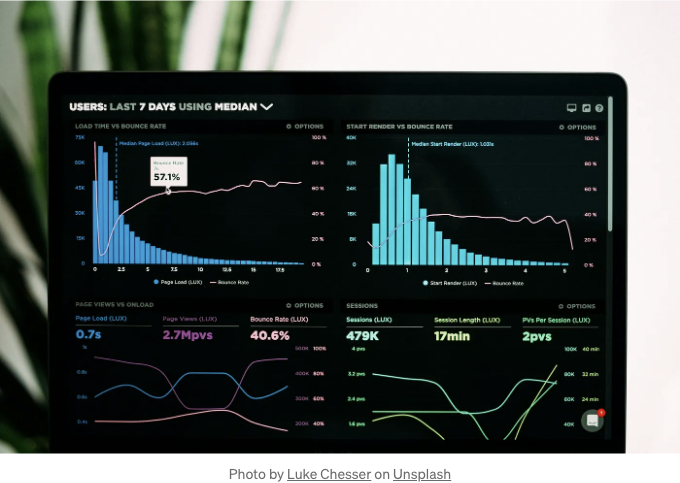

상상해봐요: 방금 졸업식 무대를 건너가고 마스터 학위(데이터 과학 및 분석)가 주머니 속에서 타는 나. 이론, 알고리즘, 그리고 데이터를 춤추게 하는 약속이 가득합니다. 그런 다음, 이 작은 아늑한 회사에서 데이터 분석가로 첫 날을 맞이하게 되었어요 — 서로 어욈을 맞추지 않는 사무실 의자와 제 나이보다 오래된 커피 머신이 있는 곳이죠.

제 상사는 하트가 따뜻하신 분이었어요. 올드 스쿨 기술의 팬이셨죠. 그는 제게 프린트 아웃을 한 무더기 줬고 웃으며 말했어요, “이 판매 데이터로부터 인사이트가 필요해요. 어서 오세요!” 예상했던 테크 천국은 아니었지만, 저는 인상을 주고 싶었어요.

그런 다음, 스프레드시트를 열었어요. 오 내 신이 그 스프레드시트를 보고 말았어요. 마치 화소가 난폭한 몬스터가 숫자를 토한 것 같았어요. 하루 종일 그것과 씨름하다 뇌가 아프더라고요. 학교에서 배운 그 모든 멋진 머신 러닝 모델들? 소용없었어요. 그것은 엑셀 지옥이었고, 저는 공식적으로 넘어지고 말았어요.

<!-- ui-log 수평형 -->
<ins class="adsbygoogle"
  style="display:block"
  data-ad-client="ca-pub-4877378276818686"
  data-ad-slot="9743150776"
  data-ad-format="auto"
  data-full-width-responsive="true"></ins>
<component is="script">
(adsbygoogle = window.adsbygoogle || []).push({});
</component>

# 작업 1: 몬스터 피벗 테이블

첫 주는 VLOOKUP 및 거대한 범위에 뻗어있는 피벗 테이블의 헝클어진 시간으로 지나갔어요. 그런데 그 악마가 나타났죠 — 기업 전략을 촉진시키는 중대한 보고서가. 엄청 복잡한 스프레드시트는 미로 같았어요 — 알아볼 수 없는 수식이 담긴 셀을 참조하는 탭들이 색상으로 표시되어 있었죠. 심지어 제 전임자조차도 완전히 이해하지 못했던 거거든요.

업데이트하는 건 악몽이었어요. 잘못된 클릭 한 번으로 전체 취약한 구조가 무너질 수 있었거든요. 지침에는 "새로 고침 버튼을 누르기 전에 숨을 참고 기도하라"는 단계조차 있었어요.

그런데, 나의 반항의 사소한 불꽃이 타오르기 시작했어요. 그 모든 판다 튜토리얼들이 무산되기엔 너무도 아까웠죠! 소심하게 빈 스크립트를 열었어요. 처음에는 시행착오의 엉망이었지만, 점점 코드들이 얽혀갔어요:

<!-- ui-log 수평형 -->
<ins class="adsbygoogle"
  style="display:block"
  data-ad-client="ca-pub-4877378276818686"
  data-ad-slot="9743150776"
  data-ad-format="auto"
  data-full-width-responsive="true"></ins>
<component is="script">
(adsbygoogle = window.adsbygoogle || []).push({});
</component>

```js
import pandas as pd

data = pd.read_excel('monster_report.xlsx')
pivot = data.pivot_table(index=['Region', 'Product'], columns='Month', values='Sales', aggfunc='sum')
pivot.to_excel('new_report.xlsx')
```

그냥… 간단히 했다 – 웃기기까지 했을 정도로 말이다. 실행을 눌렀을 때, 마음이 쿵쾅거렸다. 새로운 스프레드시트가 나타났는데, 깔끔하게 정리되어 읽기 쉬웠다. 그리고, 무엇보다도, 정확했다. 며칠이 걸렸던 일이 이제 몇 초만에 끝났다. 아마도 내 책상에서 작은 날개짓을 했을지도 모르겠다.

# 작업 2: 데이터 정제의 악몽

두 번째 작업은 고객 주소에 관련된 것이었다. 주소처럼 표준화되어야 할 것 같은 것이 있을 텐데 말이다. 그렇다고 생각했는데, 아니었다. "123 Main St," "123 Main Street," 심지어 "123 Main St. (Apt 402)"까지 있었다. 이 엉망인 상태를 정리하거나 매핑하려는 시도는 불가능했다. 나는 멍하니 되어 있었고, 내 직업 선택에 대해 의문을 품기 시작했다.```

<!-- ui-log 수평형 -->
<ins class="adsbygoogle"
  style="display:block"
  data-ad-client="ca-pub-4877378276818686"
  data-ad-slot="9743150776"
  data-ad-format="auto"
  data-full-width-responsive="true"></ins>
<component is="script">
(adsbygoogle = window.adsbygoogle || []).push({});
</component>

시간이 낭비되었어요. 대문자를 고치고 귀찮은 아파트 번호를 제거하는 데 노력을 많이 했어요. 새 데이터 일괄 처리를 받을 때마다 악몽이 다시 시작되었어요. 그러덴 어느 날 내게 깨달음이 왔어요 — 이것은 정규 표현식을 사용할 수 있는 전형적인 사례였다는 거죠!

조심스럽게 작은 함수를 만들기 시작했어요:

```python
import re

def clean_address(address):
    pattern = r'\d+\s+(?:[A-Z][a-z]+\s+)+'  # 거리 주소 부분 매칭
    match = re.search(pattern, address)
    if match:
        return match.group(0).title()  # 대문자로 변환하여 반환
    else:
        return address  # 일치 항목이 없으면 그대로 둠
```

가장 우아한 코드는 아니었지만, 작동했어요. 갑자기 몇 줄로 혼돈이 깨끗하고 일관된 열로 변신했어요. 그 느낌? 순수한 힘이었어요. 마치 지저분한 데이터의 비밀언어를 어떻게 말해야 하는지 마침내 깨달은 것 같았어요.

<!-- ui-log 수평형 -->
<ins class="adsbygoogle"
  style="display:block"
  data-ad-client="ca-pub-4877378276818686"
  data-ad-slot="9743150776"
  data-ad-format="auto"
  data-full-width-responsive="true"></ins>
<component is="script">
(adsbygoogle = window.adsbygoogle || []).push({});
</component>

# 작업 3: 시각화 고난

내 상사는 파이 차트를 좋아했어요. 안타깝게도, 그 차트들은 그를 뒤따랐어요. 화려한 색상, 와그르르한 3D 효과, 뒤틀린 피자처럼 보이는 것들, 그리고 라벨들이 너무 겹쳐서 아무것도 읽을 수 없었어요. 그 차트를 해독하는 것은 통찰력을 얻는 것보다는 시각적 공격을 버티는 것이 더 중요했어요.

나는 고전을 존중한다는 걸 잊지 말아주세요. 하지만 그 차트들은 마치 Windows 95 시대의 것처럼 보였어요. 특히 판매 추이를 지역별로 시각화해야 하는 한 보고서는 정말 복잡했어요. Excel의 차트 마법사를 잡기 위해 최선을 다했지만, 매 순간 저와 싸우더니 결과물은 혼잡하고 거의 사용하기 어렵게 만들었어요.

이제 충분해요. 나는 내 Python 튜토리얼에서 본 깔끔하고 아름다운 시각화를 기억했어요. 분명히 이보다 더 잘할 수 있을 거라고 생각했죠. Matplotlib할 때가 왔어요:

<!-- ui-log 수평형 -->
<ins class="adsbygoogle"
  style="display:block"
  data-ad-client="ca-pub-4877378276818686"
  data-ad-slot="9743150776"
  data-ad-format="auto"
  data-full-width-responsive="true"></ins>
<component is="script">
(adsbygoogle = window.adsbygoogle || []).push({});
</component>

```python
import matplotlib.pyplot as plt

regions = ['North', 'South', 'East', 'West']
sales_data = [45, 70, 55, 30] 

plt.bar(regions, sales_data)
plt.xlabel('Region')
plt.ylabel('Sales')
plt.title('Regional Sales Performance')
plt.show()
```

결과는 상쾌한 바람 같으니, 예쁜 막대 그래프가 나왔어요. 화려한 효과는 없지만 색상과 레이블이 투명해서 데이터가 명확하게 전달됐어요. 이걸 상사에게 보여주면 진정한 승리일 거 같아요...

# 상사에게 선보이는 순간

몇 주 후, 나는 용감해졌어요. 몇 가지 작은 작업을 자동화했고 호되게 엉망인 데이터셋 몇 개를 정리했어요... 작은 발걸음이지만 자신감을 쌓는 과정이었어요. 그런 다음 다음 엑셀 몬스터가 나타났고, 이게 내가 빛을 발할 순간이라고 생각했어요. 하룻밤을 안주며 나의 해결책을 신중히 코딩했지만 단지 기능에만 신경 쓴 것이 아니라 결과물을 세련되게 만들기 위해서였어요. 

<!-- ui-log 수평형 -->
<ins class="adsbygoogle"
  style="display:block"
  data-ad-client="ca-pub-4877378276818686"
  data-ad-slot="9743150776"
  data-ad-format="auto"
  data-full-width-responsive="true"></ins>
<component is="script">
(adsbygoogle = window.adsbygoogle || []).push({});
</component>

다음 날 나는 상사에게 다가가서 이렇게 말했다. "안녕하세요, 보고서를 처리하는 더 빠른 방법을 찾은 것 같아요…" 그가 "빠르다"라는 말을 듣자 눈이 살짝 멍해졌어요. 아마 새로운 스프레드시트 공식을 발명하고 있는 나를 상상했나 봐요.

"Python이라는 걸 사용하니까…" 라고 나는 그렇게 말하고 그가 치캅 웃었어요. "일단 노력에 감사드리지만, 코딩은 시간이 오래 걸려. 엑셀을 사용하면서 숙달해 가세요."

논쟁 대신에 "그냥… 보여드릴게요. 두 분만 걸릴 거예요." 라고 나는 물었어요. 마지막으로, 그는 동의해 주었어요. 나는 스크립트를 열어 실행해보고, 쾅— 깔끔한 데이터, 피벗 테이블이 거의 자동으로 구성되었고, 전문적인 차트가 화면에 나타났어요.

그의 눈썹이 슉 올라갔어요. 아니, 그는 갑자기 Python 입문자가 된 건 아니에요. 그러나 남을 무시하는 태도는 "...음, 이건 뭔가 있네요." 로 변했어요. 그 아주 작은 가능성의 빛줄기가 오늘의 승리였어요.

<!-- ui-log 수평형 -->
<ins class="adsbygoogle"
  style="display:block"
  data-ad-client="ca-pub-4877378276818686"
  data-ad-slot="9743150776"
  data-ad-format="auto"
  data-full-width-responsive="true"></ins>
<component is="script">
(adsbygoogle = window.adsbygoogle || []).push({});
</component>

# 마무리

확실하게 이야기하자면, 나는 완전히 Excel을 포기하지 않았어. 여전히 강력한 도구이며 때로는 일에 완벽한 도구일 수 있다. 그러나 파이썬은 나의 비밀 병기가 되었어. 몇 주 동안 꺼려하던 지루한 작업을 마침내 자동화할 수 있는 그 감정? 값진 거야.

모든 게 순조롭진 않았어. 전혀 그게 아니었어. 배우는 곡선은 자연스러웠지만, 코드를 디버깅하는 데 시간을 쏟고, 혼란스러운 에러 메시지와 씨름하는 시간이 많았어. 그러나 그 “아하!” 순간들이 오면, 모든 게 이해되는 걸 느껴서 계속해서 열정을 유지할 수 있었어. 그 투자는 큰 성과를 거뒀어 — 파이썬을 많이 알수록 해결할 수 있는 문제가 많아지고, 더 효율적으로 일할 수 있었어.

스프레드시트와 씁쓸함을 겪는 데이터 초보자들에게 전하고 싶은 말, 너 혼자가 아니야! 코드를 두려워하며 시작한 누군가라면 나처럼 할 수 있어. 너가 하는 일을 더 잘할 수 있게 도와주는 도구들을 찾는 거야, 때로는 그 도구가 바로 파이썬이 될 수도 있어.

<!-- ui-log 수평형 -->
<ins class="adsbygoogle"
  style="display:block"
  data-ad-client="ca-pub-4877378276818686"
  data-ad-slot="9743150776"
  data-ad-format="auto"
  data-full-width-responsive="true"></ins>
<component is="script">
(adsbygoogle = window.adsbygoogle || []).push({});
</component>

자동화에 대해 더 알고 싶다면, Travis를 만나보세요. 이는 인공지능으로 구동되는 파이썬 튜터입니다. 완전 무료이며 시작하기에 최적인 방법입니다.

그리고, 만약 내 이야기를 즐겼다면, 이 기사에 좋아요를 몇 번 눌러주세요. 그리고 더 많은 내 이야기를 읽고 싶다면 Medium에서 팔로우도 해주세요!

# 쉽게 설명하기 🚀

In Plain English 커뮤니티의 일원이 되어 주셔서 감사합니다! 떠나시기 전에:

<!-- ui-log 수평형 -->
<ins class="adsbygoogle"
  style="display:block"
  data-ad-client="ca-pub-4877378276818686"
  data-ad-slot="9743150776"
  data-ad-format="auto"
  data-full-width-responsive="true"></ins>
<component is="script">
(adsbygoogle = window.adsbygoogle || []).push({});
</component>

- 작가를 클릭하고 팔로우해주세요! 👏️️
- 팔로우하기: X | LinkedIn | YouTube | Discord | Newsletter
- 다른 플랫폼 방문: Stackademic | CoFeed | Venture | Cubed
- 더 많은 콘텐츠: PlainEnglish.io