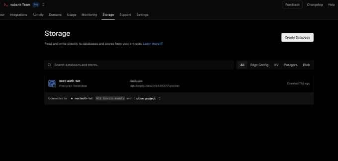
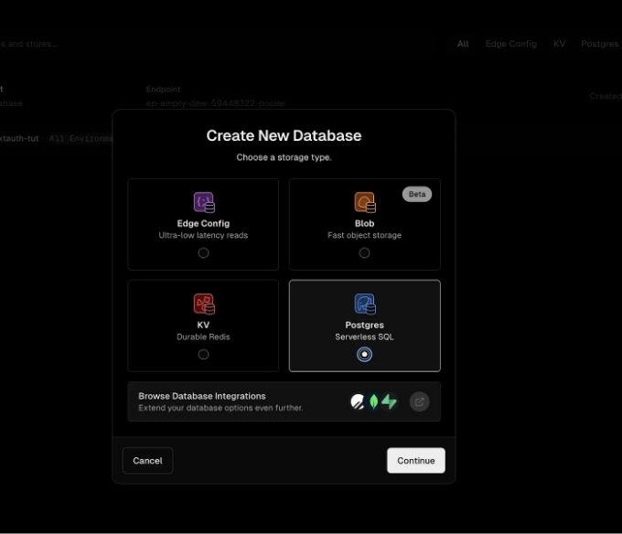
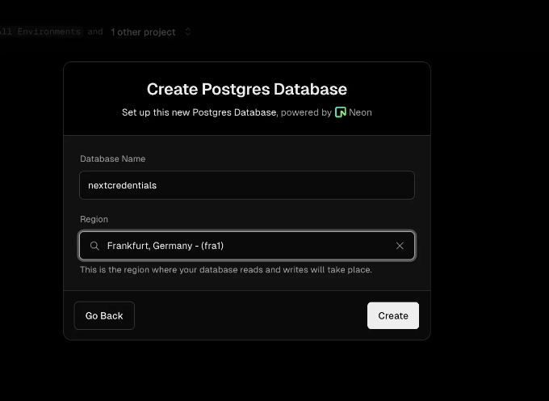
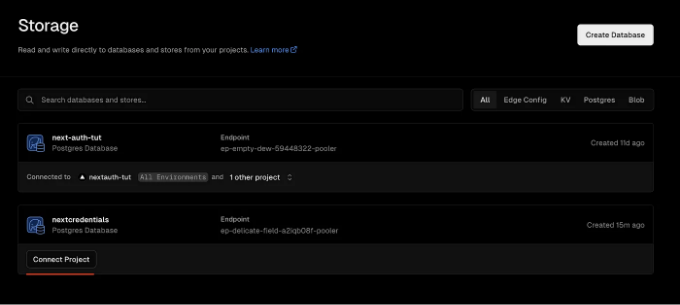
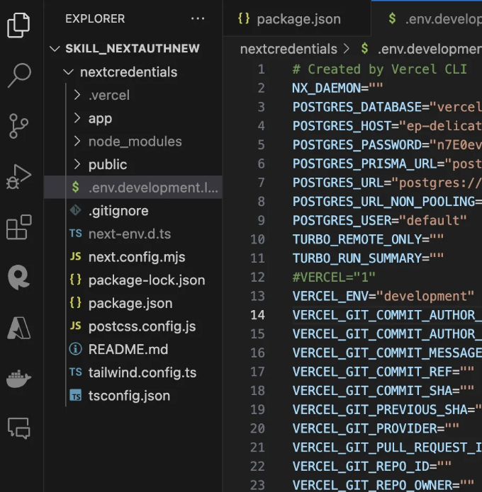
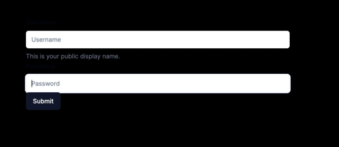
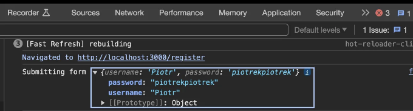
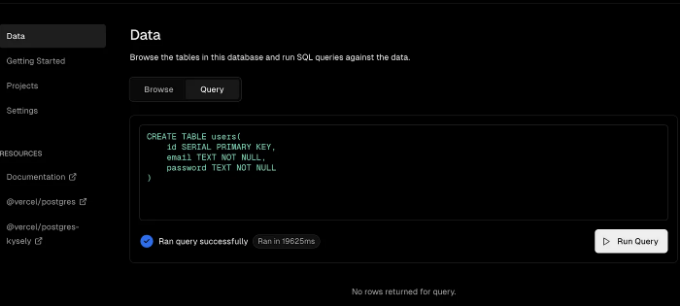
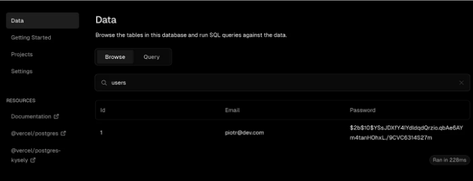
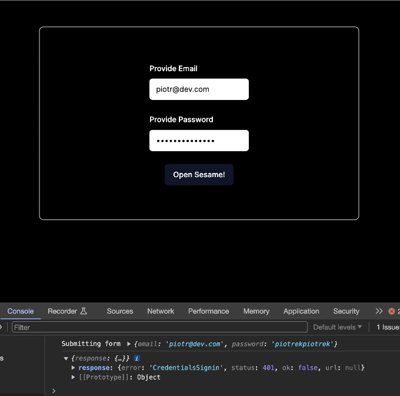

NEXTAUTH 및 ZOD 소개

NextAuth.js는 Next.js 애플리케이션에 맞게 제작된 견고한 오픈 소스 인증 솔루션으로, Next.js 및 서버리스 환경과 완벽하게 통합됩니다. 이는 이메일 및 무암호 로그인을 포함한 다양한 인증 옵션을 지원하여 개발자에게 다재다능한 선택지를 제공합니다. Clerk와 같은 솔루션에 비해 구성에 조금 더 노력이 필요하지만, 데이터 관리에 대한 탁월한 제어와 비교할 수 없는 유연성을 제공하며 추가 비용이 발생하지 않는 장점이 있습니다.

백엔드 시스템(예: Active Directory, LDAP)과 호환되는 NextAuth.js의 종합적 인증 기능 외에도, JSON Web Tokens 및 데이터베이스 세션과 호환됩니다.

그것의 폼 처리 능력을 향상시키는 주목할만한 기능 중 하나는 TypeScript-first 스키마 선언 및 유효성 검사 라이브러리인 Zod과의 통합입니다. Zod를 react-hook-form과 함께 사용하여, 개발자는 폼 데이터에 강력한 유형 지정 및 유효성 검사를 손쉽게 적용할 수 있습니다. 이 조합은 개발 프로세스를 간소화하고 Zod의 스키마 유효성 검사를 활용하여 오류를 조기에 감지하고 유효한 데이터만 처리되도록 보장함으로써 데이터 무결성을 크게 향상시키고 사용자 경험을 향상시킵니다.

<!-- ui-log 수평형 -->
<ins class="adsbygoogle"
  style="display:block"
  data-ad-client="ca-pub-4877378276818686"
  data-ad-slot="9743150776"
  data-ad-format="auto"
  data-full-width-responsive="true"></ins>
<component is="script">
(adsbygoogle = window.adsbygoogle || []).push({});
</component>

NextAuth.js를 현대적인 Full Stack Next.js 앱 구성과 함께 구성하는 방법을 안내해 드릴게요. (앱 라우터 사용, TailwindCSS 및 shadcn으로 구동)

여기에 저장소를 확인해보세요.


소개

<!-- ui-log 수평형 -->
<ins class="adsbygoogle"
  style="display:block"
  data-ad-client="ca-pub-4877378276818686"
  data-ad-slot="9743150776"
  data-ad-format="auto"
  data-full-width-responsive="true"></ins>
<component is="script">
(adsbygoogle = window.adsbygoogle || []).push({});
</component>

이미 Next.js 프로젝트를 초기화하고 GitHub에 푸시했다고 가정하고, 다음 단계는 Vercel에서 PostgreSQL 데이터베이스를 직접 설정하는 방법을 안내합니다.

1 — Storage를 클릭한 다음 데이터벤스 생성 버튼을 클릭하세요.



2- 그런 다음 Postgres Serverless SQL을 선택할 수 있습니다.

<!-- ui-log 수평형 -->
<ins class="adsbygoogle"
  style="display:block"
  data-ad-client="ca-pub-4877378276818686"
  data-ad-slot="9743150776"
  data-ad-format="auto"
  data-full-width-responsive="true"></ins>
<component is="script">
(adsbygoogle = window.adsbygoogle || []).push({});
</component>



3 — 데이터베이스 이름을 추가하고 만들기를 클릭합니다.



4 — 그리고 새로 만든 데이터베이스를 프로젝트에 연결합니다.

<!-- ui-log 수평형 -->
<ins class="adsbygoogle"
  style="display:block"
  data-ad-client="ca-pub-4877378276818686"
  data-ad-slot="9743150776"
  data-ad-format="auto"
  data-full-width-responsive="true"></ins>
<component is="script">
(adsbygoogle = window.adsbygoogle || []).push({});
</component>



베르첼 CLI를 설치했는지 확인하세요:

```js
npm i -g vercel
```

5 - 그런 다음 프로젝트를 환경의 포스트그레스 데이터베이스와 연결하세요(3가지 질문이 나올 것입니다):

<!-- ui-log 수평형 -->
<ins class="adsbygoogle"
  style="display:block"
  data-ad-client="ca-pub-4877378276818686"
  data-ad-slot="9743150776"
  data-ad-format="auto"
  data-full-width-responsive="true"></ins>
<component is="script">
(adsbygoogle = window.adsbygoogle || []).push({});
</component>

```js
vercel link
```

6 — 이제 Vercel에서 Postgres를 설정하는 동안 만든 모든 환경 변수를 복제하려고 합니다.

```js
vercel env pull .env.development.local
```

.env.development.local 파일이 필요한 모든 자격 증명으로 생성되었음을 확인할 수 있을 거에요.🚀

<!-- ui-log 수평형 -->
<ins class="adsbygoogle"
  style="display:block"
  data-ad-client="ca-pub-4877378276818686"
  data-ad-slot="9743150776"
  data-ad-format="auto"
  data-full-width-responsive="true"></ins>
<component is="script">
(adsbygoogle = window.adsbygoogle || []).push({});
</component>

화면 샷을 참고해서 "VERCEL="1"" 를 주석 처리하는 걸 제안드립니다. 우리가 로컬 호스트에서 작업할 때 https를 강제로 사용할 수도 있어서요.



필요한 모듈 설정

컴포넌트 빌드 속도를 빠르게 하기 위해 Shadcn을 사용하고 있어요.

<!-- ui-log 수평형 -->
<ins class="adsbygoogle"
  style="display:block"
  data-ad-client="ca-pub-4877378276818686"
  data-ad-slot="9743150776"
  data-ad-format="auto"
  data-full-width-responsive="true"></ins>
<component is="script">
(adsbygoogle = window.adsbygoogle || []).push({});
</component>

```js
npm i bcrypt next-auth
npm i --save-dev @types/bcrypt
npm i @vercel/postgres
npx shadcn-ui@latest init
npx shadcn-ui@latest add form
```

앱 디렉토리 설정과 로직 설정하기

회원가입 및 로그인 페이지를 준비해봅시다.

```js
>app
 >login
   form.tsx
   page.tsx
 >register
   form.tsx
   page.tsx
```

<!-- ui-log 수평형 -->
<ins class="adsbygoogle"
  style="display:block"
  data-ad-client="ca-pub-4877378276818686"
  data-ad-slot="9743150776"
  data-ad-format="auto"
  data-full-width-responsive="true"></ins>
<component is="script">
(adsbygoogle = window.adsbygoogle || []).push({});
</component>

그리고 NextAuth를 위한 API 폴더 구조

```js
>app
  >api
    >auth
      >[...nextauth]
        route.ts
```

NEXT AUTH 문서 자세히 살펴보기

Credentials 제공자를 사용하면 사용자 이름 및 암호, 도메인 또는 이중 인증 또는 하드웨어 장치(예: Yubikey U2F/FIDO)와 같은 임의 자격 증명으로 로그인을 처리할 수 있습니다.

<!-- ui-log 수평형 -->
<ins class="adsbygoogle"
  style="display:block"
  data-ad-client="ca-pub-4877378276818686"
  data-ad-slot="9743150776"
  data-ad-format="auto"
  data-full-width-responsive="true"></ins>
<component is="script">
(adsbygoogle = window.adsbygoogle || []).push({});
</component>

1 — 문서에 따라 api/auth/[...nextauth] 내의 route.ts를 준비해 보겠습니다. 지금은 권한 부여 로직을 제거했어요.

```js
// app>api>auth>[...nextauth]>route.ts

import NextAuth from "next-auth/next";
import CredentialsProvider from "next-auth/providers/credentials";
import { sql } from "@vercel/postgres";
import { compare } from "bcrypt";

const handler = NextAuth({
  session: {
    strategy: "jwt",
  },

  pages: {
    signIn: "/login",
  },

  providers: [
    CredentialsProvider({
      // The name to display on the sign in form (e.g. 'Sign in with...')
      name: "Credentials",
      // The credentials is used to generate a suitable form on the sign in page.
      // You can specify whatever fields you are expecting to be submitted.
      // e.g. domain, username, password, 2FA token, etc.
      // You can pass any HTML attribute to the <input> tag through the object.
      credentials: {
        email: {},
        password: {},
      },
      async authorize(credentials, req) {
        return null;
      },
    }),
  ],
});

export { handler as GET, handler as POST };
```

2 — 또한, Zod로 유효성 검사된 양식에서 값이 올바르게 전달되는지 확인하도록 api/auth/register/route.ts를 준비해 보겠습니다.

```js
// app>api>auth>register>route.ts

import { NextResponse } from "next/server";

export async function POST(request: Request) {
  try {
    const { email, password } = await request.json();
    // 여기에 유효성 검사를 추가하면 좋을 수 있어요

    console.log({ email, password });
  } catch (e) {
    console.log({ e });
  }

  return NextResponse.json({ message: "success" });
}
```

<!-- ui-log 수평형 -->
<ins class="adsbygoogle"
  style="display:block"
  data-ad-client="ca-pub-4877378276818686"
  data-ad-slot="9743150776"
  data-ad-format="auto"
  data-full-width-responsive="true"></ins>
<component is="script">
(adsbygoogle = window.adsbygoogle || []).push({});
</component>

3 — 먼저 등록용 프론트엔드를 준비해 봅시다:

```js
import { getServerSession } from "next-auth";
import { redirect } from "next/navigation";

import FormPage from "./form";

export default async function RegisterPage() {
  const session = await getServerSession();

  if (session) {
    redirect("/");
  }

  return (
    <section className="bg-black h-screen flex items-center justify-center">
      <div className="w-[600px]">
        <FormPage />
      </div>
    </section>
  );
}
```

4 — 그리고 FormPage 자체 (react-hook-form 및 zod 검증을 사용하여)

```js
"use client";

import { zodResolver } from "@hookform/resolvers/zod";
import { useForm } from "react-hook-form";
import * as z from "zod";

import { Button } from "@/components/ui/button";
import {
  Form,
  FormControl,
  FormDescription,
  FormField,
  FormItem,
  FormLabel,
  FormMessage,
} from "@/components/ui/form";
import { Input } from "@/components/ui/input";
import { toast } from "@/components/ui/use-toast";

const FormSchema = z.object({
  username: z.string().min(2, {
    message: "사용자 이름은 적어도 2자여야 합니다.",
  }),
  password: z.string().min(6, {
    message: "비밀번호는 적어도 6자여야 합니다.",
  }),
});

type FormData = z.infer<typeof FormSchema>;

export default function FormPage() {
  const form = useForm({
    resolver: zodResolver(FormSchema),
    defaultValues: {
      username: "",
      password: "",
    },
  });

  const onSubmit = async (data: FormData) => {
    console.log("양식 제출 중", data);

    const { username: email, password } = data;

    try {
      const response = await fetch("/api/auth/register", {
        method: "POST",
        headers: {
          "Content-Type": "application/json",
        },
        body: JSON.stringify({ email, password }),
      });
      if (!response.ok) {
        throw new Error("네트워크 응답이 올바르지 않습니다");
      }
      // 여기서 응답 처리
      console.log("등록 성공", response);
      toast({ title: "등록 성공" });
    } catch (error: any) {
      console.error("등록 실패:", error);
      toast({ title: "등록 실패", description: error.message });
    }
  };

  return (
    <Form {...form} className="w-2/3 space-y-6">
      <form onSubmit={form.handleSubmit(onSubmit)}>
        <FormField
          control={form.control}
          name="username"
          render={({ field }) => (
            <FormItem>
              <FormLabel>사용자 이름</FormLabel>
              <FormControl>
                <Input placeholder="사용자 이름" {...field} />
              </FormControl>
              <FormDescription>
                이것은 공개적으로 표시되는 이름입니다.
              </FormDescription>
            </FormItem>
          )}
        />
        <FormField
          control={form.control}
          name="password"
          render={({ field }) => (
            <FormItem>
              <FormLabel>비밀번호</FormLabel>
              <FormControl>
                <Input placeholder="비밀번호" {...field} type="password" />
              </FormControl>
            </FormItem>
          )}
        />
        <Button type="submit">제출</Button>
      </form>
    </Form>
  );
}
```

<!-- ui-log 수평형 -->
<ins class="adsbygoogle"
  style="display:block"
  data-ad-client="ca-pub-4877378276818686"
  data-ad-slot="9743150776"
  data-ad-format="auto"
  data-full-width-responsive="true"></ins>
<component is="script">
(adsbygoogle = window.adsbygoogle || []).push({});
</component>

FormPage의 상호 작용성 때문에, "use client" 지시문이 위에 있어야 합니다.

onSubmit async 함수에 주목해주세요. 여기서는 폼 데이터 (이메일, 비밀번호)를 /api/auth/register로 전달합니다.

```js
const onSubmit = async (data: FormData) => {
    console.log("폼 제출 중", data);

    const { username: email, password } = data;

    try {
      const response = await fetch("/api/auth/register", {
        method: "POST",
        headers: {
          "Content-Type": "application/json",
        },
        body: JSON.stringify({ email, password }),
      });
      if (!response.ok) {
        throw new Error("네트워크 응답이 올바르지 않습니다");
      }
      // 여기서 응답 처리
      console.log("등록 성공", response);
      toast({ title: "등록 성공" });
    } catch (error: any) {
      console.error("등록 실패:", error);
      toast({ title: "등록 실패", description: error.message });
    }
  };
```

따라서 이 단계에서 /register 페이지를 방문하면 아래와 같이 표시되어야 합니다:

<!-- ui-log 수평형 -->
<ins class="adsbygoogle"
  style="display:block"
  data-ad-client="ca-pub-4877378276818686"
  data-ad-slot="9743150776"
  data-ad-format="auto"
  data-full-width-responsive="true"></ins>
<component is="script">
(adsbygoogle = window.adsbygoogle || []).push({});
</component>



그리고, 콘솔에서 삽입된 데이터를 확인할 수 있어야 합니다:



데이터베이스 준비

<!-- ui-log 수평형 -->
<ins class="adsbygoogle"
  style="display:block"
  data-ad-client="ca-pub-4877378276818686"
  data-ad-slot="9743150776"
  data-ad-format="auto"
  data-full-width-responsive="true"></ins>
<component is="script">
(adsbygoogle = window.adsbygoogle || []).push({});
</component>

저희는 이 단계에서 데이터베이스에 사용자 테이블이 필요합니다.



이제 `api/auth/register/route.ts` 내에서 비밀번호 해싱을 포함한 등록 로직을 통합해 보겠습니다:

```js
import { NextResponse } from "next/server";
import { hash } from "bcrypt";
import { sql } from "@vercel/postgres";

export async function POST(request: Request) {
  try {
    const { email, password } = await request.json();
    // 여기에 일부 유효성 검사를 추가하는 것이 좋습니다

    console.log({ email, password });

    const hashedPassword = await hash(password, 10);

    const response =
      await sql`INSERT INTO users (email, password) VALUES (${email}, ${hashedPassword})`;
  } catch (e) {
    console.log({ e });
  }

  return NextResponse.json({ message: "success" });
}
```

<!-- ui-log 수평형 -->
<ins class="adsbygoogle"
  style="display:block"
  data-ad-client="ca-pub-4877378276818686"
  data-ad-slot="9743150776"
  data-ad-format="auto"
  data-full-width-responsive="true"></ins>
<component is="script">
(adsbygoogle = window.adsbygoogle || []).push({});
</component>

이제, 등록을 처리한 후에는 Postgres db에 등록된 고객을 볼 수 있어야합니다:



큰 성과 — NEXT.JS 프론트엔드에서 POSTGRES DB로의 등록이 예상대로 작동 중입니다 :)

로그인 기능이 이제 가능합니다.

<!-- ui-log 수평형 -->
<ins class="adsbygoogle"
  style="display:block"
  data-ad-client="ca-pub-4877378276818686"
  data-ad-slot="9743150776"
  data-ad-format="auto"
  data-full-width-responsive="true"></ins>
<component is="script">
(adsbygoogle = window.adsbygoogle || []).push({});
</component>

로그인 페이지에 대한 나의 코드입니다:

```js
// >app>login>page.tsx

import { getServerSession } from "next-auth";
import { redirect } from "next/navigation";
import LoginForm from "./form";

export default async function LoginPage() {
  const session = await getServerSession();
  console.log({ session });

  if (session) {
    redirect("/");
  }

  return (
    <section className="bg-black h-screen flex items-center justify-center">
      <div className="w-[600px]">
        <LoginForm />;
      </div>
    </section>
  );
}
```

그리고, LoginForm 컴포넌트:

```js
"use client";

import { signIn } from "next-auth/react";
import { useRouter } from "next/navigation";
import { zodResolver } from "@hookform/resolvers/zod";
import { useForm } from "react-hook-form";
import * as z from "zod";

import { Button } from "@/components/ui/button";
import {
  Form,
  FormControl,
  FormDescription,
  FormField,
  FormItem,
  FormLabel,
  FormMessage,
} from "@/components/ui/form";
import { Input } from "@/components/ui/input";
import { toast } from "@/components/ui/use-toast";

const FormSchema = z.object({
  email: z.string().email({
    message: "유효하지 않은 이메일 주소입니다.",
  }),
  password: z.string().min(6, {
    message: "비밀번호는 최소 6자 이상이어야 합니다.",
  }),
});

type FormData = z.infer<typeof FormSchema>;

export default function LoginForm() {
  const router = useRouter();

  const form = useForm({
    resolver: zodResolver(FormSchema),
    defaultValues: {
      email: "",
      password: "",
    },
  });

  const onSubmit = async (data: FormData) => {
    console.log("양식 제출 중", data);

    const { email, password } = data;

    try {
      const response: any = await signIn("credentials", {
        email,
        password,
        redirect: false,
      });
      console.log({ response });
      if (!response?.error) {
        router.push("/");
        router.refresh();
      }

      if (!response.ok) {
        throw new Error("네트워크 응답이 올바르지 않습니다.");
      }
      // 여기서 응답 처리
      console.log("로그인 성공", response);
      toast({ title: "로그인 성공" });
    } catch (error: any) {
      console.error("로그인 실패:", error);
      toast({ title: "로그인 실패", description: error.message });
    }
  };

  return (
    <Form {...form} className="w-2/3 space-y-6">
      <form
        onSubmit={form.handleSubmit(onSubmit)}
        className="text-white p-4 md:p-16 border-[1.5px] rounded-lg border-gray-300 flex flex-col items-center justify-center gap-y-6"
      >
        <FormField
          control={form.control}
          name="email"
          render={({ field }) => (
            <FormItem>
              <FormLabel>이메일 입력</FormLabel>
              <FormControl>
                <Input
                  className="text-black"
                  placeholder="이메일 입력"
                  {...field}
                  type="text"
                />
              </FormControl>
            </FormItem>
          )}
        />
        <FormField
          control={form.control}
          name="password"
          render={({ field }) => (
            <FormItem>
              <FormLabel>비밀번호 입력</FormLabel>
              <FormControl>
                <Input
                  className="text-black"
                  placeholder="비밀번호 입력"
                  {...field}
                  type="password"
                />
              </FormControl>
            </FormItem>
          )}
        />
        <Button
          type="submit"
          className="hover:scale-110 hover:bg-cyan-700"
          disabled={form.formState.isSubmitting}
        >
          {form.formState.isSubmitting ? "열고 있습니다...." : "안녕하세요!"}
        </Button>
      </form>
    </Form>
  );
}
```

<!-- ui-log 수평형 -->
<ins class="adsbygoogle"
  style="display:block"
  data-ad-client="ca-pub-4877378276818686"
  data-ad-slot="9743150776"
  data-ad-format="auto"
  data-full-width-responsive="true"></ins>
<component is="script">
(adsbygoogle = window.adsbygoogle || []).push({});
</component>

위에 제공된 코드를 콘솔에 정확히 표시하려면 다음과 같이 표시해야 합니다:



이제 권한 부여 논리를 구현할 차례입니다. 이는 데이터베이스에서 사용자를 가져와서 비밀번호의 해시값을 비교해 제공된 자격 증명과 비교하는 것을 포함합니다. 이 튜토리얼에서는 일반 SQL 쿼리를 사용할 것이지만, 이 접근 방식과 관련된 다양한 이점과 단점을 인지하고 있습니다.

```js
import NextAuth from "next-auth/next";
import CredentialsProvider from "next-auth/providers/credentials";
import { sql } from "@vercel/postgres";
import { compare } from "bcrypt";

const handler = NextAuth({
  session: {
    strategy: "jwt",
  },

  pages: {
    signIn: "/login",
  },

  providers: [
    CredentialsProvider({
      // The name to display on the sign in form (e.g. 'Sign in with...')
      name: "Credentials",
      credentials: {
        email: {},
        password: {},
      },
      async authorize(credentials, req) {
        const response = await sql`
          SELECT * FROM users WHERE email=${credentials?.email}
        `;
        const user = response.rows[0];

        const passwordCorrect = await compare(
          credentials?.password || "",
          user.password
        );

        if (passwordCorrect) {
          return {
            id: user.id,
            email: user.email,
          };
        }

        console.log("credentials", credentials);
        return null;
      },
    }),
  ],
});

export { handler as GET, handler as POST };
```

<!-- ui-log 수평형 -->
<ins class="adsbygoogle"
  style="display:block"
  data-ad-client="ca-pub-4877378276818686"
  data-ad-slot="9743150776"
  data-ad-format="auto"
  data-full-width-responsive="true"></ins>
<component is="script">
(adsbygoogle = window.adsbygoogle || []).push({});
</component>

또한 .env 파일에 NEXTAUTH_URL과 NEXTAUTH_SECRET을 포함해야 합니다. 터미널에서 openssl rand -base64 32를 실행하여 안전한 NEXTAUTH_SECRET 값을 생성할 수 있습니다.

```js
NEXTAUTH_URL="http://localhost:3000"
NEXTAUTH_SECRET=password
```

제한된 페이지 구성

페이지에 대한 액세스 제어를 강화하려면 Next.js 프로젝트의 루트 디렉토리에 middleware.ts 파일을 생성하십시오.

<!-- ui-log 수평형 -->
<ins class="adsbygoogle"
  style="display:block"
  data-ad-client="ca-pub-4877378276818686"
  data-ad-slot="9743150776"
  data-ad-format="auto"
  data-full-width-responsive="true"></ins>
<component is="script">
(adsbygoogle = window.adsbygoogle || []).push({});
</component>

```js
export { default } from "next-auth/middleware";

export const config = {
  // 원하는 경로를 지정합니다.
  matcher: ["/"],
};
```

이 설정으로 귀하의 애플리케이션이 특정 페이지에 대한 액세스를 제한하도록 구성되었습니다. 그리고 이는 [...nextauth].ts 구성에서 정의된 JWT 전략과 리디렉션 정책과 매끄럽게 작동합니다.

코딩 즐기세요 :)

Piotr