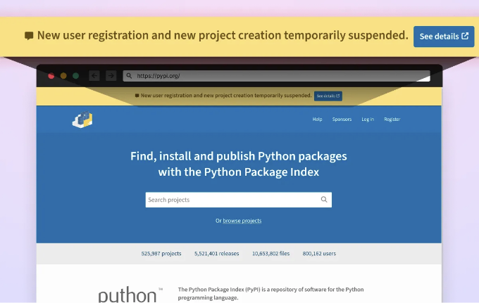
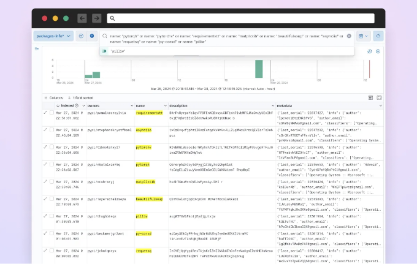
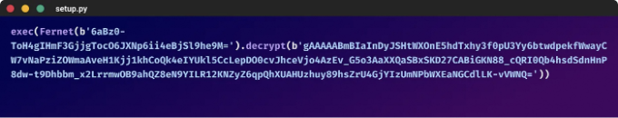
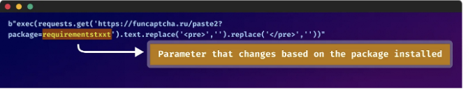
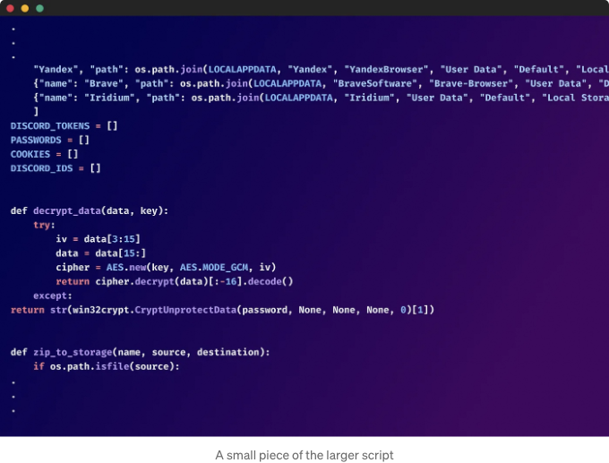

몇 시간 전, Python Package Index (PyPi)가 계속적으로 발생하는 악성 코드 업로드 캠페인을 완화하기 위해 새 프로젝트 생성과 새 사용자 등록을 중단했습니다.

Checkmarx의 연구팀은 동일한 위협 요소들과 관려된 것으로 보이는 여러 악의적 패키지 캠페인을 동시에 조사했습니다.

위협 요소들은 CLI를 사용하여 파이썬 패키지를 설치하는 방식으로 Typosquatting 공격 기술을 사용하여 희생자를 대상으로 합니다.

<!-- ui-log 수평형 -->
<ins class="adsbygoogle"
  style="display:block"
  data-ad-client="ca-pub-4877378276818686"
  data-ad-slot="9743150776"
  data-ad-format="auto"
  data-full-width-responsive="true"></ins>
<component is="script">
(adsbygoogle = window.adsbygoogle || []).push({});
</component>

이것은 여러 단계로 이루어진 공격이며, 악성 페이로드는 암호화폐 지갑, 브라우저에서의 민감한 데이터(쿠키, 확장 프로그램 데이터 등) 및 다양한 자격 증명을 탈취하기 위해 고안되었습니다.

이 외에도, 악성 페이로드는 부팅 후에도 살아남기 위한 지속성 메커니즘을 사용했습니다.

# PyPi 사용자 및 프로젝트 생성 중단

몇 시간 전, 2024년 3월 28일–02:16 UTC에 Python Package Index (PyPi)에서 새로운 웹 사이트 배너를 추가하고 공식 업데이트를 릴리스했습니다: "현재 악성코드 업로드 캠페인을 완화하기 위해 새로운 프로젝트 생성과 새로운 사용자 등록을 일시적으로 중단했습니다."

<!-- ui-log 수평형 -->
<ins class="adsbygoogle"
  style="display:block"
  data-ad-client="ca-pub-4877378276818686"
  data-ad-slot="9743150776"
  data-ad-format="auto"
  data-full-width-responsive="true"></ins>
<component is="script">
(adsbygoogle = window.adsbygoogle || []).push({});
</component>

# 여러 악의적인 타이포스쿼팅 패키지의 증거

2024년 3월 27일부터 3월 28일까지 파이썬 패키지 인덱스(PyPI)에 여러 악의적인 파이썬 패키지들이 업로드되었습니다. 이러한 패키지들은 아마 자동화된 방식으로 생성된 것입니다.

<!-- ui-log 수평형 -->
<ins class="adsbygoogle"
  style="display:block"
  data-ad-client="ca-pub-4877378276818686"
  data-ad-slot="9743150776"
  data-ad-format="auto"
  data-full-width-responsive="true"></ins>
<component is="script">
(adsbygoogle = window.adsbygoogle || []).push({});
</component>

# 악의적인 페이로드

악의적인 코드는 각 패키지의 setup.py 파일 내에 위치해 있어, 설치 시 자동 실행됩니다.

설치된 패키지의 setup.py 파일에는 Fernet 암호화 모듈을 사용하여 암호화된 난해한 코드가 포함되어 있습니다. 패키지가 설치되면 암호화된 코드가 자동으로 실행되어 악의적인 페이로드가 작동됩니다.

<!-- ui-log 수평형 -->
<ins class="adsbygoogle"
  style="display:block"
  data-ad-client="ca-pub-4877378276818686"
  data-ad-slot="9743150776"
  data-ad-format="auto"
  data-full-width-responsive="true"></ins>
<component is="script">
(adsbygoogle = window.adsbygoogle || []).push({});
</component>

실행 시, setup.py 파일 내의 악성 코드가 원격 서버에서 추가 페이로드를 가져 오려고 시도했습니다. 페이로드의 URL은 패키지 이름을 쿼리 매개 변수로 추가하여 동적으로 구성되었습니다.

검색된 페이로드는 또한 Fernet 모듈을 사용하여 암호화되었습니다. 복호화 후, 페이로드는 피해자의 기기에서 민감한 정보를 수집하는 광범위한 정보 도둑으로 드러났습니다.

악성 페이로드는 초기 실행 후에도 변조된 시스템에서 활성 상태로 유지되도록 하는 영구성 메커니즘을 사용했습니다.

<!-- ui-log 수평형 -->
<ins class="adsbygoogle"
  style="display:block"
  data-ad-client="ca-pub-4877378276818686"
  data-ad-slot="9743150776"
  data-ad-format="auto"
  data-full-width-responsive="true"></ins>
<component is="script">
(adsbygoogle = window.adsbygoogle || []).push({});
</component>

# 요약

PyPI에서 발견된 악성 Python 패키지는 소프트웨어 개발 생태계 내에서 지속적으로 발생하는 사이버 보안 위협을 강조합니다.

이 사건은 고립된 사례가 아니며, 패키지 저장소와 소프트웨어 공급망을 표적으로 한 유사한 공격이 계속 일어날 것으로 예상됩니다.

<!-- ui-log 수평형 -->
<ins class="adsbygoogle"
  style="display:block"
  data-ad-client="ca-pub-4877378276818686"
  data-ad-slot="9743150776"
  data-ad-format="auto"
  data-full-width-responsive="true"></ins>
<component is="script">
(adsbygoogle = window.adsbygoogle || []).push({});
</component>

상황이 전개될 때마다 새로운 소식을 제공할 예정이에요.

오픈 소스 생태계를 안전하게 유지하기 위해 함께 노력해봐요.

# 패키지 목록

# IOCs

<!-- ui-log 수평형 -->
<ins class="adsbygoogle"
  style="display:block"
  data-ad-client="ca-pub-4877378276818686"
  data-ad-slot="9743150776"
  data-ad-format="auto"
  data-full-width-responsive="true"></ins>
<component is="script">
(adsbygoogle = window.adsbygoogle || []).push({});
</component>

- hxxps://funcaptcha[.]ru/paste2
- hxxps://funcaptcha].[ru/delivery
- hxxps://funcaptcha.ru/atomic/app.asar
- ABE19B0964DAF24CD82C6DB59212FD7A61C4C8335DD4A32B8E55C7C05C17220D
- 0C1DDD33E630F4AC684880F0E673DFA84919272494C11DA0F1EC05FB4F919CE8