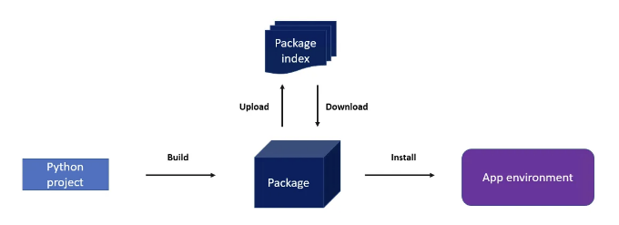

# 파이썬 애플리케이션 패키징

파이썬에서 프로젝트를 패키징하면 코드를 다른 사람들과 공유하기가 간단해지며 프로젝트를 파이썬 환경에서 일등 시민으로 만들어줍니다. 패키지에 메타데이터를 캡슐화하여 최소한의 파이썬 버전과 의존하는 서드파티 패키지를 정의합니다.

이를 통해 설치 프로그램은 환경의 호환성을 검증하고 빠진 프로젝트 의존성을 쉽게 설치하며 요구 사항을 충족하지 못하는 것을 업데이트할 수 있습니다. 결과적으로 설치된 패키지는 해당 환경에 명확한 연결을 유지합니다. 이에 반해 작업 디렉토리에서 실행되는 스크립트는 오래된 파이썬 버전이나 필수 종속성이 부족한 환경에서 작동할 수 있습니다.

<!-- ui-log 수평형 -->
<ins class="adsbygoogle"
  style="display:block"
  data-ad-client="ca-pub-4877378276818686"
  data-ad-slot="9743150776"
  data-ad-format="auto"
  data-full-width-responsive="true"></ins>
<component is="script">
(adsbygoogle = window.adsbygoogle || []).push({});
</component>



위의 그림에서 보듯이, 이 과정은 Python 프로젝트로 시작됩니다. 단계는 프로젝트에서 패키지를 빌드하여 프로젝트 개발의 특정 시점을 나타내는 설치 가능한 artifact를 만드는 것을 포함합니다. 그런 다음 작성자는 이 패키지를 패키지 인덱스(또는 패키지 저장소로도 알려짐)에 업로드합니다.

패키지 인덱스는 소프트웨어 패키지를 위한 전문 파일 서버 역할을 하며, 사용자들이 이름과 버전에 따라 패키지를 검색할 수 있도록 합니다. 다운로드한 후에 사용자는 패키지를 자신의 환경에 설치할 수 있습니다. 실제 시나리오에서는 도구가 종종 다운로드 및 설치, 빌드 및 설치, 또는 빌드 및 게시와 같은 여러 단계를 단일 명령으로 병합합니다.

# 간단한 Python 어플리케이션

<!-- ui-log 수평형 -->
<ins class="adsbygoogle"
  style="display:block"
  data-ad-client="ca-pub-4877378276818686"
  data-ad-slot="9743150776"
  data-ad-format="auto"
  data-full-width-responsive="true"></ins>
<component is="script">
(adsbygoogle = window.adsbygoogle || []).push({});
</component>

여기 간단한 Python 스크립트가 있어요. 이 스크립트는 사용자에게 삼각형의 밑변과 높이를 입력하도록 요청한 후, 면적을 계산하고 출력해줍니다:

```js
def calculate_triangle_area(base, height):
    return 0.5 * base * height

def main():
    base = float(input("삼각형의 밑변을 입력하세요: "))
    height = float(input("삼각형의 높이를 입력하세요: "))

    area = calculate_triangle_area(base, height)

    print(f"삼각형의 면적은 {area} 제곱 단위입니다.")

if __name__ == "__main__":
    main()
```

이 스크립트에서 calculate_triangle_area 함수는 삼각형의 밑변과 높이를 받아서 0.5 * 밑변 * 높이 공식을 사용해 면적을 계산합니다. main 함수는 사용자에게 삼각형의 밑변과 높이를 입력하도록 요청하고, calculate_triangle_area를 호출하여 면적을 계산한 후 결과를 출력합니다. 이 스크립트를 실행하면, 삼각형의 밑변과 높이를 입력하라는 메시지가 나타나며, 그 후 면적이 출력됩니다.

이 스크립트를 area_calculation.py 파일에 저장하고 실행해보세요. 아래는 샘플 실행 결과입니다:

<!-- ui-log 수평형 -->
<ins class="adsbygoogle"
  style="display:block"
  data-ad-client="ca-pub-4877378276818686"
  data-ad-slot="9743150776"
  data-ad-format="auto"
  data-full-width-responsive="true"></ins>
<component is="script">
(adsbygoogle = window.adsbygoogle || []).push({});
</component>

```js
$ python area_calculation.py 
삼각형의 밑변을 입력하십시오: 3
삼각형의 높이를 입력하십시오: 4
삼각형의 넓이는 6.0 제곱 단위입니다.
```

# Python 파일을 패키징하는 이유

위 예제에서 보여준 방식으로 스크립트를 배포하는 경우 패키징이 필요하지 않습니다. 이를 블로그, 호스팅된 저장소, 또는 이메일이나 채팅과 같은 직접 공유 방법을 통해 전파할 수 있습니다. 그러나 Python 애플리케이션을 패키징하지 않으면 다음과 같은 여러 가지 문제점이 발생할 수 있습니다:

- 의존성 문제: 패키징하지 않으면 의존성을 관리하는 것이 수동적이고 오류를 발생하기 쉬운 과정이 될 수 있습니다. 사용자들은 모든 의존성의 올바른 버전을 수동으로 설치해야 하며, 복잡한 애플리케이션의 경우 이는 실용적이지 않을 수 있습니다.
- 배포 및 설치 장벽: 패키지 없이 코드를 배포하고 다른 사람이 설치하고 실행할 수 있도록 하는 것은 번거로운 과정일 수 있습니다. 사용자들은 파일을 수동으로 올바른 위치에 복사하거나 환경 변수를 설정해야 할 수 있습니다.
- 버전 관리 문제: 코드를 시간이 지남에 따라 변경하면 사용자들은 그들의 시스템이나 다른 패키지와 함께 작동하는 코드 버전이 어떤 것인지 알아내는 데 어려움을 겪을 수 있습니다. 패키징하지 않으면 코드에 버전을 부여하는 표준적인 방법이 없습니다.
- 업데이트 문제: 사용자는 프로젝트 버전이 최신 버전인지 확인하고 필요에 따라 최신 버전으로 업그레이드할 수 있어야 합니다. 만들어 낸 사람으로서 사용자가 새로운 기능, 버그 수정 및 향상된 기능을 활용할 수 있도록 하는 메커니즘을 제공하는 것이 중요합니다.

<!-- ui-log 수평형 -->
<ins class="adsbygoogle"
  style="display:block"
  data-ad-client="ca-pub-4877378276818686"
  data-ad-slot="9743150776"
  data-ad-format="auto"
  data-full-width-responsive="true"></ins>
<component is="script">
(adsbygoogle = window.adsbygoogle || []).push({});
</component>

효과적인 패키징은 이러한 도전과 빠르게 프로젝트에 통합할 수 있습니다. 프로젝트에 pyproject.toml이라는 선언적 파일을 추가하여 표준화된 형식으로 프로젝트 메타데이터와 빌드 시스템을 정의할 수 있습니다. 결과적으로, 빌드, 게시, 설치, 업그레이드 및 제거와 같은 명령을 사용하여 패키지를 쉽게 관리할 수 있습니다.

## pyproject.toml

pyproject.toml은 파이썬 프로젝트를 빌드하기 위한 PEP 518에서 정의된 구성 파일입니다. 파이썬 소프트웨어 패키지의 빌드 시스템 및 요구 사항을 지정합니다. pyproject.toml 파일은 프로젝트의 루트 디렉토리에 위치합니다. 이전의 Python 패키징 접근 방식에서 사용되던 setup.py, setup.cfg, requirements.txt 및 MANIFEST.in 파일을 대체합니다.

## 최소한의 pyproject.toml 파일

<!-- ui-log 수평형 -->
<ins class="adsbygoogle"
  style="display:block"
  data-ad-client="ca-pub-4877378276818686"
  data-ad-slot="9743150776"
  data-ad-format="auto"
  data-full-width-responsive="true"></ins>
<component is="script">
(adsbygoogle = window.adsbygoogle || []).push({});
</component>

아래는 Python 프로젝트용 기본 구성 파일입니다. 핵심 프로젝트 세부 정보와 빌드 시스템 요구 사항이 명시되어 있습니다.

```js
[project]
name = "area-calculation"
version = "0.1"

[build-system]
requires = ["hatchling"]
build-backend = "hatchling.build"
```

파일의 세부 내용은 다음과 같습니다:

- [project]: 이 섹션은 프로젝트별 정보를 설명합니다.
- name: 프로젝트의 이름을 지정합니다. 이 경우 "random-wikipedia-article"입니다.
- version: 프로젝트의 버전을 나타냅니다. 여기서는 "0.1"입니다.
- [build-system]: 이 섹션은 프로젝트의 빌드 시스템을 구성합니다.
- requires: 프로젝트를 빌드하는 데 필요한 Python 패키지 목록입니다. 이 경우 "hatchling" 패키지가 필요합니다.
- build-backend: 이는 빌드 시스템의 백엔드를 지정합니다. 여기서는 "hatchling.build"입니다. 빌드 백엔드는 패키지를 빌드하는 데 사용될 Python 객체를 지정합니다. hatchling.build는 특히 PEP 517을 준수하는 Python 모듈 또는 Python 모듈 내의 호출 가능한 함수일 것으로 예상됩니다. PEP 517는 빌드 시스템이 작동해야 하는 방식을 정의합니다.

<!-- ui-log 수평형 -->
<ins class="adsbygoogle"
  style="display:block"
  data-ad-client="ca-pub-4877378276818686"
  data-ad-slot="9743150776"
  data-ad-format="auto"
  data-full-width-responsive="true"></ins>
<component is="script">
(adsbygoogle = window.adsbygoogle || []).push({});
</component>

# pyproject.toml이 어떻게 작동하는지요?

우선 pip을 사용하여 설치해 봅시다:

```js
$ pip install .
인덱스 내에서 확인 중: xxx
처리 중 /xxx/test-pyproject
  빌드 종속성 설치 중 ... 완료
  휠 빌드를 위한 요구 사항 가져오는 중 ... 완료
  메타데이터 준비 (pyproject.toml) ... 완료
수집된 패키지에 대한 휠을 빌드 중: area-calculation
  area-calculation에 대한 휠 빌드 완료 (pyproject.toml) ... 완료
  area-calculation을 위한 휠 생성: 파일이름=area_calculation-0.1-py2.py3-none-any.whl 크기=1118 sha256=1f519d2808a0862f9e71b4e68548ff3be930b209495f7460a19d986215a681e3
  디렉터리에 저장됨: /xxx/.cache/pip/wheels/77/ee/ad/cf8892b4ddb854758180f367f9e804594a24c4b2ea547d69dc
area-calculation 성공적으로 빌드됨
수집된 패키지 설치 중: area-calculation
  설치 시도: area-calculation
    기존 설치된 버전 발견: area-calculation 0.1
    area-calculation-0.1 제거 시도 중:
      area-calculation-0.1 성공적으로 제거됨
area-calculation-0.1 성공적으로 설치됨.
```

이제 Python 모듈에서 스크립트를 직접 호출할 수 있습니다. 스크립트는 Python 모듈에서 주 함수를 호출합니다.

<!-- ui-log 수평형 -->
<ins class="adsbygoogle"
  style="display:block"
  data-ad-client="ca-pub-4877378276818686"
  data-ad-slot="9743150776"
  data-ad-format="auto"
  data-full-width-responsive="true"></ins>
<component is="script">
(adsbygoogle = window.adsbygoogle || []).push({});
</component>

```js
$ python -m area_calculation
삼각형의 밑변을 입력하세요: 4
삼각형의 높이를 입력하세요: 6
삼각형의 넓이는 12.0 제곱 단위입니다.
```

## 진입점 스크립트

pyproject.toml 파일에서 진입점 스크립트는 일반적으로 패키지가 설치될 때 생성되는 콘솔 스크립트의 명세를 나타냅니다. 이 명령어는 콘솔에서 실행할 수 있는 명령어로, 코드 내 Python 함수를 실행합니다. 대부분의 경우, pyproject.toml 파일에서 [tool..scripts] 섹션 아래에 이러한 진입점을 정의합니다. 여기서는 flit 또는 poetry와 같은 빌드 시스템을 사용하는 것을 가정합니다.

예시: 

<!-- ui-log 수평형 -->
<ins class="adsbygoogle"
  style="display:block"
  data-ad-client="ca-pub-4877378276818686"
  data-ad-slot="9743150776"
  data-ad-format="auto"
  data-full-width-responsive="true"></ins>
<component is="script">
(adsbygoogle = window.adsbygoogle || []).push({});
</component>

```js
[프로젝트]
이름 = "area-calculation"
버전 = "0.1"

[프로젝트.스크립트]
area-calculation = "area_calculation:main"

[빌드-시스템]
필요 = ["hatchling"]
빌드-백엔드 = "hatchling.build"
```

이제 pipx를 사용하여 프로젝트를 가상 환경에 설치하고 스크립트를 PATH에 배치하는 프로세스를 간소화하겠습니다.

```js
$ pipx install .
  설치된 패키지 area-calculation 0.1, Python 3.11.6로 설치됨
  이제 이러한 앱들이 전역적으로 사용 가능합니다
    - area-calculation
완료!
```

이제 스크립트를 직접 호출할 수 있습니다:

<!-- ui-log 수평형 -->
<ins class="adsbygoogle"
  style="display:block"
  data-ad-client="ca-pub-4877378276818686"
  data-ad-slot="9743150776"
  data-ad-format="auto"
  data-full-width-responsive="true"></ins>
<component is="script">
(adsbygoogle = window.adsbygoogle || []).push({});
</component>

```js
$ area-calculation 
삼각형의 밑변을 입력하세요: 4
삼각형의 높이를 입력하세요: 5
삼각형의 넓이는 10.0 제곱 단위입니다.
```

# "—editable" 매개변수 사용하기

--editable 옵션은 pipx에서 -e 또는 --editable 옵션에 해당합니다. 이 옵션은 프로젝트를 ‘편집 가능’ 모드로 설치합니다. ‘편집 가능’ 모드에서는 프로젝트가 소스 코드 디렉토리에 직접 연결되므로 소스 코드를 변경하면 패키지를 다시 설치하지 않고도 즉시 적용할 수 있습니다.

```js
$ pipx install --editable .
```

<!-- ui-log 수평형 -->
<ins class="adsbygoogle"
  style="display:block"
  data-ad-client="ca-pub-4877378276818686"
  data-ad-slot="9743150776"
  data-ad-format="auto"
  data-full-width-responsive="true"></ins>
<component is="script">
(adsbygoogle = window.adsbygoogle || []).push({});
</component>

이제 main 함수에 print("편집 모드")를 추가하고 다시 실행해보세요:

```js
$ area-calculation 
삼각형의 밑변을 입력하세요: 4
삼각형의 높이를 입력하세요: 4
삼각형의 면적은 8.0 제곱 단위입니다.
편집 모드
```

# 패키지 빌드

코드를 다른 시스템에 배포하거나 프로젝트를 공개적으로 사용할 준비가 되었으면, pip가 암시적으로 처리하는 대신 패키지 생성 프로세스를 제어해야 합니다. 여기서 build가 필요해요. Build는 파이썬 프로젝트용 패키지를 제작하는 구체적인 빌드 프런트엔드입니다.

<!-- ui-log 수평형 -->
<ins class="adsbygoogle"
  style="display:block"
  data-ad-client="ca-pub-4877378276818686"
  data-ad-slot="9743150776"
  data-ad-format="auto"
  data-full-width-responsive="true"></ins>
<component is="script">
(adsbygoogle = window.adsbygoogle || []).push({});
</component>

동일한 pyproject.toml 파일을 사용하여 다음과 같이 빌드할 수 있어요:

```js
$ pipx run build
* 독립된 가상 환경(venv) 생성 중...
* 독립된 환경(hatchling)에서 패키지 설치 중...
* sdist를 위한 빌드 종속성 가져오는 중...
* sdist 빌드 중...
* sdist로부터 wheel 빌드 중
* 독립된 가상 환경(venv) 생성 중...
* 독립된 환경(hatchling)에서 패키지 설치 중...
* wheel을 위한 빌드 종속성 가져오는 중...
* wheel 빌드 중...
area_calculation-0.1.tar.gz 및 area_calculation-0.1-py2.py3-none-any.whl이 성공적으로 빌드되었어요.
```

위 예제에서는 프로젝트의 빌드 백엔드로 hatchling을 지정했어요. 위 출력에서 볼 수 있듯이 빌드는 hatchling을 사용하여 실제 패키지 빌드를 수행했어요.
이제 동일한 디렉토리에 dist 폴더와 두 개의 파일이 보일 거예요:

```js
$ ls
__pycache__  area_calculation.py  dist  pyproject.toml

$ tree dist
dist
├── area_calculation-0.1-py2.py3-none-any.whl
└── area_calculation-0.1.tar.gz

0 directories, 2 files
```

<!-- ui-log 수평형 -->
<ins class="adsbygoogle"
  style="display:block"
  data-ad-client="ca-pub-4877378276818686"
  data-ad-slot="9743150776"
  data-ad-format="auto"
  data-full-width-responsive="true"></ins>
<component is="script">
(adsbygoogle = window.adsbygoogle || []).push({});
</component>

이러한 품목들은 휠(wheels)과 소스 디스트(sdist)로 알려져 있습니다. 휠은 .whl 확장자를 가진 ZIP 아카이브이며, 소스 디스트는 gzip 압축이 적용된 tar 아카이브입니다 (.tar.gz). 휠은 빌드된 배포판입니다. 대부분의 경우, 설치 프로그램이 그들을 환경으로 푸는 것만으로 설치됩니다. 반면에 소스 디스트는 소스 배포판입니다. 설치 가능한 휠을 생성하기 위해 추가 빌드 단계가 필요합니다.

# 결론

Python 패키징은 코드 배포, 버전 관리 및 종속성 관리에서 핵심적인 역할을 합니다. 이는 다른 개발자들이 귀하의 코드를 활용하고 발전시킬 수 있도록 하는 데 도움이 됩니다.

pyproject.toml과 hatchling과 같은 빌드 시스템과 같은 도구를 사용하면 파이썬 프로젝트의 패키징 및 배포 작업을 더욱 원활하게 진행할 수 있습니다. 패키징은 라이브러리 및 프레임워크를 배포하는 데 도움이 되는 것뿐만 아니라 명령줄 도구 및 응용프로그램을 배포하는 데도 도움이 됩니다.

<!-- ui-log 수평형 -->
<ins class="adsbygoogle"
  style="display:block"
  data-ad-client="ca-pub-4877378276818686"
  data-ad-slot="9743150776"
  data-ad-format="auto"
  data-full-width-responsive="true"></ins>
<component is="script">
(adsbygoogle = window.adsbygoogle || []).push({});
</component>

독립 실행 스크립트를 공유하는 것은 특정 상황에서 간단해 보일 수 있지만, 패키징은 의존성 관리, 버전 관리, 설치 편의성과 같은 다양한 장점을 제공하여 Python 프로젝트의 표준으로 자리 잡고 있습니다.