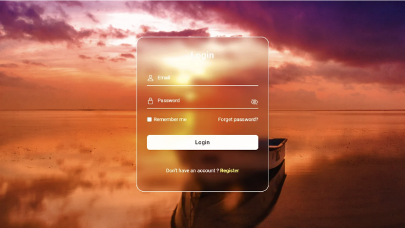

안녕하세요 독자 여러분, 이 글에서는 HTML 및 CSS 및 JavaScript를 사용하여 반응형 애니메이션 로그인 폼을 만드는 방법을 배우게 됩니다. 이전에 HTML CSS 및 JavaScript를 사용하여 반응형 개인 포트폴리오 웹사이트를 게시했습니다.

오늘은 비밀번호 및 이메일 필드가 있는 인터랙티브 로그인 폼을 만드는 것에 주력할 것입니다. 또한 비밀번호 표시, 숨김 버튼을 클릭할 수있는 기능도 포함될 것입니다. HTML, CSS 및 JavaScript를 결합하여 멋진 애니메이션 로그인 폼을 만들 수 있습니다. 세련된 배경과 매력적인 플로팅 라벨 애니메이션을 사용하여 당신의 웹사이트가 더 돋보이게 할 수 있습니다.

이 새로운 비밀번호 토글 버튼은 사용자의 편의성을 향상시키고 이 사용자 친화적인 양식에서 보안을 강화합니다. 모바일 퍼스트 디자인 전략과 데스크톱 최적화 덕분에 모바일 플랫폼에서 뛰어난 기능을 제공하여 사용자 경험과 접근성을 향상시킵니다.

<!-- ui-log 수평형 -->
<ins class="adsbygoogle"
  style="display:block"
  data-ad-client="ca-pub-4877378276818686"
  data-ad-slot="9743150776"
  data-ad-format="auto"
  data-full-width-responsive="true"></ins>
<component is="script">
(adsbygoogle = window.adsbygoogle || []).push({});
</component>

# HTML CSS 및 JavaScript로 반응형 애니메이션 로그인 폼

먼저 기본 HTML 파일을 만듭시다. 항상 그렇듯이. 이를 애니메이션 로그인 폼의 뼈대로 생각해보세요. 이 문서에서는 로그인 폼의 기본 구조를 자세히 설명하여 로그인 폼의 기초를 마련할 것입니다.

```js
    <!-- 배경 래퍼 -->
    <main class="background_wrapper">
      <div class="login_form_wrapper">
        <!-- 폼 -->
        <form action="#" class="login__form">
          <h1 class="title">Login</h1>

          <div class="login_form_content">
            <!-- 로그인 콘텐츠 상자 1 -->
            <div class="login_content_box">
              <ion-icon name="person-outline"></ion-icon>

              <div class="login_content_box--input">
                <input
                  type="email"
                  placeholder=" "
                  class="login__input email--input"
                  required
                />
                <label for="email" class="login__label">Email</label>
              </div>
            </div>
            <!-- 로그인 콘텐츠 상자 2 -->
            <div class="login_content_box">
              <ion-icon name="lock-closed-outline"></ion-icon>

              <div class="login_content_box--input">
                <input
                  type="password"
                  placeholder=" "
                  class="login__input password--input"
                  required
                />
                <label for="password" class="login__label">Password</label>
                <ion-icon
                  class="password__hidden"
                  id="password_hidden"
                  name="eye-off-outline"
                ></ion-icon>
              </div>
            </div>
            <!-- 로그인 기억하기 -->
            <div class="remember_login">
              <div class="remember_login_content">
                <input type="checkbox" class="remember_login_input" />
                <label for="remember" class="remember_login_label text--sm"
                  >Remember me</label
                >
              </div>
              <!-- 비밀번호 잊어버림 -->
              <a href="#" class="forget__login text--sm">Forget password?</a>
            </div>

            <!-- 로그인 버튼 -->
            <button class="button__login">Login</button>
            <!-- 로그인 등록 -->
            <p class="register__login text--sm">
              계정이 없으신가요? <a href="#">등록</a>
            </p>
          </div>
        </form>
      </div>
    </main>
```

HTML 기반을 마무리하면, 멋진 외관을 줄 수 있도록 CSS를 사용하여 포트폴리오를 스타일링해야 합니다. 웹사이트의 모든 것을 맞춤화할 수 있는 마법봉인 CSS입니다. 디자인을 사용자 정의하고 원하는 색상을 선택하며, 최적의 서체를 선택하여 완전히 자신만의 것으로 만들 수 있습니다.

<!-- ui-log 수평형 -->
<ins class="adsbygoogle"
  style="display:block"
  data-ad-client="ca-pub-4877378276818686"
  data-ad-slot="9743150776"
  data-ad-format="auto"
  data-full-width-responsive="true"></ins>
<component is="script">
(adsbygoogle = window.adsbygoogle || []).push({});
</component>

```json
{
  "table": "Markdown 형식으로 표를 나타내세요"
}
```