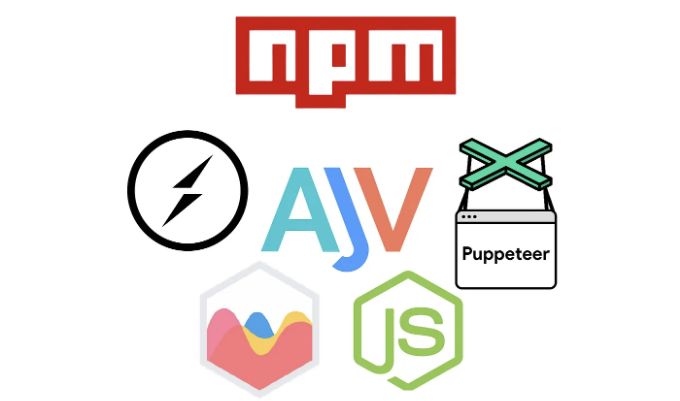
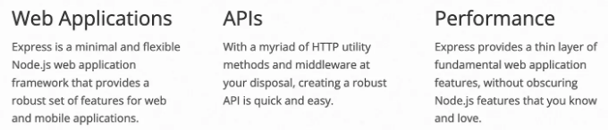
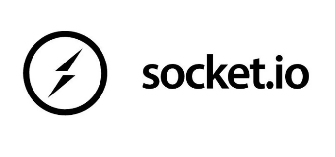
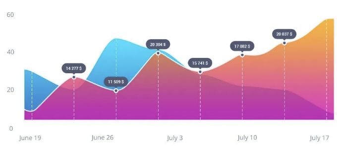

NPM (노드 패키지 매니저)에는 무수히 많은 노드 모듈이 있습니다. 끝없는 노드 모듈을 뒤적이는데 시간을 낭비하지 마세요. 올바른 선택이나 발견은 많은 시간을 절약할 수 있습니다. 빠르고 쉽게 시작할 수 있도록 도와줄 Node.js용 최고의 NPM 라이브러리를 소개할 거에요. 마지막에는 몇 가지 인기 있는 NPM 라이브러리도 언급할 거예요.

## Express

Express는 Node.js에서 가장 인기 있는 웹 서버입니다. 사용하기 쉽고 유연하며 빠른 아키텍처를 갖추고 있습니다. 수많은 라이브러리가 있어 애플리케이션을 개발하거나 간단히 만드는 데 도움을 줍니다. 예를 들어, cookie-parser는 쿠키를 준비하고 multer는 파일 업로드, http-proxy-middleware는 요청을 프록시하는 데 사용됩니다. 이 거대한 커뮤니티는 라이브러리를 만들고 관리하는 일 뿐만 아니라 여러분의 질문에 답변하기도 합니다. 거의 모든 문제에 대한 답변을 Stackoverflow에서 찾을 수 있습니다.

<!-- ui-log 수평형 -->
<ins class="adsbygoogle"
  style="display:block"
  data-ad-client="ca-pub-4877378276818686"
  data-ad-slot="9743150776"
  data-ad-format="auto"
  data-full-width-responsive="true"></ins>
<component is="script">
(adsbygoogle = window.adsbygoogle || []).push({});
</component>



## Socket.io

Socket.io는 웹 소켓을 쉽게 사용하고 관리할 수 있는 인기 있는 라이브러리입니다. 그룹 또는 모든 사용자에게 소켓을 보내는 등 복잡한 문제를 해결합니다. 이 라이브러리는 백엔드에서 구문을 실제로 단순화하며 클라이언트는 양쪽에서 이벤트를 추가하고 처리하는 것만 필요합니다.



<!-- ui-log 수평형 -->
<ins class="adsbygoogle"
  style="display:block"
  data-ad-client="ca-pub-4877378276818686"
  data-ad-slot="9743150776"
  data-ad-format="auto"
  data-full-width-responsive="true"></ins>
<component is="script">
(adsbygoogle = window.adsbygoogle || []).push({});
</component>

## 퍼피티어

퍼피티어는 웹 스크래핑, 싱글 페이지 애플리케이션 크롤링 또는 자율 웹 테스트에 주로 사용되는 Chrome/Chromium을 제어하기 위한 API를 제공합니다. 브라우저가 새 창에서 열리지 않은 상태로 헤드리스 모드로 실행할 수 있어 CLI(명령줄 인터페이스)만 있으면 서버에서 쉽게 퍼피티어를 실행할 수 있습니다. 그러나 헤드 모드로 실행할 때는 코드에 의해 브라우저 창이 조작되어 다른 사람이 클릭하거나 타이핑하는 것처럼 보일 수 있습니다.

## Ajv

Ajv는 JSON 정의를 작성함으로써 코드를 작성하지 않고도 빠르고 쉽게 읽을 수 있는 데이터 유효성을 만들 수 있는 기회를 제공합니다. Express와 함께 사용되어 들어오는 데이터 유효성을 검증하거나 브라우저에서 널리 사용됩니다.

<!-- ui-log 수평형 -->
<ins class="adsbygoogle"
  style="display:block"
  data-ad-client="ca-pub-4877378276818686"
  data-ad-slot="9743150776"
  data-ad-format="auto"
  data-full-width-responsive="true"></ins>
<component is="script">
(adsbygoogle = window.adsbygoogle || []).push({});
</component>

```js
const schema = {
  properties: {
    foo: {type: "int32"}
  },
  optionalProperties: {
    bar: {type: "string"}
  }
}

const validate = ajv.compile(schema)

const data = {
  foo: 1,
  bar: "abc"
}

console.log(validate(data)); // true
```

## Chart.js

Chart.js는 차트 렌더링 라이브러리입니다. 매우 맞춤화 및 확장 가능하여 선, 파이, 또는 막대 차트와 같은 여러 차트 유형을 제공합니다. 일반적인 솔루션 덕분에 Chart.js를 Vue, React 또는 일반 Javascript와 거의 모든 프론트엔드 프레임워크와 함께 사용할 수 있습니다.


```

<!-- ui-log 수평형 -->
<ins class="adsbygoogle"
  style="display:block"
  data-ad-client="ca-pub-4877378276818686"
  data-ad-slot="9743150776"
  data-ad-format="auto"
  data-full-width-responsive="true"></ins>
<component is="script">
(adsbygoogle = window.adsbygoogle || []).push({});
</component>

## 인기 있는 다른 라이브러리

우리 목록에서 언급할 만한 몇 가지 라이브러리는 다음과 같습니다.

- Axios — 주로 프론트엔드 프레임워크에서 사용되는 HTTP 요청 라이브러리이며 노드.js API에서 HTTP 요청을 지원하지 않는 부분 때문에 백엔드 쪽에서도 사용됩니다.
- Sharp — 이미지 조정, 크롭 또는 최소화를 위한 라이브러리
- Log4js — 응용 프로그램 내에서 광범위한 로깅을 위한 라이브러리
- Multer — 서버 요청에서 파일을 로컬 머신에 저장하거나 AWS와 같은 파일 저장소에 저장하기 위한 라이브러리

## 결론

<!-- ui-log 수평형 -->
<ins class="adsbygoogle"
  style="display:block"
  data-ad-client="ca-pub-4877378276818686"
  data-ad-slot="9743150776"
  data-ad-format="auto"
  data-full-width-responsive="true"></ins>
<component is="script">
(adsbygoogle = window.adsbygoogle || []).push({});
</component>

어떤 문제를 해결하고 있던 중에는 정확히 그 문제를 해결해 주는 라이브러리가 있을 확률이 높습니다. 단지 그것을 찾아보기만 하면 됩니다. 적절한 것을 선택하면 여러분의 시간, 버그, 신경을 아껴 줄 수 있을 겁니다. 위에서 언급한 라이브러리들은 저가 자주 사용해 왔던 것들이며 xlsx, dateformat, fast-xml-parser, 또는 xml-js와 같이 덜 사용한 것들은 언급하지 않았습니다.

제 글에 관심이 있으시다면 해당 이야기에 박수를 보내거나 팔로우해 주실 수도 있습니다. 아래에는 여러분이 관심을 가질 수 있는 몇 가지 다른 기사들이 있습니다: