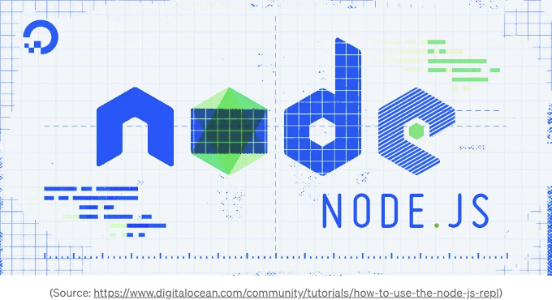

Node.js와 Express를 사용하여 웹 애플리케이션을 개발하는 것이 산업 표준이 되었습니다. 그런데 여전히 많은 개발자들이 오류 처리 보일러플레이트 코드가 많은 복잡한 코드를 작성해야 합니다. 저는 여러분에게 수백 줄의 보일러플레이트 코드를 줄여주면서도 간단한 해결책을 찾았습니다. Express js 미들웨어를 구현하는 것으로 여러분에게 보여드리겠습니다.

## 문제점

모든 Express 개발자가 직면한 문제는 오류를 효율적으로 처리하는 방법입니다. 저는 수없이 많은 개발자들이 이 구문을 사용하는 것을 보았습니다:

<!-- ui-log 수평형 -->
<ins class="adsbygoogle"
  style="display:block"
  data-ad-client="ca-pub-4877378276818686"
  data-ad-slot="9743150776"
  data-ad-format="auto"
  data-full-width-responsive="true"></ins>
<component is="script">
(adsbygoogle = window.adsbygoogle || []).push({});
</component>

```js
if (notFound) {
    res.send(404, {
        message: '찾을 수 없음'
    });
    return;
}
```

이렇게 HTTP 오류를 처리하는 것은 많은 반복 코드를 유발하고 코드를 덜 읽기 쉽게 만들 수 있습니다. 그럼 어떻게 간단하게 해결할까요?

## 해결책

우선, 오류 처리를 위한 견고한 기반을 마련해야 합니다. 코드는 심플하고 확장 가능한 오류 해결을 제공해야 하며, 잘못 작성된 코드에서 발생하는 처리되지 않은 예외나 널에 대한 호출로 인한 오류도 다룰 수 있어야 합니다. 모든 오류는 프론트엔드에서 쉽게 처리할 수 있도록 동일한 JSON 구조를 가져야 합니다.```

<!-- ui-log 수평형 -->
<ins class="adsbygoogle"
  style="display:block"
  data-ad-client="ca-pub-4877378276818686"
  data-ad-slot="9743150776"
  data-ad-format="auto"
  data-full-width-responsive="true"></ins>
<component is="script">
(adsbygoogle = window.adsbygoogle || []).push({});
</component>

이 foundation은 다음과 같이 보일 수 있습니다:

```js
class ApiError extends Error {
 constructor(status, msg, code, detail) {
  super(msg);

  this.status = status;
  this.code = code;
  this.detail = detail;
 }
}

function handle_error(err, res) {
 let status = 500;
 let error = {
  error: 'Internal error',
 };

 // JSON endpoints를 위한 통합된 에러 반환 인터페이스
 if (err instanceof ApiError) {
  status = err.status;
  error.error = err.message;
  error.code = err.code;
  error.detail = err.detail;
 } else if (err instanceof Error) {
  error.error = err.message;
  console.log(err);
  Logger.fatal(`서버의 처리되지 않은 오류, ${res.req.method} ${res.req.originalUrl}:\n 상태 코드 500, 오류 ${err.message} \n ${err?.stack}`);
 }

 // 에러 응답을 캐시하지 않음
 res.set('Cache-Control', 'no-store');
 res.status(status);
 res.json(error);
}
```

이 코드는 위에서 언급한 모든 요구 사항을 충족합니다. 이제 재미있는 부분으로 넘어가서 우리 응용 프로그램의 모든 엔드포인트에 이를 구현해야 합니다.

따라서 우리는 다음과 같이 변경할 수 있습니다:

<!-- ui-log 수평형 -->
<ins class="adsbygoogle"
  style="display:block"
  data-ad-client="ca-pub-4877378276818686"
  data-ad-slot="9743150776"
  data-ad-format="auto"
  data-full-width-responsive="true"></ins>
<component is="script">
(adsbygoogle = window.adsbygoogle || []).push({});
</component>

위의 코드를 다음과 같이 번역해 드리겠습니다.

```js
if (notFound) {
    throw new ApiError(404, '찾을 수 없음');
}
```

나중에 개발 초기 단계에서도 손쉽게 구현할 수 있도록 익스프레스 HTTP 함수를 위한 미들웨어 래퍼를 생성하겠습니다.

<!-- ui-log 수평형 -->
<ins class="adsbygoogle"
  style="display:block"
  data-ad-client="ca-pub-4877378276818686"
  data-ad-slot="9743150776"
  data-ad-format="auto"
  data-full-width-responsive="true"></ins>
<component is="script">
(adsbygoogle = window.adsbygoogle || []).push({});
</component>

```js
const FallThrough = Symbol('api-fall-through');

function async_json_middleware(fn) {
 return function(req, res, next) {
  try {
   // JSON 엔드포인트를 위한 몇 가지 기본값
   req.res.set('Cache-Control', 'no-store');

   Promise.resolve(fn(req, res)).then(data => {
    if (data === undefined) {
     res.json(null);
    } else if (data === FallThrough) {
     next();
    } else {
     res.json(data);
    }
   }, err => handle_error(err, res));
  } catch(err) {
   return handle_error(err, res);
  }
 };
}

['get', 'post', 'put', 'delete', 'all'].forEach(function(m) {
 express.application[m + '_json'] = function(path, fn) {
  this[m](path, async_json_middleware(fn));
 }
});
```

이 express 미들웨어는 두 가지 중요한 개선 사항을 제공합니다. 이제 엔드포인트 함수에서 값을 반환할 수 있으며, 이는 http 상태 코드 200과 함께 res.json을 보내는 것과 동일합니다. 그리고 무엇보다 중요한 것은 코드에서 오류를 throw할 수 있습니다. 이로 인해 코드베이스가 크게 간소화되며, res.send 및 return으로 함수 종료하는 필요가 제거됩니다.

```js
app.get_json('/api/good-morning', async req => {
  const now = new Date();
  if (now.getHours() < 6) {
    throw new ApiError(400, '아직 아침이 아닙니다');
  }
  if (now.getHours() > 10) {
    throw new ApiError(400, '이미 아침이 지났습니다');
  }
  return '좋은 아침';
});
```

## 결론

<!-- ui-log 수평형 -->
<ins class="adsbygoogle"
  style="display:block"
  data-ad-client="ca-pub-4877378276818686"
  data-ad-slot="9743150776"
  data-ad-format="auto"
  data-full-width-responsive="true"></ins>
<component is="script">
(adsbygoogle = window.adsbygoogle || []).push({});
</component>

