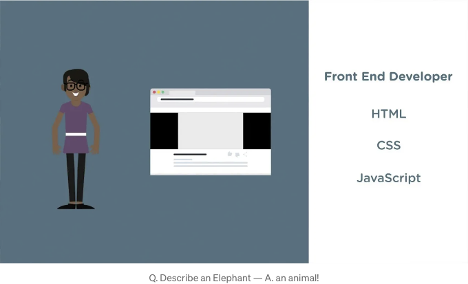

요즘 채용 웹 사이트를 살펴보셨나요? LinkedIn에서 수백 개의 채용자 메시지를 읽어보셨나요? 현대의 프론트엔드 개발자는 브라우저의 달인이자 과학자, 최첨단 디자이너로 기대됩니다.

코드로 전체 플랫폼을 프로그래밍적으로 생성할 수 있는 능력을 가진 사람으로, 코드가 너무 DRY해서 Facebook이 200줄의 코드로 만들어질 정도입니다. 이 컴퓨터과학의 거인은 가장 최신의 프레임워크와 함께 사용 중이며 React 19.1을 사용하고 있습니다 (작성 시점에는 아직 릴리스되지 않은 버전). redux, context, hooks, NPM, yarn 및 TypeScript을 하나의 모듈에서 모두 사용하고 있습니다.

앱의 스타일링은 SASS, SCSS, LESS, CSS 및 styled components로 작성되어 있습니다. 이 디자인의 신은 이미 CSS4를 구현하고, grid, flexbox, CSS 함수 및 사용자 정의 속성을 사용하고 있습니다. 폰트를 가져오고, keyframes로 애니메이션을 만들어 어디에든 넣고 있습니다... 그리고 모두 반응형입니다!

<!-- ui-log 수평형 -->

<ins class="adsbygoogle"
  style="display:block"
  data-ad-client="ca-pub-4877378276818686"
  data-ad-slot="9743150776"
  data-ad-format="auto"
  data-full-width-responsive="true"></ins>
<component is="script">
(adsbygoogle = window.adsbygoogle || []).push({});
</component>


그리고 모든 도구들이 있어요. webpack은 모든 것을 일치시키기 위해 컴파일해주고, 우리가 작성한 코드를 브라우저가 이해하지 못하기 때문에 바벨을 사용합니다. 바벨 플러그인과 확장 프로그램도 필요하고, 우리의 코드가 너무 DRY하여 '바퀴를 다시 발명하지 말아야한다'는 NPM 패키지들도 잊지 말아야 해요. 배워야 할 것이 많고, 기억해야 할 것도 많아요. 제가 다루지 않은 현대 웹사이트 개발의 대부분을 아직 다루지 않았어요 (죄송해요, 이제 그것들은 앱이라고 불립니다!).

좋은 소식이 있어요! HTML에서 필요한 것은 단지

```html
<div id="root"></div>
```

이에요.

그래서 아마 우리는 매우 정직해지고 곧 선택을 해야 할 것 같아요. 이 두 가지 다른 기술 세트를 두 개의 서로 다른 직함으로 분리해야 한다고 인정해야 해요. 디자이너와 긴밀하게 협력하여 CSS 스타일링과 관련된 모든 도구로 웹사이트의 외관과 느낌을 만드는 프론트엔드 개발자들과 사이트의 구조와 논리를 구축하는 프론트엔드 엔지니어들이 있는 세계로 접어들고 있다고 믿어요.

<!-- ui-log 수평형 -->

<ins class="adsbygoogle"
  style="display:block"
  data-ad-client="ca-pub-4877378276818686"
  data-ad-slot="9743150776"
  data-ad-format="auto"
  data-full-width-responsive="true"></ins>
<component is="script">
(adsbygoogle = window.adsbygoogle || []).push({});
</component>

웹 브라우저의 발전 방향을 보면 개발의 미래가 확장될 것 같아요. 컴퓨터 프로그램이 왕이었던 시절을 기억하죠. 지금은 컴퓨터에서 하는 모든 일이 온라인으로 가능해요. 파일을 저장하는 온라인 하드 드라이브(Google Drive, Dropbox, 심지어 OneDrive도 있죠), 브라우저 메모리 지속성(localStorage, 쿠키), 워드 처리, 이메일, 계산기, 심지어 온라인에서 코드를 작성할 수도 있어요... 브라우저가 새로운 운영 체제(OS)가 되었어요!

'모바일 앱은 어떻죠?'라는 의문이 들 수도 있겠죠. 제 답변은 간단해요... 위에 써 놓은 걸 읽어보세요! 왜 앱을 내려받아야 할까요? 반응형 웹사이트를 방문해서 동일하거나 더 나은 경험을 하지 않을 수 있겠죠? 메모리 누수가 발생하는 앱을 내려받을 필요 없이 내장 브라우저를 사용할 수 있어요.

프론트엔드 영역이 커지고 있는데, 웹 개발자로 있을 때 정말 멋진 시기이지만, 우리 앱(웹사이트)의 품질과 보안을 개선하려면 각자 다른 분야에 전문화해야 할 때가 왔어요.
