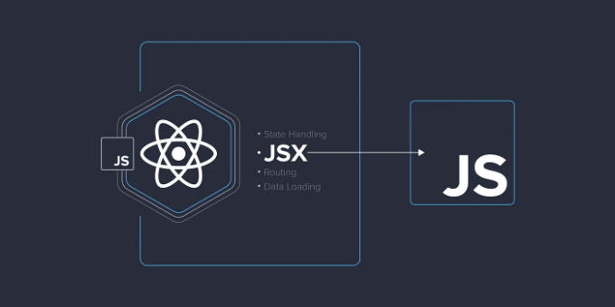

JSX는 React에서 사용되는 JavaScript 확장 구문으로 HTML과 JavaScript를 쉽게 함께 작성할 수 있습니다.

```js
const hello = <h1>Hello World</h1>
```

# React.createElement 함수란 무엇인가

<!-- ui-log 수평형 -->
<ins class="adsbygoogle"
  style="display:block"
  data-ad-client="ca-pub-4877378276818686"
  data-ad-slot="9743150776"
  data-ad-format="auto"
  data-full-width-responsive="true"></ins>
<component is="script">
(adsbygoogle = window.adsbygoogle || []).push({});
</component>

모든 JSX는 브라우저가 이해하는 React.createElement 함수 호출로 변환됩니다.

React.createElement는 다음과 같은 구문을 갖습니다:

```js
React.createElement(type, [props], [...children])
```

- Type은 h1, p, div 등과 같이 Html 태그일 수 있습니다.
- Props는 엘리먼트가 가져야 할 속성입니다.
- Children에는 다른 HTML 태그가 포함되거나 컴포넌트가 될 수 있습니다.

<!-- ui-log 수평형 -->
<ins class="adsbygoogle"
  style="display:block"
  data-ad-client="ca-pub-4877378276818686"
  data-ad-slot="9743150776"
  data-ad-format="auto"
  data-full-width-responsive="true"></ins>
<component is="script">
(adsbygoogle = window.adsbygoogle || []).push({});
</component>

```js
{
 type: 'h2',
 props: {
   children: 'Hello World'
 }
}
```

예시:-

```js
# say-hello
Hello World
```

따라서 React는 JSX를 아래 코드로 변환할 것입니다:

<!-- ui-log 수평형 -->
<ins class="adsbygoogle"
  style="display:block"
  data-ad-client="ca-pub-4877378276818686"
  data-ad-slot="9743150776"
  data-ad-format="auto"
  data-full-width-responsive="true"></ins>
<component is="script">
(adsbygoogle = window.adsbygoogle || []).push({});
</component>

```js
React.createElement("h2", { id="say-hello"}, "Hello World");
```

만약에 HTML 태그에 속성을 추가한다면, 우리의 경우와 같이, 해당 속성들은 React.createElement 호출의 두 번째 매개변수로 전달됩니다. 객체 표현은 다음과 같이 보일 것입니다:

```js
{ 
  type: 'h2', 
  props: { 
   id: 'say-hello',
   children: 'Hello World'
  } 
}
```

읽어 주셔서 감사합니다 ❤️