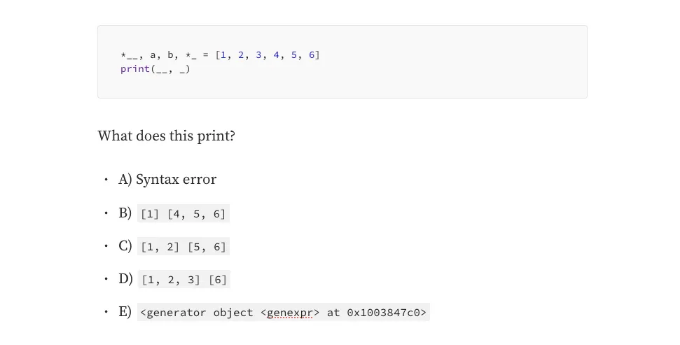

# 1) @print???

```js
@print
def testing():
  print('hello!!')
  return 1000
```

이건 뭘 하는 거야?

<!-- ui-log 수평형 -->
<ins class="adsbygoogle"
  style="display:block"
  data-ad-client="ca-pub-4877378276818686"
  data-ad-slot="9743150776"
  data-ad-format="auto"
  data-full-width-responsive="true"></ins>
<component is="script">
(adsbygoogle = window.adsbygoogle || []).push({});
</component>

- A) 문법 오류입니다. Python에는 @라는 것이 없습니다.
- B) 이것은 testing()을 호출할 때 자동으로 1000을 인쇄합니다.
- C) 이건 `function testing at 0x1023e2340`를 인쇄합니다.
- D) testing()을 호출하지 않아도 1000을 자동으로 인쇄합니다.
- E) testing()의 메타데이터가 자동으로 호출될 때마다 인쇄됩니다.

# 2) ???

```js
a, b, *_ = [1, 2, 3, 4, 5]
print(_)
```

이것은 무엇을 출력합니까?

<!-- ui-log 수평형 -->
<ins class="adsbygoogle"
  style="display:block"
  data-ad-client="ca-pub-4877378276818686"
  data-ad-slot="9743150776"
  data-ad-format="auto"
  data-full-width-responsive="true"></ins>
<component is="script">
(adsbygoogle = window.adsbygoogle || []).push({});
</component>

- A) 구문 오류
- B) [3, 4, 5]
- C) [1, 2, 3, 4, 5]
- D) `generator object `genexpr` at 0x1003847c0`
- E) NameError: ‘_’는 유효한 변수 이름이 아닙니다

### 3) *_이 1보다 많은 경우???

```js
*__, a, b, *_ = [1, 2, 3, 4, 5, 6]
print(__, _)
```

이 코드는 무엇을 출력할까요?

<!-- ui-log 수평형 -->
<ins class="adsbygoogle"
  style="display:block"
  data-ad-client="ca-pub-4877378276818686"
  data-ad-slot="9743150776"
  data-ad-format="auto"
  data-full-width-responsive="true"></ins>
<component is="script">
(adsbygoogle = window.adsbygoogle || []).push({});
</component>

- A) 문법 오류
- B) [1] [4, 5, 6]
- C) [1, 2] [5, 6]
- D) [1, 2, 3] [6]
- E) `generator object `genexpr` at 0x1003847c0`

# 4) class shenanigans

```js
class Dog:
  def __init__(self, *args, **kwargs):
    args, kwargs = kwargs, args
    self.name = args['name']
    self.age = kwargs[0]

dog = Dog('rocky', 5)
```

이것이 어떤 오류를 일으키나요?

<!-- ui-log 수평형 -->
<ins class="adsbygoogle"
  style="display:block"
  data-ad-client="ca-pub-4877378276818686"
  data-ad-slot="9743150776"
  data-ad-format="auto"
  data-full-width-responsive="true"></ins>
<component is="script">
(adsbygoogle = window.adsbygoogle || []).push({});
</component>

- A) 오류 없음
- B) ZeroDivisionError
- C) IndexError
- D) KeyError
- E) 위의 모든 것

## 5) GIL

파이썬 전역 인터프리터 락(Global Interpreter Lock, GIL)은 무엇인가요?

- A) 파이썬 서버를 침입자로부터 보호하는 물리적 잠금장치입니다.
- B) 파이썬 인터프리터가 컴퓨터의 다른 프로세스에 데이터 누출을 방지하는 요소입니다.
- C) 여러 Python 프로세스를 동시에 실행할 수 있는 프로그래밍 패러다임입니다.
- D) 한 번에 하나의 스레드만 인터프리터에서 실행할 수 있는 요소입니다.
- E) Python 인터프리터가 코드를 더 빠르게 실행할 수 있도록 하는 것입니다.

<!-- ui-log 수평형 -->
<ins class="adsbygoogle"
  style="display:block"
  data-ad-client="ca-pub-4877378276818686"
  data-ad-slot="9743150776"
  data-ad-format="auto"
  data-full-width-responsive="true"></ins>
<component is="script">
(adsbygoogle = window.adsbygoogle || []).push({});
</component>

# 6) True = False

```js
True = False
False = True

print(not True, not False)
```

이것은 무엇을 출력합니까?

- A) SyntaxError
- B) False True
- C) True False
- D) True True
- E) False False

<!-- ui-log 수평형 -->
<ins class="adsbygoogle"
  style="display:block"
  data-ad-client="ca-pub-4877378276818686"
  data-ad-slot="9743150776"
  data-ad-format="auto"
  data-full-width-responsive="true"></ins>
<component is="script">
(adsbygoogle = window.adsbygoogle || []).push({});
</component>

# 7) 컨텍스트 매니저

컨텍스트 매니저는 무엇에 사용되나요?

- A) 컨텍스트를 관리하기 위해
- B) 파일 작업 또는 데이터베이스와 같은 리소스를 올바르게 처리하기 위해
- C) Python에서 타입 힌트가 강제적으로 적용되도록 하기 위해
- D) 다른 컨텍스트에 영향을 미치지 않도록 예외를 처리하기 위해
- E) Python 인터프리터가 과도한 RAM을 차지하지 않도록 하는 것

# 아래에 답이 있습니다!!

<!-- ui-log 수평형 -->
<ins class="adsbygoogle"
  style="display:block"
  data-ad-client="ca-pub-4877378276818686"
  data-ad-slot="9743150776"
  data-ad-format="auto"
  data-full-width-responsive="true"></ins>
<component is="script">
(adsbygoogle = window.adsbygoogle || []).push({});
</component>

# 답변!!

# 1) @print???

```js
@print
def testing():
  print('hello!!')
  return 1000
```

이것은 무엇을 하는 건가요?

<!-- ui-log 수평형 -->
<ins class="adsbygoogle"
  style="display:block"
  data-ad-client="ca-pub-4877378276818686"
  data-ad-slot="9743150776"
  data-ad-format="auto"
  data-full-width-responsive="true"></ins>
<component is="script">
(adsbygoogle = window.adsbygoogle || []).push({});
</component>

- A) 문법 오류입니다. Python에는 @이라는 것이 없습니다.
- B) 이것은 testing()을 호출할 때 자동으로 1000을 인쇄합니다.
- C) 이것은 `function testing at 0x1023e2340`을 인쇄합니다.
- D) 우리가 testing()을 호출하지 않아도, 이것은 자동으로 1000을 인쇄합니다.
- E) testing()의 메타데이터는 호출될 때 자동으로 인쇄됩니다.

여기서 testing()을 print()로 꾸며주었습니다. 이것은 아래와 동일합니다:

```js
def testing():
  print('hello!!')
  return 1000

testing = print(testing)
```

print(testing)이 호출되면, `function testing at 0x1023e2340`가 인쇄됩니다. (끝의 난해한 숫자는 다를 수 있습니다)

<!-- ui-log 수평형 -->
<ins class="adsbygoogle"
  style="display:block"
  data-ad-client="ca-pub-4877378276818686"
  data-ad-slot="9743150776"
  data-ad-format="auto"
  data-full-width-responsive="true"></ins>
<component is="script">
(adsbygoogle = window.adsbygoogle || []).push({});
</component>

# 2) *_ ???

```js
a, b, *_ = [1, 2, 3, 4, 5]
print(_)
```

이 코드는 무엇을 출력할까요?

- A) 구문 오류
- B) [3, 4, 5]
- C) [1, 2, 3, 4, 5]
- D) `generator object `genexpr` at 0x1003847c0`
- E) NameError: ‘_’는 유효한 변수명이 아닙니다.

<!-- ui-log 수평형 -->
<ins class="adsbygoogle"
  style="display:block"
  data-ad-client="ca-pub-4877378276818686"
  data-ad-slot="9743150776"
  data-ad-format="auto"
  data-full-width-responsive="true"></ins>
<component is="script">
(adsbygoogle = window.adsbygoogle || []).push({});
</component>

- _은 유효한 변수 이름입니다.
- a에는 1이, b에는 2가 할당됩니다 (튜플 언패킹).
- _ 앞에 *를 붙이면 _가 여러 값을 "잡을" 수 있습니다 (0부터 무한대까지).
- _는 따라서 모든 미할당 숫자를 "잡아"낼 것입니다 — 3, 4, 5를 포함한 모든 숫자.
- _는 결국 [3, 4, 5]가 될 것입니다.

# 3) *_가 1개 이상일까요???

```js
*__, a, b, *_ = [1, 2, 3, 4, 5, 6]
print(__, _)
```

이 코드는 무엇을 출력할까요?

<!-- ui-log 수평형 -->
<ins class="adsbygoogle"
  style="display:block"
  data-ad-client="ca-pub-4877378276818686"
  data-ad-slot="9743150776"
  data-ad-format="auto"
  data-full-width-responsive="true"></ins>
<component is="script">
(adsbygoogle = window.adsbygoogle || []).push({});
</component>

- A) 구문 오류
- B) [1] [4, 5, 6]
- C) [1, 2] [5, 6]
- D) [1, 2, 3] [6]
- E) `generator object `genexpr` at 0x1003847c0`

표현식 당 *은 하나만 허용됩니다. 2개를 가지고 있으면 SyntaxError가 발생합니다.

# 4) class shenanigans

```js
class Dog:
  def __init__(self, *args, **kwargs):
    args, kwargs = kwargs, args
    self.name = args['name']
    self.age = kwargs[0]

dog = Dog('rocky', 5)
```

<!-- ui-log 수평형 -->
<ins class="adsbygoogle"
  style="display:block"
  data-ad-client="ca-pub-4877378276818686"
  data-ad-slot="9743150776"
  data-ad-format="auto"
  data-full-width-responsive="true"></ins>
<component is="script">
(adsbygoogle = window.adsbygoogle || []).push({});
</component>

위 코드에서 발생하는 오류는 무엇입니까?

- A) 오류 없음
- B) ZeroDivisionError
- C) IndexError
- D) KeyError
- E) 모두

`*args`는 함수가 임의의 개수의 위치 인수를 사용할 수 있도록 하며, `**kwargs`는 함수가 임의의 키워드 인수를 사용할 수 있도록 합니다.

Dog(`rocky`, 5)는 __init__에 2개의 위치 인수를 전달하므로, args=(`rocky`, 5)이 되고, kwargs={} (여기에는 키워드 인수가 없음)

<!-- ui-log 수평형 -->
<ins class="adsbygoogle"
  style="display:block"
  data-ad-client="ca-pub-4877378276818686"
  data-ad-slot="9743150776"
  data-ad-format="auto"
  data-full-width-responsive="true"></ins>
<component is="script">
(adsbygoogle = window.adsbygoogle || []).push({});
</component>

`args`, `kwargs` = `kwargs`, `args`는 `args`와 `kwargs`를 교환합니다. 따라서 이제 `args={}`이고 `kwargs=(`rocky`, 5)`입니다.

`args['name']`을 호출하려고 할 때, 현재 `args`가 비어 있는 딕셔너리이므로 KeyError가 발생합니다.

# 5) GIL

Python Global Interpreter Lock(GIL)이란 무엇인가요?

<!-- ui-log 수평형 -->
<ins class="adsbygoogle"
  style="display:block"
  data-ad-client="ca-pub-4877378276818686"
  data-ad-slot="9743150776"
  data-ad-format="auto"
  data-full-width-responsive="true"></ins>
<component is="script">
(adsbygoogle = window.adsbygoogle || []).push({});
</component>

- A) Python 서버를 침입자로부터 안전하게 보호하는 물리적 잠금 장치
- B) Python 인터프리터가 컴퓨터의 다른 프로세스로부터 데이터 누출을 방지하는 것
- C) 여러 Python 프로세스를 동시에 실행할 수 있게 해주는 프로그래밍 패러다임
- D) 한 번에 한 스레드만 인터프리터 당에서 실행할 수 있도록 하는 것
- E) Python 인터프리터가 코드를 빠르게 실행할 수 있도록 해주는 것

Python GIL은 Python 인터프리터에서 한 번에 한 스레드만 실행할 수 있도록 만듭니다. (하지만 우리는 이를 우회하기 위해 multiprocessing을 사용할 수 있습니다)

# 6) True = False

```js
True = False
False = True
```

<!-- ui-log 수평형 -->
<ins class="adsbygoogle"
  style="display:block"
  data-ad-client="ca-pub-4877378276818686"
  data-ad-slot="9743150776"
  data-ad-format="auto"
  data-full-width-responsive="true"></ins>
<component is="script">
(adsbygoogle = window.adsbygoogle || []).push({});
</component>

```js
print(not True, not False)
```

이것은 무엇을 출력합니까?

- A) SyntaxError
- B) False True
- C) True False
- D) True True
- E) False False

True는 Python의 예약어이기 때문에 True에 아무것도 할당할 수 없습니다. 제대로 답변했기를 바랍니다.

<!-- ui-log 수평형 -->
<ins class="adsbygoogle"
  style="display:block"
  data-ad-client="ca-pub-4877378276818686"
  data-ad-slot="9743150776"
  data-ad-format="auto"
  data-full-width-responsive="true"></ins>
<component is="script">
(adsbygoogle = window.adsbygoogle || []).push({});
</component>

# 7) 컨텍스트 매니저

컨텍스트 매니저는 무엇에 사용되나요?

- A) 컨텍스트를 관리하기 위해
- B) 파일 작업이나 데이터베이스와 같은 리소스를 적절히 처리하기 위해
- C) 파이썬에서 타입 힌트가 강제되도록 하는 데 사용됩니다
- D) 예외가 다른 컨텍스트에 영향을 미치지 않도록 하는 데 사용됩니다
- E) 파이썬 인터프리터가 과도한 RAM을 사용하지 않도록 하는 데 사용됩니다

```py
# 파일을 읽어야 한다고 가정해 봅시다

file = open('hi.txt')

print(file.read())

file.close()
```

<!-- ui-log 수평형 -->
<ins class="adsbygoogle"
  style="display:block"
  data-ad-client="ca-pub-4877378276818686"
  data-ad-slot="9743150776"
  data-ad-format="auto"
  data-full-width-responsive="true"></ins>
<component is="script">
(adsbygoogle = window.adsbygoogle || []).push({});
</component>

만약이를 실행하면 몇 가지 오류로 인해 file.close()가 실행되지 않을 수 있습니다. 파일을 닫지 않으면 다음과 같은 문제가 발생할 수 있습니다:

- 파일이 RAM을 차지하여 프로그램이 느려질 수 있음
- 파일에 변경 사항이 저장되지 않을 수 있음. 많은 파일이 닫힐 때만 제대로 저장될 수 있기 때문임
- Windows에서 파일이 열려있는 경우 다른 스캐너나 프로그램이 해당 파일을 읽을 수 없는 경우가 있음
- 그리고 다른 이상한 문제들

```js
# 컨텍스트 매니저를 사용하여 파일 읽기

with open('hi.txt') as file:
  print(file.read())
```

with 키워드를 사용하면 open('hi.txt')를 컨텍스트 매니저로 사용할 수 있습니다. 이는 컨텍스트가 시작될 때 __enter__가 실행되고, 컨텍스트가 종료될 때 __exit__가 실행된다는 것을 의미합니다.

<!-- ui-log 수평형 -->
<ins class="adsbygoogle"
  style="display:block"
  data-ad-client="ca-pub-4877378276818686"
  data-ad-slot="9743150776"
  data-ad-format="auto"
  data-full-width-responsive="true"></ins>
<component is="script">
(adsbygoogle = window.adsbygoogle || []).push({});
</component>

알아두어야 할 점: 이것은 파일을 제대로 닫을 것입니다.

# 결론

속지 않고 정확히 몇 개를 맞췄는지 확인해 봤니?

다 맞추지 못했다고 해서 당신이 패배자라는 뜻은 아닙니다. 그저 1) 어딘가 부주의했거나 2) 아직 파이썬에 익숙하지 않은 것 뿐일 수도 있습니다.

<!-- ui-log 수평형 -->
<ins class="adsbygoogle"
  style="display:block"
  data-ad-client="ca-pub-4877378276818686"
  data-ad-slot="9743150776"
  data-ad-format="auto"
  data-full-width-responsive="true"></ins>
<component is="script">
(adsbygoogle = window.adsbygoogle || []).push({});
</component>