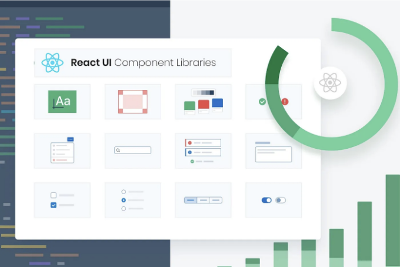
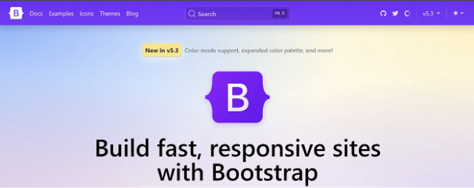
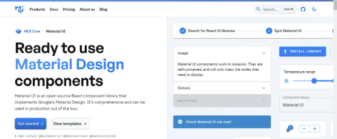
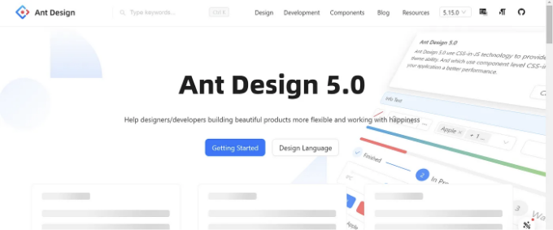
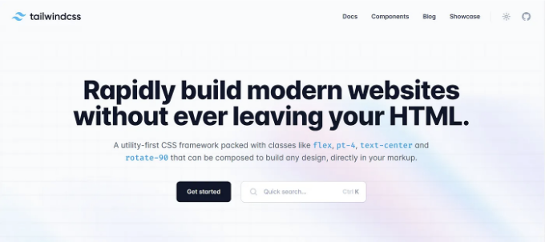
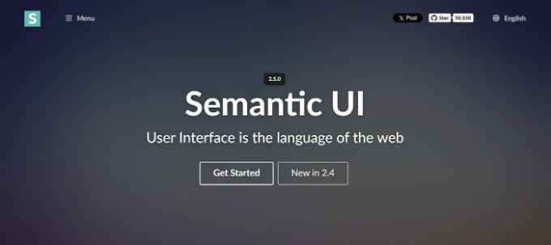
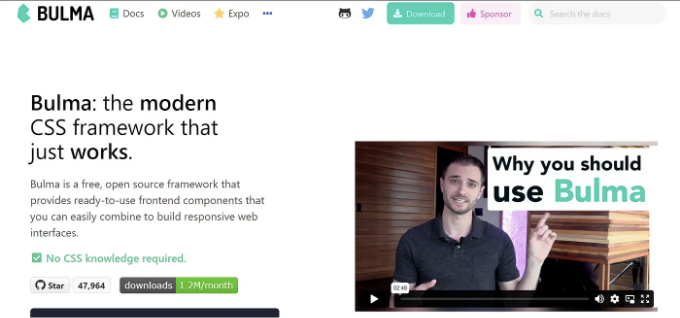
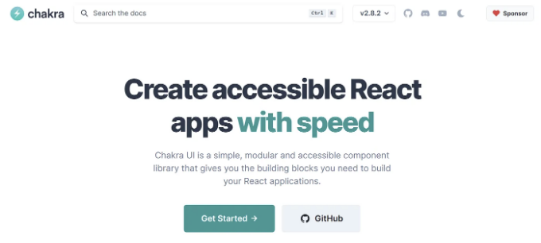

안녕하세요!!

수백 개의 웹 사이트가 존재하는 빠르게 변화하는 세상에서 특정 작업을 위한 웹 사이트를 찾게 될 때 우리는 항상 아름답고 효율적인 사용자 인터페이스를 가진 웹 사이트를 선호합니다.

웹 개발자로서 우리의 임무는 최종 사용자 또는 클라이언트에게 훌륭한 사용자 경험을 제공하는 것입니다. 이를 위해 우리는 CSS 코드를 작성하지만 동일한 유형의 구성 요소를 위해 매번 CSS 코드를 작성하는 것은 무의미합니다. 따라서, 우리를 돕기 위해 우리를 위해 웹 구성 요소, 유틸리티 및 클래스를 사용할 준비가 된 웹 사이트를 만들기 위한 우수한 라이브러리와 프레임워크를 구축해 놓은 사람들이 있습니다.

<!-- ui-log 수평형 -->
<ins class="adsbygoogle"
  style="display:block"
  data-ad-client="ca-pub-4877378276818686"
  data-ad-slot="9743150776"
  data-ad-format="auto"
  data-full-width-responsive="true"></ins>
<component is="script">
(adsbygoogle = window.adsbygoogle || []).push({});
</component>

우리가 함께 살펴볼 10가지 CSS 프레임워크:

- 부트스트랩

가장 인기 있는 하나이며 나의 처음 접한 프레임워크입니다. 트위터에서 만들었습니다. 부트스트랩은 간격, 여백, 패딩 등과 같은 유틸리티와 함께 사용할 준비가 된 컴포넌트를 제공합니다. HTML, SCSS 및 JavaScript 파일과 함께 번들로 제공됩니다.

<!-- ui-log 수평형 -->
<ins class="adsbygoogle"
  style="display:block"
  data-ad-client="ca-pub-4877378276818686"
  data-ad-slot="9743150776"
  data-ad-format="auto"
  data-full-width-responsive="true"></ins>
<component is="script">
(adsbygoogle = window.adsbygoogle || []).push({});
</component>

장점:

- CDN을 사용하여 쉽게 통합 가능
- 웹 페이지에 반응성 제공
- 다양한 콘텐츠들과 지원이 많은 커뮤니티
- 초심자들에게 완벽한 선택

단점:

- 웹사이트들이 서로 매우 비슷해 보일 수 있음
- 커스터마이징이 그리 많지 않음

<!-- ui-log 수평형 -->
<ins class="adsbygoogle"
  style="display:block"
  data-ad-client="ca-pub-4877378276818686"
  data-ad-slot="9743150776"
  data-ad-format="auto"
  data-full-width-responsive="true"></ins>
<component is="script">
(adsbygoogle = window.adsbygoogle || []).push({});
</component>

2. Material-UI

구글에서 만든 오픈 소스 라이브러리입니다. 개발자를 위한 훌륭한 미리 만들어진 컴포넌트 및 그리드 시스템을 제공합니다. 또한 준비된 웹사이트를 위한 미리 만들어진 템플릿을 판매합니다.

장점:

<!-- ui-log 수평형 -->
<ins class="adsbygoogle"
  style="display:block"
  data-ad-client="ca-pub-4877378276818686"
  data-ad-slot="9743150776"
  data-ad-format="auto"
  data-full-width-responsive="true"></ins>
<component is="script">
(adsbygoogle = window.adsbygoogle || []).push({});
</component>

- 훌륭한 문서, 구성 요소의 쉬운 통합을 제공합니다
- 특정 요구 사항에 맞게 쉽게 사용자 정의 가능
- Google의 지원을 받음

단점:

- Material UI는 애니메이션을 사용하여 오버헤드를 생성합니다
- 구성 요소의 애니메이션은 인지적으로 주의를 산만하게 만듭니다

3. Ant-Design

<!-- ui-log 수평형 -->
<ins class="adsbygoogle"
  style="display:block"
  data-ad-client="ca-pub-4877378276818686"
  data-ad-slot="9743150776"
  data-ad-format="auto"
  data-full-width-responsive="true"></ins>
<component is="script">
(adsbygoogle = window.adsbygoogle || []).push({});
</component>

Ant Design은 다양한 구성 요소를 보유한 인기 있는 디자인 프레임워크이며 기업용 응용 프로그램을 고려하여 제작되었습니다.

장점:

- 다양한 사용자 입력 구성 요소
- 포괄적
- 좋은 폼 처리
- UI가 아름답게 보입니다

<!-- ui-log 수평형 -->
<ins class="adsbygoogle"
  style="display:block"
  data-ad-client="ca-pub-4877378276818686"
  data-ad-slot="9743150776"
  data-ad-format="auto"
  data-full-width-responsive="true"></ins>
<component is="script">
(adsbygoogle = window.adsbygoogle || []).push({});
</component>

단점:

- 커뮤니티 지원이 부족합니다.
- 테스트가 조금 복잡해집니다.
- 번들 크기가 큽니다.

4. Tailwind CSS

2024년에 가장 인기 있는 라이브러리 중 하나이며 저의 개인적인 즐겨찾기입니다. 다른 프레임워크와 달리 미리 구축된 컴포넌트를 제공하지 않지만 함께 사용할 수 있는 유틸리티 클래스를 제공합니다.

<!-- ui-log 수평형 -->
<ins class="adsbygoogle"
  style="display:block"
  data-ad-client="ca-pub-4877378276818686"
  data-ad-slot="9743150776"
  data-ad-format="auto"
  data-full-width-responsive="true"></ins>
<component is="script">
(adsbygoogle = window.adsbygoogle || []).push({});
</component>

장점:

- 빠른 개발
- 매우 사용자 정의 가능
- 브레이크 포인트를 사용한 우수한 반응성 제공
- 코드 재사용성
- Next.js 지원

단점:

<!-- ui-log 수평형 -->
<ins class="adsbygoogle"
  style="display:block"
  data-ad-client="ca-pub-4877378276818686"
  data-ad-slot="9743150776"
  data-ad-format="auto"
  data-full-width-responsive="true"></ins>
<component is="script">
(adsbygoogle = window.adsbygoogle || []).push({});
</component>

- 큰 HTML 파일
- CSS 지식이 필요
- 때로는 자체 CSS를 작성해야 함
- 설정 파일 다루는 지식이 필요한 설치가 필요

5. 시맨틱 UI

시맨틱 UI는 웹 사이트의 개념적 구축 블록이 개별 HTML 태그가 아닌 개별 인터페이스 요소라는 믿음에 기반합니다. 단어와 클래스를 교환 가능한 개념으로 취급합니다. 클래스는 명사/수식어 관계, 단어 순서 등과 같은 자연어의 구문을 사용합니다.

<!-- ui-log 수평형 -->
<ins class="adsbygoogle"
  style="display:block"
  data-ad-client="ca-pub-4877378276818686"
  data-ad-slot="9743150776"
  data-ad-format="auto"
  data-full-width-responsive="true"></ins>
<component is="script">
(adsbygoogle = window.adsbygoogle || []).push({});
</component>

장점:

- 엄격한 코딩 규칙
- 좋은 문서화
- 잘 구성됨
- 쉬운 통합
- 다양한 UI 구성 요소 및 JavaScript 플러그인 선택 가능

단점:

- 높은 학습 곡선
- 오래된 브라우저와 호환되지 않음
- 클래스 이름에 대한 지나친 의존

<!-- ui-log 수평형 -->
<ins class="adsbygoogle"
  style="display:block"
  data-ad-client="ca-pub-4877378276818686"
  data-ad-slot="9743150776"
  data-ad-format="auto"
  data-full-width-responsive="true"></ins>
<component is="script">
(adsbygoogle = window.adsbygoogle || []).push({});
</component>

6. Bulma

자유롭고 오픈 소스인 Bulma는 Flexbox를 기반으로하며 Sass로 제작된 CSS 프레임워크입니다. 완전히 반응형이며 완전히 모듈화되어 있습니다.

장점:

<!-- ui-log 수평형 -->
<ins class="adsbygoogle"
  style="display:block"
  data-ad-client="ca-pub-4877378276818686"
  data-ad-slot="9743150776"
  data-ad-format="auto"
  data-full-width-responsive="true"></ins>
<component is="script">
(adsbygoogle = window.adsbygoogle || []).push({});
</component>

- 모바일 퍼스트 컨셉트
- 가벼운 무게
- 우아한 UI
- 가독성 있는 클래스들

단점:

- 커뮤니티 지원이 부족함
- IE 같은 오래된 브라우저에서 CSS가 느림
- JavaScript 통합 미지원
- 큰 CSS 파일이 생성됨

7. Chakra UI

<!-- ui-log 수평형 -->
<ins class="adsbygoogle"
  style="display:block"
  data-ad-client="ca-pub-4877378276818686"
  data-ad-slot="9743150776"
  data-ad-format="auto"
  data-full-width-responsive="true"></ins>
<component is="script">
(adsbygoogle = window.adsbygoogle || []).push({});
</component>

Chakra UI는 React 애플리케이션을 구축하는 데 필요한 기본 빌딩 블록을 제공하는 간단하고 모듈식이며 접근 가능한 컴포넌트 라이브러리입니다.

장점:
- 웹 접근성을 위한 모든 표준을 준수합니다.
- 쉽게 사용자 정의할 수 있습니다.
- 다크 모드 지원
- 반응형을 쉽게 추가할 수 있습니다.

<!-- ui-log 수평형 -->
<ins class="adsbygoogle"
  style="display:block"
  data-ad-client="ca-pub-4877378276818686"
  data-ad-slot="9743150776"
  data-ad-format="auto"
  data-full-width-responsive="true"></ins>
<component is="script">
(adsbygoogle = window.adsbygoogle || []).push({});
</component>

단점:
- Chakra UI의 몇 가지 구성 요소는 사용자 정의 테마가 허용되지 않습니다.

8. Mantine UI

React 웹 애플리케이션을 위한 100가지 이상의 사용 준비된 구성 요소 및 50 가지 훅을 제공하는 타입스크립트 기반 프레임워크입니다.

<!-- ui-log 수평형 -->
<ins class="adsbygoogle"
  style="display:block"
  data-ad-client="ca-pub-4877378276818686"
  data-ad-slot="9743150776"
  data-ad-format="auto"
  data-full-width-responsive="true"></ins>
<component is="script">
(adsbygoogle = window.adsbygoogle || []).push({});
</component>

[이미지](./img/8CSSFrameworksin2024forReactDevelopers_8.png)

장점:

- TypeScript 기반
- Next.js와 같은 현대적인 프레임워크 지원
- 사용자 정의 가능
- 접근성이 좋음

단점:

<!-- ui-log 수평형 -->
<ins class="adsbygoogle"
  style="display:block"
  data-ad-client="ca-pub-4877378276818686"
  data-ad-slot="9743150776"
  data-ad-format="auto"
  data-full-width-responsive="true"></ins>
<component is="script">
(adsbygoogle = window.adsbygoogle || []).push({});
</component>

- 커뮤니티 지원이 부족합니다.
- 맞춤 설정을 위한 학습 곡선이 있습니다.
- 종속성 관리 복잡성이 있습니다.

개인적인 추천:

- 웹 디자인 초보자라면 부트스트랩을 사용하세요.
- Vanilla CSS를 잘 다룬다면 Tailwind를 사용하세요.
- UI 인터페이스를 훌륭하게 원한다면 복사하여 붙여넣을 수 있는 구성 요소를 원한다면 Chakra UI를 사용하세요.
- Mantine UI

읽어 주셔서 감사합니다!!

<!-- ui-log 수평형 -->
<ins class="adsbygoogle"
  style="display:block"
  data-ad-client="ca-pub-4877378276818686"
  data-ad-slot="9743150776"
  data-ad-format="auto"
  data-full-width-responsive="true"></ins>
<component is="script">
(adsbygoogle = window.adsbygoogle || []).push({});
</component>

행복한 코딩하세요!

# Stackademic 🎓

끝까지 읽어주셔서 감사합니다. 떠나시기 전에:

- 작가를 칭찬하고 팔로우해 주시면 감사하겠습니다! 👏
- 다른 플랫폼에서도 우리를 팔로우해 주세요: X | LinkedIn | YouTube | Discord
- 다른 플랫폼 방문하기: In Plain English | CoFeed | Venture | Cubed
- Stackademic.com에서 더 많은 콘텐츠를 만나보세요.