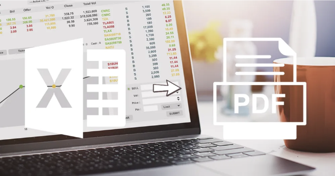
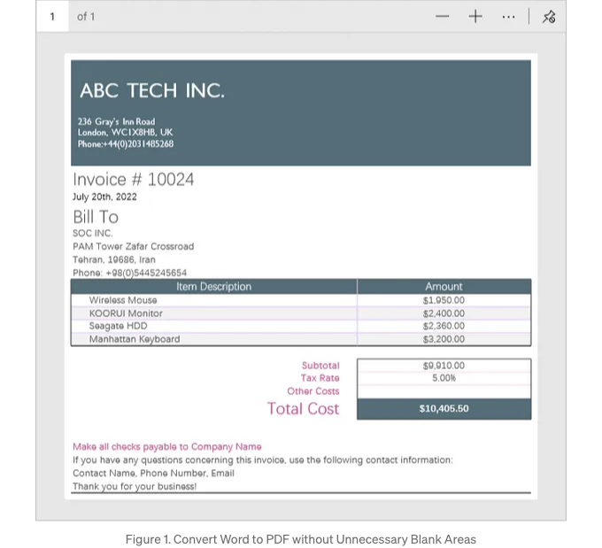
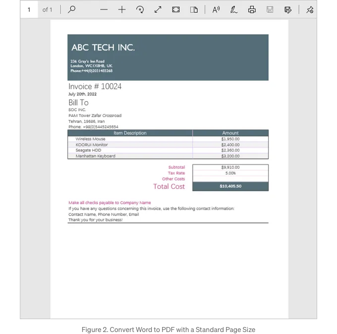

마이크로소프트 엑셀은 현재 데이터 관리와 분석을 위한 중요한 도구입니다. 그러나 형식 보존, 다양한 기기 호환성 또는 무단 변경 방지와 같은 이유로 원본 엑셀 파일을 공유하는 것이 이상적이지 않은 경우가 있습니다. 그렇기 때문에 Excel 파일을 PDF 형식으로 변환하는 것이 필요합니다.

이 블로그 포스트에서는 파이썬을 사용하여 Excel 파일을 PDF로 변환하는 과정을 안내하고, 구체적인 8가지 예제를 통해 설명하겠습니다.

- 파이썬을 사용하여 기본 페이지 설정으로 워크시트를 PDF로 변환하기
- 파이썬을 사용하여 사용자 정의 페이지 여백으로 워크시트를 PDF로 변환하기
- 파이썬을 사용하여 불필요한 공백 영역을 자르면서 워크시트를 PDF로 변환하기
- 파이썬을 사용하여 표준 페이지 크기로 워크시트를 PDF로 변환하기
- 파이썬을 사용하여 그리드 라인을 보존하면서 워크시트를 PDF로 변환하기
- 파이썬을 사용하여 페이지 방향을 지정하면서 워크시트를 PDF로 변환하기
- 파이썬을 사용하여 셀 범위를 PDF로 변환하기
- 파이썬을 사용하여 워크북을 PDF로 변환하기

<!-- ui-log 수평형 -->
<ins class="adsbygoogle"
  style="display:block"
  data-ad-client="ca-pub-4877378276818686"
  data-ad-slot="9743150776"
  data-ad-format="auto"
  data-full-width-responsive="true"></ins>
<component is="script">
(adsbygoogle = window.adsbygoogle || []).push({});
</component>

## 종속성 설치

이 솔루션을 사용하려면 Python에서 엑셀 문서를 읽고 생성 및 조작하는 데 사용되는 Python 라이브러리인 Spire.XLS가 종속성으로 설치되어 있어야 합니다. 다음 pip 명령을 실행하여 Python용 Spire.XLS를 설치할 수 있습니다.

```js
pip install Spire.XLS
```

## Python에서 기본 페이지 설정으로 워크시트를 PDF로 변환하기

<!-- ui-log 수평형 -->
<ins class="adsbygoogle"
  style="display:block"
  data-ad-client="ca-pub-4877378276818686"
  data-ad-slot="9743150776"
  data-ad-format="auto"
  data-full-width-responsive="true"></ins>
<component is="script">
(adsbygoogle = window.adsbygoogle || []).push({});
</component>

마이크로소프트 엑셀에서 페이지 설정이란 워크시트를 실제 페이지나 PDF와 같은 디지털 형식으로 변환할 때 인쇄되거나 표시될 방식을 결정하는 다양한 매개변수를 의미합니다. 이러한 설정을 통해 페이지 방향, 용지 크기, 여백, 스케일링 등과 같은 요소를 제어할 수 있습니다.

이미 원하는 페이지 설정을 워크시트에 설정했다면, Spire.XLS가 제공하는 Worksheet.SaveToPdf 메서드를 사용하여 PDF로 변환할 수 있습니다.

```js
from spire.xls import *
from spire.xls.common import *

# Workbook 객체 생성
workbook = Workbook()

# Excel 문서 로드
workbook.LoadFromFile("C:\\Users\\Administrator\\Desktop\\Input.xlsx")

# 특정 워크시트 가져오기 (인덱스는 0부터 시작)
sheet = workbook.Worksheets[0]

# 워크시트를 PDF 파일로 변환
sheet.SaveToPdf("output/WorksheetToPdf.pdf")

# 리소스 해제
workbook.Dispose()
```

## 파이썬에서 사용자 정의 페이지 여백으로 워크시트를 PDF로 변환하기

<!-- ui-log 수평형 -->
<ins class="adsbygoogle"
  style="display:block"
  data-ad-client="ca-pub-4877378276818686"
  data-ad-slot="9743150776"
  data-ad-format="auto"
  data-full-width-responsive="true"></ins>
<component is="script">
(adsbygoogle = window.adsbygoogle || []).push({});
</component>

페이지 여백 설정을 조정하여 콘텐츠와 PDF 페이지 가장자리 간의 간격을 제어할 수 있어요. 페이지 내용을 페이지 중앙에 배치하도록 또는 중요한 데이터나 요소가 변환된 PDF에서 페이지 테두리에 너무 가깝지 않도록 보장하는 데 유용해요.

Spire.XLS는 여백을 포함한 페이지 설정을 다루는 PageSetup 클래스를 제공해요. 이 클래스에는 TopMargin, BottomMargin, LeftMargin, RightMargin과 같은 속성이 있어요. 이 속성들은 페이지의 각 면에 대한 여백을 구성하는 데 책임이 있어요.

```js
from spire.xls import *
from spire.xls.common import *

# Workbook 객체 생성
workbook = Workbook()

# Excel 문서 불러오기
workbook.LoadFromFile("C:\\Users\\Administrator\\Desktop\\Input.xlsx")

# 특정 워크시트 가져오기 (인덱스는 0부터 시작)
sheet = workbook.Worksheets[1]

# PageSetup 객체 가져오기
pageSetup = sheet.PageSetup

# 페이지 여백 설정
pageSetup.TopMargin = 0.1
pageSetup.BottomMargin = 0.1
pageSetup.LeftMargin = 0.1
pageSetup.RightMargin = 0.1

# 워크시트를 PDF 파일로 변환
sheet.SaveToPdf("output/CostomizePageMargins.pdf")

# 자원 정리
workbook.Dispose()
```

## 필요 없는 공백 영역을 잘라내며 워크시트를 PDF로 변환하는 Python 코드

<!-- ui-log 수평형 -->
<ins class="adsbygoogle"
  style="display:block"
  data-ad-client="ca-pub-4877378276818686"
  data-ad-slot="9743150776"
  data-ad-format="auto"
  data-full-width-responsive="true"></ins>
<component is="script">
(adsbygoogle = window.adsbygoogle || []).push({});
</component>

워크시트를 PDF로 변환할 때 불필요한 공백 영역을 제거할 수 있어요. 이렇게 하면 워크시트의 내용을 정확하게 나타내는 PDF 파일이 생성되고 과도한 빈 공간이 없어요.

불필요한 공백 영역을 제거하려면 먼저 페이지 여백을 작은 값이나 0으로 설정해야 해요. 이렇게 하면 내용을 둘러싼 빈 공간이 최소화되죠. 그리고 Workbook.ConverterSetting.SheetFitToPage 속성을 true로 설정해야 해요. 이렇게 하면 PDF 페이지 크기가 워크시트의 내용 영역에 맞게 조정됩니다.

```js
from spire.xls import *
from spire.xls.common import *
                  
# Workbook 객체 생성
workbook = Workbook()

# Excel 문서 로드
workbook.LoadFromFile("C:\\Users\\Administrator\\Desktop\\Input.xlsx")

# 특정 워크시트 가져오기 (인덱스는 0부터 시작)
sheet = workbook.Worksheets[1]

# PageSetup 객체 가져오기
pageSetup = sheet.PageSetup

# 페이지 여백 설정
pageSetup.TopMargin = 0.1
pageSetup.BottomMargin = 0.1
pageSetup.LeftMargin = 0.1
pageSetup.RightMargin = 0.1

# PDF 페이지 크기를 내용 영역에 맞게 조정
workbook.ConverterSetting.SheetFitToPage = True

# 워크시트를 PDF 파일로 변환
sheet.SaveToPdf("output/RemoveBlankArea.pdf")

# 자원 해제
workbook.Dispose()
```



<!-- ui-log 수평형 -->
<ins class="adsbygoogle"
  style="display:block"
  data-ad-client="ca-pub-4877378276818686"
  data-ad-slot="9743150776"
  data-ad-format="auto"
  data-full-width-responsive="true"></ins>
<component is="script">
(adsbygoogle = window.adsbygoogle || []).push({});
</component>

## 파이썬을 사용하여 워크시트를 표준 페이지 크기의 PDF로 변환하기

A4와 같은 표준 페이지 크기를 사용하여 워크시트를 PDF로 변환하면 문서를 공유하고 보거나 인쇄할 때 호환성, 일관성 및 편의성이 보장됩니다. 이는 더 나은 문서 구성을 촉진하며 널리 인정받는 국제 표준에 부합합니다.

PageSetup 클래스 내에서 PaperSize 속성을 활용하여 문서를 PDF로 변환할 때 페이지 크기를 정의할 수 있습니다. 이 속성을 사용하여 A3, A4, B4, B5와 같은 표준 용지 크기 또는 구체적인 요구에 맞는 사용자 정의 용지 크기를 지정할 수 있습니다.

```python
from spire.xls import *
from spire.xls.common import *

# Workbook 객체 생성
workbook = Workbook()

# Excel 문서 로드
workbook.LoadFromFile("C:\\Users\\Administrator\\Desktop\\Input.xlsx")

# 특정 워크시트 얻기 (인덱스는 0부터 시작)
sheet = workbook.Worksheets[1]

# PageSetup 객체 얻기
pageSetup = sheet.PageSetup

# 페이지 크기를 A4로 설정
pageSetup.PaperSize = PaperSizeType.PaperA4

# 페이지 방향 설정
pageSetup.Orientation = PageOrientationType.Portrait

# 콘텐츠를 중앙에 배치할 수 있도록 적절한 여백 설정
pageSetup.TopMargin = 0.5
pageSetup.LeftMargin = 0.6

# 모든 열을 페이지에 맞추기
# workbook.ConverterSetting.SheetFitToPageRetainPaperSize = True

# 워크시트를 PDF 파일로 변환
sheet.SaveToPdf("output/StandardPageSize.pdf")

# 리소스 해제
workbook.Dispose()
```

<!-- ui-log 수평형 -->
<ins class="adsbygoogle"
  style="display:block"
  data-ad-client="ca-pub-4877378276818686"
  data-ad-slot="9743150776"
  data-ad-format="auto"
  data-full-width-responsive="true"></ins>
<component is="script">
(adsbygoogle = window.adsbygoogle || []).push({});
</component>



## Python에서 그리드 선을 보존하면서 워크시트를 PDF로 변환하기

변환 프로세스 중에 그리드 선을 보존함으로써, 결과 PDF 파일은 원본 워크시트의 그리드 구조를 시각적으로 유지합니다. 이는 가독성, 데이터 정렬 및 전반적인 시각적 일관성을 유지하는 데 도움이 될 수 있습니다.

워크시트를 PDF로 변환할 때 그리드 선을 활성화하려면 PageSetup.IsPrintGridlines를 True로 설정하십시오. 기본값은 False입니다.

<!-- ui-log 수평형 -->
<ins class="adsbygoogle"
  style="display:block"
  data-ad-client="ca-pub-4877378276818686"
  data-ad-slot="9743150776"
  data-ad-format="auto"
  data-full-width-responsive="true"></ins>
<component is="script">
(adsbygoogle = window.adsbygoogle || []).push({});
</component>

```js
spire.xls에서 *
spire.xls.common에서 *

# Workbook 객체 생성
workbook = Workbook()

# Excel 문서 불러오기
workbook.LoadFromFile("C:\\Users\\Administrator\\Desktop\\Input.xlsx")

# 특정 워크시트 가져오기 (인덱스는 0부터 시작)
sheet = workbook.Worksheets[1]

# PageSetup 객체 가져오기
pageSetup = sheet.PageSetup

# 그리드 라인 유지
pageSetup.IsPrintGridlines = True

# 워크시트를 PDF 파일로 변환
sheet.SaveToPdf("output/PreserveGridlines.pdf")

# 리소스 정리
workbook.Dispose()
```

## 페이지 방향을 지정하여 Python에서 워크시트를 PDF로 변환하기

워크시트를 PDF로 변환할 때 콘텐츠가 원하는 레이아웃으로 표시되도록 페이지 방향을 지정할 수 있습니다. 이를 위해 PageSetup.Orientation을 Lanscape 또는 Portrait으로 설정합니다.

```js
from spire.xls import *
from spire.xls.common import *

# Workbook 객체 생성
workbook = Workbook()

# Excel 문서 불러오기
workbook.LoadFromFile("C:\\Users\\Administrator\\Desktop\\Input.xlsx")

# 특정 워크시트 가져오기 (인덱스는 0부터 시작)
sheet = workbook.Worksheets[1]

# PageSetup 객체 가져오기
pageSetup = sheet.PageSetup

# 페이지 방향을 Lanscape(가로) 또는 Portrait(세로)로 설정
pageSetup.Orientation = PageOrientationType.Landscape

# 워크시트를 PDF 파일로 변환
sheet.SaveToPdf("output/PageOrientation.pdf")

# 리소스 정리
workbook.Dispose()
```

<!-- ui-log 수평형 -->
<ins class="adsbygoogle"
  style="display:block"
  data-ad-client="ca-pub-4877378276818686"
  data-ad-slot="9743150776"
  data-ad-format="auto"
  data-full-width-responsive="true"></ins>
<component is="script">
(adsbygoogle = window.adsbygoogle || []).push({});
</component>

## Python에서 셀 범위를 PDF로 변환하기

특정 셀 범위를 PDF로 변환함으로써, 선택한 데이터만 포함하는 집중된 PDF 문서를 생성할 수 있습니다. 이는 필요하지 않은 정보를 포함하지 않고 워크시트의 특정 부분을 공유하거나 배포해야 할 때 특히 유용합니다.

변환할 셀 범위를 지정하기 위해 PageSetup.PrintArea 속성에 "A7:B11"과 같은 값을 할당할 수 있습니다. 이를 통해 워크시트를 PDF로 변환할 때 포함하려는 특정 셀 범위를 정의할 수 있습니다.

```python
from spire.xls import *
from spire.xls.common import *

# Workbook 객체 생성
workbook = Workbook()

# Excel 문서 로드
workbook.LoadFromFile("C:\\Users\\Administrator\\Desktop\\Input.xlsx")

# 특정 워크시트 가져오기 (인덱스는 0부터 시작)
sheet = workbook.Worksheets[1]

# PageSetup 객체 가져오기
pageSetup = sheet.PageSetup

# 인쇄 범위 설정
pageSetup.PrintArea = "A7:B11"

# 콘텐츠 페이지에 맞춤
workbook.ConverterSetting.SheetFitToPage = True

# 워크시트를 PDF 파일로 변환
sheet.SaveToPdf("output/CellRangeToPdf.pdf")

# 리소스 해제
workbook.Dispose()
```

<!-- ui-log 수평형 -->
<ins class="adsbygoogle"
  style="display:block"
  data-ad-client="ca-pub-4877378276818686"
  data-ad-slot="9743150776"
  data-ad-format="auto"
  data-full-width-responsive="true"></ins>
<component is="script">
(adsbygoogle = window.adsbygoogle || []).push({});
</component>

## Python에서 워크북을 PDF로 변환하기

각 시트가 별도의 페이지에 표시되는 하나의 PDF 문서로 워크북을 변환할 수 있습니다. 이를 통해 PDF 파일 내에서 각 시트의 내용을 쉽게 탐색하고 확인할 수 있습니다.

Spire.XLS를 사용하여 Workbook.SaveToFile 메서드를 활용해 워크북을 PDF와 같은 다른 파일 형식으로 변환할 수 있습니다. 변환 프로세스 이전에 각 시트에 대한 페이지 설정을 사용자 정의하고, ConverterSetting 객체 내에서 제공되는 속성을 구성하여 기타 구체적인 옵션을 설정해야 할 수 있습니다.

```python
from spire.xls import *
from spire.xls.common import *

# Workbook 객체 생성
workbook = Workbook()

# Excel 문서 로드
workbook.LoadFromFile("C:\\Users\\Administrator\\Desktop\\Input.xlsx")

# 워크북의 워크시트를 반복
for sheet in workbook.Worksheets:

    # PageSetup 객체 가져오기
    pageSetup = sheet.PageSetup

    # 페이지 여백 설정
    pageSetup.TopMargin = 0.3
    pageSetup.BottomMargin = 0.3
    pageSetup.LeftMargin = 0.3
    pageSetup.RightMargin = 0.3

    # 페이지 크기를 A4로 설정
    pageSetup.PaperSize = PaperSizeType.PaperA4

    # 페이지 방향 설정
    pageSetup.Orientation = PageOrientationType.Portrait

# 모든 열을 페이지에 맞춤
# workbook.ConverterSetting.SheetFitToPageRetainPaperSize = True

# 워크북을 PDF로 변환
workbook.SaveToFile("output/WorkbookToPdf.pdf", FileFormat.PDF)

# 자원 해제
workbook.Dispose()
```

<!-- ui-log 수평형 -->
<ins class="adsbygoogle"
  style="display:block"
  data-ad-client="ca-pub-4877378276818686"
  data-ad-slot="9743150776"
  data-ad-format="auto"
  data-full-width-responsive="true"></ins>
<component is="script">
(adsbygoogle = window.adsbygoogle || []).push({});
</component>

## 무료 평가 라이선스 받기

위에서 언급한 코드 조각은 각 페이지 중앙에 빨간색 평가 메시지가 포함된 PDF 문서를 생성합니다. 워터마크를 제거하고 싶다면 여기에서 30일 무료 평가 라이선스를 받을 수 있습니다.

## 결론

이 블로그 포스트에서는 엑셀 파일을 PDF로 변환하는 다양한 시나리오에 대해 포괄적으로 요약했습니다. 페이지 크기 조정, 페이지 방향 설정, 페이지 여백 관리, 변환 영역 지정 등과 같은 주제를 다루었습니다. 본 포스트가 귀하의 요구에 대해 가치 있고 유익하다는 것을 바랍니다.

<!-- ui-log 수평형 -->
<ins class="adsbygoogle"
  style="display:block"
  data-ad-client="ca-pub-4877378276818686"
  data-ad-slot="9743150776"
  data-ad-format="auto"
  data-full-width-responsive="true"></ins>
<component is="script">
(adsbygoogle = window.adsbygoogle || []).push({});
</component>

## 관련 주제

- Python에서 Word를 PDF로 변환하기
- Python에서 Excel에서 데이터 추출하기
- Python에서 Excel에 테두리 추가하기
- Python에서 Excel에서 Pivot 테이블 생성하기