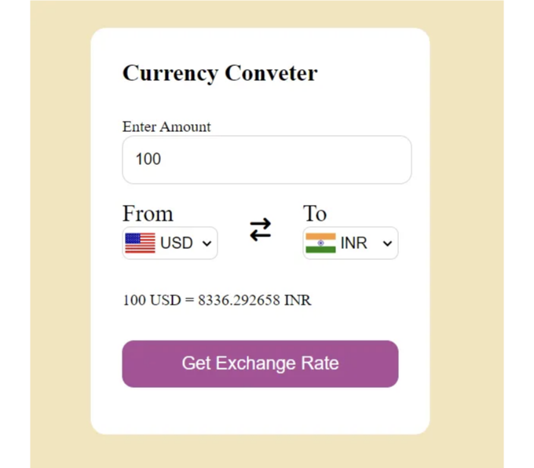

웹 개발 기술을 더 깊이 배워보시겠어요? 이번 튜토리얼에서는 HTML, CSS 및 JavaScript를 사용하여 처음부터 통화 변환기 웹 애플리케이션을 만드는 과정을 안내해 드릴 거에요.

소개: 통화 변환은 여행객, 투자자 및 글로벌 사업을 운영하는 사람들에게 일반적인 요구사항입니다. 웹 개발 기술의 힘을 이용하면 외부 API에서 실시간 환율을 가져와 통화 변환을 위한 사용자 친화적이고 효율적인 도구를 만들 수 있어요.

주요 기능:

<!-- ui-log 수평형 -->
<ins class="adsbygoogle"
  style="display:block"
  data-ad-client="ca-pub-4877378276818686"
  data-ad-slot="9743150776"
  data-ad-format="auto"
  data-full-width-responsive="true"></ins>
<component is="script">
(adsbygoogle = window.adsbygoogle || []).push({});
</component>

- 직관적인 사용자 인터페이스: 우리의 통화 변환기는 통화를 선택하기 쉽도록 드롭다운 메뉴를 제공합니다.
- 실시간 환율: 환율은 외부 API에서 동적으로 가져와 정확성과 신뢰성을 보장합니다.
- 시각적 표현: 국가를 나타내는 국기가 통화 옵션 옆에 표시되어 사용자 경험을 향상시킵니다.

작동 방법:

- HTML 구조: 먼저 입력 필드, 드롭다운 메뉴, 변환된 금액을 표시할 디스플레이 영역 등을 포함한 웹 페이지 구조를 만듭니다.
- CSS 스타일링: 다음으로 웹 페이지를 스타일링하여 시각적으로 매력적이고 사용자 친화적으로 만듭니다.
- JavaScript 기능: JavaScript를 사용하여 API에서 환전율을 가져오고 통화 선택 및 금액 입력과 같은 사용자 상호작용을 처리합니다.
- 외부 API 통합: 외부 API와 통화 변환기를 통합하여 실시간 환율을 가져옵니다.
- 테스팅 및 배포: 마지막으로 어플리케이션을 테스트하고 공개 액세스를 위해 호스팅 플랫폼에 배포합니다.

결론: 통화 변환기 웹 어플리케이션을 만드는 것은 재미있는 프로젝트일 뿐만 아니라 가치 있는 학습 경험입니다. HTML, CSS 및 JavaScript를 결합하여 실제 필요에 부응하는 실용적인 도구를 만들 수 있습니다. 초보자든 경험 있는 개발자든 이 튜토리얼을 통해 자신만의 웹 어플리케이션을 만들고 배포하는 능력을 갖출 수 있습니다.

<!-- ui-log 수평형 -->
<ins class="adsbygoogle"
  style="display:block"
  data-ad-client="ca-pub-4877378276818686"
  data-ad-slot="9743150776"
  data-ad-format="auto"
  data-full-width-responsive="true"></ins>
<component is="script">
(adsbygoogle = window.adsbygoogle || []).push({});
</component>

시작할 준비가 되셨나요? 튜토리얼을 따라가면서 새롭게 얻은 웹 개발 능력으로 친구들을 감탄시키세요!

Currency Converter 웹 앱을 여기에서 확인해보세요: Currency Converter 웹 앱

다음 블로그 포스트에서는 Currency Converter의 고급 기능 및 최적화에 대해 깊이 파헤치겠습니다.

즐거운 코딩 되세요!