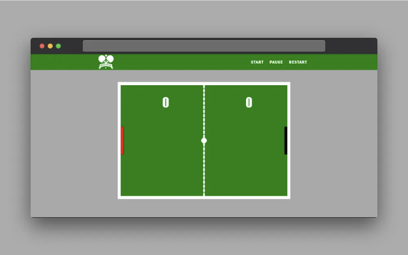

- 소개
- 프로젝트 개요
- 핑 퐁 게임의 특징
- 선행 요건
- 코드 구조
    - 단계 1. HTML 구조:
    - 단계 2. CSS 스타일링:
    - 단계 3. JavaScript 로직:
- 배운 점
- 프로젝트 플레이 방법
- 배포
- 향후 개선 사항
- 결론

# 소개

이 프로젝트는 HTML, CSS, 그리고 JavaScript의 기본 요소를 사용하여 즐겁고 상호작용적인 핑퐁 게임을 만드는 데 도움을 줄 것입니다. 이 과정을 통해 애니메이션, 사용자 참여, 그리고 게임의 기본 원칙에 관련된 중요한 기술들을 습득할 것입니다. 이는 웹 개발의 동적인 분야에 대한 훌륭한 입문서가 될 것입니다!

<!-- ui-log 수평형 -->
<ins class="adsbygoogle"
  style="display:block"
  data-ad-client="ca-pub-4877378276818686"
  data-ad-slot="9743150776"
  data-ad-format="auto"
  data-full-width-responsive="true"></ins>
<component is="script">
(adsbygoogle = window.adsbygoogle || []).push({});
</component>

# 프로젝트 개요

이 프로젝트는 웹 개발의 기본 구성 요소인 HTML, CSS 및 JavaScript을 사용하여 재미있고 플레이 가능한 탁구 게임을 만들 수 있도록 도와줍니다. 이 과정에서 애니메이션, 사용자 상호 작용 및 핵심 게임 메카닉스에 관련된 가치 있는 기술을 익힐 수 있습니다. 웹 개발의 흥미로운 세계로 첫걸음을 내딛는 좋은 기회입니다!

# 탁구 게임의 특징

이 프로젝트에서는 다음과 같은 특징을 갖춘 탁구 게임을 개발할 예정입니다:

<!-- ui-log 수평형 -->
<ins class="adsbygoogle"
  style="display:block"
  data-ad-client="ca-pub-4877378276818686"
  data-ad-slot="9743150776"
  data-ad-format="auto"
  data-full-width-responsive="true"></ins>
<component is="script">
(adsbygoogle = window.adsbygoogle || []).push({});
</component>

- 두 명용 패들: 게임에는 사용자와 컴퓨터용 패들이 포함되어 상호 작용하는 게임플레이를 가능하게 합니다.
- 공 움직임: 패들 간에 공이 움직이며, 플레이어들은 계속해서 공을 주고받아 게임을 이어나가야 합니다.
- 점수 추적: 게임은 양쪽 플레이어의 점수를 추적하며, 플레이어가 점수를 획득할 때마다 업데이트합니다.
- 시작, 일시정지, 다시 시작 버튼: 이러한 버튼을 통해 플레이어는 게임을 제어할 수 있으며, 필요에 따라 시작하거나 멈추거나 다시 시작할 수 있습니다.
- 간단한 AI: 게임에는 컴퓨터 패들을 제어하는 간단한 AI가 포함되어 있어 단일 플레이어 게임에 도전 요소를 더합니다.

# 준비 사항

이 핑퐁 게임을 만들기 위해 HTML, CSS 및 JavaScript의 기본적인 이해가 필요합니다. 응용 프로그램의 구조를 위한 HTML, 스타일링을 위한 CSS, 그리고 응용 프로그램 로직을 구현하기 위한 JavaScript에 익숙해야 합니다.

코드를 작성할 텍스트 편집기나 IDE(예: Visual Studio Code)가 필요하며, 테스트를 위해 웹 브라우저가 필요합니다. 선택 사항으로는 애플리케이션을 호스팅하기 위한 GitHub 계정이 포함될 수 있습니다.

<!-- ui-log 수평형 -->
<ins class="adsbygoogle"
  style="display:block"
  data-ad-client="ca-pub-4877378276818686"
  data-ad-slot="9743150776"
  data-ad-format="auto"
  data-full-width-responsive="true"></ins>
<component is="script">
(adsbygoogle = window.adsbygoogle || []).push({});
</component>

# 코드 구조

프로젝트용 새 폴더를 만들어주세요. 폴더 이름은 원하시는 대로 지으시고, 그 안에 index.html, style.css, 그리고 script.js라는 세 개의 파일을 만들어주세요. 이 파일들이 당신의 프로젝트의 기초가 될 것입니다. 이제 이 폴더를 텍스트 편집기나 IDE(예: Visual Studio Code)에서 열고 아래 단계를 따라주세요:

## 단계 1. HTML 구조:

index.html 파일을 열고 다음 HTML 코드를 병합하여 "핑퐁 게임"을 만들어보세요:

<!-- ui-log 수평형 -->
<ins class="adsbygoogle"
  style="display:block"
  data-ad-client="ca-pub-4877378276818686"
  data-ad-slot="9743150776"
  data-ad-format="auto"
  data-full-width-responsive="true"></ins>
<component is="script">
(adsbygoogle = window.adsbygoogle || []).push({});
</component>

위의 HTML 코드는 핑퐁 게임의 기본 구조를 설정합니다. 시작, 일시정지 및 재시작 버튼이 있는 헤더와 이미지 로고가 포함되어 있습니다. 게임 영역은 게임 렌더링을 위한 ping-pong id가 있는 캔버스 요소로 구성되어 있습니다.

스타일링을 위한 외부 CSS 파일과 게임 기능을 위한 JavaScript 파일에 대한 링크가 포함되어 있으며, 스크립트 태그는 최적의 로딩을 위해 defer로 설정되어 있습니다.

<!-- ui-log 수평형 -->
<ins class="adsbygoogle"
  style="display:block"
  data-ad-client="ca-pub-4877378276818686"
  data-ad-slot="9743150776"
  data-ad-format="auto"
  data-full-width-responsive="true"></ins>
<component is="script">
(adsbygoogle = window.adsbygoogle || []).push({});
</component>

`style.css` 파일을 열고 다음 CSS 코드를 붙여넣어 Ping Pong 게임을 스타일링하세요:

```js
*{
 margin: 0;
 padding: 0;
 box-sizing: border-box;
}

body{
 background-color: darkgrey;
}

.header {
 display: flex;
 align-items: center;
 justify-content: space-around;
 padding: 0.1em;
 margin-top: 0.1em;
 background-color: green;
}

.header img {
 width: 60px;
}

.buttons button {
 letter-spacing: 2px;
 text-transform: uppercase;
 border: none;
 color: white;
 background-color: green;
 padding: 10px;
 letter-spacing: 1px;
 font-size: 1em;
 font-weight: bold;
 font-family: 'Franklin Gothic Medium', 'Arial Narrow', Arial, sans-serif;
}

.buttons button:hover {
 text-decoration: underline;
 font-size: 1.05em;
}

.pong-wrapper {
 display: flex;
 justify-content: center;
 align-items: center;
 margin-top: 3em;
}

#ping-pong {
 width: 80%;
 max-width: 680px;
 border: 12px solid white;
}

@media screen and (max-width: 480px) {
 .header img {
  width: 40px;
 }
 .buttons button {
  letter-spacing: 1px;
  padding: 5px;
  letter-spacing: 1px;
  font-size: 0.7em;
 }

 .buttons button:hover {
  text-decoration: underline;
  font-size: 1.05em;
 }
}
```

이 CSS 코드는 탁구 게임 인터페이스를 스타일링합니다. body, 버튼과 로고가 있는 헤더, 그리고 주요 게임 영역에 대한 스타일이 포함되어 있습니다. 미디어 쿼리를 사용하여 작은 화면에 대한 스타일을 조정합니다.

## 단계 3. JavaScript 로직:

<!-- ui-log 수평형 -->
<ins class="adsbygoogle"
  style="display:block"
  data-ad-client="ca-pub-4877378276818686"
  data-ad-slot="9743150776"
  data-ad-format="auto"
  data-full-width-responsive="true"></ins>
<component is="script">
(adsbygoogle = window.adsbygoogle || []).push({});
</component>

'script.js' 파일을 열고 다음 JavaScript 코드를 사용하여 핑퐁 게임에 기능을 추가하세요:

```js
const canvas = document.querySelector("#ping-pong");

const context = canvas.getContext("2d");

const startBtn = document.querySelector(".start-btn");

const pauseBtn = document.querySelector(".pause-btn");

const restartBtn = document.querySelector(".restart-btn");

let gameRunning = false;

let animationId;

// 사용자 패들 생성
const user = {
 x: 0,
 y: canvas.height/2 - 100/2,
 width: 10,
 height: 100,
 color: "red",
 score: 0
}

// 컴퓨터 패들 생성
const computer = {
 x: canvas.width - 10,
 y: canvas.height/2 - 100/2,
 width: 10,
 height: 100,
 color: "black",
 score: 0
}

// 공 생성
const ball = {
 x: canvas.width / 2,
 y: canvas.height / 2,
 radius: 10,
 speed: 5,
 velocityX: 5,
 velocityY: 5,
 color: "white"
}

// 네트 생성
const net = {
 x: canvas.width/2 - 1,
 y: 0,
 width: 2,
 height: 10,
 color: "white"
}

restartBtn.addEventListener("click", () => {
 document.location.reload();
});

addEventListener("load", (event) => {
 render();
});

// 네트 그리기 함수
function drawNet() {
    const netWidth = 4; // 필요에 따라 네트 폭 조절
    const netSpacing = 15; // 필요에 따라 간격 조절

    // 왼쪽 절반 네트 그리기
    for (let i = 0; i <= canvas.height; i += netSpacing) {
        drawRectangle(net.x, net.y + i, netWidth, net.height, net.color);
    }

    // 오른쪽 절반 네트 그리기
    for (let i = 0; i <= canvas.height; i += netSpacing) {
        drawRectangle(net.x + net.width - netWidth, net.y + i, netWidth, net.height, net.color);
    }
}


// 직사각형 그리기 함수
function drawRectangle(x, y, w, h, color) {
 context.fillStyle = color;
 context.fillRect(x, y, w, h);
}

// 원 그리기 함수
function drawCircle(x, y, r, color) {
 context.fillStyle = color;
 context.beginPath();
 context.arc(x, y, r, 0, Math.PI * 2, false);
 context.closePath();
 context.fill();
}

// 텍스트 그리기 함수
function drawText(text, x, y, color) {
 context.fillStyle = color;
 context.font = "45px fantasy";
 context.fillText(text, x, y);
}

// 게임 렌더링 함수
function render() {
    // 캔버스 초기화
    drawRectangle(0, 0, canvas.width, canvas.height, "green");

    // 네트 그리기
    drawNet();

    // 점수 표시
    drawText(user.score, canvas.width / 4, canvas.height / 5, "white");
    drawText(computer.score, (3 * canvas.width) / 4, canvas.height / 5, "white");

    // 사용자 및 컴퓨터 패들 그리기
    drawRectangle(user.x, user.y, user.width, user.height, user.color);
    drawRectangle(computer.x, computer.y, computer.width, computer.height, computer.color);

    // 공 그리기
    drawCircle(ball.x, ball.y, ball.radius, ball.color);

    // 중앙의 흰색 선 그리기
    drawRectangle(net.x, net.y, net.width, canvas.height, net.color);
}

// 사용자 패들 제어
canvas.addEventListener("mousemove", movePaddle);

function movePaddle(evt) {
 let rectangle = canvas.getBoundingClientRect();

 user.y = evt.clientY - rectangle.top - user.height/2;
}

// 충돌 검출 함수
function collision(b, p) {
 b.top = b.y - b.radius;
 b.bottom = b.y + b.radius;
 b.left = b.x - b.radius;
 b.right = b.x + b.radius;

 p.top = p.y;
 p.bottom = p.y + p.height;
 p.left = p.x;
 p.right = p.x + p.width;

 return b.right > p.left && b.bottom > p.top && b.left < p.right && b.top < p.bottom; 
}

// 공 초기화 함수
function resetBall() {
 ball.x = canvas.width / 2;
 ball.y = canvas.height / 2;

 ball.speed = 5;
 ball.velocityX = -ball.velocityX;
}

// 업데이트 함수
function update() {
 ball.x += ball.velocityX;
 ball.y += ball.velocityY;

 // 컴퓨터 패들을 제어하는 간단한 AI
 let computerLevel = 0.1;
 computer.y += (ball.y - (computer.y + computer.height/2)) * computerLevel;

 if(ball.y + ball.radius > canvas.height || ball.y - ball.radius < 0) {
  ball.velocityY = -ball.velocityY;
 }

 let player = (ball.x < canvas.width/2) ? user : computer;

 if(collision(ball, player)) {
  // 공이 플레이어에 부딪힌 위치
  let collidePoint = ball.y - (player.y + player.height/2);

  // 정규화
  collidePoint = collidePoint / (player.height/2);

  // 라디안 각도 계산
  let angleRad = collidePoint * Math.PI/4;

  // 부딪힐 때 공의 X 방향
  let direction = (ball.x < canvas.width/2) ? 1 : -1;


  // X 및 Y 속도 변경
  ball.velocityX = direction * ball.speed * Math.cos(angleRad);

  ball.velocityY = ball.speed * Math.sin(angleRad);

  // 패들이 공을 받을 때 마다 속도 증가
  ball.speed += 0.5;
 }
 // 점수 업데이트
 if(ball.x - ball.radius < 0) {
  // 컴퓨터 1점 획득
  computer.score++;
  resetBall();
 } else if(ball.x + ball.radius > canvas.width){
  // 사용자 1점 획득
  user.score++;
  resetBall();
 }
}

// 게임 초기화 함수
function animate() {
    if(!gameRunning) {
        return; // 일시 중지된 경우 애니메이션을 계속하지 마세요.
    }

    update();
    render();
    animationId = requestAnimationFrame(animate);
}


startBtn.addEventListener("click", () => {
    if (!gameRunning) {
        gameRunning = true;
        animate();
    }
});

pauseBtn.addEventListener("click", () => {
    gameRunning = false;
    cancelAnimationFrame(animationId);
});
```

위의 JavaScript 코드는 HTML 캔버스와 JavaScript를 사용하여 핑퐁 게임을 설정합니다. 사용자 및 컴퓨터 패들, 공, 네트를 생성하고 충돌 검출, 점수 매기기, 패들 이동과 같은 게임 로직을 처리합니다. 게임 시작, 일시 중지, 재시작 버튼과 같은 게임 컨트롤용 이벤트 리스너를 포함합니다.

캔버스에 도형을 그리고 게임 요소를 업데이트하고 게임 루프를 애니메이션화하는 함수가 포함되어 있습니다. 컴퓨터 패들은 공의 수직 위치를 따르는 간단한 AI를 갖고 있습니다. 점수는 공이 패들을 지나치는 것을 기준으로 합니다. 공이 패들에 부딪힐 때마다 게임 속도가 증가합니다.

<!-- ui-log 수평형 -->
<ins class="adsbygoogle"
  style="display:block"
  data-ad-client="ca-pub-4877378276818686"
  data-ad-slot="9743150776"
  data-ad-format="auto"
  data-full-width-responsive="true"></ins>
<component is="script">
(adsbygoogle = window.adsbygoogle || []).push({});
</component>

# 배운 교훈

이 프로젝트를 통해 코딩에 뛰어들기 전에 게임 로직을 계획하고 디자인하는 중요성을 배웠어요. 또한 상호작용 웹 애플리케이션을 만드는 데 중요한 CSS 스타일링, JavaScript 이벤트 및 DOM 조작에 대한 이해력을 향상시켰습니다.

# 플레이 방법

핑퐁 게임을 플레이하려면 다음 단계를 따라주세요:

<!-- ui-log 수평형 -->
<ins class="adsbygoogle"
  style="display:block"
  data-ad-client="ca-pub-4877378276818686"
  data-ad-slot="9743150776"
  data-ad-format="auto"
  data-full-width-responsive="true"></ins>
<component is="script">
(adsbygoogle = window.adsbygoogle || []).push({});
</component>

- 게임 시작하기: 게임을 시작하려면 시작 버튼을 클릭하세요. 이렇게 하면 공이 움직이기 시작하고, 사용자 및 컴퓨터가 패들을 제어합니다.
- 패들 제어하기: 패들(즉, 빨간 패들)을 마우스로 상하로 이동하여 데스크톱에서 공을 쳐라.
- 공 치기: 패들로 공을 쳐서 게임을 계속 유지하려고 노력하세요. 공이 당신의 패들을 지나가서 뒤에 있는 화면 가장자리에 도달하면 상대방이 점수를 획득합니다.
- 점수 획득하기: 공이 상대의 패들을 지나가서 그들 뒤에있는 화면 가장자리에 도달할 때마다 당신은 한 점을 획득합니다.
- 게임 승리하기: 한 플레이어가 일정한 점수에 도달하거나 게임을 중지할 때까지 계속 플레이하세요. 해당 버튼을 사용하여 게임을 일시 중지하거나 다시 시작할 수 있습니다.

# 배포

핑퐁 게임 프로젝트는 GitHub Pages에서 호스팅되며 다음 링크를 방문하여 온라인으로 플레이할 수 있습니다:

게임하기: https://wasiu-akindoyin.github.io/Ping-Pong-Game-Web-Application/

<!-- ui-log 수평형 -->
<ins class="adsbygoogle"
  style="display:block"
  data-ad-client="ca-pub-4877378276818686"
  data-ad-slot="9743150776"
  data-ad-format="auto"
  data-full-width-responsive="true"></ins>
<component is="script">
(adsbygoogle = window.adsbygoogle || []).push({});
</component>

위의 텍스트를 친근한 톤으로 한국어로 번역하면 다음과 같습니다:

GitHub 저장소에 접속하여 소스 코드를 확인하거나 기여할 수 있습니다.

# 향후 개선 사항

앞으로 게임에 더 많은 기능을 추가할 계획입니다:

- 모바일 기기에 대한 향상된 반응성: 현재 버전이 데스크톱 기반임으로 휴대전화에서 게임을 즐길 수 있게 합니다.
- 다중 플레이어 지원
- 향상된 그래픽 및 애니메이션
- 플레이어 점수 및 게임 기록을 저장하기 위한 백엔드 서버 통합

<!-- ui-log 수평형 -->
<ins class="adsbygoogle"
  style="display:block"
  data-ad-client="ca-pub-4877378276818686"
  data-ad-slot="9743150776"
  data-ad-format="auto"
  data-full-width-responsive="true"></ins>
<component is="script">
(adsbygoogle = window.adsbygoogle || []).push({});
</component>

# 결론

HTML, CSS 및 JavaScript를 사용하여 핑퐁 게임을 만드는 것은 도전적이지만 보람있는 경험이었습니다. 게임 개발과 JavaScript 프로그래밍에 대해 유용한 통찰력을 얻었다고 생각합니다. 게임을 플레이하고 코드를 탐색하여 프론트엔드 개발에 대한 이해를 향상시키길 권유합니다.

만약 이 프로젝트 안내가 도움이 되었다면 박수를 보내주시고 공유하고 저를 팔로우해주세요. 프론트엔드 개발, 블록체인 네트워크 및 더 많은 것에 대해 더 배우기 위해 노력하겠습니다. 끝까지 함께해 주셔서 감사합니다. 다음 모임에서 뵙겠습니다.