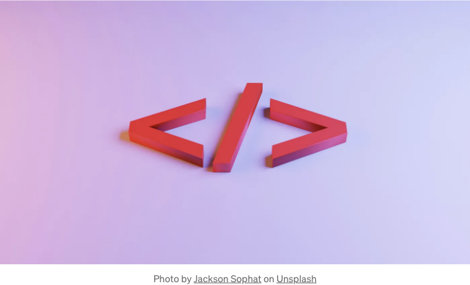

## CSS 구문:

- CSS는 선택자와 선언 블록으로 구성됩니다.
- 선택자는 HTML 요소를 대상으로 하며, 선언 블록에는 세미콜론으로 구분된 하나 이상의 속성-값 쌍이 포함됩니다.

## 선택자:

<!-- ui-log 수평형 -->
<ins class="adsbygoogle"
  style="display:block"
  data-ad-client="ca-pub-4877378276818686"
  data-ad-slot="9743150776"
  data-ad-format="auto"
  data-full-width-responsive="true"></ins>
<component is="script">
(adsbygoogle = window.adsbygoogle || []).push({});
</component>

- 셀렉터는 특정 HTML 요소를 스타일링하는 데 사용됩니다.
- 일반적인 셀렉터에는 엘리먼트 셀렉터 (예: p, h1, div), 클래스 셀렉터 (예: .classname), ID 셀렉터 (예: #idname) 및 하위 셀렉터 (예: 부모 자식)가 포함됩니다.

# 속성과 값:

- CSS 속성은 대상 요소의 모양과 동작을 정의합니다.
- 각 속성 뒤에는 콜론과 값이, 여러 속성은 세미콜론으로 구분됩니다.
- 속성 예시에는 color, font-size, margin, padding, background-color, border 등이 포함됩니다.

# 박스 모델:

<!-- ui-log 수평형 -->
<ins class="adsbygoogle"
  style="display:block"
  data-ad-client="ca-pub-4877378276818686"
  data-ad-slot="9743150776"
  data-ad-format="auto"
  data-full-width-responsive="true"></ins>
<component is="script">
(adsbygoogle = window.adsbygoogle || []).push({});
</component>

- CSS에서 레이아웃 및 위치 지정에 중요한 상자 모델을 이해하는 것이 중요합니다.
- 상자 모델은 콘텐츠, 안쪽 여백, 테두리 및 바깥쪽 여백으로 구성됩니다.
- 이러한 속성을 조절하면 웹 페이지의 요소의 크기, 간격 및 위치를 제어할 수 있습니다.

# 표시 및 위치 지정:

- CSS는 페이지의 요소를 배열하기 위한 다양한 표시 및 위치 지정 옵션을 제공합니다.
- 일반적인 표시 값으로는 블록, 인라인, 인라인-블록, 플렉스 및 그리드가 있습니다.
- 위치 지정 옵션에는 상대적, 절대적, 고정된 및 정적인 옵션이 포함됩니다.

# 반응형 디자인:

<!-- ui-log 수평형 -->
<ins class="adsbygoogle"
  style="display:block"
  data-ad-client="ca-pub-4877378276818686"
  data-ad-slot="9743150776"
  data-ad-format="auto"
  data-full-width-responsive="true"></ins>
<component is="script">
(adsbygoogle = window.adsbygoogle || []).push({});
</component>

- 다양한 기기가 증가함에 따라 다양한 화면 크기에 적응하는 반응형 레이아웃을 만드는 것이 중요합니다.
- CSS 미디어 쿼리를 활용하여 화면 너비, 높이 또는 기기 방향에 따라 특정 스타일을 적용할 수 있습니다.

## CSS 리셋과 프레임워크:

- CSS 리셋은 기본 브라우저 스타일을 제거하여 다양한 브라우저에서 스타일을 표준화하는 데 도움을 줍니다.
- Bootstrap 및 Foundation과 같은 CSS 프레임워크는 미리 구축된 CSS 구성 요소와 레이아웃을 제공하여 개발 속도를 높일 수 있습니다.

## 연습과 실험:

<!-- ui-log 수평형 -->
<ins class="adsbygoogle"
  style="display:block"
  data-ad-client="ca-pub-4877378276818686"
  data-ad-slot="9743150776"
  data-ad-format="auto"
  data-full-width-responsive="true"></ins>
<component is="script">
(adsbygoogle = window.adsbygoogle || []).push({});
</component>

- 다양한 레이아웃과 스타일을 만들어보며 CSS 개념을 강화하세요.
- 웹 요소에 미치는 효과를 발견하기 위해 CSS 속성과 값에 실험해보세요.

CSS 코드를 효과적으로 구성하기 위해 주석을 사용하고 관련된 스타일을 그룹화하며, Sass나 Less와 같은 CSS 전처리기를 활용하여 더 효율적인 스타일링을 해보세요. 내일은 더 고급 CSS 기술과 Best Practice에 대해 자세히 다룰 것입니다. CSS 스킬을 연마하다 보면 곧 웹 페이지를 아름답게 스타일링할 수 있는 능숙한 개발자가 될 것입니다!