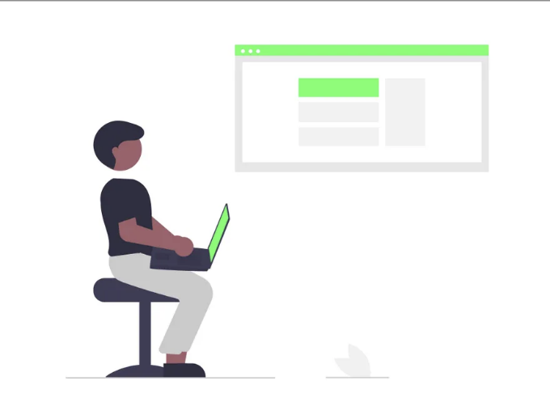
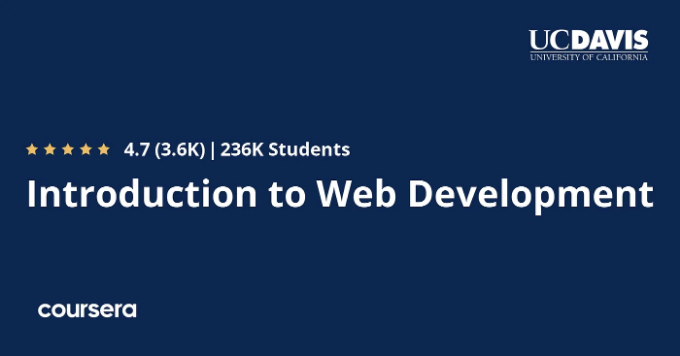
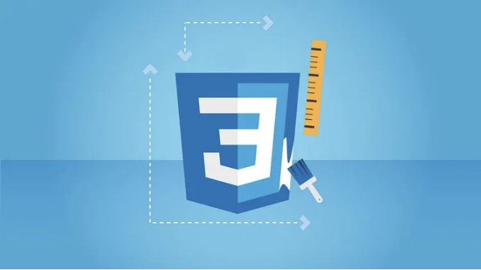
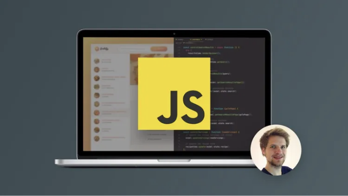
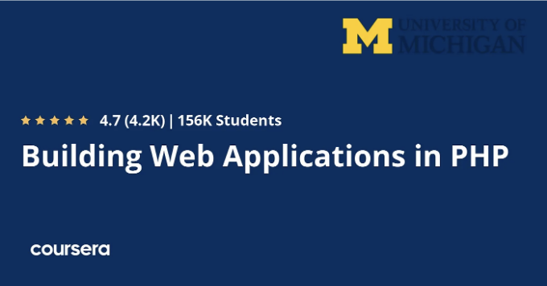
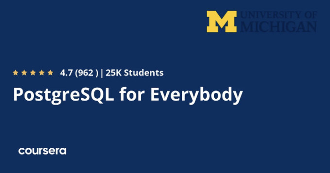
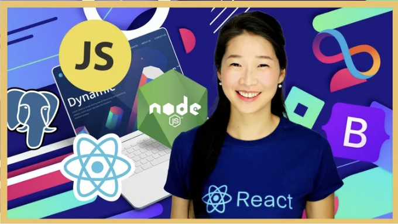

## 2024년에 웹 개발을 배우는 데 일주일, 한 달 또는 일년이 걸릴까요?

안녕하세요 여러분, 웹 개발을 배우고 웹 개발을 얼마나 배우고 웹 개발자가 될까요, 그러면 정확히 얼마나 시간이 걸릴지 궁금하다면 올바른 장소에 오신 것을 환영합니다.

이전에, 저는 최고의 웹 개발 코스 및 HTML, CSS, JavaScript 같은 필수 웹 개발 기술 및 React.js, Node.js와 같은 프레임워크를 배우는 데 사용되는 최고의 코스를 공유했었고 이번 기사에서는 여러분들이 웹 개발을 배우는 데 얼마나 시간이 걸리는지 정확히 말해드리겠습니다. 몇 주 또는 몇 달이 걸릴까요?

<!-- ui-log 수평형 -->
<ins class="adsbygoogle"
  style="display:block"
  data-ad-client="ca-pub-4877378276818686"
  data-ad-slot="9743150776"
  data-ad-format="auto"
  data-full-width-responsive="true"></ins>
<component is="script">
(adsbygoogle = window.adsbygoogle || []).push({});
</component>

지금 설립되는 어떤 회사도 웹 사이트가 없으면 안 되겠지요. 웹 사이트가 없으면 대상을 도달할 수 없고 관계를 구축하거나 서비스를 제공할 수 없습니다.

웹 개발은 프론트엔드, 백엔드 및 웹사이트 데이터베이스를 생성하는 과정이며, 이들은 올바르게 작동하기 위해 결합되어야 합니다. 이 글은 웹 개발자가 되는 방법과 소요 시간에 대해 이해하는 데 도움이 될 것입니다.

그런데 만약 완전한 초보자라면 Udemy의 The Complete 2024 Web Development Bootcamp과 같은 온라인 부트캠프 과정부터 시작할 수 있습니다. 이는 실제 부트캠프 수업의 일부분으로 이용할 수 있으며, Udemy 할인 행사에서 $9.9에 구매할 수 있습니다. 이 할인 행사는 가끔씩 열리며, 현재 할인 중일 수도 있습니다.

이 61시간 과정은 시작하기에 좋으며, 진지하게 따른다면 7일 또는 1주일 동안 웹 개발에 대해 많은 것을 배울 수 있습니다. 프로젝트와 코딩 연습이 가득해 실전 연습을 할 수 있습니다.

<!-- ui-log 수평형 -->
<ins class="adsbygoogle"
  style="display:block"
  data-ad-client="ca-pub-4877378276818686"
  data-ad-slot="9743150776"
  data-ad-format="auto"
  data-full-width-responsive="true"></ins>
<component is="script">
(adsbygoogle = window.adsbygoogle || []).push({});
</component>

# 1. 웹 개발을 이해하는 데는 얼마나 걸릴까요?

소개에서 정의된 대로 웹 개발은 프론트엔드 개발, 백엔드 개발, 데이터베이스 디자인 등 많은 기술을 필요로 합니다.

따라서 여러 언어와 프레임워크를 알아야 하기 때문에 각 섹션에 심층적으로 파고들기 위해서는 시간이 필요할 것입니다.

이런 기술들을 알아가는 데는 9개월에서 1년이 소요될 수 있지만, 아직까지는 구직자에게 매력적이지 않을 수 있어 아마 인턴십을 하거나 연봉 $66,106을 받는 입사 자리를 얻을 것입니다.

<!-- ui-log 수평형 -->
<ins class="adsbygoogle"
  style="display:block"
  data-ad-client="ca-pub-4877378276818686"
  data-ad-slot="9743150776"
  data-ad-format="auto"
  data-full-width-responsive="true"></ins>
<component is="script">
(adsbygoogle = window.adsbygoogle || []).push({});
</component>

# 2. 혼자 웹 개발을 배울 수 있을까요?

이 질문에 대한 간단한 대답은 "네"입니다. 대학에 다니지 않고 집에서 코스를 배우며 전문적인 웹 개발자가 될 수도 있습니다. 많은 돈과 시간을 투자하지 않고도 어떤 대기업들도 웹 개발자를 고용합니다.

# 3. 각 기술을 익히는 데 소요되는 시간은 얼마인가요?

웹 개발의 각 부분마다 배워야 할 언어가 있습니다. 각 회사가 사용하는 언어와 프레임워크가 다르기 때문에 특정 언어를 명확히 지정할 수 없습니다. 그러나 가장 많이 사용되는 몇 가지 언어를 추천하고, 이를 이해함으로써 다른 언어로 업그레이드할 수 있습니다:

<!-- ui-log 수평형 -->
<ins class="adsbygoogle"
  style="display:block"
  data-ad-client="ca-pub-4877378276818686"
  data-ad-slot="9743150776"
  data-ad-format="auto"
  data-full-width-responsive="true"></ins>
<component is="script">
(adsbygoogle = window.adsbygoogle || []).push({});
</component>

## 3.1. HTML

웹사이트의 디자인을 구성하는 가장 간단한 구조화된 언어입니다. 버튼을 어디에 놓을지, 텍스트를 어디에 쓸지, 이미지를 어디에 넣을지 등을 결정하는 데 사용됩니다. 본 코스인 '웹 개발 입문'은 여러분이 이 글에서 자세히 다룰 웹 개발에 필요한 HTML 및 다른 많은 언어를 배울 수 있도록 도와 드릴 것입니다. 그러나 HTML을 습득하는 데는 단 몇 일이면 충분합니다.

## 3.2. CSS

<!-- ui-log 수평형 -->
<ins class="adsbygoogle"
  style="display:block"
  data-ad-client="ca-pub-4877378276818686"
  data-ad-slot="9743150776"
  data-ad-format="auto"
  data-full-width-responsive="true"></ins>
<component is="script">
(adsbygoogle = window.adsbygoogle || []).push({});
</component>

그것은 HTML 페이지를 스타일링하는 데 사용되는 cascading style sheet의 약자이며, 버튼에 색상을 추가하는 등의 기능을 합니다. 좋은 규율을 갖추고 몇 달 동안 이 언어를 배우면 중급 수준의 CSS 능력을 갖출 수 있습니다. 그러나 이 "CSS — The Complete Guide 2024 (incl. Flexbox, Grid & Sass)" 과정은 이 언어의 기본 개념과 Flexbox, Grid, Sass와 같은 고급 개념을 가르쳐 줍니다.

### 3.3. JavaScript

이 언어는 어떤 다른 프로그래밍 언어보다 거의 가장 많이 사용되며, 웹 사이트를 상호 작용적으로 만들어 사용자 경험을 향상시킬 수 있습니다. JavaScript를 배우는 데는 몇 달이 걸릴 수 있지만, "The Complete JavaScript Course 2024: From Zero to Expert!" 이라는 이 과정은 두 달 안에 이 중요한 지식을 이해하는 데 도움이 될 것입니다.

<!-- ui-log 수평형 -->
<ins class="adsbygoogle"
  style="display:block"
  data-ad-client="ca-pub-4877378276818686"
  data-ad-slot="9743150776"
  data-ad-format="auto"
  data-full-width-responsive="true"></ins>
<component is="script">
(adsbygoogle = window.adsbygoogle || []).push({});
</component>

## 3.4. PHP

다음 웹 앱을 만들 때 사용할 수 있는 많은 백엔드 언어가 있지만 PHP는 웹의 79% 이상에서 사용되기 때문에 이 언어를 배우면 웹 개발자로 일자리를 구할 기회가 될 것입니다. PHP로 웹 애플리케이션을 개발하는 이 코스는 몇 일 만에 PHP 기본을 이해하는 데 도움이 될 것입니다!

<!-- ui-log 수평형 -->
<ins class="adsbygoogle"
  style="display:block"
  data-ad-client="ca-pub-4877378276818686"
  data-ad-slot="9743150776"
  data-ad-format="auto"
  data-full-width-responsive="true"></ins>
<component is="script">
(adsbygoogle = window.adsbygoogle || []).push({});
</component>

## 3.5. 데이터베이스

다양한 데이터베이스 유형과 소프트웨어가 있지만 가장 많이 사용되고 유명한 것 중 하나는 데이터를 저장하는 관계형 데이터베이스인 PostgreSQL 데이터베이스입니다. 본 강좌 '모두를 위한 PostgreSQL'를 통해 두 달 동안 이러한 기술을 익힐 수 있습니다.

# 4. 웹 개발자를 위한 교육 추천하기

<!-- ui-log 수평형 -->
<ins class="adsbygoogle"
  style="display:block"
  data-ad-client="ca-pub-4877378276818686"
  data-ad-slot="9743150776"
  data-ad-format="auto"
  data-full-width-responsive="true"></ins>
<component is="script">
(adsbygoogle = window.adsbygoogle || []).push({});
</component>

온라인 교육 플랫폼인 Coursera, edX, Udemy 등에서는 웹 개발 과정을 어디서나 수강할 수 있어요. 저는 웹 개발 분야에서 적어도 입문 수준이 되는 데 도움이 되는 몇 가지 강좌를 추천해 드릴게요:

### 4.1. 모두를 위한 웹 응용 프로그램

PHP 언어와 MySQL 데이터베이스를 사용하여 웹 응용 프로그램을 구축하는 것을 배울 수 있는 최고의 강좌 중 하나에요. PostgreSQL과 유사한 관계형 데이터베이스에 대한 내용도 포함돼 있어요.

### 4.2. 전체 2024 웹 개발 부트캠프

<!-- ui-log 수평형 -->
<ins class="adsbygoogle"
  style="display:block"
  data-ad-client="ca-pub-4877378276818686"
  data-ad-slot="9743150776"
  data-ad-format="auto"
  data-full-width-responsive="true"></ins>
<component is="script">
(adsbygoogle = window.adsbygoogle || []).push({});
</component>

이 강의는 HTML, CSS, 그리고 JavaScript와 같은 웹 기술을 사용하여 17시간의 비디오로 웹 프론트엔드를 구축하는 방법을 가르칠 것입니다. 실제 웹 개발 경험을 쌓기 위해 연습할 수 있는 세 가지 프로젝트가 포함되어 있습니다.

## 4.3. 8시간 동안 MySQL 데이터베이스

MySQL를 초보자들에게 가르칠 수 있는 좋은 아마존 책이 있습니다. 이 책은 데이터베이스 개발을 시작하고자 하는 학생들에게 적합하며, 웹 개발에도 유용할 것입니다.

<!-- ui-log 수평형 -->
<ins class="adsbygoogle"
  style="display:block"
  data-ad-client="ca-pub-4877378276818686"
  data-ad-slot="9743150776"
  data-ad-format="auto"
  data-full-width-responsive="true"></ins>
<component is="script">
(adsbygoogle = window.adsbygoogle || []).push({});
</component>