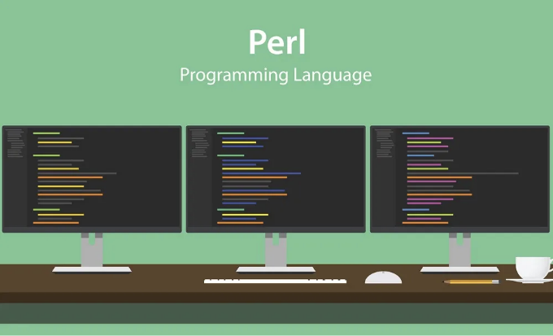

# 소개

Perl은 오랫동안 웹 개발을 위한 선호되는 스크립팅 언어로, 강력한 텍스트 처리 기능과 다양한 작업을 수행하기 쉽게 만드는 모듈들의 방대한 컬렉션을 제공합니다. Perl은 웹 애플리케이션의 백엔드 로직을 처리하는 한편, HTML과 CSS는 웹 페이지의 구조와 스타일을 제공하여 프론트엔드를 디자인하는 데 필수적입니다. 본 문서는 Perl 웹 애플리케이션에 HTML과 CSS를 통합하여 동적이고 시각적으로 매력적인 웹 콘텐츠를 만드는 방법을 안내합니다.

# Perl로 무대를 준비하기

<!-- ui-log 수평형 -->
<ins class="adsbygoogle"
  style="display:block"
  data-ad-client="ca-pub-4877378276818686"
  data-ad-slot="9743150776"
  data-ad-format="auto"
  data-full-width-responsive="true"></ins>
<component is="script">
(adsbygoogle = window.adsbygoogle || []).push({});
</component>

퍼플의 CGI (공통 게이트웨이 인터페이스) 모듈은 웹 콘텐츠를 동적으로 생성하는 인기 있는 방법입니다. CGI 스크립트는 웹 양식에서 사용자 입력을 처리하고 데이터베이스와 상호 작용하여 서버 측 데이터에 기반한 HTML 콘텐츠를 동적으로 생성할 수 있습니다. 이것은 시작할 수 있는 간단한 Perl CGI 스크립트입니다:

```perl
use CGI;
my $query = CGI->new;

print $query->header('text/html');
print $query->start_html('My Web Page');
print $query->h1('Hello, world!');
print $query->end_html;
```

이 스크립트는 헤더가 있는 기본 HTML 페이지를 생성합니다. CGI 모듈의 메서드인 header, start_html, h1 및 end_html은 해당 HTML 태그를 생성하는 데 도움이 됩니다.

# HTML 통합

<!-- ui-log 수평형 -->
<ins class="adsbygoogle"
  style="display:block"
  data-ad-client="ca-pub-4877378276818686"
  data-ad-slot="9743150776"
  data-ad-format="auto"
  data-full-width-responsive="true"></ins>
<component is="script">
(adsbygoogle = window.adsbygoogle || []).push({});
</component>

펄은 HTML 콘텐츠를 생성할 수 있지만, 펄 스크립트 내에서 대량의 HTML 코드를 유지하는 것은 번거로울 수 있습니다. 더 나은 방법은 HTML 템플릿을 사용하는 것입니다. 템플릿 툴킷은 비즈니스 로직과 프레젠테이션을 분리하여 응용 프로그램을 관리하고 확장하기 쉽게 만드는 강력한 펄 템플릿 시스템입니다.

템플릿 툴킷을 사용하려면 먼저 CPAN에서 모듈을 설치하세요:

```js
cpan Template
```

그런 다음, HTML 템플릿을 생성하세요 (여기서는 page.html이라고 해봅시다):

<!-- ui-log 수평형 -->
<ins class="adsbygoogle"
  style="display:block"
  data-ad-client="ca-pub-4877378276818686"
  data-ad-slot="9743150776"
  data-ad-format="auto"
  data-full-width-responsive="true"></ins>
<component is="script">
(adsbygoogle = window.adsbygoogle || []).push({});
</component>

```js
<!DOCTYPE html>
<html lang="en">
<head>
    <meta charset="UTF-8">
    <title>[% title %]</title>
</head>
<body>
    <h1>[% heading %]</h1>
    <p>[% content %]</p>
</body>
</html>
```

이 Perl 스크립트에서는 Template 모듈을 사용하여 이 템플릿을 처리합니다.

```js
use Template;

my $vars = {
    title => '나의 웹 페이지',
    heading => '안녕, 세상아!',
    content => '이것은 Perl로 생성된 웹 페이지입니다.',
};
my $template = Template->new();
$template->process('page.html', $vars) || die $template->error();
```

# CSS로 스타일 추가하기

<!-- ui-log 수평형 -->
<ins class="adsbygoogle"
  style="display:block"
  data-ad-client="ca-pub-4877378276818686"
  data-ad-slot="9743150776"
  data-ad-format="auto"
  data-full-width-responsive="true"></ins>
<component is="script">
(adsbygoogle = window.adsbygoogle || []).push({});
</component>

CSS는 HTML 콘텐츠의 시각적 표현을 향상시킵니다. CSS는 HTML 템플릿에 직접 포함하거나 외부 CSS 파일에 링크할 수 있습니다. 페이지.html 템플릿에 내부 CSS를 추가하는 방법은 다음과 같습니다:

```js
<head>
    <meta charset="UTF-8">
    <title>[% title %]</title>
    <style>
        body {
            font-family: Arial, sans-serif;
            margin: 40px;
        }
        h1 {
            color: #333366;
        }
        p {
            color: #666666;
        }
    </style>
</head>
```

외부 CSS의 경우, .css 파일을 만들고 HTML 템플릿에서 링크합니다:

```js
<head>
    <meta charset="UTF-8">
    <title>[% title %]</title>
    <link rel="stylesheet" href="style.css">
</head>
```

<!-- ui-log 수평형 -->
<ins class="adsbygoogle"
  style="display:block"
  data-ad-client="ca-pub-4877378276818686"
  data-ad-slot="9743150776"
  data-ad-format="auto"
  data-full-width-responsive="true"></ins>
<component is="script">
(adsbygoogle = window.adsbygoogle || []).push({});
</component>

그리고 style.css 파일에는 다음과 같은 내용이 있습니다:

```js
body {
    font-family: Arial, sans-serif;
    margin: 40px;
}

h1 {
    color: #333366;
}

p {
    color: #666666;
}
```

