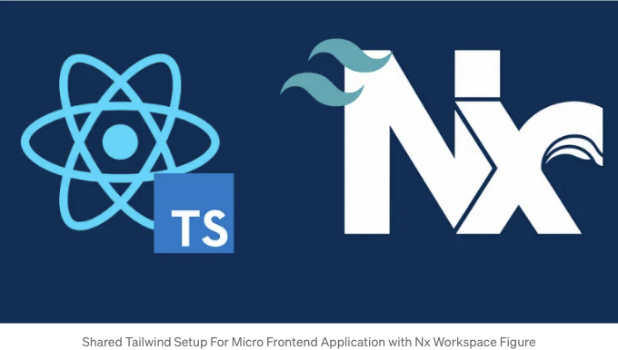
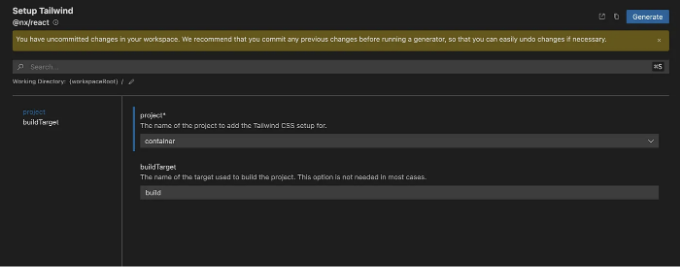
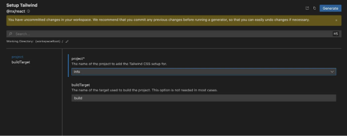
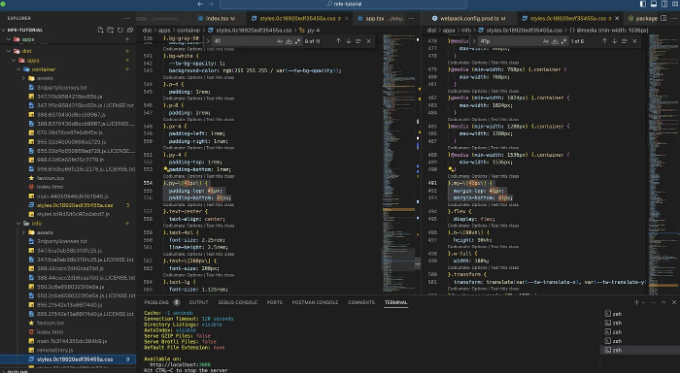

이 튜토리얼에서는 Nx Workspace를 사용하여 마이크로 프론트엔드 애플리케이션에 Tailwind CSS를 설정하는 과정을 안내합니다. Nx Workspace를 사용하여 호스트 및 리모트 애플리케이션을 만들고 두 애플리케이션 모두를 위해 Tailwind CSS를 구성합니다. 이 튜토리얼을 완료하면 마이크로 프론트엔드 애플리케이션에 Tailwind CSS를 설정하는 방법을 확실하게 이해하게 될 것입니다.

# 최종 구현 링크

마이크로 프론트엔드 아키텍처의 최종 구현은 다음 리포지토리 커밋에서 확인할 수 있습니다:

<!-- ui-log 수평형 -->
<ins class="adsbygoogle"
  style="display:block"
  data-ad-client="ca-pub-4877378276818686"
  data-ad-slot="9743150776"
  data-ad-format="auto"
  data-full-width-responsive="true"></ins>
<component is="script">
(adsbygoogle = window.adsbygoogle || []).push({});
</component>

- info와 container 애플리케이션에 Tailwind CSS 구성 추가

# 전제 조건

시작하기 전에 다음 사항이 설정되어 있는지 확인하십시오:

- ESLint, Prettier, Husky 구성과 함께 Nx Workspace를 만들기 위한 기본 레포지토리.
- Nx Workspace를 사용하여 Micro Frontend 아키텍처 구축.

<!-- ui-log 수평형 -->
<ins class="adsbygoogle"
  style="display:block"
  data-ad-client="ca-pub-4877378276818686"
  data-ad-slot="9743150776"
  data-ad-format="auto"
  data-full-width-responsive="true"></ins>
<component is="script">
(adsbygoogle = window.adsbygoogle || []).push({});
</component>

시작하기 전에이 자습서에서 사용할 도구 및 기술을 살펴 보겠습니다:

- Nx Workspace: Nx는 Google, Facebook 및 Microsoft와 같이 개발하는 데 도움이되는 모노레포용 확장 가능한 개발 도구 세트입니다.
- React: 사용자 인터페이스를 구축하기 위한 JavaScript 라이브러리입니다.
- Tailwind CSS: 사용자 정의 디자인을 신속하게 구축하기 위한 유틸리티 기반 CSS 프레임워크입니다.
- ESLint: JavaScript의 패턴을 식별하고 보고하는 데 사용되는 플러그인 가능하고 구성 가능한 린터 도구입니다.
- Prettier: 일관된 코드 스타일을 강제하는 의견이 분분한 코드 포매터입니다.
- Netlify: 지속적인 배포, 서버리스 함수 등을 제공하는 플랫폼입니다.

# 목차

- 최종 구현 링크
- 필수 조건
- 목차
- Nx Workspace 생성
- 호스트 애플리케이션 생성
- 원격 애플리케이션 생성
- Tailwind CSS 설치
- 컨테이너 애플리케이션용 Tailwind CSS 구성
- 정보 애플리케이션용 Tailwind CSS 구성
- Tailwind CSS 모든 애플리케이션의 프로덕션 및 개발 모드 테스트
- 결론
- 참고문헌

<!-- ui-log 수평형 -->
<ins class="adsbygoogle"
  style="display:block"
  data-ad-client="ca-pub-4877378276818686"
  data-ad-slot="9743150776"
  data-ad-format="auto"
  data-full-width-responsive="true"></ins>
<component is="script">
(adsbygoogle = window.adsbygoogle || []).push({});
</component>

# 컨테이너 애플리케이션을 위해 Tailwind CSS 구성하기

- 컨테이너 애플리케이션을 위해 Tailwind CSS를 구성하기 전에, tailwindcss 패키지와 @tailwindcss/forms 플러그인을 다운로드해야 합니다. 이미 이러한 패키지를 설치하지 않았다면 다음 명령을 실행하여 설치할 수 있습니다:

```js
pnpm add -D @tailwindcss/forms tailwindcss
```

컨테이너 애플리케이션을 위해 Tailwind CSS를 구성하려면 다음 단계를 따라야 합니다:

<!-- ui-log 수평형 -->
<ins class="adsbygoogle"
  style="display:block"
  data-ad-client="ca-pub-4877378276818686"
  data-ad-slot="9743150776"
  data-ad-format="auto"
  data-full-width-responsive="true"></ins>
<component is="script">
(adsbygoogle = window.adsbygoogle || []).push({});
</component>

- 다음 명령을 실행하여 컨테이너 애플리케이션에 Tailwind CSS 플러그인을 추가하세요:

```js
pnpm exec nx generate @nx/react:setup-tailwind --project=container --no-interactive --dry-run
```



위 명령을 실행하거나 Nx 콘솔을 사용한 후에는 Nx가 컨테이너 애플리케이션을 위해 Tailwind CSS 플러그인을 자동으로 구성할 수 있습니다.

<!-- ui-log 수평형 -->
<ins class="adsbygoogle"
  style="display:block"
  data-ad-client="ca-pub-4877378276818686"
  data-ad-slot="9743150776"
  data-ad-format="auto"
  data-full-width-responsive="true"></ins>
<component is="script">
(adsbygoogle = window.adsbygoogle || []).push({});
</component>

- 프로젝트의 루트 디렉토리에 기본 Tailwind 구성 파일을 생성하세요.

```js
// tailwind.base.config.js
/** @type {import('tailwindcss').Config} */
module.exports = {
  content: [
    './apps/**/*.{js,ts,jsx,tsx}',
    './packages/**/*.{js,ts,jsx,tsx}',
    './{src,pages,components,app}/**/*.{ts,tsx,html}',
  ],
  theme: {
    extend: {
      colors: {
        primary: {
          DEFAULT: '#3366ff',
          50: '#f0f4ff',
          100: '#f0f4ff',
          200: '#d9e2ff',
          300: '#a6c1ff',
          400: '#598bff',
          500: '#3366ff',
          600: '#274bdb',
          700: '#1a34b8',
          800: '#102694',
          900: '#091c7a',
        },
      },
    },
  },
  plugins: [require('@tailwindcss/forms')],
};
```

- 컨테이너 응용 프로그램의 tailwind.config.js 파일을 다음 내용으로 업데이트하세요:

```js
/* eslint-disable @typescript-eslint/unbound-method */
/* eslint-disable @typescript-eslint/no-var-requires */
const { createGlobPatternsForDependencies } = require('@nx/react/tailwind');
const { join } = require('path');
const baseConfig = require('../../tailwind.base.config');

/** @type {import('tailwindcss').Config} */
module.exports = {
  content: [
    ...(baseConfig?.content || []),
    join(
      __dirname,
      '{src,pages,components,app}/**/*!(*.stories|*.spec).{ts,tsx,html}'
    ),
    ...createGlobPatternsForDependencies(__dirname),
    // INFO : Add the following line to include the tailwind styles from the info application
    ...createGlobPatternsForDependencies(join(__dirname, 'apps/info')),
  ],
  ...baseConfig,
};
```

<!-- ui-log 수평형 -->
<ins class="adsbygoogle"
  style="display:block"
  data-ad-client="ca-pub-4877378276818686"
  data-ad-slot="9743150776"
  data-ad-format="auto"
  data-full-width-responsive="true"></ins>
<component is="script">
(adsbygoogle = window.adsbygoogle || []).push({});
</component>

# 정보 애플리케이션을 위한 Tailwind CSS 구성하기

Tailwind CSS를 정보 애플리케이션에 구성하기 위해서는 다음 단계를 따라야 합니다:

- 다음 명령어를 실행하여 info 애플리케이션에 Tailwind CSS 플러그인을 추가합니다:

```js
pnpm exec nx generate @nx/react:setup-tailwind --project=info --no-interactive --dry-run
```

<!-- ui-log 수평형 -->
<ins class="adsbygoogle"
  style="display:block"
  data-ad-client="ca-pub-4877378276818686"
  data-ad-slot="9743150776"
  data-ad-format="auto"
  data-full-width-responsive="true"></ins>
<component is="script">
(adsbygoogle = window.adsbygoogle || []).push({});
</component>



명령을 실행하거나 Nx 콘솔을 사용한 후, Nx는 info 애플리케이션을 위해 Tailwind CSS 플러그인을 자동으로 구성할 수 있습니다.

- info 애플리케이션의 tailwind.config.js 파일을 다음 내용으로 업데이트하십시오:

```js
/* eslint-disable @typescript-eslint/unbound-method */
/* eslint-disable @typescript-eslint/no-var-requires */
const { createGlobPatternsForDependencies } = require('@nx/react/tailwind');
const { join } = require('path');
const baseConfig = require('../../tailwind.base.config');

/** @type {import('tailwindcss').Config} */
module.exports = {
  content: [
    ...(baseConfig?.content || []),
    join(
      __dirname,
      '{src,pages,components,app}/**/*!(*.stories|*.spec).{ts,tsx,html}'
    ),
    ...createGlobPatternsForDependencies(__dirname),
  ],
  ...baseConfig,
};
```  

<!-- ui-log 수평형 -->
<ins class="adsbygoogle"
  style="display:block"
  data-ad-client="ca-pub-4877378276818686"
  data-ad-slot="9743150776"
  data-ad-format="auto"
  data-full-width-responsive="true"></ins>
<component is="script">
(adsbygoogle = window.adsbygoogle || []).push({});
</component>

# 테일윈드 CSS 전체 애플리케이션 프로덕션 및 개발 모드에 대한 테스트

컨테이너 및 정보 애플리케이션에 테일윈드 CSS를 구성한 후에는 애플리케이션을 프로덕션 및 개발 모드로 테스트할 수 있습니다.

- 우선 정보 애플리케이션에서 사용자 지정 동적 테일윈드 스타일을 테스트할 수 있습니다.

```js
// apps/info/src/app/app.tsx
export function App() {
  return (
    <main>
      <h1>Welcome to info!</h1>
      <p>This is a remote app that is part of the Nx plugin for Webpack 5.</p>
      <section className="bg-gray-50 shadow-sm p-4 rounded-lg">
        <h2 className="text-4xl font-bold text-center border-b-4 border-b-primary py-[41px]">
          Info
        </h2>
        <p className="text-lg text-center my-[41px]">
          This app is a remote app that is part of the Nx plugin for Webpack 5.
        </p>
      </section>
    </main>
  );
}

export default App;
```

<!-- ui-log 수평형 -->
<ins class="adsbygoogle"
  style="display:block"
  data-ad-client="ca-pub-4877378276818686"
  data-ad-slot="9743150776"
  data-ad-format="auto"
  data-full-width-responsive="true"></ins>
<component is="script">
(adsbygoogle = window.adsbygoogle || []).push({});
</component>

- 다음 단계에서는 Info 애플리케이션에서 사용자 정의 애니메이션 테일윈드 스타일을 테스트할 수 있습니다.

아래 스타일을 tailwind.base.config.js 파일에 추가해보세요.

```js
/** @type {import('tailwindcss').Config} */
module.exports = {
  content: [
    './apps/**/*.{js,ts,jsx,tsx}',
    './packages/**/*.{js,ts,jsx,tsx}',
    './{src,pages,components,app}/**/*.{ts,tsx,html}',
  ],
  theme: {
    extend: {
      colors: {
        primary: {
          DEFAULT: '#3366ff',
          50: '#f0f4ff',
          100: '#f0f4ff',
          200: '#d9e2ff',
          300: '#a6c1ff',
          400: '#598bff',
          500: '#3366ff',
          600: '#274bdb',
          700: '#1a34b8',
          800: '#102694',
          900: '#091c7a',
        },
      },
      // INFO : 다음 애니메이션 스타일을 추가합니다
      animation: {
        wiggle: 'wiggle 1s ease-in-out infinite',
      },
      // INFO : 다음 키프레임 스타일을 추가합니다
      keyframes: {
        wiggle: {
          '0%, 100%': { transform: 'rotate(-3deg)' },
          '50%': { transform: 'rotate(3deg)' },
        },
      },
    },
  },
  plugins: [require('@tailwindcss/forms')],
};
```

- 이 애니메이션 스타일을 Info 애플리케이션에서 사용하세요. 이렇게 함으로써 Info 제목에 `wiggle` 애니메이션을 추가하고 `tailwind.base.config.js` 파일에서 프라이머리 색상을 사용합니다.

<!-- ui-log 수평형 -->
<ins class="adsbygoogle"
  style="display:block"
  data-ad-client="ca-pub-4877378276818686"
  data-ad-slot="9743150776"
  data-ad-format="auto"
  data-full-width-responsive="true"></ins>
<component is="script">
(adsbygoogle = window.adsbygoogle || []).push({});
</component>

```js
// apps/info/src/app/app.tsx
export function App() {
  return (
    <main>
      <h1>Welcome to info!</h1>
      <p>This is a remote app that is part of the Nx plugin for Webpack 5.</p>
      <section className="bg-gray-50 shadow-sm p-4 rounded-lg">
        <h2 className="text-4xl font-bold text-center border-b-4 border-b-primary py-[40px]">
          {/* INFO : 다음 줄 스타일이 추가되었습니다 */}
          <p className="animate-wiggle p-8 text-primary-700">Info</p>
        </h2>
        <p className="text-lg text-center my-[40px]">
          This app is a remote app that is part of the Nx plugin for Webpack 5.
        </p>
      </section>
    </main>
  );
}

export default App;
```

- 컨테이너 애플리케이션 테일윈드 스타일을 테스트합니다.

```js
// apps/container/src/pages/home/index.tsx
import SocialLinks from '../../components/social-links';

export default function HomePage() {
  return (
    <div className="h-[90vh] flex flex-col justify-center items-center bg-gray-100 gap-y-4 w-full">
      <p className="text-[200px] animate-wiggle">🌍</p>
      <h1 className="text-primary text-4xl font-bold">
        Welcome to the Container!
      </h1>
      <p className="text-lg text-primary-400">
        This is the container app that consumes the remote app info.
      </p>
      <p className="text-lg text-gray-400">
        It was created with the Nx plugin for Webpack 5.
      </p>
      <SocialLinks />
    </div>
  );
}
```

```js
const socialLinks = [
  {
    name: '🔗 LinkedIn',
    url: 'https://www.linkedin.com/in/serifcolakel/',
  },
  {
    name: '🔗 Twitter',
    url: 'https://twitter.com/ColakelSerif',
  },
];

export default function SocialLinks() {
  return (
    <div className="flex flex-row divide-x-2 md:w-1/3 w-full divide-black justify-center items-center border py-4 rounded-lg bg-white">
      {socialLinks.map(({ name, url }) => (
        <a
          className="px-4 hover:underline text-primary-400 text-xl"
          href={url}
          key={name}
          rel="noreferrer"
          target="_blank"
        >
          {name}
        </a>
      ))}
    </div>
  );
}
```

<!-- ui-log 수평형 -->
<ins class="adsbygoogle"
  style="display:block"
  data-ad-client="ca-pub-4877378276818686"
  data-ad-slot="9743150776"
  data-ad-format="auto"
  data-full-width-responsive="true"></ins>
<component is="script">
(adsbygoogle = window.adsbygoogle || []).push({});
</component>

- 마지막 단계에서는 컨테이너 및 정보 애플리케이션의 동적 스타일과 애니메이션을 빌드에서 확인할 수 있습니다.

- 다음 명령을 실행하여 프로덕션 모드로 컨테이너 및 정보 애플리케이션을 빌드하세요:

```js
rm -rf dist
```

```js
pnpm run serve:info
```

<!-- ui-log 수평형 -->
<ins class="adsbygoogle"
  style="display:block"
  data-ad-client="ca-pub-4877378276818686"
  data-ad-slot="9743150776"
  data-ad-format="auto"
  data-full-width-responsive="true"></ins>
<component is="script">
(adsbygoogle = window.adsbygoogle || []).push({});
</component>

```js
// apps/container/webpack.config.prod.ts
import { withReact } from '@nx/react';
import { withModuleFederation } from '@nx/react/module-federation';
import { composePlugins, ModuleFederationConfig, withNx } from '@nx/webpack';

import baseConfig from './module-federation.config';
const prodConfig: ModuleFederationConfig = {
  ...baseConfig,
  /*
   * 프로덕션용 원격 재정의.
   * 각 항목은 고유한 이름과 배포된 URL의 쌍입니다.
   *
   * 예:
   * remotes: [
   *   ['app1', 'http://app1.example.com'],
   *   ['app2', 'http://app2.example.com'],
   * ]
   *
   * 필요에 따라 원격 remoteEntry.js 파일의 전체 경로도 사용할 수 있습니다.
   *
   * remotes: [
   *   ['app1', 'http://example.com/path/to/app1/remoteEntry.js'],
   *   ['app2', 'http://example.com/path/to/app2/remoteEntry.js'],
   * ]
   */
  remotes: [['info', 'http://localhost:3001/']], // INFO : 프로덕션을 위해 URL 변경 old: remotes: [['info', 'https://relaxed-mochi-7581fa.netlify.app/']],
};
// Nx 옵션 및 컨텍스트에서 config 개체를 빌드하기 위한 webpack용 Nx 플러그인.
export default composePlugins(
  withNx(),
  withReact(),
  withModuleFederation(prodConfig)
);
```

```js
pnpm run serve:container
```

- 애플리케이션을 빌드한 후에는 dist 폴더에서 style.css 테일윈드 스타일 및 애니메이션을 볼 수 있습니다.


```

<!-- ui-log 수평형 -->
<ins class="adsbygoogle"
  style="display:block"
  data-ad-client="ca-pub-4877378276818686"
  data-ad-slot="9743150776"
  data-ad-format="auto"
  data-full-width-responsive="true"></ins>
<component is="script">
(adsbygoogle = window.adsbygoogle || []).push({});
</component>

# 결론

이 튜토리얼에서는 Nx Workspace를 사용하여 마이크로 프론트앤드 애플리케이션에 Tailwind CSS를 설정하는 방법을 배웠습니다. Nx Workspace를 사용하여 호스트 및 원격 애플리케이션을 만들고 두 애플리케이션 모두를 위해 Tailwind CSS를 구성했습니다. 또한 제품 및 개발 모드에서 애플리케이션을 테스트하여 Tailwind CSS 스타일이 올바르게 작동하는지 확인했습니다. 이 튜토리얼을 따르면 이제 마이크로 프론트앤드 애플리케이션을 위해 Tailwind CSS를 설정하는 방법에 대한 탄탄한 이해가 있어야 합니다.


