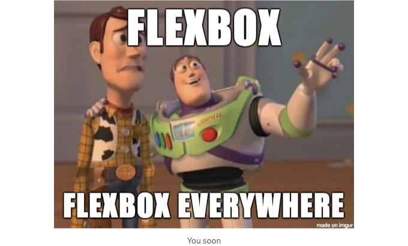

플렉스박스는 1차원 레이아웃을 구축하기 위한 관련 CSS 속성 모음입니다. 플렉스박스의 주요 아이디어는 컨테이너 요소 내의 빈 공간이 자식 요소에 의해 자동으로 나눠진다는 것입니다. 이 때 자식 요소의 크기나 컨테이너 자체의 크기와 상관없이 나눠집니다. 플렉스박스는 또한 부모 컨테이너 내에서 항목들을 수평 및 수직으로 쉽게 정렬할 수 있게 해줍니다. 따라서 수직 가운데 정렬 및 자식 요소 간 너비 또는 높이의 균일한 분포와 같은 과제들은 단순함으로 해결됩니다. 저와 함께 시작부터 끝까지, Flexbox의 모든 잠재력을 발휘해보세요.

매우 기본적인 예제부터 시작해봅시다:

```js
<div class="box-container">
   <div class="box-red"></div>
   <div class="box-green"></div>
   <div class="box-blue"></div>
   <div class="box-yellow"></div>
   <div class="box-cyan"></div>
   <div class="box-magenta"></div>
</div>
```  

<!-- ui-log 수평형 -->
<ins class="adsbygoogle"
  style="display:block"
  data-ad-client="ca-pub-4877378276818686"
  data-ad-slot="9743150776"
  data-ad-format="auto"
  data-full-width-responsive="true"></ins>
<component is="script">
(adsbygoogle = window.adsbygoogle || []).push({});
</component>

```js
.box-container {
  height: 450px;
  width: 450px;
  background-color: gray;
}

.box-red {
  height: 50px;
  width: 50px;
  background-color: red;
}

.box-green {
  height: 50px;
  width: 50px;
  background-color: green;
}

.box-blue {
  height: 50px;
  width: 50px;
  background-color: blue;
}

.box-yellow {
  height: 50px;
  width: 50px;
  background-color: yellow;
}

.box-cyan {
  height: 50px;
  width: 50px;
  background-color: cyan;
}

.box-magenta {
  height: 50px;
  width: 50px;
  background-color: magenta;
}
```

위 코드의 결과는:

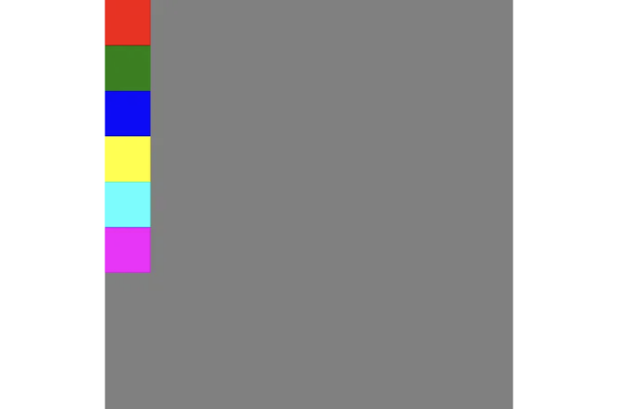

여기서 HTML의 블록 수준 요소의 매우 기본적인 측면을 만납니다: 블록 수준 요소는 항상 새 줄에서 시작됩니다.

<!-- ui-log 수평형 -->
<ins class="adsbygoogle"
  style="display:block"
  data-ad-client="ca-pub-4877378276818686"
  data-ad-slot="9743150776"
  data-ad-format="auto"
  data-full-width-responsive="true"></ins>
<component is="script">
(adsbygoogle = window.adsbygoogle || []).push({});
</component>

지금은 우리 컨테이너를 "display" 속성을 "flex"로 설정하여 플렉스 컨테이너로 변환해 보겠습니다.

```css
.box-container {
  display: flex;
  height: 450px;
  width: 450px;
  background-color: gray;
}
```

아래는 출력 결과입니다:

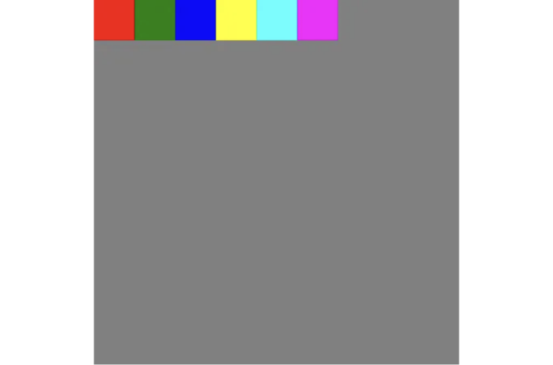

<!-- ui-log 수평형 -->
<ins class="adsbygoogle"
  style="display:block"
  data-ad-client="ca-pub-4877378276818686"
  data-ad-slot="9743150776"
  data-ad-format="auto"
  data-full-width-responsive="true"></ins>
<component is="script">
(adsbygoogle = window.adsbygoogle || []).push({});
</component>

우리가 플렉스 컨테이너를 만들 때, 해당 컨테이너의 직계 자식들은 모두 플렉스 아이템이 되어 블록 수준 요소로 발생할 수 있는 줄 바꿈을 무시하고 행으로 정렬되게 됩니다.

자, 우리가 더 진행하기 전에, 함께 사용할 Flexbox 용어 몇 가지에 익숙해지도록 해요. 이해를 돕기 위해 아래 이미지를 참고해주세요.

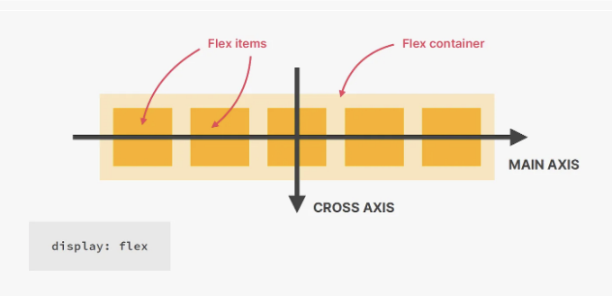

- Flex Container(플렉스 컨테이너): 하나 이상의 플렉스 아이템을 포함하는 부모 요소입니다. 플렉스 컨테이너를 설정하려면 CSS 속성 "display"를 사용하여 컨테이너 요소에 "flex" 또는 "inline-flex" 값을 설정합니다.
- Flex Item(플렉스 아이템): 플렉스 모델을 사용하여 배치된 플렉스 컨테이너의 직계 자식 요소들입니다. 각각의 플렉스 아이템은 플렉스 컨테이너 내에서 커질 수 있고 줄어들 수 있으며 정렬될 수 있습니다.
- Main Axis(메인 축): 플렉스 아이템이 플렉스 컨테이너 내에서 배치되는 기본 축입니다. 이는 "flex-direction" 속성에 의해 결정됩니다. 예를 들어, "flex-direction"이 기본값인 "row"로 설정된 경우, 메인 축은 메인 시작부터 메인 끝까지 수평으로 표시됩니다.
- Cross Axis(교차 축): 플렉스 컨테이너 내에서 메인 축과 수직인 축입니다. 플렉스 아이템이 배치되는 방향과 수직입니다. 예를 들어, "flex-direction"이 "row"로 설정된 경우, 교차 축은 교차 시작부터 교차 끝까지 세로로 진행됩니다.
- Main Start 및 Main End: 이 용어들은 플렉스 컨테이너 내의 메인 축의 시작점과 끝점을 가리킵니다. 메인 시작은 메인 축이 시작되는 곳이고, 메인 끝은 끝나는 곳입니다. 플렉스 아이템을 메인 축을 따라 정렬하는 것은 "justify-content"와 같은 속성으로 제어됩니다.
- Cross Start 및 Cross End: 비슷하게, 이 용어들은 플렉스 컨테이너 내의 교차 축의 시작점과 끝점을 가리킵니다. 교차 시작은 교차 축이 시작되는 곳이고, 교차 끝은 끝나는 곳입니다. 플렉스 아이템을 교차 축을 따라 정렬하는 것은 "align-items" 및 "align-self"와 같은 속성으로 제어됩니다.

<!-- ui-log 수평형 -->
<ins class="adsbygoogle"
  style="display:block"
  data-ad-client="ca-pub-4877378276818686"
  data-ad-slot="9743150776"
  data-ad-format="auto"
  data-full-width-responsive="true"></ins>
<component is="script">
(adsbygoogle = window.adsbygoogle || []).push({});
</component>

자, 이제 우리의 코드 예제로 돌아가서 flex 컨테이너에 적용된 몇 가지 속성을 테스트해 봅시다.

gap: `length`를 사용하지 않고 항목 사이에 공간을 만듭니다.

0 | `length`


<!-- ui-log 수평형 -->
<ins class="adsbygoogle"
  style="display:block"
  data-ad-client="ca-pub-4877378276818686"
  data-ad-slot="9743150776"
  data-ad-format="auto"
  data-full-width-responsive="true"></ins>
<component is="script">
(adsbygoogle = window.adsbygoogle || []).push({});
</component>

`justify-content`: 주요 축(기본적으로 수평)을 따라 항목을 정렬하는 데 사용됩니다.

- `flex-start`: 항목을 컨테이너의 주요 축의 시작 부분에 정렬합니다. 이것은 이제까지 보아온 기본 동작입니다.
- `flex-end`: 항목을 컨테이너의 주요 축 끝 부분에 정렬합니다.

<!-- ui-log 수평형 -->
<ins class="adsbygoogle"
  style="display:block"
  data-ad-client="ca-pub-4877378276818686"
  data-ad-slot="9743150776"
  data-ad-format="auto"
  data-full-width-responsive="true"></ins>
<component is="script">
(adsbygoogle = window.adsbygoogle || []).push({});
</component>


center: 컨테이너의 주축을 따라 항목들을 가운데 정렬합니다.


space-between: 첫 번째 항목이 시작점에 정렬되고 마지막 항목이 끝점에 정렬되며, 주축을 따라 항목을 동일한 간격으로 분배합니다.

<!-- ui-log 수평형 -->
<ins class="adsbygoogle"
  style="display:block"
  data-ad-client="ca-pub-4877378276818686"
  data-ad-slot="9743150776"
  data-ad-format="auto"
  data-full-width-responsive="true"></ins>
<component is="script">
(adsbygoogle = window.adsbygoogle || []).push({});
</component>


space-around: 주축을 따라 항목들을 균등하게 분배하면서 첫 번째와 마지막 항목 주변에 공간을 포함합니다. 시작 및 끝 갭은 각 항목 사이의 공간의 반입니다.


space-evenly: 주축을 따라 항목을 균등하게 분배하면서 주변과 각 항목 사이에 동일한 공간을 제공합니다.

<!-- ui-log 수평형 -->
<ins class="adsbygoogle"
  style="display:block"
  data-ad-client="ca-pub-4877378276818686"
  data-ad-slot="9743150776"
  data-ad-format="auto"
  data-full-width-responsive="true"></ins>
<component is="script">
(adsbygoogle = window.adsbygoogle || []).push({});
</component>


align-items: 교차 축을 따라 항목을 정렬합니다 (기본적으로 수직으로)

stretch | flex-start | flex-end | center | baseline

stretch: 항목을 컨테이너의 교차 축을 채우도록 늘립니다. 이를 통해 항목이 수직으로 확장되어 컨테이너의 전체 높이를 채울 수 있습니다. 지금까지 각 상자에 50px의 미리 정의된 높이가 있으므로 stretch의 효과를 보지 못했었지만, 이제 녹색 상자의 높이 속성을 제거하면 어떻게 되는지 확인해보세요.

<!-- ui-log 수평형 -->
<ins class="adsbygoogle"
  style="display:block"
  data-ad-client="ca-pub-4877378276818686"
  data-ad-slot="9743150776"
  data-ad-format="auto"
  data-full-width-responsive="true"></ins>
<component is="script">
(adsbygoogle = window.adsbygoogle || []).push({});
</component>

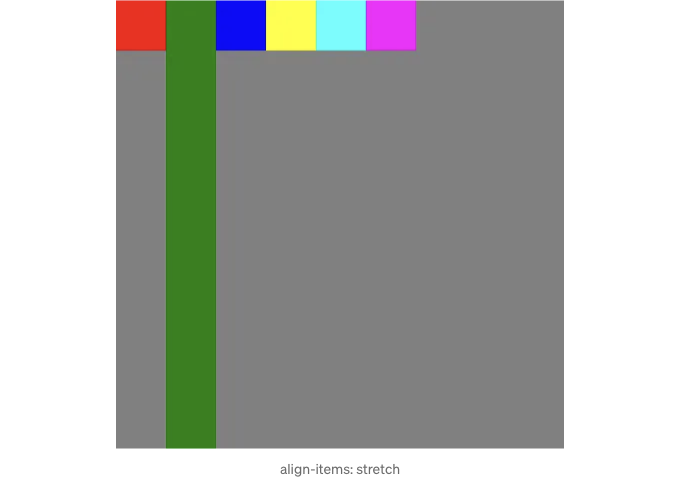

MDN에서 stretch에 대해 설명한 내용입니다:

flex-start: 항목들을 컨테이너의 교차 축 시작 부분에 정렬합니다.

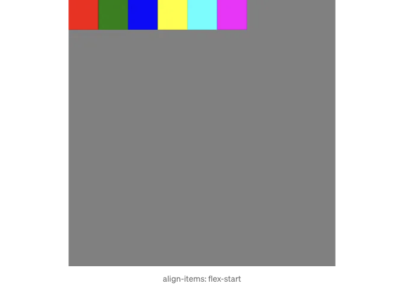

<!-- ui-log 수평형 -->
<ins class="adsbygoogle"
  style="display:block"
  data-ad-client="ca-pub-4877378276818686"
  data-ad-slot="9743150776"
  data-ad-format="auto"
  data-full-width-responsive="true"></ins>
<component is="script">
(adsbygoogle = window.adsbygoogle || []).push({});
</component>

flex-end: 아이템을 컨테이너의 교차 축 끝에 정렬합니다.

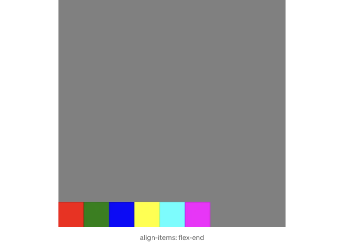

center: 아이템을 컨테이너의 교차 축을 기준으로 가운데 정렬합니다.

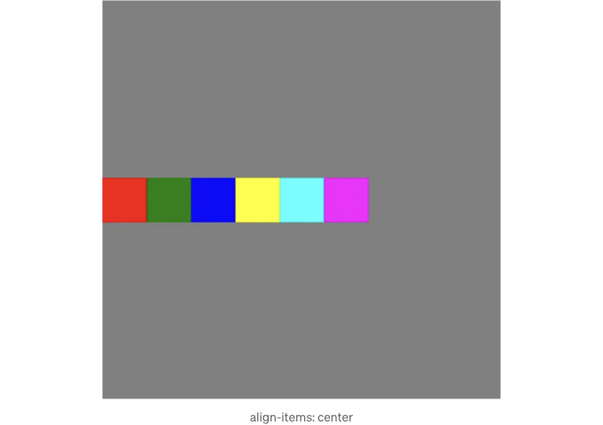

<!-- ui-log 수평형 -->
<ins class="adsbygoogle"
  style="display:block"
  data-ad-client="ca-pub-4877378276818686"
  data-ad-slot="9743150776"
  data-ad-format="auto"
  data-full-width-responsive="true"></ins>
<component is="script">
(adsbygoogle = window.adsbygoogle || []).push({});
</component>

baseline: 항목들의 기준선을 일치시킵니다. 기준선은 문자가 앉는 가상의 선으로 타이포그래피에서 사용되는 개념입니다. 이를 더 잘 이해하기 위해 우리의 녹색 상자의 높이를 100px로 변경해 봅시다.

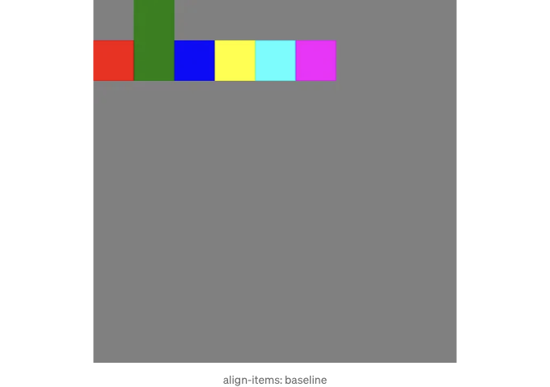

flex-direction: 주축을 정의합니다

row | row-reverse | column | column-reverse

<!-- ui-log 수평형 -->
<ins class="adsbygoogle"
  style="display:block"
  data-ad-client="ca-pub-4877378276818686"
  data-ad-slot="9743150776"
  data-ad-format="auto"
  data-full-width-responsive="true"></ins>
<component is="script">
(adsbygoogle = window.adsbygoogle || []).push({});
</component>

row: 플렉스 항목들은 왼쪽(왼에서 오른쪽으로 - LTR 언어) 또는 오른쪽(오른에서 왼쪽으로 - RTL 언어)에서 시작하여 반대쪽으로 수평으로 흐르는 행에 배치됩니다. 이것이 기본 동작입니다.

row-reverse: 플렉스 항목들은 왼쪽(왼에서 오른쪽으로 - LTR 언어) 또는 오른쪽(오른에서 왼쪽으로 - RTL 언어)에서 시작하여 반대쪽으로 수평으로 흐르는 행에 배치됩니다.


column: 플렉스 항목들은 위에서 시작하여 수직으로 아래로 흐르는 샬을 형성합니다.

<!-- ui-log 수평형 -->
<ins class="adsbygoogle"
  style="display:block"
  data-ad-client="ca-pub-4877378276818686"
  data-ad-slot="9743150776"
  data-ad-format="auto"
  data-full-width-responsive="true"></ins>
<component is="script">
(adsbygoogle = window.adsbygoogle || []).push({});
</component>

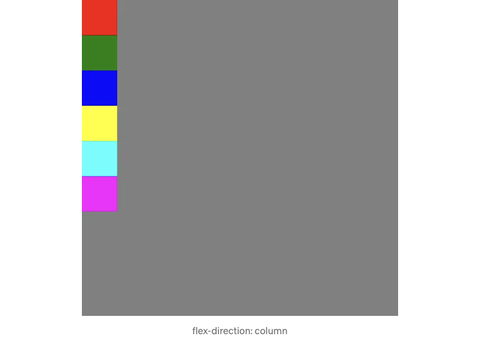

- `column-reverse`: Flex 항목이 열에 배치되며, 아래에서 시작하여 위로 세로로 흐릅니다.

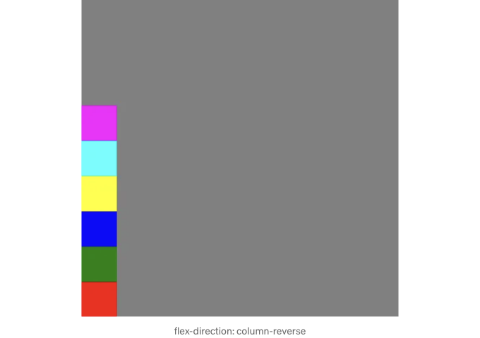

- `flex-wrap`: 항목들이 너무 크면 새 줄로 랩핑되도록 허용합니다.

<!-- ui-log 수평형 -->
<ins class="adsbygoogle"
  style="display:block"
  data-ad-client="ca-pub-4877378276818686"
  data-ad-slot="9743150776"
  data-ad-format="auto"
  data-full-width-responsive="true"></ins>
<component is="script">
(adsbygoogle = window.adsbygoogle || []).push({});
</component>

nowrap | wrap | wrap-reverse

nowrap: Flex 아이템들이 한 줄에 배치됩니다. 이는 메인 축에 충분한 공간이 없어도 다음 줄로 넘어가지 않는다는 것을 의미합니다. 이는 기본 동작입니다.

wrap: 필요에 따라 Flex 아이템이 여러 줄로 줄바꿈됩니다. 한 줄에 모든 항목이 들어갈 공간이 충분하지 않으면 다음 줄로 이동합니다. 마지막 두 상자의 너비를 200px로 설정하여 이 기능을 시도해보세요.

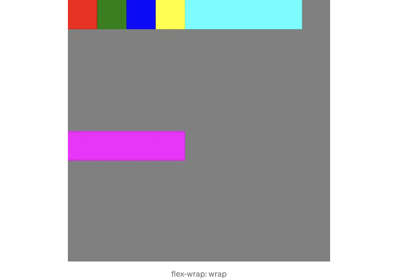

<!-- ui-log 수평형 -->
<ins class="adsbygoogle"
  style="display:block"
  data-ad-client="ca-pub-4877378276818686"
  data-ad-slot="9743150776"
  data-ad-format="auto"
  data-full-width-responsive="true"></ins>
<component is="script">
(adsbygoogle = window.adsbygoogle || []).push({});
</component>

이제 이 텍스트와 줄 사이 간격이 존재하는 이유가 "align-content: stretch"의 기본값 때문이라는 것이 궁금할 수 있습니다. 곧 이에 대해 설명하겠습니다.

wrap-reverse: wrap과 동일하게 작동하지만 cross start와 cross end가 교환됩니다.

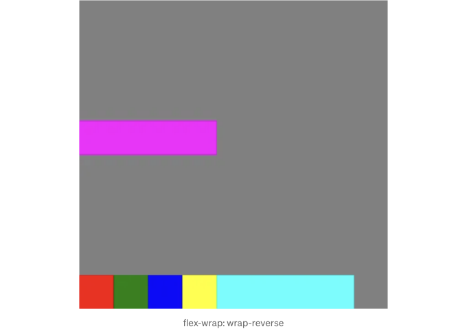

align-content: 여러 줄이 있는 경우에만 적용되며, flex-wrap: wrap으로 설정된 경우에만 효과가 있습니다.

<!-- ui-log 수평형 -->
<ins class="adsbygoogle"
  style="display:block"
  data-ad-client="ca-pub-4877378276818686"
  data-ad-slot="9743150776"
  data-ad-format="auto"
  data-full-width-responsive="true"></ins>
<component is="script">
(adsbygoogle = window.adsbygoogle || []).push({});
</component>

테이블 태그를 마크다운 형식으로 변경해주세요.

| stretch | flex-start | flex-end | center | space-between | space-around |

- stretch: 위에서 보았듯이 flex 라인을 컨테이너의 교차 축으로 채우도록 늘립니다.

- flex-start: flex 라인을 컨테이너의 교차 축 시작 부분에 정렬합니다.

- flex-end: flex 라인을 컨테이너의 교차 축 끝 부분에 정렬합니다.

<!-- ui-log 수평형 -->
<ins class="adsbygoogle"
  style="display:block"
  data-ad-client="ca-pub-4877378276818686"
  data-ad-slot="9743150776"
  data-ad-format="auto"
  data-full-width-responsive="true"></ins>
<component is="script">
(adsbygoogle = window.adsbygoogle || []).push({});
</component>

표 태그를 Markdown 형식으로 변경합니다.

| 값             | 설명                                                                                                                                                                      |
|----------------|---------------------------------------------------------------------------------------------------------------------------------------------------------------------------|
| center         | 컨테이너의 교차 축을 따라 플렉스 라인들을 가운데 정렬합니다.                                                                                                                     |
| space-between  | 첫 번째 라인이 시작 부분에 정렬되고 마지막 라인이 끝 부분에 정렬된 상태로 교차 축을 따라 플렉스 라인들을 균일하게 분배합니다.                                                   |
| space-around   | 플렉스 라인들을 교차 축을 따라 균일하게 분배하되 각 라인 주위에 동일한 공간이 있습니다. 시작과 끝 여백은 각 라인 간의 공간의 절반에 해당합니다.                   |
| space-evenly   | 플렉스 라인들을 교차 축을 따라 균일하게 분배하되 각 라인 주위와 사이에 동일한 공간이 있습니다.                                                                          |

<!-- ui-log 수평형 -->
<ins class="adsbygoogle"
  style="display:block"
  data-ad-client="ca-pub-4877378276818686"
  data-ad-slot="9743150776"
  data-ad-format="auto"
  data-full-width-responsive="true"></ins>
<component is="script">
(adsbygoogle = window.adsbygoogle || []).push({});
</component>

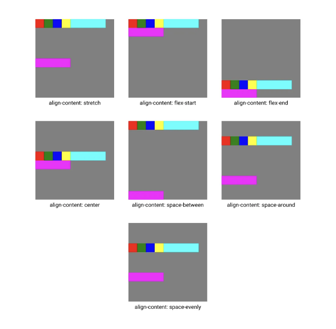

지금까지 플렉스 컨테이너에서 사용 가능한 가장 중요한 속성들과 그들이 어떻게 작동하는지 살펴보았습니다. 이제 한 발자국 더 나아가서 각 플렉스 아이템을 개별적으로 관리할 수 있는 속성들을 살펴봅시다.

align-self: 개별 플렉스 아이템에 대한 align-items를 덮어씁니다.

auto | stretch | flex-start | flex-end | center | baseline

<!-- ui-log 수평형 -->
<ins class="adsbygoogle"
  style="display:block"
  data-ad-client="ca-pub-4877378276818686"
  data-ad-slot="9743150776"
  data-ad-format="auto"
  data-full-width-responsive="true"></ins>
<component is="script">
(adsbygoogle = window.adsbygoogle || []).push({});
</component>

`flex-grow`: 메인 축을 따라 여분의 공간이 생겼을 때 컨테이너 내 다른 플렉스 아이템에 비해 얼마나 더 많이 성장할지 결정합니다.

0 | `integer`

하나의 상자에 이 기능을 테스트해 봅시다:

```js
.box-magenta {
  flex-grow: 1;
  height: 50px;
  width: 50px;
  background-color: magenta;
}
```

<!-- ui-log 수평형 -->
<ins class="adsbygoogle"
  style="display:block"
  data-ad-client="ca-pub-4877378276818686"
  data-ad-slot="9743150776"
  data-ad-format="auto"
  data-full-width-responsive="true"></ins>
<component is="script">
(adsbygoogle = window.adsbygoogle || []).push({});
</component>

결과:


우리가 볼 수 있듯이, 메인 축에서 남은 모든 공간(각 상자의 너비가 50px이므로 여기서는 150px)은 flex-grow를 1로 설정한 상자에 의해 차지됩니다. flex-grow는 사용 가능한 공간의 비율을 나타내는 단위가 없는 숫자이며, 다른 상자들은 기본적으로 flex-grow에 대해 값을 0으로 가지므로 자홍색 상자가 나머지 공간을 차지합니다.

다음 코드 조각을 시도해 봅시다:

<!-- ui-log 수평형 -->
<ins class="adsbygoogle"
  style="display:block"
  data-ad-client="ca-pub-4877378276818686"
  data-ad-slot="9743150776"
  data-ad-format="auto"
  data-full-width-responsive="true"></ins>
<component is="script">
(adsbygoogle = window.adsbygoogle || []).push({});
</component>

```js
.box-cyan {
  flex-grow: 2;
  height: 50px;
  width: 50px;
  background-color: cyan;
}

.box-magenta {
  flex-grow: 3;
  height: 50px;
  width: 50px;
  background-color: magenta;
}
```

여기서 공간의 나머지 150픽셀은 각각 배율이 2와 3인 두 상자로 나누어집니다. 이는 150픽셀을 5부분으로 나누어서 2개를 박스-시안에 할당하고 나머지 3개를 박스-마젠타에 할당하는 것을 의미합니다. 결과:


모든 플렉스 항목에 flex-grow 값이 1이었다면, 각 항목이 사용 가능한 공간을 동일하게 차지하게 됩니다.```

<!-- ui-log 수평형 -->
<ins class="adsbygoogle"
  style="display:block"
  data-ad-client="ca-pub-4877378276818686"
  data-ad-slot="9743150776"
  data-ad-format="auto"
  data-full-width-responsive="true"></ins>
<component is="script">
(adsbygoogle = window.adsbygoogle || []).push({});
</component>

테이블 태그를 마크다운 형식으로 변경하세요.

flex-shrink: 메인 축을 따라 충분한 공간이 없을 때, flex 항목이 컨테이너 내 다른 flex 항목에 비해 얼마나 줄어드는지를 결정합니다.

1 | `정수`

flex-shrink에 대해서는 조금 복잡한 부분이 있습니다. 몇 가지 예시를 통해 이해해 보겠습니다:

```js
.box-container {
  display: flex;
  height: 450px;
  width: 240px;
  background-color: gray;
}
```

<!-- ui-log 수평형 -->
<ins class="adsbygoogle"
  style="display:block"
  data-ad-client="ca-pub-4877378276818686"
  data-ad-slot="9743150776"
  data-ad-format="auto"
  data-full-width-responsive="true"></ins>
<component is="script">
(adsbygoogle = window.adsbygoogle || []).push({});
</component>

저희 컨테이너 너비를 450px에서 240px로 변경하려고 합니다. 이렇게 하면 각 상자가 50px씩 주어진 주축에 맞지 않게 됩니다 (총 300px). flex-wrap의 기본값은 nowrap임을 염두에 두세요.


개발자 도구를 열고 각 상자를 검사하면 50px 대신 40px의 너비를 갖는 것을 알 수 있습니다. 이것은 모든 flex 항목이 기본적으로 flex-shrink 값이 1인 것 때문입니다. 모든 flex 항목이 같은 수축 요소를 가지고 있기 때문에 초과된 60px의 공간이 균등하게 각 상자에서 차감됩니다. 이는 모든 상자가 각각 10px씩 줄어 들게 됨을 의미합니다.

이제 어려운 부분이 나왔네요. 유감스럽게도, flex-shrink는 flex-grow만큼 부드럽게 작동하지 않습니다. 이는 flex 항목이 얼마나 줄어들지는 해당 항목의 초기 크기뿐만 아니라 flex-shrink 값에도 의존하기 때문입니다. 이 문제에 대해 우리는 어떤 문제도 겪지 않았습니다. 왜냐하면 우리의 모든 상자가 50px의 너비를 갖고 있었기 때문입니다. 이를 바꿔보고 분석해 봅시다:

<!-- ui-log 수평형 -->
<ins class="adsbygoogle"
  style="display:block"
  data-ad-client="ca-pub-4877378276818686"
  data-ad-slot="9743150776"
  data-ad-format="auto"
  data-full-width-responsive="true"></ins>
<component is="script">
(adsbygoogle = window.adsbygoogle || []).push({});
</component>

```js
.box-container {
  display: flex;
  height: 450px;
  width: 300px;
  background-color: gray;
}

.box-red {
  height: 50px;
  width: 50px;
  background-color: red;
}

.box-green {
  height: 50px;
 width: 50px;
  background-color: green;
}

.box-blue {
  height: 50px;
  width: 50px;
  background-color: blue;
}

.box-yellow {
  height: 50px;
  width: 50px;
  background-color: yellow;
}

.box-cyan {
  height: 50px;
  width: 50px;
  background-color: cyan;
}

.box-magenta {
  height: 50px;
  width: 150px;
  background-color: magenta;
}
```

출력:

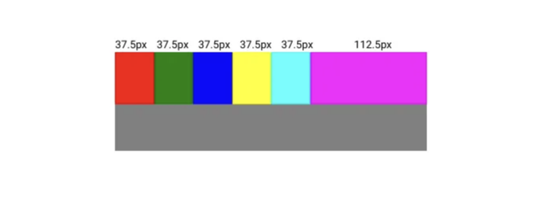

보시다시피, 상자들의 `flex-shrink` 속성을 명시적으로 설정하지 않아서 기본값인 1로 설정되었습니다. 현재 우리의 지식으로는 각 상자가 주축에 맞게 동일한 양(16.66px)으로 축소될 것으로 예상할 수 있습니다. 그러나 사실은 그런 방식으로 작동하지 않습니다. 각 상자의 초기 크기가 개별적으로 축소되는 양을 평가하는 데 별도의 요소로 계산됩니다. 따라서 폭이 50px인 상자는 가상의 축소 요소인 1을, 폭이 150px인 상자는 가상의 축소 요소인 3을 가지고 있다고 말할 수 있습니다. 이러한 요소들을 모두 합하면 8이 됩니다. 초과된 공간(100px)을 총 요소 개수(8)로 나누면, 각 요소당 줄여야 할 크기를 계산하고 최종 결과를 찾을 수 있습니다.```

<!-- ui-log 수평형 -->
<ins class="adsbygoogle"
  style="display:block"
  data-ad-client="ca-pub-4877378276818686"
  data-ad-slot="9743150776"
  data-ad-format="auto"
  data-full-width-responsive="true"></ins>
<component is="script">
(adsbygoogle = window.adsbygoogle || []).push({});
</component>

이 속성에 대한 마지막 예시까지 함께 하겠어요:

```js
.box-container {
  display: flex;
  height: 450px;
  width: 370px;
  background-color: gray;
}

.box-red {
  height: 50px;
  width: 100px;
  background-color: red;
}

.box-green {
  flex-shrink: 3;
  height: 50px;
  width: 100px;
  background-color: green;
}

.box-blue {
  flex-shrink: 5;
  height: 50px;
  width: 75px;
  background-color: blue;
}

.box-yellow {
  height: 50px;
  width: 150px;
  background-color: yellow;
}

.box-cyan {
  height: 50px;
  width: 25px;
  background-color: cyan;
}

.box-magenta {
  flex-shrink: 4;
  height: 50px;
  width: 200px;
  background-color: magenta;
}
```

결과:


<!-- ui-log 수평형 -->
<ins class="adsbygoogle"
  style="display:block"
  data-ad-client="ca-pub-4877378276818686"
  data-ad-slot="9743150776"
  data-ad-format="auto"
  data-full-width-responsive="true"></ins>
<component is="script">
(adsbygoogle = window.adsbygoogle || []).push({});
</component>

여기에 자세한 해결책이 있어요:

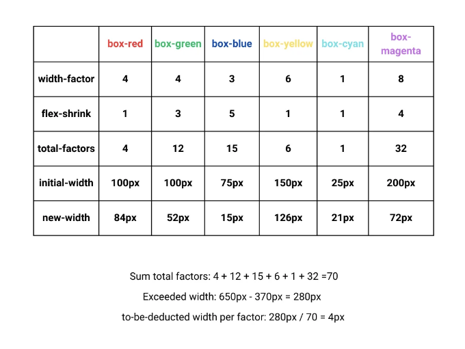

아직도 헷갈리는 점이 있다면, 매우 유용하게 찾은 이 Stack Overflow 게시물을 확인해볼 수 있어요.

flex-basis: 남아 있는 공간이 분배되기 전에 flex 아이템의 초기 크기를 지정합니다.

<!-- ui-log 수평형 -->
<ins class="adsbygoogle"
  style="display:block"
  data-ad-client="ca-pub-4877378276818686"
  data-ad-slot="9743150776"
  data-ad-format="auto"
  data-full-width-responsive="true"></ins>
<component is="script">
(adsbygoogle = window.adsbygoogle || []).push({});
</component>

auto | content |`length`

auto: 브라우저는 플렉스 항목의 컨텐츠를 기반으로 초기 크기를 계산합니다.

content: 초기 크기는 컨텐츠의 크기만을 기반으로 하며 지정된 너비 또는 높이는 무시됩니다. 저희 상자 중 하나의 flex-basis를 content로 설정하면, 해당 상자가 사라지는 것을 보실 수 있습니다. 왜냐하면 해당 상자에는 컨텐츠가 없기 때문입니다.

`length`: 항목의 너비를 정의하기 위해 길이(픽셀 또는 퍼센트)로 설정할 수 있으며 width 속성 대신 사용할 수 있습니다.


<!-- ui-log 수평형 -->
<ins class="adsbygoogle"
  style="display:block"
  data-ad-client="ca-pub-4877378276818686"
  data-ad-slot="9743150776"
  data-ad-format="auto"
  data-full-width-responsive="true"></ins>
<component is="script">
(adsbygoogle = window.adsbygoogle || []).push({});
</component>

테이블 태그를 Markdown 형식으로 변경하면 다음과 같습니다.

```md
flex: 하나의 선언으로 flex-grow, flex-shrink 및 flex-basis 속성을 결합하는 권장 단축 속성입니다.

0 1 auto | `int` `int` `len`

다음 속성으로 넘어가기 전에, 모든 flex 항목에 동일한 너비를 제공하는 인기 있는 속임수를 보여드릴게요. 사용할 속임수는 flex: 1이며, flex-grow, flex-shrink 및 flex-basis에 각각 1, 1, 0% 값을 설정합니다.

```

<!-- ui-log 수평형 -->
<ins class="adsbygoogle"
  style="display:block"
  data-ad-client="ca-pub-4877378276818686"
  data-ad-slot="9743150776"
  data-ad-format="auto"
  data-full-width-responsive="true"></ins>
<component is="script">
(adsbygoogle = window.adsbygoogle || []).push({});
</component>

아래는 마법이 작동하는 방법입니다. flex-basis와 flex-grow가 함께 작동합니다. flex-basis를 0%로 설정한 후에 남은 공간(모든 기초가 0이기 때문에 모든 공간이 남게 됩니다)은 flex-grow에 기반하여 비율적으로 분배됩니다. 그리고 모든 flex에 대해 flex-grow가 1이기 때문에 모두 같은 너비를 가지게 됩니다.

order: flex 항목이 컨테이너 내에서 나타나는 순서를 제어합니다. 기본적으로 flex 항목은 0의 order 값을 가집니다. 음수 값은 항목을 표시 순서 상에서 더 앞으로 이동시키고, 양수 값은 뒤로 이동시킵니다.

<!-- ui-log 수평형 -->
<ins class="adsbygoogle"
  style="display:block"
  data-ad-client="ca-pub-4877378276818686"
  data-ad-slot="9743150776"
  data-ad-format="auto"
  data-full-width-responsive="true"></ins>
<component is="script">
(adsbygoogle = window.adsbygoogle || []).push({});
</component>

0 | `int`

예시:

```js
.box-container {
  display: flex;
  height: 450px;
  width: 450px;
  background-color: gray;
}

.box-red {
  order: 3;
  height: 50px;
  width: 50px;
  background-color: red;
}

.box-green {
  order: 5;
  height: 50px;
  width: 50px;
  background-color: green;
}

.box-blue {
  order: 2;
  height: 50px;
  width: 50px;
  background-color: blue;
}

.box-yellow {
  height: 50px;
  width: 50px;
  background-color: yellow;
}

.box-cyan {
  order: 1;
  height: 50px;
  width: 50px;
  background-color: cyan;
}

.box-magenta {
  order: -2;
  height: 50px;
  width: 50px;
  background-color: magenta;
}
```

결과:

<!-- ui-log 수평형 -->
<ins class="adsbygoogle"
  style="display:block"
  data-ad-client="ca-pub-4877378276818686"
  data-ad-slot="9743150776"
  data-ad-format="auto"
  data-full-width-responsive="true"></ins>
<component is="script">
(adsbygoogle = window.adsbygoogle || []).push({});
</component>


이제까지 보여드린 모든 속성과 기능들은 CSS Flexbox의 핵심 도구 모음으로, 동적이고 반응형 레이아웃을 만드는 데 필수적인 기본 구성 요소를 제공합니다. 그러나 더 배울 것이 항상 있다는 것을 인지하는 것이 중요합니다. 이러한 속성들은 가장 일반적으로 사용되는 것들로, 견고한 기반을 제공합니다. 웹 개발 여정을 계속하면서 Flexbox에 대해 더 깊이 파고들고 고급 기술을 수용하는 것은 웹에서 훌륭한 사용자 경험을 만드는 선두에 서 있는 것을 보장합니다. 계속 배우고 실험하며, 여러분의 호기심을 따라가세요!

# 자료

Jonas Schmedtmann의 "HTML과 CSS로 실전 반응형 웹사이트 만들기"

<!-- ui-log 수평형 -->
<ins class="adsbygoogle"
  style="display:block"
  data-ad-client="ca-pub-4877378276818686"
  data-ad-slot="9743150776"
  data-ad-format="auto"
  data-full-width-responsive="true"></ins>
<component is="script">
(adsbygoogle = window.adsbygoogle || []).push({});
</component>

# Advanced CSS and Sass: Flexbox, Grid, Animations and More! by Jonas Schmedtmann