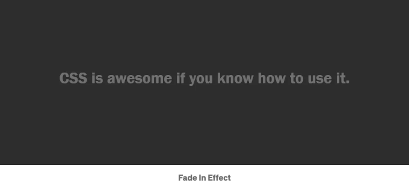
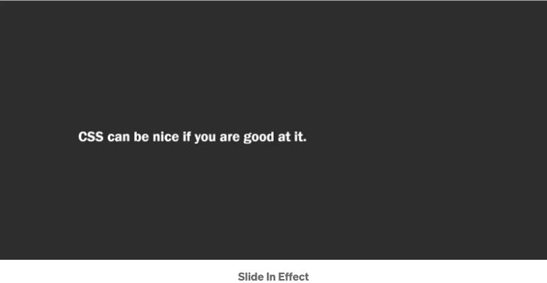
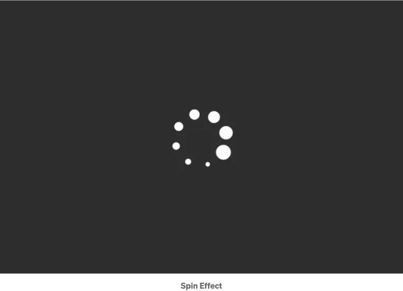
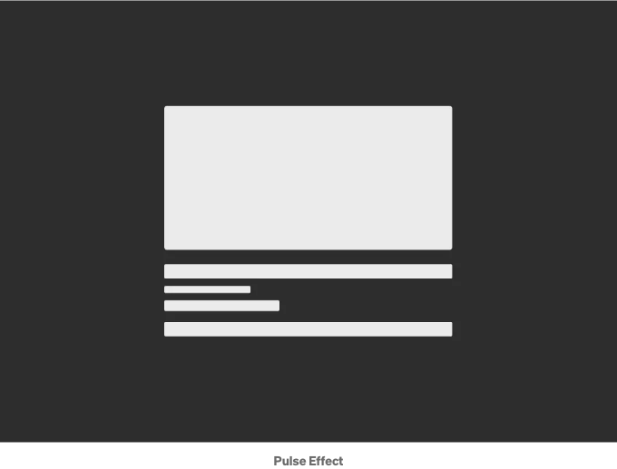
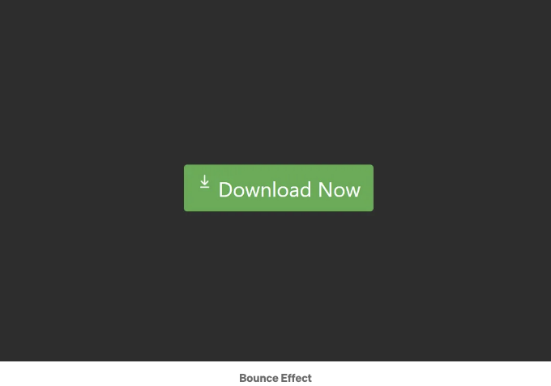
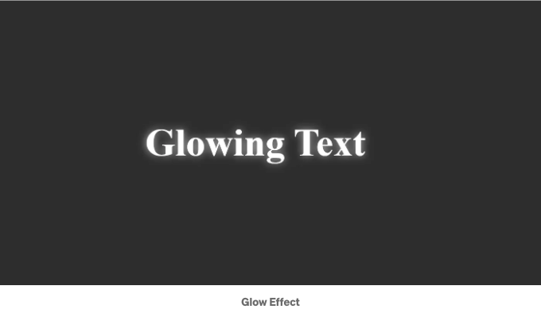
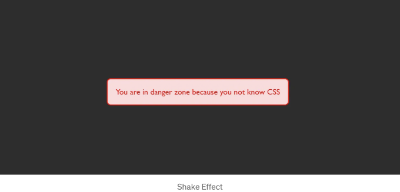
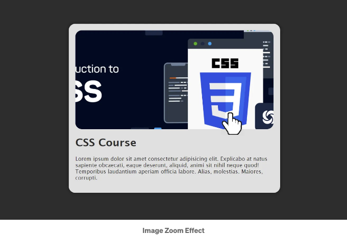
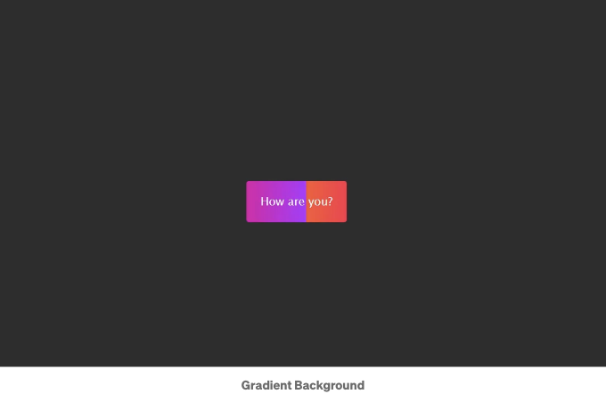

CSS를 사용하여 애니메이션을 만들면 웹 프로젝트에 상호작용성과 시각적 매력을 추가할 수 있어요. 여기에는 구현할 수 있는 10가지 쉽고 매우 유용한 CSS 애니메이션이 있어요:

## 1. 호버 효과:

버튼, 링크 또는 이미지에 호버 효과를 적용하여 마우스 커서가 올라갈 때 색상, 크기 또는 불투명도가 변경되도록 할 수 있어요.

<!-- ui-log 수평형 -->
<ins class="adsbygoogle"
  style="display:block"
  data-ad-client="ca-pub-4877378276818686"
  data-ad-slot="9743150776"
  data-ad-format="auto"
  data-full-width-responsive="true"></ins>
<component is="script">
(adsbygoogle = window.adsbygoogle || []).push({});
</component>

```js
.button:hover {
  background-color: #0078d4;
  color: #fff;
  transform: scale(1.1);
  transition: all 0.3s ease;
}
```

## 2. Fade In/Fade Out:

요소를 부드럽게 나타나거나 사라지도록 애니메이션 처리하여 표시되거나 숨겨질 때 부드럽게 처리합니다.


```

<!-- ui-log 수평형 -->
<ins class="adsbygoogle"
  style="display:block"
  data-ad-client="ca-pub-4877378276818686"
  data-ad-slot="9743150776"
  data-ad-format="auto"
  data-full-width-responsive="true"></ins>
<component is="script">
(adsbygoogle = window.adsbygoogle || []).push({});
</component>

```js
.fade-in {
    opacity: 0;
    animation: fadeIn 1s ease-in forwards;
}

@keyframes fadeIn {
    from {
        opacity: 0;
    }

    to {
        opacity: 1;
    }
}

.fade-out {
    opacity: 1;
    animation: fadeOut 1s ease-out forwards;
}

@keyframes fadeOut {
    from {
        opacity: 1;
    }

    to {
        opacity: 0;
    }
}
```

## 3. 슬라이드 인/슬라이드 아웃:

화면에 들어오거나 나가는 요소에 슬라이딩 효과를 만듭니다.



<!-- ui-log 수평형 -->
<ins class="adsbygoogle"
  style="display:block"
  data-ad-client="ca-pub-4877378276818686"
  data-ad-slot="9743150776"
  data-ad-format="auto"
  data-full-width-responsive="true"></ins>
<component is="script">
(adsbygoogle = window.adsbygoogle || []).push({});
</component>

```css
.slide-in {
    transform: translateX(-100%);
    animation: slideIn 1s ease-in forwards;
}

@keyframes slideIn {
    from {
        transform: translateX(-100%);
    }

    to {
        transform: translateX(0);
    }
}

.slide-out {
    transform: translateX(100%);
    animation: slideOut 1s ease-in forwards;
}

@keyframes slideOut {
    from {
        transform: translateX(100%);
    }

    to {
        transform: translateX(0);
    }
}
```

## 4. Spin:

요소를 계속해서 회전하게 만듭니다.



<!-- ui-log 수평형 -->
<ins class="adsbygoogle"
  style="display:block"
  data-ad-client="ca-pub-4877378276818686"
  data-ad-slot="9743150776"
  data-ad-format="auto"
  data-full-width-responsive="true"></ins>
<component is="script">
(adsbygoogle = window.adsbygoogle || []).push({});
</component>

```js
.spin {
    animation: spin 2s linear infinite;
}

@keyframes spin {
    0% {
        transform: rotate(0deg);
    }

    100% {
        transform: rotate(360deg);
    }
}
```

## 5. 펄스:

요소에 약간의 뛰는 효과를 만듭니다.


```

<!-- ui-log 수평형 -->
<ins class="adsbygoogle"
  style="display:block"
  data-ad-client="ca-pub-4877378276818686"
  data-ad-slot="9743150776"
  data-ad-format="auto"
  data-full-width-responsive="true"></ins>
<component is="script">
(adsbygoogle = window.adsbygoogle || []).push({});
</component>

```css
.pulse {
    animation: pulse 1s infinite;
}

@keyframes pulse {
    0% {
        opacity: 1;
    }

    50% {
        opacity: 0.95;
    }

    100% {
        opacity: 1;
    }
}
```

## 6. Bounce:

요소를 위아래로 튕기는 애니메이션.


```

<!-- ui-log 수평형 -->
<ins class="adsbygoogle"
  style="display:block"
  data-ad-client="ca-pub-4877378276818686"
  data-ad-slot="9743150776"
  data-ad-format="auto"
  data-full-width-responsive="true"></ins>
<component is="script">
(adsbygoogle = window.adsbygoogle || []).push({});
</component>

```js
.bounce {
  animation: bounce 1s infinite;
}

@keyframes bounce {
  0%, 20%, 50%, 80%, 100% {
    transform: translateY(0);
  }
  40% {
    transform: translateY(-30px);
  }
  60% {
    transform: translateY(-15px);
  }
}
```

## 7. Glow:

Make text or elements glow softly.



<!-- ui-log 수평형 -->
<ins class="adsbygoogle"
  style="display:block"
  data-ad-client="ca-pub-4877378276818686"
  data-ad-slot="9743150776"
  data-ad-format="auto"
  data-full-width-responsive="true"></ins>
<component is="script">
(adsbygoogle = window.adsbygoogle || []).push({});
</component>

```css
.glow {
  text-shadow: 0 0 5px rgba(255, 255, 255, 0.7);
  animation: glow 1s alternate infinite;
}

@keyframes glow {
  0% {
    text-shadow: 0 0 5px rgba(255, 255, 255, 0.7);
  }
  100% {
    text-shadow: 0 0 20px rgba(255, 255, 255, 0.7);
  }
}
```

## 8. 흔들기:

가벼운 흔들기 애니메이션을 만듭니다.


```

<!-- ui-log 수평형 -->
<ins class="adsbygoogle"
  style="display:block"
  data-ad-client="ca-pub-4877378276818686"
  data-ad-slot="9743150776"
  data-ad-format="auto"
  data-full-width-responsive="true"></ins>
<component is="script">
(adsbygoogle = window.adsbygoogle || []).push({});
</component>

```css
.shake {
    animation: shake 0.5s ease-in-out infinite;
}

@keyframes shake {
    0% {
        transform: translateX(0);
    }

    25% {
        transform: translateX(-5px);
    }

    50% {
        transform: translateX(5px);
    }

    75% {
        transform: translateX(-5px);
    }

    100% {
        transform: translateX(0);
    }
}
```

## 9. 이미지 호버 시 확대:

사용자가 호버하는 경우 이미지를 확대합니다.



<!-- ui-log 수평형 -->
<ins class="adsbygoogle"
  style="display:block"
  data-ad-client="ca-pub-4877378276818686"
  data-ad-slot="9743150776"
  data-ad-format="auto"
  data-full-width-responsive="true"></ins>
<component is="script">
(adsbygoogle = window.adsbygoogle || []).push({});
</component>

```css
.image-zoom {
    width: 600px;
    height: 300px;
    overflow: hidden;
    border-radius: 20px;
    cursor: pointer;
}

.image-zoom img {
    width: 100%;
    height: 100%;
    object-fit: cover;
    transition: transform 0.5s;
}

.image-zoom img:hover {
    transform: scale(1.5);
}
```

## 10. 그라데이션 배경:

다채로운 그라데이션 배경 애니메이션을 생성하세요.



<!-- ui-log 수평형 -->
<ins class="adsbygoogle"
  style="display:block"
  data-ad-client="ca-pub-4877378276818686"
  data-ad-slot="9743150776"
  data-ad-format="auto"
  data-full-width-responsive="true"></ins>
<component is="script">
(adsbygoogle = window.adsbygoogle || []).push({});
</component>

```js
.gradient {
    padding: 20px;
    border-radius: 4px;
    background: linear-gradient(90deg, #ff5733, #ff006c, #b133ff);
    background-size: 200% 100%;
    animation: gradientBg 4s linear infinite;
}

@keyframes gradientBg {
    0% {
        background-position: 200% 0;
    }

    100% {
        background-position: -200% 0;
    }
}
```

