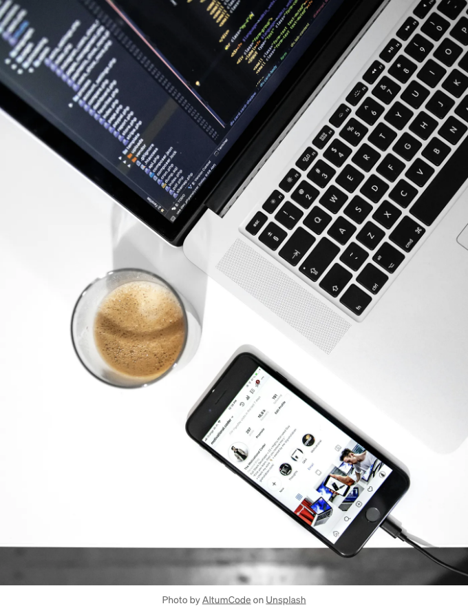
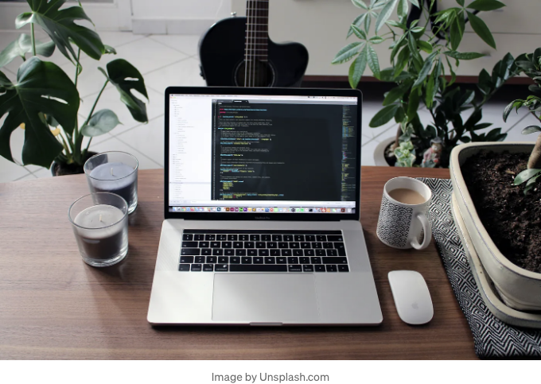
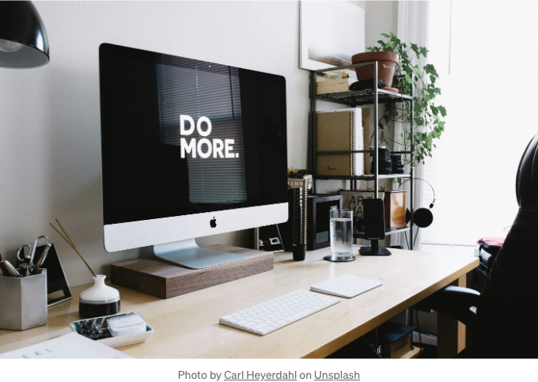

# 소개

안녕하세요 사랑스러운 워드프레스 애호가 여러분! 여러분의 워드프레스 사이트를 완벽하게 반영하는 멋진 여정에 오신 것을 환영합니다. 여러분이 첫 블로그를 시작하거나, 영감을 주는 디지털 상점을 오픈하거나, 여러분의 재능을 과시하는 포트폴리오를 만들고 있다면, 디지털 세계에서 개인화는 여러분의 가장 친한 친구입니다. 그리고 알고 계세요? 여러분의 사이트에 그 특별한 감성을 불어넣기 위한 비밀은 몇 가지 똑똑한 CSS 조정에 있습니다.



웹 디자인의 매혹적인 세계로 발을 딛고 있는 여러분을 위해 CSS (계층적 스타일 시트)에 대해 이야기해 봅시다. 이것은 여러분의 사이트를 표준 템플릿에서 개인화된 디지털 안식처로 변신시켜 주는 요술 도우미입니다. 색상을 조정하고 레이아웃을 조절하며 여러분의 감성이 잘 전달되도록 마법을 뿌려 주는 것이 중요합니다.

<!-- ui-log 수평형 -->
<ins class="adsbygoogle"
  style="display:block"
  data-ad-client="ca-pub-4877378276818686"
  data-ad-slot="9743150776"
  data-ad-format="auto"
  data-full-width-responsive="true"></ins>
<component is="script">
(adsbygoogle = window.adsbygoogle || []).push({});
</component>



# 워드프레스에서 커스텀 CSS 시작하기

CSS의 마법 주문에 뛰어들기 전에, 워드프레스 커스터마이저에서 커스텀 CSS 기능에 액세스하는 방법에 대해 간단히 짚어보겠습니다. 워드프레스 대시보드로 이동한 다음, 외관 ` 커스터마이즈로 이동하세요. 여기에서 '추가 CSS' 섹션을 찾을 수 있으며, 이곳에 우리가 곧 살펴볼 마법같은 CSS 코드를 붙여넣을 수 있습니다. 쉽죠?

# 워드프레스 초보자를 위한 30가지 CSS 코드 스니펫:

<!-- ui-log 수평형 -->
<ins class="adsbygoogle"
  style="display:block"
  data-ad-client="ca-pub-4877378276818686"
  data-ad-slot="9743150776"
  data-ad-format="auto"
  data-full-width-responsive="true"></ins>
<component is="script">
(adsbygoogle = window.adsbygoogle || []).push({});
</component>

## 사이트의 글꼴 변경하기

글꼴은 사이트의 개성을 상당히 말해줍니다. 시크하고 현대적인 것을 원하시나요, 아니면 클래식하고 우아한 스타일을 원하시나요? 아래와 같이 변경할 수 있어요:

```js
body {
    font-family: '글꼴 이름', sans-serif;
}
```

`글꼴 이름` 자리에 사용하고 싶은 글꼴을 넣어 주세요. Google Fonts는 여러분이 마음에 드는 글꼴을 찾는 데 훌륭한 도구입니다.

<!-- ui-log 수평형 -->
<ins class="adsbygoogle"
  style="display:block"
  data-ad-client="ca-pub-4877378276818686"
  data-ad-slot="9743150776"
  data-ad-format="auto"
  data-full-width-responsive="true"></ins>
<component is="script">
(adsbygoogle = window.adsbygoogle || []).push({});
</component>

## 헤더 크기를 사용자 정의하세요

큰 폰트로 강조하거나 세련되고 섬세하게? 사이트 스타일에 맞게 헤더 크기를 조정해보세요:

```css
header.site-header {
    font-size: 24px; /* 크기를 조절해보세요 */
}
```

## 배경 색상 수정

<!-- ui-log 수평형 -->
<ins class="adsbygoogle"
  style="display:block"
  data-ad-client="ca-pub-4877378276818686"
  data-ad-slot="9743150776"
  data-ad-format="auto"
  data-full-width-responsive="true"></ins>
<component is="script">
(adsbygoogle = window.adsbygoogle || []).push({});
</component>

사이트 분위기를 완벽한 배경으로 설정하세요:

```js
body {
    background-color: #ffccdd; /* 선택한 색상으로 대체하세요 */
}
```

## 링크 색상 변경

당신의 미적 기준에 따라 링크를 돋보이게 하거나 조화롭게 조절하세요:

<!-- ui-log 수평형 -->
<ins class="adsbygoogle"
  style="display:block"
  data-ad-client="ca-pub-4877378276818686"
  data-ad-slot="9743150776"
  data-ad-format="auto"
  data-full-width-responsive="true"></ins>
<component is="script">
(adsbygoogle = window.adsbygoogle || []).push({});
</component>

```js
a {
    color: #dd77cc; /* 바람직한 링크 색상 */
}
```

## 내비게이션 메뉴 스타일링하기

당신의 내비게이션 메뉴는 당신의 사이트로의 길잡이 역할을 해요. 다음의 가이드를 따라 인바이팅한 메뉴로 만들어보세요:

```js
#site-navigation {
    background-color: #efe9e9; /* 부드러운 핑크, 또는 당신이 좋아하는 어떤 색상이든 */
}
```

<!-- ui-log 수평형 -->
<ins class="adsbygoogle"
  style="display:block"
  data-ad-client="ca-pub-4877378276818686"
  data-ad-slot="9743150776"
  data-ad-format="auto"
  data-full-width-responsive="true"></ins>
<component is="script">
(adsbygoogle = window.adsbygoogle || []).push({});
</component>

## 푸터 스타일 조정

푸터는 당신의 사이트의 심포니에서 마지막 음표처럼 중요합니다. 기억에 남도록 만들어보세요:

```js
.site-footer {
    background-color: #f3e4f5; /* 모든 것을 조화롭게 연결하는 색상 선택 */
```

## 포스트 제목 맞춤 설정

<!-- ui-log 수평형 -->
<ins class="adsbygoogle"
  style="display:block"
  data-ad-client="ca-pub-4877378276818686"
  data-ad-slot="9743150776"
  data-ad-format="auto"
  data-full-width-responsive="true"></ins>
<component is="script">
(adsbygoogle = window.adsbygoogle || []).push({});
</component>

당신의 독자들의 관심을 끌기 위해 게시물 제목에 약간의 화려함을 더해보세요:

```js
.entry-title {
    color: #333333; /* 우아함을 위한 짙은 색조 */
    font-weight: bold;
    text-transform: uppercase;
}
```

## 위젯을 다르게 스타일링하세요

위젯은 단조로울 필요가 없습니다. 차별화되거나 조화롭게 어우러지도록 스타일링해보세요:

<!-- ui-log 수평형 -->
<ins class="adsbygoogle"
  style="display:block"
  data-ad-client="ca-pub-4877378276818686"
  data-ad-slot="9743150776"
  data-ad-format="auto"
  data-full-width-responsive="true"></ins>
<component is="script">
(adsbygoogle = window.adsbygoogle || []).push({});
</component>

```js
.widget {
    background-color: #f0e8e9; /* 부드러운 배경색 */
    padding: 20px;
    border-radius: 5px; /* 부드러운 느낌을 위한 약간 둥근 모서리 */
}
```

## 측면 제어 레이아웃

사이드바는 당신의 사이트 레이아웃의 중요한 구성 요소입니다. 위치와 외관을 사용자 정의하세요:

```js
#secondary {
    float: right; /* 또는 왼쪽, 선호에 따라 */
    width: 300px; /* 필요시 너비 조정 */
}
```

<!-- ui-log 수평형 -->
<ins class="adsbygoogle"
  style="display:block"
  data-ad-client="ca-pub-4877378276818686"
  data-ad-slot="9743150776"
  data-ad-format="auto"
  data-full-width-responsive="true"></ins>
<component is="script">
(adsbygoogle = window.adsbygoogle || []).push({});
</component>

## 작성자 의견 강조하기

댓글 섹션에 작성한 내용을 빛나게 만들어보세요:

```js
.bypostauthor {
    background-color: #fff0f0; /* 내 댓글을 부드럽게 강조합니다 */
}
```

## 이미지 자동으로 크기 조정하기

<!-- ui-log 수평형 -->
<ins class="adsbygoogle"
  style="display:block"
  data-ad-client="ca-pub-4877378276818686"
  data-ad-slot="9743150776"
  data-ad-format="auto"
  data-full-width-responsive="true"></ins>
<component is="script">
(adsbygoogle = window.adsbygoogle || []).push({});
</component>

게시물과 페이지 내에서 이미지가 아름답게 맞게 표시되도록 해보세요:

```js
img {
    max-width: 100%;
    height: auto;
}
```

## 사용자 정의 버튼 만들기

링크를 클릭하여 행동을 유도하는 아름다운 버튼으로 변환하세요:

<!-- ui-log 수평형 -->
<ins class="adsbygoogle"
  style="display:block"
  data-ad-client="ca-pub-4877378276818686"
  data-ad-slot="9743150776"
  data-ad-format="auto"
  data-full-width-responsive="true"></ins>
<component is="script">
(adsbygoogle = window.adsbygoogle || []).push({});
</component>

```css
a.button {
    background-color: #ff6699; /* 생동감 있는 버튼 색상 */
    padding: 10px 20px;
    color: white;
    text-decoration: none;
    border-radius: 5px;
}
```

## 양식 개인화

연락처 또는 구독 양식과 같은 양식에 독특한 감성을 불어보세요:

```css
input[type="text"], input[type="email"], textarea {
    background-color: #f9f3f4; /* 입력 필드용 부드러운 배경 */
    border: 1px solid #dcdcdc;
    padding: 10px;
}
```

<!-- ui-log 수평형 -->
<ins class="adsbygoogle"
  style="display:block"
  data-ad-client="ca-pub-4877378276818686"
  data-ad-slot="9743150776"
  data-ad-format="auto"
  data-full-width-responsive="true"></ins>
<component is="script">
(adsbygoogle = window.adsbygoogle || []).push({});
</component>

## 패딩과 마진 조정

요소 주변의 간격을 더 정밀하게 조정하여 더 깔끔한 레이아웃을 만들어보세요:

```js
.content-area {
    padding: 20px;
    margin: 20px 0;
}
```

## 블록인용문 스타일 개인화

<!-- ui-log 수평형 -->
<ins class="adsbygoogle"
  style="display:block"
  data-ad-client="ca-pub-4877378276818686"
  data-ad-slot="9743150776"
  data-ad-format="auto"
  data-full-width-responsive="true"></ins>
<component is="script">
(adsbygoogle = window.adsbygoogle || []).push({});
</component>

중요한 텍스트나 인용구를 강조하기 위해 블록 인용문을 꾸며보세요:

```js
blockquote {
    border-left: 5px solid #ff6699; /* 강조 색상 */
    margin: 20px 0;
    padding-left: 15px;
    font-style: italic;
}
```

## 포스트 내 목록 스타일링하기

주문형과 비주문형 목록을 시각적으로 매력적으로 만들어보세요:

<!-- ui-log 수평형 -->
<ins class="adsbygoogle"
  style="display:block"
  data-ad-client="ca-pub-4877378276818686"
  data-ad-slot="9743150776"
  data-ad-format="auto"
  data-full-width-responsive="true"></ins>
<component is="script">
(adsbygoogle = window.adsbygoogle || []).push({});
</component>

```css
ul, ol {
    margin-left: 20px;
    list-style-position: inside;
    color: #666; /* 리스트용 잔잔한 텍스트 색상 */
}
```

## 링크를 위한 사용자 정의 커서

링크에 사용자 정의 커서를 추가하여 재미를 더해보세요:

```css
a:hover {
    cursor: pointer; /* 마음에 드는 커서 스타일로 변경하세요 */
}
```

<!-- ui-log 수평형 -->
<ins class="adsbygoogle"
  style="display:block"
  data-ad-client="ca-pub-4877378276818686"
  data-ad-slot="9743150776"
  data-ad-format="auto"
  data-full-width-responsive="true"></ins>
<component is="script">
(adsbygoogle = window.adsbygoogle || []).push({});
</component>

## 테이블 스타일 수정

테이블의 가독성을 향상하세요:

```js
table {
    width: 100%;
    border-collapse: collapse;
}
th, td {
    border: 1px solid #ddd;
    padding: 8px;
    text-align: left;
}
``` 

## 링크에 멋진 호버 효과 추가

<!-- ui-log 수평형 -->
<ins class="adsbygoogle"
  style="display:block"
  data-ad-client="ca-pub-4877378276818686"
  data-ad-slot="9743150776"
  data-ad-format="auto"
  data-full-width-responsive="true"></ins>
<component is="script">
(adsbygoogle = window.adsbygoogle || []).push({});
</component>

간단한 hover 효과로 링크를 상호 작용 가능하게 만들어보세요:

```js
a:hover {
    text-decoration: underline;
    color: #ff6699; /* Hover 효과를 위한 밝은 색상 */
}
```

## 스크롤바 모양 변경

스크롤바를 사이트 테마에 맞게 사용자 정의하세요:

<!-- ui-log 수평형 -->
<ins class="adsbygoogle"
  style="display:block"
  data-ad-client="ca-pub-4877378276818686"
  data-ad-slot="9743150776"
  data-ad-format="auto"
  data-full-width-responsive="true"></ins>
<component is="script">
(adsbygoogle = window.adsbygoogle || []).push({});
</component>

```js
::-webkit-scrollbar {
    width: 10px;
}
::-webkit-scrollbar-thumb {
    background: #ff6699; /* 스크롤바 색상 */
    border-radius: 5px;
}
```

## 카테고리 디스플레이 커스터마이징

사이트의 미적인 측면에 맞게 카테고리 디스플레이를 스타일링하세요:

```js
.cat-links {
    background-color: #ffe6f2; /* 연한 핑크 배경 */
    padding: 5px;
    border-radius: 5px;
}
```

<!-- ui-log 수평형 -->
<ins class="adsbygoogle"
  style="display:block"
  data-ad-client="ca-pub-4877378276818686"
  data-ad-slot="9743150776"
  data-ad-format="auto"
  data-full-width-responsive="true"></ins>
<component is="script">
(adsbygoogle = window.adsbygoogle || []).push({});
</component>

## 검색 결과에서 검색어 강조하기

검색 결과에서 검색어를 더욱 눈에 띄게 만들어 보세요:

```js
mark {
    background-color: #ffccdd; /* 연한 분홍 하이라이트 */
    padding: 0;
}
```

## 사용자 정의 페이지 전환

<!-- ui-log 수평형 -->
<ins class="adsbygoogle"
  style="display:block"
  data-ad-client="ca-pub-4877378276818686"
  data-ad-slot="9743150776"
  data-ad-format="auto"
  data-full-width-responsive="true"></ins>
<component is="script">
(adsbygoogle = window.adsbygoogle || []).push({});
</component>

페이지 이동 시 서서히 변하는 애니메이션 효과를 추가해 보세요:

```js
body {
    transition: background-color 0.5s ease;
}
```

## 로그인 페이지 스타일링

WordPress 로그인 페이지를 자신만의 스타일로 꾸밀 수 있습니다:

<!-- ui-log 수평형 -->
<ins class="adsbygoogle"
  style="display:block"
  data-ad-client="ca-pub-4877378276818686"
  data-ad-slot="9743150776"
  data-ad-format="auto"
  data-full-width-responsive="true"></ins>
<component is="script">
(adsbygoogle = window.adsbygoogle || []).push({});
</component>

```js
body.login {
    background-color: #fff5f8; /* 사용자 정의 배경색 */
}
.login h1 a {
    background-image: url('your-logo-url.png'); /* 사용자 정의 로고 */
}
```

## 사용자 정의 오류 페이지

404 오류 페이지를 스타일링하여 실망감을 줄일 수 있어요:

```js
.error404 .page-content {
    background-color: #f8e6f9; /* 부드러운 보라색 */
    padding: 40px;
    border-radius: 5px;
}
```

<!-- ui-log 수평형 -->
<ins class="adsbygoogle"
  style="display:block"
  data-ad-client="ca-pub-4877378276818686"
  data-ad-slot="9743150776"
  data-ad-format="auto"
  data-full-width-responsive="true"></ins>
<component is="script">
(adsbygoogle = window.adsbygoogle || []).push({});
</component>

## 스크롤할 때 요소들을 애니메이션으로 만들기

화면에 들어오면 요소들을 애니메이션으로 만들어 매력적인 경험을 만들어보세요:

```js
@keyframes fadeInUp {
    from {
        transform: translate3d(0, 40px, 0);
        opacity: 0;
    }
    to {
        transform: translate3d(0, 0, 0);
        opacity: 1;
    }
}
.element-to-animate {
    animation: fadeInUp 1s ease-out 1;
}
``` 

## 고정 또는 붙는 요소

<!-- ui-log 수평형 -->
<ins class="adsbygoogle"
  style="display:block"
  data-ad-client="ca-pub-4877378276818686"
  data-ad-slot="9743150776"
  data-ad-format="auto"
  data-full-width-responsive="true"></ins>
<component is="script">
(adsbygoogle = window.adsbygoogle || []).push({});
</component>

사용자가 스크롤을 할 때 중요한 요소들이 화면에 계속해서 보이도록 유지하세요:

```js
.sticky-element {
    position: fixed;
    top: 0;
    width: 100%;
}
```

## 반응형 디자인 조정

모든 기기에서 사이트가 멋지게 보이도록 보장하세요:

<!-- ui-log 수평형 -->
<ins class="adsbygoogle"
  style="display:block"
  data-ad-client="ca-pub-4877378276818686"
  data-ad-slot="9743150776"
  data-ad-format="auto"
  data-full-width-responsive="true"></ins>
<component is="script">
(adsbygoogle = window.adsbygoogle || []).push({});
</component>

```js
@media (max-width: 768px) {
    .sidebar {
        display: none;
    }
}
```

## 요소 숨기거나 표시하기

요소의 가시성을 쉽게 제어하세요:

```js
.hide-on-mobile {
    display: none;
}
@media (min-width: 768px) {
    .hide-on-mobile {
        display: block;
    }
}
```

<!-- ui-log 수평형 -->
<ins class="adsbygoogle"
  style="display:block"
  data-ad-client="ca-pub-4877378276818686"
  data-ad-slot="9743150776"
  data-ad-format="auto"
  data-full-width-responsive="true"></ins>
<component is="script">
(adsbygoogle = window.adsbygoogle || []).push({});
</component>

## 사용자 정의 로딩 화면

사용자 정의 로딩 화면을 통해 즐거운 대기 경험을 만들어보세요:

```js
.loading-screen {
    background-color: #ffccdd;
    position: fixed;
    z-index: 9999;
    width: 100%;
    height: 100%;
    display: flex;
    justify-content: center;
    align-items: center;
}
```



<!-- ui-log 수평형 -->
<ins class="adsbygoogle"
  style="display:block"
  data-ad-client="ca-pub-4877378276818686"
  data-ad-slot="9743150776"
  data-ad-format="auto"
  data-full-width-responsive="true"></ins>
<component is="script">
(adsbygoogle = window.adsbygoogle || []).push({});
</component>

# 결론

대단해요! 이제 WordPress 사이트에 뿌려 넣을 CSS 스니펫의 보물 창고로 무장했네요. 이를 통해 단순한 블로그에서 본인의 멋진 디지털 표현물로 변화시킬 수 있을 거에요. 위의 스니펫들은 시작점일 뿐이란 것을 기억하세요. WordPress와 CSS의 아름다운 점은 사용자 정의를 위한 자유로움입니다. 그러니 실험하고 코드를 마음대로 수정하는 데 두려워하지 마세요.

가장 중요한 건, 이 과정에서 즐겁게 보내세요. 당신의 웹사이트는 인터넷의 일부가 아니라, 당신의 한 부분입니다. 당신만큼 동적이고 화려하며 특별할 만한 사이트로 가치가 있어요. 물들어 보고, 놀면서 당신만의 독특한 영혼의 디지털 표현물이 완벽하게 피어나는 것을 지켜보세요. 즐겁게 사용자 정의하세요!

더 많은 영감과 코드 해킹, 그리고 최고의 웹 존재感를 구축하기 위한 도구를 찾으려면 제 사랑하는 사이트인 STARKAT DIGITAL을 방문해주세요. 저희는 최고의 실천 방법과 우리의 상상력으로 현재 그것을 구축 중이에요. 건배하며, 이 30가지 자주 사용되는 CSS 스니펫들을 즐기세요. WordPress를 이용하여 꿈꾸는 사이트를 만들어 가는 여정에서 도움이 되기를 바랍니다.