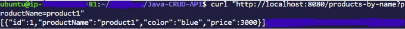

소개

자바 CRUD (Create, Read, Update, Delete) Rest API를 개발하는 포괄적인 안내서에 오신 것을 환영합니다. 이 프로젝트에서는 Spring Boot, Hibernate, MySQL, Docker 및 Docker Compose를 통합하여 RESTful 서비스를 통해 데이터를 효과적으로 관리할 수 있는 견고하고 확장 가능한 솔루션을 만드는 방법에 대해 설명하겠습니다.

다양성으로 유명한 자바와 자바 애플리케이션 개발을 간소화하는 데 유명한 Spring Boot이 우리 API의 백본 역할을 할 것입니다. MySQL 데이터베이스와의 원활한 상호 작용을 용이하게 만들기 위해 널리 사용되는 ORM(객체 관계 매핑) 프레임워크인 Hibernate을 사용할 것입니다.

Docker 및 Docker Compose의 통합을 통해 프로젝트가 더 나아가서 휴대성, 일관성 및 다양한 환경에서의 배포 용이성을 보장할 것입니다. 게다가 Kubernetes를 사용하여 배포 측면을 탐구하여 더 많은 확장 가능성과 유지 관리성을 강화할 것입니다.

<!-- ui-log 수평형 -->
<ins class="adsbygoogle"
  style="display:block"
  data-ad-client="ca-pub-4877378276818686"
  data-ad-slot="9743150776"
  data-ad-format="auto"
  data-full-width-responsive="true"></ins>
<component is="script">
(adsbygoogle = window.adsbygoogle || []).push({});
</component>

이 안내서는 최신 기술을 사용하여 견고한 CRUD API를 성공적으로 구현하는 데 도움이 되는 단계별 지침, 모범 사례 및 통찰을 제공합니다.

다음은 우리가 진행할 단계입니다:

- Spring Boot, Spring Web, Spring Data 및 Hibernate을 사용하여 Java 애플리케이션 만들기
- 로컬 머신에 MySQL Server 및 MySQL Workbench 설치
- Dockerfile과 docker-compose.yml 파일을 작성하여 Java 애플리케이션을 도커화하고 데이터베이스를 실행
- Maven을 사용하여 Java 앱 빌드, Docker 이미지 빌드 및 Docker Compose를 사용하여 컨테이너 실행하기. 또한 배포를 위해 minikube 사용
- Postman 및 curl로 애플리케이션 테스트하기

요구사항:

<!-- ui-log 수평형 -->
<ins class="adsbygoogle"
  style="display:block"
  data-ad-client="ca-pub-4877378276818686"
  data-ad-slot="9743150776"
  data-ad-format="auto"
  data-full-width-responsive="true"></ins>
<component is="script">
(adsbygoogle = window.adsbygoogle || []).push({});
</component>

- 스프링 이니셜라이저: Spring Initializr
- 자바: Oracle에서 Java 다운로드 | Oracle
- 메이븐: Apache Maven 설치하기 | Maven
- 자바 IDE (IntelliJ): IntelliJ IDEA 다운로드 — 주요 Java 및 Kotlin IDE (jetbrains.com)
- 포스트맨: 무료로 시작하려면 Postman 다운로드하기 | Get Started for Free
- MySQL 서버: MySQL :: 다운로드 시작하기 | Begin Your Download
- MySQL Workbench: MySQL :: MySQL Workbench
- Docker 및 Minikube (https://github.com/midejoe/Install-DevOps-Tools).

새로운 Java Spring Boot 애플리케이션을 생성해보세요.

저는 Java IDE를 사용하여 애플리케이션을 빌드했습니다. 먼저 생성될 레이어를 정의해봅시다.

- 컨트롤러 레이어: 이는 클라이언트로부터의 모든 사용자 요청을 처리합니다.
- 서비스 레이어: 비즈니스 로직을 처리합니다.
- 레포지토리 레이어: 데이터베이스와 통신하고 클라이언트에게 응답을 보냅니다.

<!-- ui-log 수평형 -->
<ins class="adsbygoogle"
  style="display:block"
  data-ad-client="ca-pub-4877378276818686"
  data-ad-slot="9743150776"
  data-ad-format="auto"
  data-full-width-responsive="true"></ins>
<component is="script">
(adsbygoogle = window.adsbygoogle || []).push({});
</component>

알림: 소스 코드는 내 Github 저장소로 이동하세요.

단계 1: 스프링 이니셜라이저를 사용하여 스켈레톤 스프링부트 프로젝트를 생성하세요. 스프링 이니셜라이저 링크로 이동하고 아래 세부 사항로 채우세요:

Maven 프로젝트 선택;
언어: java
Spring Boot: 최신 버전
프로젝트 메타데이터- 그룹 (참고: 선호하는 이름을 제공하세요)
Artifact (참고: 선호하는 이름을 제공하세요. 예: tutorial)
Java 버전: 8
의존성 추가: Spring Web (엔드포인트 노출에 사용됨)
MySQL Driver: (MySQL 데이터베이스를 사용하기 때문에)
Spring Data JPA: 데이터베이스와 통신하기 위해
Lombok: 세터와 게터를 정의하기 위해


<!-- ui-log 수평형 -->
<ins class="adsbygoogle"
  style="display:block"
  data-ad-client="ca-pub-4877378276818686"
  data-ad-slot="9743150776"
  data-ad-format="auto"
  data-full-width-responsive="true"></ins>
<component is="script">
(adsbygoogle = window.adsbygoogle || []).push({});
</component>

- "Generate"을 클릭하여 패키지를 생성하고 원하는 폴더에 저장하세요.
- zip 폴더가 생성됩니다. IntelliJ에서 해당 폴더를 가져오려면 IDE에서 가져오기 폴더를 클릭하면 됩니다.

단계 2: IntelliJ에서 패키지 만들기:

- 튜토리얼/src/java/com.joesalt 디렉토리로 이동합니다. 오른쪽 클릭하여 새로 만들기를 선택하고 패키지를 검색하여 controller라는 패키지를 만드세요.
- 이와 같은 방법으로 service, repository 및 model이라는 다른 패키지를 만드세요. 이렇게 하면 총 4개의 패키지가 생성됩니다.

Model 패키지에 대해: 모델 패키지를 클릭하고 Product라는 Java 클래스를 선택하여 클래스를 생성하세요. 아래 코드를 입력하세요:

<!-- ui-log 수평형 -->
<ins class="adsbygoogle"
  style="display:block"
  data-ad-client="ca-pub-4877378276818686"
  data-ad-slot="9743150776"
  data-ad-format="auto"
  data-full-width-responsive="true"></ins>
<component is="script">
(adsbygoogle = window.adsbygoogle || []).push({});
</component>

위의 코드는 데이터베이스의 엔터티를 나타내는 Product라는 Java 클래스를 정의합니다. 테이블의 열에 해당하는 필드(id, productName, color, price)가 Jakarta Persistence annotations(@Entity, @Table, @Id, @GeneratedValue, @Column)으로 주석이 달려 있으며, Lombok의 @Data 어노테이션을 사용하여 보일러플레이트 코드를 자동 생성합니다. 이 데이터베이스의 관련 테이블의 이름은 "product_inventory"입니다.

컨트롤러 패키지: HealthController, ProductController라는 두 개의 클래스를 만드세요. 아래 코드를 입력하세요 (HealthController.java)

위의 코드는 두 개의 엔드포인트("/" 및 "/health")를 갖는 Spring Boot REST 컨트롤러인 HealthController를 정의합니다. 각각은 접근 시 HTTP 200 OK 상태로 응답합니다.

(ProductController.java)

<!-- ui-log 수평형 -->
<ins class="adsbygoogle"
  style="display:block"
  data-ad-client="ca-pub-4877378276818686"
  data-ad-slot="9743150776"
  data-ad-format="auto"
  data-full-width-responsive="true"></ins>
<component is="script">
(adsbygoogle = window.adsbygoogle || []).push({});
</component>

위의 코드는 제품을 관리하기 위한 CRUD 작업 (생성, 읽기, 업데이트, 삭제)를 수행하는 Spring Boot REST 컨트롤러인 ProductController를 정의합니다. 이 컨트롤러는 제품을 삽입, 검색, 업데이트, 삭제하는 등 데이터베이스 작업을 수행하기 위해 ProductService와 상호 작용합니다. 엔드포인트에는 제품을 저장하고, ID로 단일 제품을 가져오고, 모든 제품을 나열하고, 제품을 업데이트하고, 제품을 삭제하며, SQL 문을 사용하여 이름으로 제품을 검색하는 기능이 포함되어 있습니다.

그 다음은 서비스 패키지: 비즈니스 로직을 처리하는 ProductService.java 클래스를 만듭니다. 아래 코드를 입력하세요:

위의 코드는 제품 관리를 위한 비즈니스 로직을 캡슐화하는 Spring Boot 서비스 클래스인 ProductService를 정의합니다. 이 클래스는 데이터베이스와 상호 작용하기 위해 ProductRepository를 사용하며, 제품을 저장, 검색, 나열, 업데이트, 삭제하고, 리포지토리의 메소드를 사용하여 이름으로 제품을 검색하는 기능을 제공합니다. 추가적으로, 해당 서비스는 특정 ID의 제품을 찾을 수 없는 경우에 대한 예외 처리를 수행합니다.

다음으로, 리포지토리 패키지를 생성합니다: 리포지토리 패키지에서 인터페이스를 만들고, 해당 패키지에서 인터페이스를 선택한 후 ProductRepository로 이름을 지정하세요. 데이터베이스와 상호 작용하기 위한 기본 코드입니다. 아래 코드를 입력하세요:

<!-- ui-log 수평형 -->
<ins class="adsbygoogle"
  style="display:block"
  data-ad-client="ca-pub-4877378276818686"
  data-ad-slot="9743150776"
  data-ad-format="auto"
  data-full-width-responsive="true"></ins>
<component is="script">
(adsbygoogle = window.adsbygoogle || []).push({});
</component>

위의 코드는 ProductRepository라는 Spring Data JPA 리포지토리 인터페이스를 정의합니다. ProductRepository는 JpaRepository를 확장합니다. 이 인터페이스는 Product 엔티티에 대한 기본 CRUD 작업을 제공하며 @Query로 주석이 달린 getProductsByName이라는 사용자 정의 메소드를 포함하고 있습니다. 이를 통해 네이티브 SQL 쿼리를 사용하여 이름별 제품 목록을 검색할 수 있습니다.

단계 3: 로컬 머신에 MySQL 서버와 MySQL Workbench를 설치하세요. 제공된 링크를 사용하여 둘 모두를 설치 및 구성하세요. (사용자 이름과 암호를 생성하세요)

- Workbench에서 아래의 코드를 입력하여 데이터베이스를 생성하세요:

```js
CREATE database store_database
```

<!-- ui-log 수평형 -->
<ins class="adsbygoogle"
  style="display:block"
  data-ad-client="ca-pub-4877378276818686"
  data-ad-slot="9743150776"
  data-ad-format="auto"
  data-full-width-responsive="true"></ins>
<component is="script">
(adsbygoogle = window.adsbygoogle || []).push({});
</component>

- 다음으로 'product_inventory' 테이블을 생성하고 아래와 같이 필요한 필드를 정의하세요:

```js
use store_database;
CREATE TABLE IF NOT EXISTS product_inventory
(id BIGINT NOT NULL PRIMARY KEY auto_increment,
product_name VARCHAR(32) not null,
color varchar(10),
price INT
);
```


그 다음으로 자바 코드에서 데이터베이스 이름과 테이블 이름을 지정하세요. 리소스 폴더로 이동하여 'application.properties' 파일을 찾고 아래 코드를 입력하세요. 참고: 데이터베이스 사용자 이름과 암호를 입력하세요.

<!-- ui-log 수평형 -->
<ins class="adsbygoogle"
  style="display:block"
  data-ad-client="ca-pub-4877378276818686"
  data-ad-slot="9743150776"
  data-ad-format="auto"
  data-full-width-responsive="true"></ins>
<component is="script">
(adsbygoogle = window.adsbygoogle || []).push({});
</component>

`application.properties` 파일은 SQL 데이터베이스에 연결되는 Spring Boot 애플리케이션을 위해 데이터 소스와 ORM 프레임워크를 구성하는 데 사용됩니다.

단계 4: 애플리케이션 테스트하기

- IntelliJ로 돌아가서 `TutorialApplication.java` 파일을 선택하고 왼쪽에 있는 재생 버튼(lime 7)을 클릭하세요. 아래 이미지 참조:


<!-- ui-log 수평형 -->
<ins class="adsbygoogle"
  style="display:block"
  data-ad-client="ca-pub-4877378276818686"
  data-ad-slot="9743150776"
  data-ad-format="auto"
  data-full-width-responsive="true"></ins>
<component is="script">
(adsbygoogle = window.adsbygoogle || []).push({});
</component>

- Postman에서 경로를 테스트하세요.

건강 경로를 테스트하세요: 아래 내용을 입력하세요


200 응답이 반환됩니다.

<!-- ui-log 수평형 -->
<ins class="adsbygoogle"
  style="display:block"
  data-ad-client="ca-pub-4877378276818686"
  data-ad-slot="9743150776"
  data-ad-format="auto"
  data-full-width-responsive="true"></ins>
<component is="script">
(adsbygoogle = window.adsbygoogle || []).push({});
</component>

새 제품 추가: 아래와 같은 본문을 요청 본문으로 하는 POST 요청을 통해 localhost:8080/product에 새 제품을 데이터베이스에 추가해보세요:


데이터베이스를 확인해보세요:

<!-- ui-log 수평형 -->
<ins class="adsbygoogle"
  style="display:block"
  data-ad-client="ca-pub-4877378276818686"
  data-ad-slot="9743150776"
  data-ad-format="auto"
  data-full-width-responsive="true"></ins>
<component is="script">
(adsbygoogle = window.adsbygoogle || []).push({});
</component>

  

단계 5: 이제 Maven을 사용하여 Java 파일을 패키징해 봅시다.

- 실행 중인 애플리케이션을 중지합니다.
- 위 링크에서 Maven을 설치합니다.
- TutorialApplicationTests.java 파일로 이동하여 아래와 같이 테스트 클래스를 주석 처리합니다:


<!-- ui-log 수평형 -->
<ins class="adsbygoogle"
  style="display:block"
  data-ad-client="ca-pub-4877378276818686"
  data-ad-slot="9743150776"
  data-ad-format="auto"
  data-full-width-responsive="true"></ins>
<component is="script">
(adsbygoogle = window.adsbygoogle || []).push({});
</component>

- pom.xml 파일을 검색하고 아래에 표시된대로 빌드 태그 아래에 원하는 이름으로 `finalName` 태그를 입력하세요:


- 이제 터미널을 열어 `mvn clean install`을 실행하세요. 아래와 유사한 출력을 받아야 합니다:


<!-- ui-log 수평형 -->
<ins class="adsbygoogle"
  style="display:block"
  data-ad-client="ca-pub-4877378276818686"
  data-ad-slot="9743150776"
  data-ad-format="auto"
  data-full-width-responsive="true"></ins>
<component is="script">
(adsbygoogle = window.adsbygoogle || []).push({});
</component>

- 다음과 같이 target 디렉토리 아래에서 jar 파일을 찾을 수 있습니다:


이제 Docker를 사용하여 데이터베이스를 Spring 앱과 연결해 봅시다. 먼저 앱과 데이터베이스를 Docker화하고, Docker Compose를 사용하여 실행합니다.

<!-- ui-log 수평형 -->
<ins class="adsbygoogle"
  style="display:block"
  data-ad-client="ca-pub-4877378276818686"
  data-ad-slot="9743150776"
  data-ad-format="auto"
  data-full-width-responsive="true"></ins>
<component is="script">
(adsbygoogle = window.adsbygoogle || []).push({});
</component>

애플리케이션 루트 수준에서 Dockerfile(대문자 "D")이라는 파일을 만들고 다음과 같이 채워 넣어 주세요:

```js
FROM openjdk:17-jdk-alpine

# JAR 파일을 컨테이너로 복사합니다
COPY target/joe-v3.jar app-v2.jar

# 포트 80을 노출합니다
EXPOSE 8080

# 애플리케이션 실행을 위한 엔트리 포인트를 정의합니다
ENTRYPOINT ["java", "-jar", "app-v2.jar"]
```

이 Dockerfile은 JAR 파일로 패키지된 Java 애플리케이션을 위한 Docker 이미지를 생성하는 데 사용됩니다.

도커 파일로부터 도커 이미지를 빌드해 주세요.

<!-- ui-log 수평형 -->
<ins class="adsbygoogle"
  style="display:block"
  data-ad-client="ca-pub-4877378276818686"
  data-ad-slot="9743150776"
  data-ad-format="auto"
  data-full-width-responsive="true"></ins>
<component is="script">
(adsbygoogle = window.adsbygoogle || []).push({});
</component>

```js
도커 빌드 -t dev-app-image .
```

이미지를 Dockerhub로 푸시하세요. 먼저 도커에 로그인해야 합니다. docker login 명령을 사용하세요.

```js
도커 태그 dev-app-image:latest midejoe/java-api:1.0
도커 푸쉬 midejoe/java-api:1.0
```

이제 MySQL 데이터베이스 도커 파일을 생성해 봅시다:

<!-- ui-log 수평형 -->
<ins class="adsbygoogle"
  style="display:block"
  data-ad-client="ca-pub-4877378276818686"
  data-ad-slot="9743150776"
  data-ad-format="auto"
  data-full-width-responsive="true"></ins>
<component is="script">
(adsbygoogle = window.adsbygoogle || []).push({});
</component>

```js
# 공식 MySQL 도커 이미지 사용
FROM mysql:latest

# MySQL 루트 비밀번호 설정 (원하는 비밀번호로 대체)
ENV MYSQL_ROOT_PASSWORD=@YourRootPassword

# 비루트 사용자 및 비밀번호 설정 (원하는 사용자명과 비밀번호로 대체)
ENV MYSQL_USER=dbuser
ENV MYSQL_PASSWORD=@YourPassword#

# (선택사항) 새로운 데이터베이스 생성 (원하는 데이터베이스 이름으로 대체)
ENV MYSQL_DATABASE=store_database

# MySQL 포트 노출
EXPOSE 3306
```

이제 MySQL 이미지를 빌드해 봅시다:

```js
docker build -t my-sql-image .
```

이미지를 Dockerhub에 푸시하세요:

<!-- ui-log 수평형 -->
<ins class="adsbygoogle"
  style="display:block"
  data-ad-client="ca-pub-4877378276818686"
  data-ad-slot="9743150776"
  data-ad-format="auto"
  data-full-width-responsive="true"></ins>
<component is="script">
(adsbygoogle = window.adsbygoogle || []).push({});
</component>

```js
도커 태그 my-sql-image:latest midejoe/java-api:mysql
도커 푸시 midejoe/java-api:mysql
```

MySQL 이미지의 인스턴스를 실행합니다.

```js
도커 실행 — name my-sql-server -p 3306:3306 -d my-sql-image
```

MySQL 서버에 로그인하여 비밀번호를 입력하세요.

<!-- ui-log 수평형 -->
<ins class="adsbygoogle"
  style="display:block"
  data-ad-client="ca-pub-4877378276818686"
  data-ad-slot="9743150776"
  data-ad-format="auto"
  data-full-width-responsive="true"></ins>
<component is="script">
(adsbygoogle = window.adsbygoogle || []).push({});
</component>

```js
도커 exec -it my-sql-server mysql -u dbuser -p
```

이제 데이터베이스를 테스트하기 위해 다양한 작업을 수행해 봅시다.

다음 SQL 명령문을 실행하세요:
데이터베이스 생성:

```js
CREATE DATABASE store_database;
```

<!-- ui-log 수평형 -->
<ins class="adsbygoogle"
  style="display:block"
  data-ad-client="ca-pub-4877378276818686"
  data-ad-slot="9743150776"
  data-ad-format="auto"
  data-full-width-responsive="true"></ins>
<component is="script">
(adsbygoogle = window.adsbygoogle || []).push({});
</component>

데이터베이스를 표시해보세요:

```js
SHOW DATABASES;
```

테이블을 생성해보세요:

```js
use store_database;
```

<!-- ui-log 수평형 -->
<ins class="adsbygoogle"
  style="display:block"
  data-ad-client="ca-pub-4877378276818686"
  data-ad-slot="9743150776"
  data-ad-format="auto"
  data-full-width-responsive="true"></ins>
<component is="script">
(adsbygoogle = window.adsbygoogle || []).push({});
</component>

우리의 java_api를 위한 테이블을 만들어 보겠습니다:

```js
CREATE TABLE IF NOT EXISTS product_inventory
(id BIGINT NOT NULL PRIMARY KEY auto_increment,
product_name VARCHAR(32) not null,
color varchar(10),
price INT
);
```

- exit 명령어를 사용하여 데이터베이스에서 나가세요 (exit;)

이제, java API의 "application.properties" (src/main/resources/application.properties) 파일에서 mysql 컨테이너 URL을 수정해 봅시다.

<!-- ui-log 수평형 -->
<ins class="adsbygoogle"
  style="display:block"
  data-ad-client="ca-pub-4877378276818686"
  data-ad-slot="9743150776"
  data-ad-format="auto"
  data-full-width-responsive="true"></ins>
<component is="script">
(adsbygoogle = window.adsbygoogle || []).push({});
</component>

```js
spring.datasource.url=${DATABASE_URL}
spring.datasource.username=${DATABASE_USERNAME}
spring.datasource.password=${DATABASE_PASSWORD}
spring.jpa.hibernate.ddl-auto=update
spring.jpa.properties.hibernate.dialect=org.hibernate.dialect.MySQLDialect
```

## 도커 컴포즈 사용

도커 컴포즈 파일에 mysql 서비스와 java 앱을 추가해 봅시다.

참고: java 앱은 mysql 컨테이너가 시작될 때까지 기다려야 하므로, java 앱 컨테이너는 첫 번째 시도에서 실패할 수 있습니다. mysql 데이터베이스에 연결을 완료하려면 docker compose up 명령을 다시 실행할 수 있습니다.

<!-- ui-log 수평형 -->
<ins class="adsbygoogle"
  style="display:block"
  data-ad-client="ca-pub-4877378276818686"
  data-ad-slot="9743150776"
  data-ad-format="auto"
  data-full-width-responsive="true"></ins>
<component is="script">
(adsbygoogle = window.adsbygoogle || []).push({});
</component>

```js
버전: ‘3’
서비스:
 my-sql-server:
  container_name: my-sql-server
  image: midejoe/java-api:mysql
  ports:
   — 3306:3306

 java-crud-app:
  container_name: java_api
  image: java-api:latest
  ports:
   — 8080:8080
  environment:
   — DATABASE_URL=jdbc:mysql://my-sql-server:3306/store_database
   — DATABASE_USERNAME=dbuser
   — DATABASE_PASSWORD=@YourPassword#
  depends_on:
   — my-sql-server
```

도커 컴포즈 파일을 실행하십시오:

```js
docker-compose -f docker_compose.yml up
```

아래와 같은 출력이라면 준비된 것입니다:

<!-- ui-log 수평형 -->
<ins class="adsbygoogle"
  style="display:block"
  data-ad-client="ca-pub-4877378276818686"
  data-ad-slot="9743150776"
  data-ad-format="auto"
  data-full-width-responsive="true"></ins>
<component is="script">
(adsbygoogle = window.adsbygoogle || []).push({});
</component>


이제 다음 명령어로 실행 중인 컨테이너를 확인할 수 있어요:

```js
docker ps -a
```

아래와 같은 결과가 나와야 해요:

<!-- ui-log 수평형 -->
<ins class="adsbygoogle"
  style="display:block"
  data-ad-client="ca-pub-4877378276818686"
  data-ad-slot="9743150776"
  data-ad-format="auto"
  data-full-width-responsive="true"></ins>
<component is="script">
(adsbygoogle = window.adsbygoogle || []).push({});
</component>


## 어플리케이션 테스트하기

이제 curl을 사용하여 java api를 다시 테스트해 봅시다:

헬스 체크

<!-- ui-log 수평형 -->
<ins class="adsbygoogle"
  style="display:block"
  data-ad-client="ca-pub-4877378276818686"
  data-ad-slot="9743150776"
  data-ad-format="auto"
  data-full-width-responsive="true"></ins>
<component is="script">
(adsbygoogle = window.adsbygoogle || []).push({});
</component>

```js
# GET 방법: 
curl http://localhost:8080/health
```

제품 생성: 이제 제품을 생성해 보겠습니다. 아래의 바디를 요청 바디로 사용하여 localhost:8080/product로 POST 요청을 보냅니다.

```js
# POST 방법: 
curl -X POST -H “Content-Type: application/json” -d ‘{“productName”: “product1”, “color”: “blue”, “price”: 3000}’ http://localhost:8080/product
```


<!-- ui-log 수평형 -->
<ins class="adsbygoogle"
  style="display:block"
  data-ad-client="ca-pub-4877378276818686"
  data-ad-slot="9743150776"
  data-ad-format="auto"
  data-full-width-responsive="true"></ins>
<component is="script">
(adsbygoogle = window.adsbygoogle || []).push({});
</component>

또 하나 만들어보겠습니다:

```js
# POST 방식: 
curl -X POST -H "Content-Type: application/json" -d '{"productName": "product2", "color": "green", "price": 4000}' http://localhost:8080/product
```


아이디로 제품 읽기:

<!-- ui-log 수평형 -->
<ins class="adsbygoogle"
  style="display:block"
  data-ad-client="ca-pub-4877378276818686"
  data-ad-slot="9743150776"
  data-ad-format="auto"
  data-full-width-responsive="true"></ins>
<component is="script">
(adsbygoogle = window.adsbygoogle || []).push({});
</component>

```js
# GET 방법:
curl -X GET ‘http://localhost:8080/product?productId=1'
```


모든 제품 가져오기:

```js
curl http://localhost:8080/products
```

<!-- ui-log 수평형 -->
<ins class="adsbygoogle"
  style="display:block"
  data-ad-client="ca-pub-4877378276818686"
  data-ad-slot="9743150776"
  data-ad-format="auto"
  data-full-width-responsive="true"></ins>
<component is="script">
(adsbygoogle = window.adsbygoogle || []).push({});
</component>

아래와 같이 제품 이름으로 제품을 얻으세요:

```js
curl “http://localhost:8080/products-by-name?productName=product1"
```



<!-- ui-log 수평형 -->
<ins class="adsbygoogle"
  style="display:block"
  data-ad-client="ca-pub-4877378276818686"
  data-ad-slot="9743150776"
  data-ad-format="auto"
  data-full-width-responsive="true"></ins>
<component is="script">
(adsbygoogle = window.adsbygoogle || []).push({});
</component>

제품 업데이트: 첫 번째로 만든 제품을 업데이트해 봅시다.

```js
# PATCH 방법: 
 curl -X PATCH -H "Content-Type: application/json" -d '{"productName": "product3", "color": "cyan", "price": 5000}' "http://localhost:8080/product?productId=1"
```


제품 삭제: productId를 사용하여 추가한 두 번째 제품을 삭제합시다.

<!-- ui-log 수평형 -->
<ins class="adsbygoogle"
  style="display:block"
  data-ad-client="ca-pub-4877378276818686"
  data-ad-slot="9743150776"
  data-ad-format="auto"
  data-full-width-responsive="true"></ins>
<component is="script">
(adsbygoogle = window.adsbygoogle || []).push({});
</component>

```js
curl -X DELETE “http://localhost:8080/product?productId=2"
```


우리는 MySQL 데이터베이스에서 모든 활동을 확인할 수도 있어요:

MySQL 서버에 로그인하고 비밀번호를 입력하세요.

<!-- ui-log 수평형 -->
<ins class="adsbygoogle"
  style="display:block"
  data-ad-client="ca-pub-4877378276818686"
  data-ad-slot="9743150776"
  data-ad-format="auto"
  data-full-width-responsive="true"></ins>
<component is="script">
(adsbygoogle = window.adsbygoogle || []).push({});
</component>

도커를 실행할 때 다음 명령어를 사용하세요. 

```bash
docker exec -it my-sql-server mysql -u dbuser -p
```


이전에 생성된 product_inventory 테이블을 확인하려면 SHOW TABLES;를 입력하세요.


<!-- ui-log 수평형 -->
<ins class="adsbygoogle"
  style="display:block"
  data-ad-client="ca-pub-4877378276818686"
  data-ad-slot="9743150776"
  data-ad-format="auto"
  data-full-width-responsive="true"></ins>
<component is="script">
(adsbygoogle = window.adsbygoogle || []).push({});
</component>

마침내 테이블 안의 항목을 확인해 봅시다


Kubernetes

제공된 Docker Compose 구성을 Kubernetes에 배포하려면 다음 Kubernetes 매니페스트 파일을 생성해 봅시다:

<!-- ui-log 수평형 -->
<ins class="adsbygoogle"
  style="display:block"
  data-ad-client="ca-pub-4877378276818686"
  data-ad-slot="9743150776"
  data-ad-format="auto"
  data-full-width-responsive="true"></ins>
<component is="script">
(adsbygoogle = window.adsbygoogle || []).push({});
</component>

- 파일을 만들어 mysql-deployment.yaml이라고 이름 짓기

```yaml
# mysql-deployment.yaml
apiVersion: apps/v1
kind: Deployment
metadata:
  name: mysql-deployment
spec:
  replicas: 1
  selector:
    matchLabels:
      app: mysql
  template:
    metadata:
      labels:
        app: mysql
    spec:
      containers:
        - name: my-sql-server
          image: midejoe/java-api:mysql
          ports:
            - containerPort: 3306
```

- mysql을 위한 서비스 yaml 만들기

```yaml
apiVersion: v1
kind: Service
metadata:
  name: mysql-service
spec:
  selector:
    app: mysql
  ports:
    - protocol: TCP
      port: 3306
      targetPort: 3306
```

<!-- ui-log 수평형 -->
<ins class="adsbygoogle"
  style="display:block"
  data-ad-client="ca-pub-4877378276818686"
  data-ad-slot="9743150776"
  data-ad-format="auto"
  data-full-width-responsive="true"></ins>
<component is="script">
(adsbygoogle = window.adsbygoogle || []).push({});
</component>

Java CRUD 앱을 위한 배포 YAML 파일을 만들어보세요:

```yaml
apiVersion: apps/v1
kind: Deployment
metadata:
  name: java-crud-app-deployment
spec:
  replicas: 1
  selector:
    matchLabels:
      app: java-crud-app
  template:
    metadata:
      labels:
        app: java-crud-app
    spec:
      containers:
      - name: java-crud-app
        image: midejoe/java-api:2.0
        ports:
        - containerPort: 8080
        env:
        - name: DATABASE_URL
          value: "jdbc:mysql://mysql-service:3306/store_database"
        - name: DATABASE_USERNAME
          value: "dbuser"
        - name: DATABASE_PASSWORD
          value: "@YourPassword#"
```

- Java CRUD 앱을 위한 서비스 YAML 파일을 만들어보세요:

```yaml
apiVersion: v1
kind: Service
metadata:
  name: java-crud-app-service
spec:
  selector:
    app: java-crud-app
  ports:
  - protocol: TCP
    port: 8080
    targetPort: 8080
  type: NodePort
```

<!-- ui-log 수평형 -->
<ins class="adsbygoogle"
  style="display:block"
  data-ad-client="ca-pub-4877378276818686"
  data-ad-slot="9743150776"
  data-ad-format="auto"
  data-full-width-responsive="true"></ins>
<component is="script">
(adsbygoogle = window.adsbygoogle || []).push({});
</component>

쿠버네티스 클러스터(minikube)에 파일을 적용해주세요

```js
kubectl apply -f mysql-deployment.yaml
kubectl apply -f mysql-service.yaml
kubectl apply -f java-crud-app-deployment.yaml
kubectl apply -f java-crud-app-service.yaml
```

파드와 서비스가 실행 중인지 확인해주세요:


<!-- ui-log 수평형 -->
<ins class="adsbygoogle"
  style="display:block"
  data-ad-client="ca-pub-4877378276818686"
  data-ad-slot="9743150776"
  data-ad-format="auto"
  data-full-width-responsive="true"></ins>
<component is="script">
(adsbygoogle = window.adsbygoogle || []).push({});
</component>


참고: 운영 환경에서는 인프라 및 요구 사항에 따라 Ingress 컨트롤러 또는 로드 밸런서 서비스 유형을 고려할 수 있습니다.

curl을 사용하여 응용 프로그램을 테스트해보세요:

여기서 명령은 아래와 같이 보일 것입니다.

<!-- ui-log 수평형 -->
<ins class="adsbygoogle"
  style="display:block"
  data-ad-client="ca-pub-4877378276818686"
  data-ad-slot="9743150776"
  data-ad-format="auto"
  data-full-width-responsive="true"></ins>
<component is="script">
(adsbygoogle = window.adsbygoogle || []).push({});
</component>

```js
curl http://<node-ip>:<node-port>/health
```

node-ip은 minikube 클러스터의 IP입니다. IP를 얻으려면 minikube ip 명령을 입력하세요. node-port는 mysql 서비스를 생성할 때 할당된 포트입니다.


결론

<!-- ui-log 수평형 -->
<ins class="adsbygoogle"
  style="display:block"
  data-ad-client="ca-pub-4877378276818686"
  data-ad-slot="9743150776"
  data-ad-format="auto"
  data-full-width-responsive="true"></ins>
<component is="script">
(adsbygoogle = window.adsbygoogle || []).push({});
</component>

우리 해냈어요! 우리는 Java로 CRUD rest API를 구축하고 배포했어요. 사용한 기술은 다음과 같아요:

- Spring Boot (의존성: Spring Web, Spring Data JPA, MySQL connector)
- Hibernate
- MySQL
- Docker
- Docker compose
- Kubernetes

이것은 단지 예시일 뿐이지만, 여러분께서 여러분만의 애플리케이션을 구축하는 데 출발점으로 활용하실 수 있어요.

만약 이 안내서가 도움이 되셨다면 박수 버튼을 눌러 주시거나 댓글을 남겨 주세요.

<!-- ui-log 수평형 -->
<ins class="adsbygoogle"
  style="display:block"
  data-ad-client="ca-pub-4877378276818686"
  data-ad-slot="9743150776"
  data-ad-format="auto"
  data-full-width-responsive="true"></ins>
<component is="script">
(adsbygoogle = window.adsbygoogle || []).push({});
</component>

더 흥미로운 이야기를 보시려면 팔로우 해주세요.