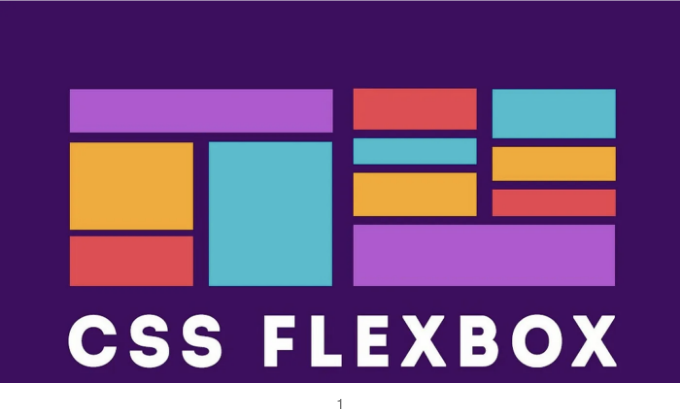
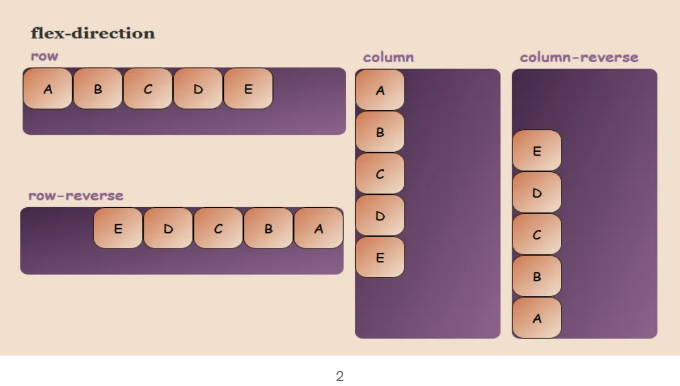
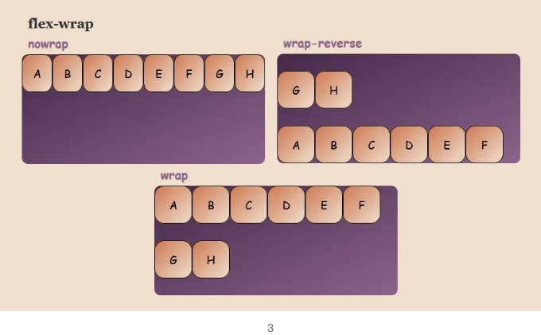
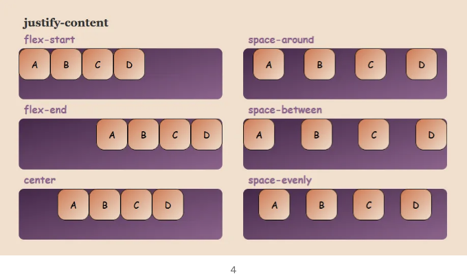
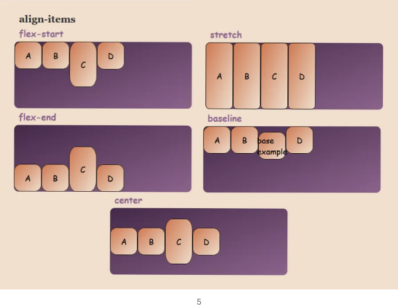

# Flexbox란 무엇이며 어떻게 사용하나요?

Flexbox (Flexible Box)는 웹 페이지의 HTML 요소를 정렬하는 데 사용되는 구조입니다.

Flexbox를 사용하면 요소들을 수평 및 수직으로 정렬할 수 있으며 간격을 조절할 수 있습니다.

<!-- ui-log 수평형 -->
<ins class="adsbygoogle"
  style="display:block"
  data-ad-client="ca-pub-4877378276818686"
  data-ad-slot="9743150776"
  data-ad-format="auto"
  data-full-width-responsive="true"></ins>
<component is="script">
(adsbygoogle = window.adsbygoogle || []).push({});
</component>

Flexbox 속성을 사용하려면 정렬하려는 요소가 포함된 컨테이너가 필요합니다. 이 컨테이너에 CSS 속성으로 "display: flex;" 또는 "display: inline-flex;" 코드를 작성해야 합니다.

# Flex-direction

Flex-direction은 요소를 가로 또는 세로로 정렬하는 데 사용되는 속성입니다. "flex-direction:row"를 사용하면 행 방향으로, "flex-direction:column"을 사용하면 열 방향으로 정렬할 수 있습니다. 기본적으로 행이라고 간주됩니다.

<!-- ui-log 수평형 -->
<ins class="adsbygoogle"
  style="display:block"
  data-ad-client="ca-pub-4877378276818686"
  data-ad-slot="9743150776"
  data-ad-format="auto"
  data-full-width-responsive="true"></ins>
<component is="script">
(adsbygoogle = window.adsbygoogle || []).push({});
</component>

"row-reverse"와 "column-reverse" 속성은 순서를 거꾸로 시작하도록합니다.

# Flex-wrap

Flex-wrap은 요소들이 현재 화면에 완전히 맞지 않을 때 다음 줄로 넘어가거나 그것을 방지하는 속성입니다.

"flex-wrap: nowrap"은 기본 값으로, 요소들/컨테이너가 화면에 맞지 않을 때 넘침을 허용하고 다음 줄/줄들로 넘어가지 않도록합니다.

<!-- ui-log 수평형 -->
<ins class="adsbygoogle"
  style="display:block"
  data-ad-client="ca-pub-4877378276818686"
  data-ad-slot="9743150776"
  data-ad-format="auto"
  data-full-width-responsive="true"></ins>
<component is="script">
(adsbygoogle = window.adsbygoogle || []).push({});
</component>

“flex-wrap: wrap” 값은 요소들이 화면에 맞지 않을 때 줄 바꿈을 허용합니다.

“flex-wrap: wrap-reverse” 값은 요소들이 화면에 맞지 않을 때, "row-reverse"와 같이 역순으로 정렬합니다.

# Justify-content

<!-- ui-log 수평형 -->
<ins class="adsbygoogle"
  style="display:block"
  data-ad-client="ca-pub-4877378276818686"
  data-ad-slot="9743150776"
  data-ad-format="auto"
  data-full-width-responsive="true"></ins>
<component is="script">
(adsbygoogle = window.adsbygoogle || []).push({});
</component>

Contents를 정의하는 것은 요소들 사이 및 주위의 간격을 조정하고 정렬하는 데 사용되는 속성입니다.

“justify-content: flex-start”는 기본값이며 모든 플렉스 요소를 시작 부분에 정렬합니다.

“justify-content: flex-end”는 flex-start의 오른쪽 정렬된 버전입니다.

“justify-content: center”는 모든 요소를 컨테이너 가운데에 배치하고 좌우로 동일한 간격을 유지합니다.

<!-- ui-log 수평형 -->
<ins class="adsbygoogle"
  style="display:block"
  data-ad-client="ca-pub-4877378276818686"
  data-ad-slot="9743150776"
  data-ad-format="auto"
  data-full-width-responsive="true"></ins>
<component is="script">
(adsbygoogle = window.adsbygoogle || []).push({});
</component>

"justify-content: space-around" 속성은 요소들을 좌우에 동일한 간격으로 정렬합니다. 오른쪽과 왼쪽 끝은 각각 1x의 간격을 가지며 요소들 사이의 간격은 2x로 설정됩니다.

"justify-content: space-between" 속성은 첫 번째 요소와 마지막 요소를 모서리에 정렬하고 다른 요소들 사이에 동일한 간격을 둡니다.

"justify-content: space-evenly" 속성은 컨테이너와 요소들 사이에 동일한 간격을 둡니다.

<!-- ui-log 수평형 -->
<ins class="adsbygoogle"
  style="display:block"
  data-ad-client="ca-pub-4877378276818686"
  data-ad-slot="9743150776"
  data-ad-format="auto"
  data-full-width-responsive="true"></ins>
<component is="script">
(adsbygoogle = window.adsbygoogle || []).push({});
</component>

# Align-items

Align items은 아이템들을 수직으로 정렬하는 데 사용됩니다.

References:

<!-- ui-log 수평형 -->
<ins class="adsbygoogle"
  style="display:block"
  data-ad-client="ca-pub-4877378276818686"
  data-ad-slot="9743150776"
  data-ad-format="auto"
  data-full-width-responsive="true"></ins>
<component is="script">
(adsbygoogle = window.adsbygoogle || []).push({});
</component>

1- [여기를 클릭하세요!](https://community.kodular.io/t/flexbox-css-flexible-box-layout-module-for-kodular/132608)

2,3,4,5 - [여기를 클릭하세요!](https://byteiota.com/flexbox-conatiner/)