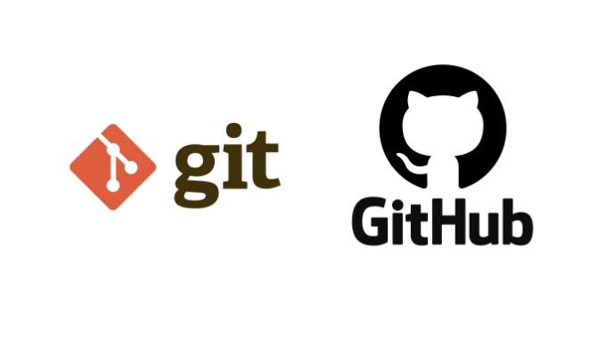

소프트웨어 개발 분야에서 Git과 GitHub은 종종 상호 교환 가능하게 사용되는 두 용어로, 초보자와 숙련된 개발자 모두에게 혼란을 야기합니다. 비록 둘은 밀접한 관련이 있지만, 각각 다른 목적으로 사용되며 버전 관리 및 협업 코딩 세계를 탐색하는 데 매우 중요합니다. Git과 GitHub의 차이를 이해하는 것이 중요합니다.

Git이란?

Git은 2005년 Linus Torvalds가 만든 분산 버전 관리 시스템(VCS)으로, 주로 소프트웨어 개발 중에 소스 코드를 관리하기 위해 설계되었습니다. 개발자들은 코드베이스의 변경 사항을 추적하고 다른 사람들과 협업하며 필요한 경우 이전 버전으로 손쉽게 돌아갈 수 있습니다. SVN과 같은 중앙집중식 버전 관리 시스템과 달리 Git은 분산 방식으로 작동하여 각 개발자가 로컬 컴퓨터에 저장소의 완전한 사본을 가질 수 있습니다.

Git의 주요 특징:

<!-- ui-log 수평형 -->
<ins class="adsbygoogle"
  style="display:block"
  data-ad-client="ca-pub-4877378276818686"
  data-ad-slot="9743150776"
  data-ad-format="auto"
  data-full-width-responsive="true"></ins>
<component is="script">
(adsbygoogle = window.adsbygoogle || []).push({});
</component>

- 로컬 저장소: Git은 모든 변경 사항과 브랜치를 개발자 각자의 컴퓨터에 완벽한 히스토리로 저장합니다. 이는 개발자들이 오프라인으로 작업할 수 있고 변경 사항을 지역적으로 커밋하고 나중에 중앙 저장소와 동기화할 수 있음을 의미합니다.
- 브랜치 및 병합: Git은 새로운 기능을 실험하거나 버그를 수정할 때 본 코드베이스에 영향을 주지 않고 브랜치를 만드는 프로세스를 단순화합니다. 변경 사항이 테스트되고 준비되면 개발자들은 브랜치를 메인 브랜치로 병합할 수 있습니다.
- 속도와 효율성: Git은 대규모 코드베이스를 효과적으로 관리하는 속도와 효율성으로 알려져 있습니다. 변경 사항 커밋, 브랜치 생성, 병합과 같은 작업들은 아주 빠르게 이루어지며, 복잡한 프로젝트에서도 원할한 협업이 가능합니다.

GitHub란 무엇인가요?

반면에 GitHub은 2008년 Tom Preston-Werner, Chris Wanstrath, PJ Hyett에 의해 설립된 Git 저장소를 위한 웹 기반 호스팅 서비스입니다. 이는 개발자가 Git 저장소를 호스팅하고 다른 사람과 협업하며 오픈 소스 프로젝트에 기여할 수 있는 플랫폼을 제공합니다. Git이 기본 버전 관리 시스템인 반면, GitHub은 개발자들을 위해 특별히 제작된 협업 기능과 소셜 네트워킹 요소의 레이어를 추가합니다.

<!-- ui-log 수평형 -->
<ins class="adsbygoogle"
  style="display:block"
  data-ad-client="ca-pub-4877378276818686"
  data-ad-slot="9743150776"
  data-ad-format="auto"
  data-full-width-responsive="true"></ins>
<component is="script">
(adsbygoogle = window.adsbygoogle || []).push({});
</component>

GitHub의 주요 기능:

- 원격 저장소 호스팅: GitHub는 개발자들이 Git 저장소를 클라우드에 저장할 수 있는 원격 저장소 호스팅 서비스 역할을 합니다. 이를 통해 인터넷 연결이 가능한 어디에서든 프로젝트에 액세스하고 협업할 수 있습니다.
- 이슈 추적 및 프로젝트 관리: GitHub는 이슈 추적, 프로젝트 관리 및 팀 협업을 위한 도구를 제공하여 개발자들이 작업을 조직화하고 버그를 추적하며 팀 내에서 협업을 조율하기 쉽게 만듭니다.
- 풀 리퀘스트 및 코드 리뷰: GitHub의 가장 강력한 기능 중 하나는 풀 리퀘스트를 지원하는 것입니다. 이 기능을 통해 개발자들은 변경 사항을 제안하고 코드를 리뷰하며 본 코드로 병합하기 전에 피드백을 제공할 수 있습니다. 이를 통해 투명하고 협업적인 개발 워크플로우를 용이하게 합니다.

Git vs GitHub: 차이점 이해하기

요약하자면, Git은 프로젝트의 변경 내역을 관리하는 버전 관리 시스템이며 GitHub는 Git을 기반으로 구축된 웹 기반 플랫폼으로, 저장소를 호스팅하고 다른 사람들과 협업하며 소프트웨어 프로젝트를 관리할 수 있는 기능을 제공합니다. Git은 로컬 기계에서 독립적으로 사용할 수 있지만, GitHub는 중앙 집중식 플랫폼을 제공하여 Git 저장소를 호스팅하고 공유할 수 있어 소프트웨어 개발의 협업 측면을 강화합니다.

<!-- ui-log 수평형 -->
<ins class="adsbygoogle"
  style="display:block"
  data-ad-client="ca-pub-4877378276818686"
  data-ad-slot="9743150776"
  data-ad-format="auto"
  data-full-width-responsive="true"></ins>
<component is="script">
(adsbygoogle = window.adsbygoogle || []).push({});
</component>

결론적으로, Git과 GitHub는 현대 소프트웨어 개발 워크플로우에서 중요한 역할을 합니다. Git은 버전 관리의 기초를 형성하는 반면, GitHub는 다양한 협업 도구와 소셜 기능으로 보완하여 오픈 소스 기여 및 팀 협업에 강력한 플랫폼이 됩니다. Git과 GitHub 사이의 차이를 이해하는 것은 개발자가 개발 프로세스를 간소화하고 더 넓은 소프트웨어 개발 커뮤니티와 소통하는 데 중요합니다.

제 최신 작업 내용을 업데이트하려면! 저를 Medium에서 팔로우하고 이 기사에 박수를 치셔서 제 콘텐츠 제작을 지원해주세요. 읽어 주셔서 감사합니다!