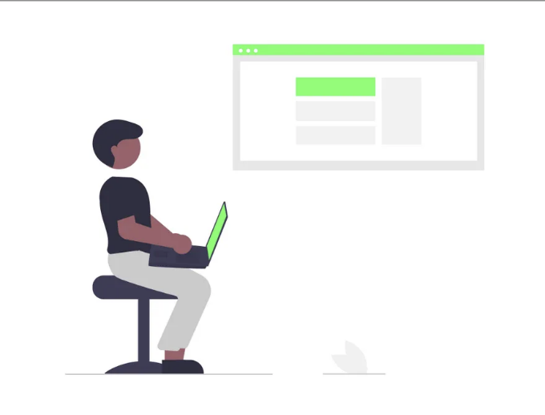
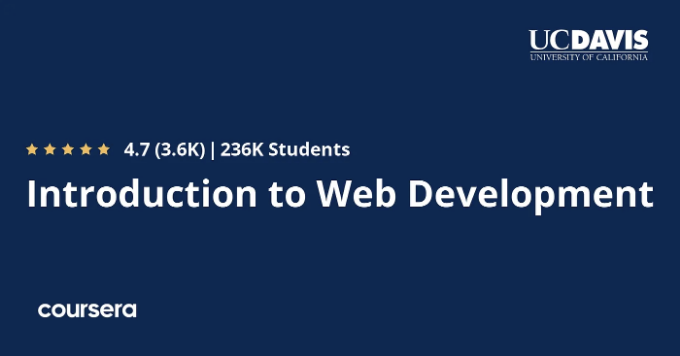
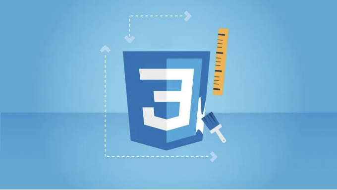
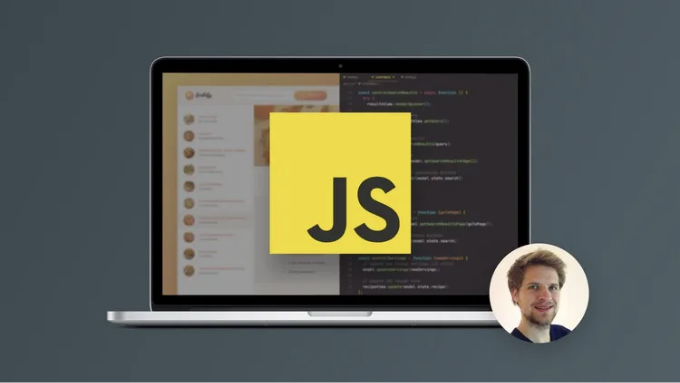
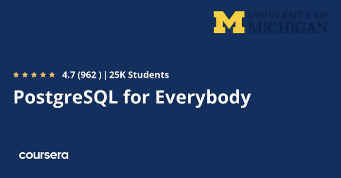

## 2024년에 웹 개발을 배우는 데 한 주, 한 달 또는 한 해가 걸릴까요?

안녕하세요 여러분, 웹 개발을 배우는 방법과 웹 개발을 배우고 웹 개발자가 되는 데 얼마나 시간이 걸리는지 궁금하다면 올바른 곳에 오셨습니다.

이전에, 나는 최고의 웹 개발 코스와 HTML, CSS, JavaScript 같은 필수 웹 개발 기술 및 React.js와 Node.js와 같은 프레임워크를 배우는 데 가장 좋은 코스를 공유했었고, 이 기사에서는 얼마나 시간이 걸릴지 정확하게 알려드릴 것입니다. 웹 개발을 배우는 데는 몇 주 또는 몇 달이 걸릴까요?

<!-- ui-log 수평형 -->
<ins class="adsbygoogle"
  style="display:block"
  data-ad-client="ca-pub-4877378276818686"
  data-ad-slot="9743150776"
  data-ad-format="auto"
  data-full-width-responsive="true"></ins>
<component is="script">
(adsbygoogle = window.adsbygoogle || []).push({});
</component>

현재 설립된 어떤 회사도 웹사이트를 갖고 있지 않을 거예요. 왜냐하면 웹사이트 없이는 대상을 도달하고 관계를 구축하거나 서비스를 제공할 수 없으 af

웹 개발은 프론트엔드, 백엔드, 그리고 웹사이트 데이터베이스를 생성하는 과정이며, 이들은 올바르게 결합되어 작동해야 합니다. 이 글은 웹 개발자가 되는 방법과 소요 시간에 대해 이해할 수 있도록 도와줄 거예요.

참고로, 아직 초보라면 Udemy의 The Complete 2024 Web Development Bootcamp과 같은 온라인 부트캠프 과정으로 시작할 수 있어요. 이 강좌는 일반 부트캠프 수업의 일부분으로 구매할 수 있고 Udemy 판매 시기에는 $9.9에 구매할 수 있어요. 지금은 세일 중일지도 몰라요.

이 61시간 강좌는 시작하기에 아주 좋고, 진지하게 따라가면 7일이나 1주일만에 웹 개발을 아주 많이 배울 수 있어요. 프로젝트와 코딩 연습이 가득해서 실습을 통해 직접 경험할 수도 있어요.

<!-- ui-log 수평형 -->
<ins class="adsbygoogle"
  style="display:block"
  data-ad-client="ca-pub-4877378276818686"
  data-ad-slot="9743150776"
  data-ad-format="auto"
  data-full-width-responsive="true"></ins>
<component is="script">
(adsbygoogle = window.adsbygoogle || []).push({});
</component>

# 1. 웹 개발을 이해하는 데 얼마나 걸릴까요?

소개에서 정의된 대로 웹 개발은 프론트엔드 개발, 백엔드 개발, 데이터베이스 설계 등 많은 기술이 필요하다는 것을 알 수 있습니다.

따라서 많은 언어와 프레임워크를 알아야 하기 때문에 각 섹션에 대해 심층적으로 파고들기 위해서는 시간이 필요합니다.

이러한 기술들을 약 9개월에서 1년 사이에 배울 수 있지만, 여러분의 고용주에게 매력적으로 보이지는 않을 것이며, 아마도 인턴십을 하거나 연봉 66,106 달러짜리 입사할 수 있는 직업을 얻을 수 있을 것입니다.

<!-- ui-log 수평형 -->
<ins class="adsbygoogle"
  style="display:block"
  data-ad-client="ca-pub-4877378276818686"
  data-ad-slot="9743150776"
  data-ad-format="auto"
  data-full-width-responsive="true"></ins>
<component is="script">
(adsbygoogle = window.adsbygoogle || []).push({});
</component>

# 2. 자체 학습을 통해 웹 개발을 배울 수 있을까요?

이 질문의 간단한 답은 "예"입니다. 심지어 대학에 다니지 않고 집에서 강좌를 학습하여 자체적으로 프로 웹 개발자가 될 수 있습니다. 많은 돈과 시간을 들이지 않아도 되며 어떤 대기업도 웹 개발자를 능력으로 고용합니다.

# 3. 각 기술을 배우는 데 소요되는 시간은 얼마나 될까요?

웹 개발의 각 부분에는 배워야 할 언어가 있습니다. 특정 언어를 지정할 수 없으며 동일한 회사라도 사용하는 언어와 프레임워크가 다를 수 있습니다. 그럼에도 불구하고, 가장 많이 사용되는 몇 가지 언어를 추천하고 해당 언어를 이해하면 다른 언어로 스스로 스킬을 향상시킬 수 있습니다:

<!-- ui-log 수평형 -->
<ins class="adsbygoogle"
  style="display:block"
  data-ad-client="ca-pub-4877378276818686"
  data-ad-slot="9743150776"
  data-ad-format="auto"
  data-full-width-responsive="true"></ins>
<component is="script">
(adsbygoogle = window.adsbygoogle || []).push({});
</component>

## 3.1. HTML

웹사이트의 디자인을 구성하는 가장 간단한 언어인 HTML은 버튼을 어디에 놓을지, 텍스트를 어디에 쓸지, 이미지를 넣을 곳 등을 결정합니다. 이 '웹 개발 입문' 과정은 여러분이 이 글에서 다루게 될 웹 개발에 필요한 HTML 및 다른 많은 언어를 배울 수 있도록 도와줄 것입니다. 여전히 HTML을 습득하는 데는 단 몇 일이면 충분합니다.

## 3.2. CSS

<!-- ui-log 수평형 -->
<ins class="adsbygoogle"
  style="display:block"
  data-ad-client="ca-pub-4877378276818686"
  data-ad-slot="9743150776"
  data-ad-format="auto"
  data-full-width-responsive="true"></ins>
<component is="script">
(adsbygoogle = window.adsbygoogle || []).push({});
</component>

이것은 HTML 페이지를 스타일링하는 데 사용되는 cascading style sheet의 약자로, 버튼에 색상을 추가하는 것과 같은 작업을 할 수 있습니다. 이 언어를 몇 달 만에 중급 수준의 CSS 개발자가 되기 위해 좋은 규율로 배울 수 있지만, CSS — The Complete Guide 2024 (포함 Flexbox, Grid 및 Sass) 이 코스에서 이 언어의 기본 개념뿐만 아니라 Flexbox, Grid 및 Saas와 같은 고급 개념을 가르쳐줄 것입니다.

### 3.3. JavaScript

이 언어는 다른 어떤 프로그래밍 언어보다 거의 가장 많이 사용되며, 사용자 경험을 향상시키기 위해 웹 사이트를 인터랙티브하게 만들 수 있습니다. JavaScript를 배우는 데는 몇 달이 걸릴 수 있지만, The Complete JavaScript Course 2024: From Zero to Expert! 이 코스를 통해 이 필수 언어를 2개월 안에 숙달할 수 있습니다.

<!-- ui-log 수평형 -->
<ins class="adsbygoogle"
  style="display:block"
  data-ad-client="ca-pub-4877378276818686"
  data-ad-slot="9743150776"
  data-ad-format="auto"
  data-full-width-responsive="true"></ins>
<component is="script">
(adsbygoogle = window.adsbygoogle || []).push({});
</component>

## 3.4. PHP

다음 웹 앱을 구축하는 데 사용할 수 있는 많은 백엔드 언어가 있지만 PHP는 웹의 %79 이상에서 사용됩니다. 따라서 이 언어를 배우면 웹 개발자로 일자리를 얻을 기회가 생깁니다. 이 "PHP로 웹 애플리케이션 만들기" 강좌는 몇 일 안에 PHP 기본을 이해하는 데 도움이 됩니다!

<!-- ui-log 수평형 -->
<ins class="adsbygoogle"
  style="display:block"
  data-ad-client="ca-pub-4877378276818686"
  data-ad-slot="9743150776"
  data-ad-format="auto"
  data-full-width-responsive="true"></ins>
<component is="script">
(adsbygoogle = window.adsbygoogle || []).push({});
</component>

## 3.5. 데이터베이스

다양한 데이터베이스 유형과 소프트웨어가 있지만, 가장 많이 사용되고 유명한 것 중 하나는 데이터를 저장하는 관계형 데이터베이스인 PostgreSQL 데이터베이스입니다. 이 코스, 'PostgreSQL for Everybody',는 여러분이 이러한 기술을 2개월 동안 배울 수 있도록 도와줍니다.

# 4. 웹 개발자를 위한 교육 추천

<!-- ui-log 수평형 -->
<ins class="adsbygoogle"
  style="display:block"
  data-ad-client="ca-pub-4877378276818686"
  data-ad-slot="9743150776"
  data-ad-format="auto"
  data-full-width-responsive="true"></ins>
<component is="script">
(adsbygoogle = window.adsbygoogle || []).push({});
</component>

웹 개발 과정은 Coursera, edX, Udemy 등 온라인 교육 플랫폼 전역에서 제공됩니다. 이 분야를 숙달하고 웹 개발 분야에서 적어도 입문 수준이 될 수 있는 몇 가지 강좌를 추천드리겠습니다:

### 4.1. 모두를 위한 웹 어플리케이션

PHP 언어와 MySQL 데이터베이스를 사용하여 웹 애플리케이션을 구축하는 것을 배우는 최고의 강좌 중 하나이며, PostgreSQL과 유사하여 릴레이션 데이터베이스입니다.

### 4.2. 완벽한 2024 웹 개발 부트캠프

<!-- ui-log 수평형 -->
<ins class="adsbygoogle"
  style="display:block"
  data-ad-client="ca-pub-4877378276818686"
  data-ad-slot="9743150776"
  data-ad-format="auto"
  data-full-width-responsive="true"></ins>
<component is="script">
(adsbygoogle = window.adsbygoogle || []).push({});
</component>

이 코스는 HTML, CSS 및 JavaScript와 같은 웹 기술을 사용하여 웹 프론트엔드를 구축하는 방법을 가르치며, 17시간 동안 3개의 프로젝트를 진행하여 웹 개발에 대한 실제 경험을 쌓을 수 있습니다.

### 4.3. 8시간 동안의 MySQL 데이터베이스

MySQL를 초보자들에게 가르쳐 주는 좋은 아마존 서적이며, 데이터베이스 개발에 처음 시작하고 싶은 학생들에게 적합하며, 웹 개발에도 유용합니다.

<!-- ui-log 수평형 -->
<ins class="adsbygoogle"
  style="display:block"
  data-ad-client="ca-pub-4877378276818686"
  data-ad-slot="9743150776"
  data-ad-format="auto"
  data-full-width-responsive="true"></ins>
<component is="script">
(adsbygoogle = window.adsbygoogle || []).push({});
</component>

## 결론

물론, 웹 개발자로 성장하기 위해 배워야 할 기술은 많습니다. 프론트엔드 개발을 위한 React 프레임워크 및 Vue.js와 같은 여러 기술들이 있지만, 이러한 기술들은 웹 개발자로의 여정을 시작하는 데 도움이 될 것입니다.