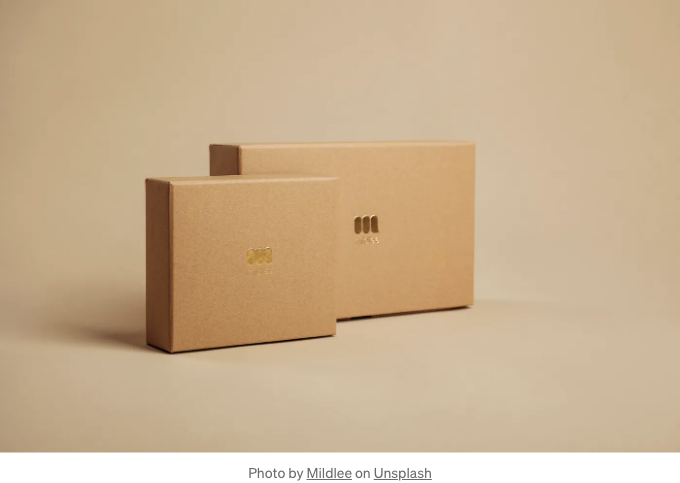

Flexbox는 강력한 CSS 레이아웃 모델로 웹 레이아웃을 설계하고 구성하는 방식을 혁신적으로 바꿨어요. 유연하고 반응형 디자인을 만드는 직관적인 방법을 제공하며, Flexbox에는 일반적인 레이아웃 작업을 간단히 하는 다양한 팁과 트릭이 있어요. 이 글에서는 Flexbox 레이아웃을 숙달하기 위한 필수 기술에 대해 다뤄볼 거예요. 행과 열을 만들기, 콘텐츠 가운데 정렬, 반응형 최적화 등이요.

# 행과 열 레이아웃 만들기

Flexbox의 근본적인 측면 중 하나는 행과 열 레이아웃을 손쉽게 만들 수 있다는 점이에요. flex 컨테이너와 그 자식에 몇 가지 주요 속성을 적용하여 다목적이고 동적인 구조를 만들 수 있어요.

<!-- ui-log 수평형 -->
<ins class="adsbygoogle"
  style="display:block"
  data-ad-client="ca-pub-4877378276818686"
  data-ad-slot="9743150776"
  data-ad-format="auto"
  data-full-width-responsive="true"></ins>
<component is="script">
(adsbygoogle = window.adsbygoogle || []).push({});
</component>

```js
/* 행 레이아웃 정의 */
.row {
  display: flex;
  flex-wrap: wrap;
}

/* 열 레이아웃 정의 */
.col {
  flex: 1;
}
```

# 콘텐츠 수평 및 수직 가운데 정렬

플렉스박스는 콘텐츠를 컨테이너 내에서 수평 및 수직으로 중앙에 정렬하는 작업을 간단하게 해줍니다. 이러한 기술들은 콘텐츠의 크기나 차원에 관계없이 완벽하게 정렬되도록 보장합니다.

```js
/* 콘텐츠를 수평으로 가운데 정렬 */
.center-horizontally {
  display: flex;
  justify-content: center;
}

/* 콘텐츠를 수직으로 가운데 정렬 */
.center-vertically {
  display: flex;
  align-items: center;
}

/* 콘텐츠를 수평 및 수직으로 동시에 가운데 정렬 */
.center {
  display: flex;
  justify-content: center;
  align-items: center;
}
```

<!-- ui-log 수평형 -->
<ins class="adsbygoogle"
  style="display:block"
  data-ad-client="ca-pub-4877378276818686"
  data-ad-slot="9743150776"
  data-ad-format="auto"
  data-full-width-responsive="true"></ins>
<component is="script">
(adsbygoogle = window.adsbygoogle || []).push({});
</component>

# 동일 너비 칼럼

Flexbox를 사용하면 동일한 너비를 가진 칼럼을 손쉽게 만들 수 있어요. 행 레이아웃 내 각 칼럼에 flex: 1; 속성을 적용하면 사용 가능한 공간을 균등하게 공유하도록 할 수 있어요.

```js
/* 동일한 너비 칼럼 */
.row > .col {
  flex: 1;
}
```

# 반응형 Flexbox 그리드

<!-- ui-log 수평형 -->
<ins class="adsbygoogle"
  style="display:block"
  data-ad-client="ca-pub-4877378276818686"
  data-ad-slot="9743150776"
  data-ad-format="auto"
  data-full-width-responsive="true"></ins>
<component is="script">
(adsbygoogle = window.adsbygoogle || []).push({});
</component>

Flexbox의 유연성은 반응형 그리드 레이아웃을 구축할 때 돋보입니다. 행(row) 및 열(column) 클래스를 미디어 쿼리와 결합하여, 다양한 화면 크기에 매끄럽게 적응하는 디자인을 만들 수 있습니다.

```js
@media (min-width: 768px) {
  .row {
    flex-wrap: nowrap;
  }
  .col {
    flex: 0 0 auto;
  }
}
```

# 플렉스 컨테이너 중첩

더 복잡한 레이아웃을 위해, Flexbox를 사용하면 서로 중첩된 플렉스 컨테이너를 생성할 수 있습니다. 이 기술을 사용하면 각기 다른 수준에서 행과 열이 포함된 계층 구조를 만들 수 있습니다.

<!-- ui-log 수평형 -->
<ins class="adsbygoogle"
  style="display:block"
  data-ad-client="ca-pub-4877378276818686"
  data-ad-slot="9743150776"
  data-ad-format="auto"
  data-full-width-responsive="true"></ins>
<component is="script">
(adsbygoogle = window.adsbygoogle || []).push({});
</component>

```js
<div class="parent-container">
  <div class="row">
    <div class="col">
      <!-- 내용 -->
    </div>
    <div class="col">
      <!-- 내용 -->
    </div>
  </div>
</div>
```

# 스크롤 가능한 콘텐츠와 고정 헤더

Flexbox를 사용하여 고정 헤더 레이아웃과 스크롤 가능한 콘텐츠 영역을 구현합니다. 이는 헤더에 계속 액세스해야 하는 긴 콘텐츠를 가진 애플리케이션에 특히 유용합니다.

```js
/* 고정 헤더 레이아웃 */
.fixed-header-container {
  display: flex;
  flex-direction: column;
  height: 100vh; /* 필요에 맞게 조절 */
}

.header {
  flex: 0 0 auto;
}

.content {
  flex: 1;
  overflow-y: auto;
}
```

<!-- ui-log 수평형 -->
<ins class="adsbygoogle"
  style="display:block"
  data-ad-client="ca-pub-4877378276818686"
  data-ad-slot="9743150776"
  data-ad-format="auto"
  data-full-width-responsive="true"></ins>
<component is="script">
(adsbygoogle = window.adsbygoogle || []).push({});
</component>

# 고정 푸터

콘텐츠의 높이에 관계없이 화면 하단에 고정 푸터를 구현하세요. 이 레이아웃은 콘텐츠가 적을 때에도 푸터가 항상 하단에 고정되도록 합니다.

```js
/* Sticky footer */
.sticky-footer-container {
  display: flex;
  flex-direction: column;
  min-height: 100vh;
}

.content {
  flex: 1;
}

.footer {
  flex: 0 0 auto;
}
```

# 메이슨리 그리드 레이아웃

<!-- ui-log 수평형 -->
<ins class="adsbygoogle"
  style="display:block"
  data-ad-client="ca-pub-4877378276818686"
  data-ad-slot="9743150776"
  data-ad-format="auto"
  data-full-width-responsive="true"></ins>
<component is="script">
(adsbygoogle = window.adsbygoogle || []).push({});
</component>

가로 공간에 따라 아이템이 배치되어 시각적으로 매력적인 배열이 생성되는 메이슨리 스타일의 그리드 레이아웃을 만들어보세요.

```js
/* 메이슨리 그리드 레이아웃 */
.masonry-grid {
  display: flex;
  flex-wrap: wrap;
}

.masonry-item {
  width: calc(33.33% - 10px); /* 필요에 따라 조정 */
  margin: 5px;
}
```

# 신축성 있는 사이드바와 본문 콘텐츠

사용자 상호작용에 따라 사이드바가 확장 또는 축소되는 신축성 있는 레이아웃을 디자인해보세요.

<!-- ui-log 수평형 -->
<ins class="adsbygoogle"
  style="display:block"
  data-ad-client="ca-pub-4877378276818686"
  data-ad-slot="9743150776"
  data-ad-format="auto"
  data-full-width-responsive="true"></ins>
<component is="script">
(adsbygoogle = window.adsbygoogle || []).push({});
</component>

```js
/* 유연한 사이드바와 본문 콘텐츠 */
.flexible-layout {
  display: flex;
}

.sidebar {
  flex: 0 0 250px; /* 필요에 따라 너비 조절 */
}

.main-content {
  flex: 1;
}
```

# 홀리 그레일 레이아웃

헤더, 푸터 및 세 개의 열(왼쪽 사이드바, 본문 콘텐츠, 오른쪽 사이드바)가 모두 다양한 화면 크기에 반응적으로 적응하는 고전적인 홀리 그레일 레이아웃을 구현합니다.

```js
/* 홀리 그레일 레이아웃 */
.holy-grail-container {
  display: flex;
  min-height: 100vh;
}

.header,
.footer {
  flex: 0 0 auto;
}

.left-sidebar,
.right-sidebar {
  flex: 0 0 200px; /* 필요에 따라 너비 조절 */
}

.main-content {
  flex: 1;
}
```

<!-- ui-log 수평형 -->
<ins class="adsbygoogle"
  style="display:block"
  data-ad-client="ca-pub-4877378276818686"
  data-ad-slot="9743150776"
  data-ad-format="auto"
  data-full-width-responsive="true"></ins>
<component is="script">
(adsbygoogle = window.adsbygoogle || []).push({});
</component>

# 유연한 타일을 가진 이미지 갤러리

가용 공간에 따라 크기가 조절되는 유연한 타일을 가진 이미지 갤러리 레이아웃을 생성하여 이미지를 시각적으로 균형 잡힌 방식으로 제시합니다.

```js
/* 유연한 타일을 가진 이미지 갤러리 */
.image-gallery {
  display: flex;
  flex-wrap: wrap;
}

.image-tile {
  flex: 1 1 200px; /* 필요에 따라 너비 조정 */
  margin: 5px;
}
```

# 반응형 카드 그리드

<!-- ui-log 수평형 -->
<ins class="adsbygoogle"
  style="display:block"
  data-ad-client="ca-pub-4877378276818686"
  data-ad-slot="9743150776"
  data-ad-format="auto"
  data-full-width-responsive="true"></ins>
<component is="script">
(adsbygoogle = window.adsbygoogle || []).push({});
</component>

다양한 화면 크기에 맞게 카드가 동적으로 위치와 크기를 조정하여 최적의 뷰잉 경험을 제공하는 반응형 카드 그리드 레이아웃을 만들어보세요.

```js
/* 반응형 카드 그리드 */
.card-grid {
  display: flex;
  flex-wrap: wrap;
  justify-content: space-between;
}

.card {
  flex: 0 0 calc(33.33% - 20px); /* 필요에 따라 너비와 여백 조정 */
  margin: 10px;
}
```

이 필수 팁과 트릭을 숙달하면 Flexbox의 전체 잠재력을 활용하여 웹 프로젝트에 멋진 반응형 레이아웃을 만들 수 있습니다. 간단한 랜딩 페이지 또는 복잡한 웹 애플리케이션을 구축하든, Flexbox를 통해 자신감과 효율성을 갖고 디자인할 수 있습니다. 오늘부터 이러한 기술을 업무 프로세스에 통합하고 웹 디자인 기술을 새로운 레벨로 끌어올려보세요!```