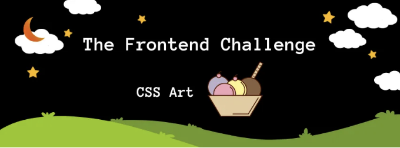
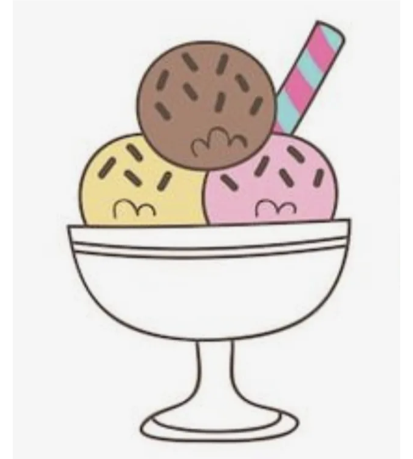

이것은 DEV Challenge v24.03.20, CSS 아트: Favorite Snack을 위한 제출입니다.

# 영감

여름 간식이 제 그림을 영감으로 삼았어요. 저는 좋은 선데이 컵을 좋아해요. Pinterest에서 아이디어를 얻었어요.

<!-- ui-log 수평형 -->
<ins class="adsbygoogle"
  style="display:block"
  data-ad-client="ca-pub-4877378276818686"
  data-ad-slot="9743150776"
  data-ad-format="auto"
  data-full-width-responsive="true"></ins>
<component is="script">
(adsbygoogle = window.adsbygoogle || []).push({});
</component>

# 데모

# 여정

이전에 일러스트 (라디오 상자와 커피잔)를 만들어 놓은 적이 있지만 이번에는 빨리 만들었습니다.

<!-- ui-log 수평형 -->
<ins class="adsbygoogle"
  style="display:block"
  data-ad-client="ca-pub-4877378276818686"
  data-ad-slot="9743150776"
  data-ad-format="auto"
  data-full-width-responsive="true"></ins>
<component is="script">
(adsbygoogle = window.adsbygoogle || []).push({});
</component>

저는 컵에 귀여운 얼굴을 그리는 방법을 배웠어요.

최종 일러스트에 만족해하고, 이후에 애니메이션을 추가할 거예요.

## 코드

여기서 코드를 확인할 수 있어요.

<!-- ui-log 수평형 -->
<ins class="adsbygoogle"
  style="display:block"
  data-ad-client="ca-pub-4877378276818686"
  data-ad-slot="9743150776"
  data-ad-format="auto"
  data-full-width-responsive="true"></ins>
<component is="script">
(adsbygoogle = window.adsbygoogle || []).push({});
</component>

읽어 주셔서 감사합니다!