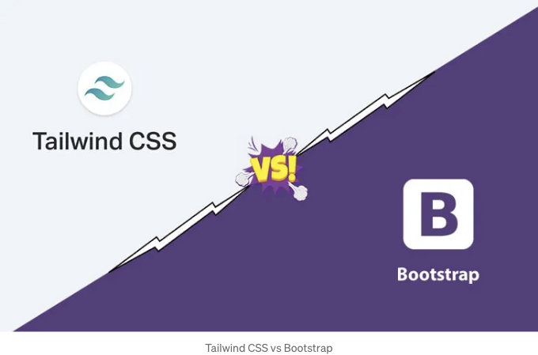
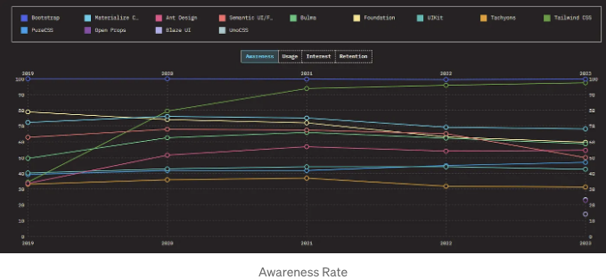
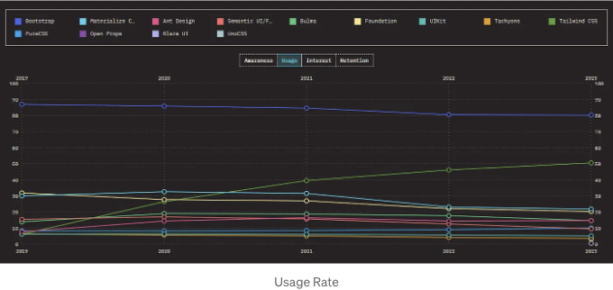
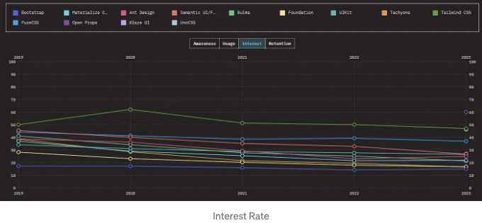
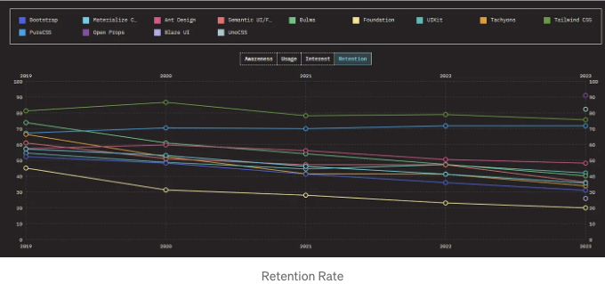

안녕하세요!
이 이야기에는 Tailwind CSS와 Bootstrap을 소개하고 최적화, 렌더링, 2023-24 인기 등에서 비교할 것입니다.



# 소개

## Tailwind CSS

<!-- ui-log 수평형 -->
<ins class="adsbygoogle"
  style="display:block"
  data-ad-client="ca-pub-4877378276818686"
  data-ad-slot="9743150776"
  data-ad-format="auto"
  data-full-width-responsive="true"></ins>
<component is="script">
(adsbygoogle = window.adsbygoogle || []).push({});
</component>

테일윈드 CSS는 현대 웹사이트 개발을 가속화하기 위해 디자인된 인기 있는 유틸리티 중심의 CSS 프레임워크입니다. 전통적인 프레임워크가 미리 만들어진 컴포넌트를 제공하는 반면, 테일윈드는 패딩, 마진, 색상 또는 타이포그래피와 같은 요소의 스타일을 특정하게 설정하는 대량의 로우 레벨 유틸리티 클래스를 제공합니다. 이 프레임워크는 HTML 파일, JavaScript 컴포넌트 및 다른 템플릿의 모든 클래스 이름을 스캔하여 해당 스타일을 생성하고 정적 CSS 파일로 작성합니다.

빠르고 유연하며 신뢰할 수 있으며 런타임이 전혀 필요하지 않습니다.

테일윈드 CSS의 주요 개념은 다음과 같습니다:

- 유틸리티 중심 접근 방식: 미리 디자인된 컴포넌트 대신, 테일윈드는 사용자 정의 UI 요소를 만들기 위해 결합하는 기본 구성 요소(유틸리티 클래스)를 제공합니다. 이를 통해 웹사이트의 모양과 느낌에 대해 세밀한 제어를 할 수 있습니다.
- 빠른 프로토타이핑: 테일윈드의 유틸리티 클래스가 HTML에서 쉽게 이용 가능하기 때문에, 광범위한 CSS를 처음부터 작성하는 대신 웹 페이지를 빠르게 스타일링할 수 있습니다. 이는 프로토타이핑 및 웹사이트의 초기 레이아웃 구축에 특히 유용합니다.
- 반응형 디자인: 테일윈드에는 화면 크기에 따라 스타일을 조정할 수 있는 반응형 수정자가 포함되어 있어 다양한 기기에서 웹사이트가 매끄럽게 적응되도록 합니다.
- 사용자 정의: 테일윈드는 확장 가능한 사용자 정의 옵션을 제공합니다. 필요한 유틸리티 클래스만 포함하고 디자인 시스템에 맞게 조정할 수 있습니다.
- 통합: 테일윈드는 다양한 JavaScript 프레임워크와 라이브러리와 원활하게 통합되어 현대 웹 개발에 유연한 도구로 사용할 수 있습니다.

<!-- ui-log 수평형 -->
<ins class="adsbygoogle"
  style="display:block"
  data-ad-client="ca-pub-4877378276818686"
  data-ad-slot="9743150776"
  data-ad-format="auto"
  data-full-width-responsive="true"></ins>
<component is="script">
(adsbygoogle = window.adsbygoogle || []).push({});
</component>

## 부트스트랩

부트스트랩은 웹 개발을 위한 무료이자 인기 있는 프레임워크로, 웹사이트를 만드는 프로세스를 단순화합니다. 특히 반응형 웹사이트를 만드는 데 유용하며, 이는 데스크탑부터 모바일폰까지 모든 기기에서 좋아보입니다. 강력하고 확장 가능하며 기능이 풍부한 프론트엔드 툴킷입니다. Sass로 빌드 및 사용자 정의하고, 사전 구축된 그리드 시스템 및 구성 요소를 활용하고, 강력한 JavaScript 플러그인으로 프로젝트를 살려 보세요.

다음은 부트스트랩의 주요 개념을 살펴본 것입니다:

- 반응형 그리드 시스템: 이것은 아마도 부트스트랩에서 가장 강력한 기능입니다. 화면 크기에 따라 자동으로 조정되는 그리드와 열을 갖춘 유연한 레이아웃 시스템을 제공합니다. 이를 통해 웹사이트가 데스크탑, 태블릿 및 모바일폰에서 최상의 모습으로 나타나고 잘 작동하도록 보장합니다.
- 사전 디자인된 UI 구성 요소: 부트스트랩은 버튼, 내비게이션 바, 폼, 모달, 이미지 캐로셀 등과 같은 준비된 UI 구성 요소의 거대한 컬렉션을 포함하고 있습니다. 이러한 구성 요소는 스타일이 적용되어 있으며 코딩되어 있어, 빌드하는 데 시간과 노력을 많이 절약할 수 있습니다.
- 다양한 JavaScript 플러그인: 부트스트랩은 정적 UI 구성 요소 이상의 것을 제공합니다. 웹 페이지에 상호작용성과 기능을 추가하는 다양한 JavaScript 플러그인을 제공합니다. 팝업 모달, 캐로셀, 툴팁, 스크롤투각 내비게이션 등을 생성하는 플러그인이 있습니다. 이러한 플러그인은 잘 문서화되어 있으며 통합하기 쉽습니다.
- 부트스트랩 테마 및 사용자 정의: 부트스트랩은 사전 제작된 구성 요소를 제공할 뿐만 아니라 광범위한 사용자 정의도 허용합니다. 내장된 테마를 사용하거나 고유한 테마를 만들어 웹사이트에 원하는 모양과 느낌을 구현할 수 있습니다. 부트스트랩은 스타일링 및 구성 요소에 맞게 맞춤화하는 데 사용할 수 있는 다양한 CSS 클래스를 제공합니다.

<!-- ui-log 수평형 -->
<ins class="adsbygoogle"
  style="display:block"
  data-ad-client="ca-pub-4877378276818686"
  data-ad-slot="9743150776"
  data-ad-format="auto"
  data-full-width-responsive="true"></ins>
<component is="script">
(adsbygoogle = window.adsbygoogle || []).push({});
</component>

# 구성 요소 사용 가능성

## 부트스트랩

부트스트랩은 웹 페이지에 통합할 수 있는 다양한 미리 디자인된 구성 요소를 제공합니다. 부트스트랩에서 사용 가능한 구성 요소를 간단히 살펴보면:

- 기본 구성 요소: 버튼, 알림, 진행 막대, 배지, 레이블
- 네비게이션: 네비게이션 바, 브레드크럼, 페이지네이션, 드롭다운
- 폼: 레이아웃, 입력란, 레이아웃, 유효성 검사
- 콘텐츠: 타이포그래피, 이미지, 표, 코드 스니펫
- 모달 & 팝업: 아코디언, 경고 팝업, 툴팁, 팝오버 메뉴
- JavaScript 플러그인: 캐로셀, 접히는 요소, 토스트(alert)

<!-- ui-log 수평형 -->
<ins class="adsbygoogle"
  style="display:block"
  data-ad-client="ca-pub-4877378276818686"
  data-ad-slot="9743150776"
  data-ad-format="auto"
  data-full-width-responsive="true"></ins>
<component is="script">
(adsbygoogle = window.adsbygoogle || []).push({});
</component>

## Tailwind CSS

Tailwind CSS 자체는 버튼, 카드 또는 내비게이션 메뉴와 같은 사전 제작된 구성 요소를 제공하지 않습니다. 대신 각 요소를 스타일링하기 위한 유틸리티 클래스에 중점을 둡니다.

그러나 Tailwind CSS의 구성 요소를 활용하는 다양한 방법이 있습니다:

- 유틸리티 클래스로 구성 요소 작성: Tailwind의 유틸리티 클래스를 HTML과 결합하여 사용자 정의 구성 요소를 작성할 수 있습니다. 이는 최대의 제어를 제공하지만 개발 노력이 더 필요합니다.
- Tailwind UI (공식): Tailwind CSS의 개발자들은 Tailwind UI라는 프리미엄 라이브러리를 제공합니다. https://tailwindui.com/에서 확인할 수 있습니다. 이 라이브러리는 Tailwind 클래스로 스타일링된 다양하고 사전 제작된 반응형 구성 요소를 제공합니다. 이러한 구성 요소는 HTML, React 및 Vue 형식으로 제공됩니다.
- Daisy UI: Daisy UI는 Tailwind CSS와 특히 호환되도록 설계된 인기 있는 무료 오픈 소스 구성 요소 라이브러리입니다. https://daisyui.com/에서 확인할 수 있습니다. 이는 사전 제작된 구성 요소를 Tailwind의 유틸리티 클래스 위에 추가하여 개발을 더 빠르고 쉽게 만듭니다.

<!-- ui-log 수평형 -->
<ins class="adsbygoogle"
  style="display:block"
  data-ad-client="ca-pub-4877378276818686"
  data-ad-slot="9743150776"
  data-ad-format="auto"
  data-full-width-responsive="true"></ins>
<component is="script">
(adsbygoogle = window.adsbygoogle || []).push({});
</component>

# Tailwind CSS와 Bootstrap 비교

다음은 Tailwind CSS와 Bootstrap을 다양한 측면에서 비교한 것입니다:

## 렌더링 속도

렌더링 속도는 웹 앱을 만들 때 고려해야 할 주요 요소 중 하나입니다. 보통 Tailwind CSS는 Bootstrap보다 더 나은 렌더링 속도와 최적화를 갖추고 있다고 여겨집니다. 이에 대한 세부 분석은 다음과 같습니다:

<!-- ui-log 수평형 -->
<ins class="adsbygoogle"
  style="display:block"
  data-ad-client="ca-pub-4877378276818686"
  data-ad-slot="9743150776"
  data-ad-format="auto"
  data-full-width-responsive="true"></ins>
<component is="script">
(adsbygoogle = window.adsbygoogle || []).push({});
</component>

Tailwind CSS

- 유틸리티 클래스: Tailwind는 구체적인 스타일을 달성하기 위해 결합하는 작은 재사용 가능한 CSS 클래스를 사용합니다. 초기 CSS 파일 크기가 커질 수 있지만 실제로 페이지에서 사용하는 스타일만 포함되므로 불필요한 CSS 양을 줄일 수 있습니다. 이는 브라우저가 파싱하고 렌더링해야 하는 미사용 CSS 양을 줄입니다.
- 사용하지 않는 스타일 제거: Tailwind는 최종 CSS 파일에서 사용하지 않는 스타일을 삭제하는 기능을 제공하여 파일 크기를 더 줄이고 성능을 향상시킵니다.

부트스트랩

- 미리 구축된 구성 요소: 부트스트랩은 버튼, 폼, 내비게이션 바와 같은 미리 구축된 구성 요소를 제공합니다. 이러한 구성 요소에는 내장된 스타일이 있어 편리할 수 있지만 필요하지 않은 스타일을 포함할 수도 있습니다.
- 중첩 선택기: 부트스트랩은 CSS에서 중첩 선택기를 사용할 수 있어 복잡한 레이아웃의 경우 브라우저 성능에 영향을 줄 수 있습니다.

<!-- ui-log 수평형 -->
<ins class="adsbygoogle"
  style="display:block"
  data-ad-client="ca-pub-4877378276818686"
  data-ad-slot="9743150776"
  data-ad-format="auto"
  data-full-width-responsive="true"></ins>
<component is="script">
(adsbygoogle = window.adsbygoogle || []).push({});
</component>

## 번들 크기

부트스트랩과 Tailwind CSS는 번들 크기에 영향을 미치는 다른 방식을 채택하고 있어요:

**Tailwind CSS**  
Tailwind CSS는 작은 번들 크기로 유명합니다. 직접 HTML에 포함시키는 유틸리티 클래스를 사용하죠. 이렇게 하면 실제 사용하는 스타일만 지불하면 되는 장점이 있어요.

**부트스트랩**  
부트스트랩은 큰 번들 크기를 제공합니다. 미리 구축된 구성요소와 스타일이 기본 제공되어 편리하지만 최종 CSS 파일을 부풀릴 수 있습니다.

<!-- ui-log 수평형 -->
<ins class="adsbygoogle"
  style="display:block"
  data-ad-client="ca-pub-4877378276818686"
  data-ad-slot="9743150776"
  data-ad-format="auto"
  data-full-width-responsive="true"></ins>
<component is="script">
(adsbygoogle = window.adsbygoogle || []).push({});
</component>

## 디자인 철학

Tailwind CSS

```html
<div class="bg-gray-200 p-4">
  <div class="bg-white shadow p-4">
    헤더
  </div>
  내용
</div>
```

- Tailwind CSS는 유틸리티 우선 접근 방식을 촉진합니다. 이 예시에서는 유틸리티 클래스로 카드 형식의 구조를 만들었습니다.
- 우리는 배경색, 그림자, 여백 및 기타 스타일을 명시적으로 정의합니다.

<!-- ui-log 수평형 -->
<ins class="adsbygoogle"
  style="display:block"
  data-ad-client="ca-pub-4877378276818686"
  data-ad-slot="9743150776"
  data-ad-format="auto"
  data-full-width-responsive="true"></ins>
<component is="script">
(adsbygoogle = window.adsbygoogle || []).push({});
</component>

부트스트랩

```js
<div class="card">
  <div class="card-header">헤더</div>
  <div class="card-body">콘텐츠</div>
</div>
```

부트스트랩은 미리 정의된 구성 요소를 사용하여 의견을 가진 디자인 시스템을 따릅니다. 이 예에서는 부트스트랩의 card 클래스를 사용하여 카드 구조를 만들고 있습니다.

## 사용자 정의

<!-- ui-log 수평형 -->
<ins class="adsbygoogle"
  style="display:block"
  data-ad-client="ca-pub-4877378276818686"
  data-ad-slot="9743150776"
  data-ad-format="auto"
  data-full-width-responsive="true"></ins>
<component is="script">
(adsbygoogle = window.adsbygoogle || []).push({});
</component>

테일윈드 CSS

```js
// 테일윈드 CSS 사용자 정의
module.exports = {
  theme: {
    extend: {
      colors: {
        primary: '#3498db',
      },
    },
  },
};
```

테일윈드 CSS는 구성 파일에서 다양한 사용자 정의 옵션을 제공합니다. 이 예시에서는 테마의 색상 팔레트를 primary라는 새로운 색상으로 확장하고 #3498db 색으로 설정합니다.

부트스트랩

<!-- ui-log 수평형 -->
<ins class="adsbygoogle"
  style="display:block"
  data-ad-client="ca-pub-4877378276818686"
  data-ad-slot="9743150776"
  data-ad-format="auto"
  data-full-width-responsive="true"></ins>
<component is="script">
(adsbygoogle = window.adsbygoogle || []).push({});
</component>

```js
/* 부트스트랩 사용자 정의하기 */
$primary-color: #3498db;
```

부트스트랩은 변수를 통해 사용자 정의할 수 있습니다. 이 경우에는 $primary-color 변수를 특정한 색상 코드로 설정하여 주요 색상을 사용자 정의하고 있어요.

## 생태계와 커뮤니티

Tailwind CSS

<!-- ui-log 수평형 -->
<ins class="adsbygoogle"
  style="display:block"
  data-ad-client="ca-pub-4877378276818686"
  data-ad-slot="9743150776"
  data-ad-format="auto"
  data-full-width-responsive="true"></ins>
<component is="script">
(adsbygoogle = window.adsbygoogle || []).push({});
</component>

- Tailwind CSS에는 성장하는 커뮤니티와 생태계가 있지만 Bootstrap만큼 광범위하지는 않을 수 있습니다.
- 그러나 인기를 얻고 있으며, 프레임워크를 배우고 활용하려는 사람들을 위한 자원을 제공합니다.

Bootstrap

- Bootstrap은 방대한 커뮤니티와 생태계를 갖추고 있으며, 방대한 문서, 플러그인 및 테마가 제공됩니다.
- 도움이나 자원을 찾을 때 이러한 견고한 지원 시스템은 유리할 수 있습니다.

# CSS 2023 비교 결과

<!-- ui-log 수평형 -->
<ins class="adsbygoogle"
  style="display:block"
  data-ad-client="ca-pub-4877378276818686"
  data-ad-slot="9743150776"
  data-ad-format="auto"
  data-full-width-responsive="true"></ins>
<component is="script">
(adsbygoogle = window.adsbygoogle || []).push({});
</component>

인식률



Tailwind CSS는 발표된 이후 몇 년 동안 매우 높은 인식률을 얻었다는 것을 볼 수 있습니다. Bootstrap과 비교했을 때 2% 밖에 차이나지 않으며 2024년에는 Bootstrap을 넘어설 것으로 예상됩니다. 이는 전 세계 개발자들이 Tailwind CSS에 대한 인식을 높이고 있다는 의미입니다. 그러나 Bootstrap은 오래된 프레임워크이기 때문에 몇 년 동안 거의 일정한 선을 보였습니다. Tailwind CSS가 출시되기 전까지는 대부분의 사람들이 Bootstrap을 사용했기 때문입니다.

사용률

<!-- ui-log 수평형 -->
<ins class="adsbygoogle"
  style="display:block"
  data-ad-client="ca-pub-4877378276818686"
  data-ad-slot="9743150776"
  data-ad-format="auto"
  data-full-width-responsive="true"></ins>
<component is="script">
(adsbygoogle = window.adsbygoogle || []).push({});
</component>



부트스트랩은 많은 웹사이트와 웹 앱이 사용하고 있기 때문에 사용률이 높습니다. 부트스트랩은 오래된 프레임워크이므로 사용률이 높지만 이 수치는 점차 감소하고 있습니다. 반면 테일윈드 CSS는 사용률이 매우 급증하였으며, 오늘날 개발자들은 주로 테일윈드 CSS를 사용하는 데 더욱 초점을 맞추고 있습니다.

관심도



<!-- ui-log 수평형 -->
<ins class="adsbygoogle"
  style="display:block"
  data-ad-client="ca-pub-4877378276818686"
  data-ad-slot="9743150776"
  data-ad-format="auto"
  data-full-width-responsive="true"></ins>
<component is="script">
(adsbygoogle = window.adsbygoogle || []).push({});
</component>

Tailwind CSS가 Bootstrap보다 훨씬 더 높은 관심을 받았다는 것을 알 수 있습니다. Tailwind CSS는 2023년과 이후 몇 년간 모든 CSS 프레임워크 및 라이브러리 중에서 낮은 관심률로 나타났던 부트스트랩과 대조됩니다. 이는 개발자들이 부트스트랩보다 Tailwind CSS에 더 많은 관심을 가지고 있다는 것을 의미합니다.

유지율



부트스트랩의 유지율은 지난 몇 년간 크게 감소했습니다. 이는 개발자들이 다른 프레임워크와 경쟁사로 전환하고 있다는 것을 의미합니다. Tailwind CSS의 유지율은 약 3-4% 정도 감소했지만 여전히 다른 프레임워크보다 더 높은 유지율을 보유하고 있습니다.

<!-- ui-log 수평형 -->
<ins class="adsbygoogle"
  style="display:block"
  data-ad-client="ca-pub-4877378276818686"
  data-ad-slot="9743150776"
  data-ad-format="auto"
  data-full-width-responsive="true"></ins>
<component is="script">
(adsbygoogle = window.adsbygoogle || []).push({});
</component>

# Tailwind CSS를 Bootstrap보다 사용하는 이유

Tailwind CSS는 성능과 최적화를 염두에 두고 처음부터 설계되었습니다. 유틸리티 우선 접근 방식을 통해 개발자들은 최소한의 오버헤드로 복잡한 디자인을 구축할 수 있어 더 빠른 렌더링 속도와 보다 간소화된 개발 과정을 이끌어냅니다. 이 효율성은 사용되지 않는 스타일을 정리하여 최종 번들 크기를 크게 줄이는 Tailwind의 능력에 의해 더욱 향상되었습니다. 반면, Bootstrap의 큰 미리 만들어진 컴포넌트 라이브러리는 포괄적이지만 불필요한 불러오기를 도입하여 로드 시간과 성능에 영향을 줄 수 있습니다.

두 프레임워크의 디자인 철학은 Tailwind가 많은 사용자에게 선호되는 선택일 수 있는 이유를 강조합니다. Tailwind는 스타일링에 대한 더 손을 대는 접근 방식을 장려하며 웹사이트의 모양과 느낌에 대한 더 큰 유연성과 제어를 제공합니다. 이를 통해 Bootstrap 기반 사이트가 미리 정의된 컴포넌트에 의존하여 나타날 수 있는 어느 정도 균일한 모양과 달리 더 독특하고 맞춤형 디자인을 이끌어낼 수 있습니다.

게다가, Tailwind의 맞춤화 능력은 Bootstrap이 제공하는 능력을 크게 능가합니다. Tailwind를 사용하면 스타일을 무시하는 것과 싸움 없이 프로젝트의 요구에 맞는 사용자 정의 디자인 시스템을 정의할 수 있습니다. 이러한 맞춤화 수준은 일관성과 디자인의 확장성을 육성하여 모든 규모의 프로젝트에 매력적인 옵션으로 만들어냅니다.

<!-- ui-log 수평형 -->
<ins class="adsbygoogle"
  style="display:block"
  data-ad-client="ca-pub-4877378276818686"
  data-ad-slot="9743150776"
  data-ad-format="auto"
  data-full-width-responsive="true"></ins>
<component is="script">
(adsbygoogle = window.adsbygoogle || []).push({});
</component>

Tailwind CSS 주변의 커뮤니티와 생태계도 급속하게 성장하고 있어서, 개발 경험을 풍부하게 하는 다양한 리소스, 플러그인 및 통합을 제공합니다. Bootstrap은 오랫동안 확실한 커뮤니티를 보유하고 있지만, Tailwind 주변의 역동성과 열정은 지속적으로 확장되고 있는 활기찬 지원 생태계를 시사합니다.

마지막으로, 관심과 유지율은 점차 성장하고 있는 유틸리티 우선 CSS 프레임워크의 전반적인 추세를 반영하며, 개발자들은 점점 더 더 많은 컨트롤, 효율성, 그리고 성능 이점을 제공하는 도구를 찾고 있습니다. 특히 Tailwind CSS의 높은 유지율은 그 효과적임과 사용자 만족을 시사합니다. 한 번 Tailwind로 전환한 개발자들은 그것을 유지하기 위한 설득력 있는 이유를 발견하며, 계속 사용하게 됩니다.

# 결론

웹 개발 분야의 다양한 변화 속에서, Tailwind CSS와 Bootstrap 모두 고유한 웹사이트 구축 및 스타일링 접근 방식을 제공하며 자신만의 영역을 확보했습니다. Tailwind CSS는 유틸리티 중심의 디자인과 성능 강조로 세밀한 컨트롤과 효율성을 추구하는 개발자들을 위해 적합합니다. 반면에 Bootstrap은 사전에 디자인된 컴포넌트의 폭넓은 라이브러리로 빠른 개발을 우선시하는 사람들에겐 여전히 필수적입니다. 두 프레임워크 중 어떤 것을 선택할지는 프로젝트 요구 사항, 개발자 선호도, 그리고 특정 디자인 과제에 따라 다릅니다. 웹이 계속 진화함에 따라 두 프레임워크는 분명히 적응할 것이며, 개발 커뮤니티의 다양한 요구를 계속해서 충족시킬 것입니다.

<!-- ui-log 수평형 -->
<ins class="adsbygoogle"
  style="display:block"
  data-ad-client="ca-pub-4877378276818686"
  data-ad-slot="9743150776"
  data-ad-format="auto"
  data-full-width-responsive="true"></ins>
<component is="script">
(adsbygoogle = window.adsbygoogle || []).push({});
</component>


