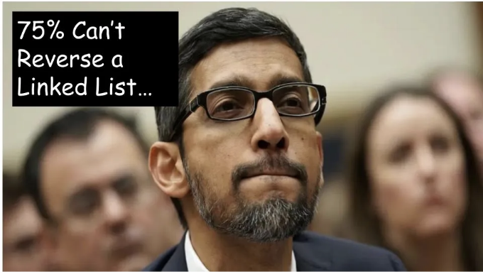
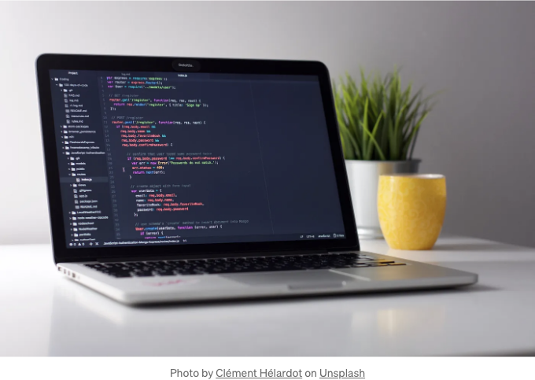
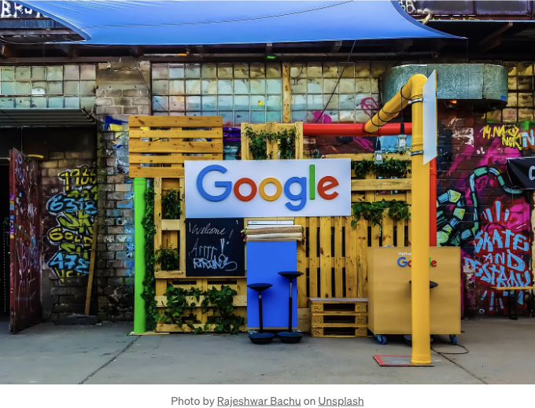

그들은 기준에 미치지 못해요.

2022년에 구글에 입사한 후, 후보자들을 면접하는 방법을 배웠어요. 후보자들을 만나고 얼마나 고난을 겪는지 보았어요. 나는 그들이 법적으로 공유할 수 있는 몇 가지 일반적인 실수를 공유할 준비가 돼 있어요.

데이터 구조를 모르는 것이 후보자를 탈락시키는 가장 큰 이유는 아니에요.

<!-- ui-log 수평형 -->
<ins class="adsbygoogle"
  style="display:block"
  data-ad-client="ca-pub-4877378276818686"
  data-ad-slot="9743150776"
  data-ad-format="auto"
  data-full-width-responsive="true"></ins>
<component is="script">
(adsbygoogle = window.adsbygoogle || []).push({});
</component>

우리가 들어가기 전에 현재 인터뷰 과정이 어떻게 이루어지는지 살펴보겠습니다.

## 온라인 평가

신입사원이라면, 코딩 문제를 해결하는 온라인 평가를 받게 될 것입니다. 어떤 언어를 사용하더라도 괜찮습니다. 이 스크린에서 얼마나 잘 하는지는 나중 인터뷰 단계에서 제안을 받을 가능성에 영향을 미치지 않을 것입니다.

<!-- ui-log 수평형 -->
<ins class="adsbygoogle"
  style="display:block"
  data-ad-client="ca-pub-4877378276818686"
  data-ad-slot="9743150776"
  data-ad-format="auto"
  data-full-width-responsive="true"></ins>
<component is="script">
(adsbygoogle = window.adsbygoogle || []).push({});
</component>

이 화면이 테스트하고 있는 것은 하나입니다:

지원자가 문제를 해결할 수 없다면, 전화 인터뷰나 현장 면접에서도 잘 하지 못할 것입니다. 합격하면 축하드립니다! 직접 면접을 진행하게 될 것입니다.

## 전화 인터뷰

<!-- ui-log 수평형 -->
<ins class="adsbygoogle"
  style="display:block"
  data-ad-client="ca-pub-4877378276818686"
  data-ad-slot="9743150776"
  data-ad-format="auto"
  data-full-width-responsive="true"></ins>
<component is="script">
(adsbygoogle = window.adsbygoogle || []).push({});
</component>

구글의 전화면 검색은 현장 면접 중 하나를 대표합니다. 지원자는 구글 음성 채팅에 참여하고 구글 IDE에서 코딩 문제를 해결할 것입니다.

지원자는 현장 면접과 동일한 기준에 따라 평가될 것입니다. 이는 지원자가 실제로 연속적인 현장 면접을 통과할 수 있는지를 평가하기 위함입니다. 일부는 통과하지만 대부분은 통과하지 못합니다.

전화면 검색에서 잘하지 못하는 지원자를 위해 알아두어야 할 사항은 다음과 같습니다:

- 두 번째 기회를 줄 수 있습니다. 인사 담당자에게 요청하고 왜 다시 기회를 받아야 하는지 또는 코딩 기술을 모두 표현하지 못했는지 설명하세요.
- 최소 12개월 이상 다시 지원하기 위해 기다려야 할 것입니다.

<!-- ui-log 수평형 -->
<ins class="adsbygoogle"
  style="display:block"
  data-ad-client="ca-pub-4877378276818686"
  data-ad-slot="9743150776"
  data-ad-format="auto"
  data-full-width-responsive="true"></ins>
<component is="script">
(adsbygoogle = window.adsbygoogle || []).push({});
</component>

현장 면접까지 도달하면 후보자는 진지한 면접을 준비해야 합니다.

## 현장 면접

Google의 현장 면접에 합격하는 것은 그 자체로 흔치 않은 성취입니다. 이 정도로 도달하는 소수의 후보자들을 위해 여기 알아두어야 할 사항들입니다.

<!-- ui-log 수평형 -->
<ins class="adsbygoogle"
  style="display:block"
  data-ad-client="ca-pub-4877378276818686"
  data-ad-slot="9743150776"
  data-ad-format="auto"
  data-full-width-responsive="true"></ins>
<component is="script">
(adsbygoogle = window.adsbygoogle || []).push({});
</component>

- 후보자가 어떻게 코드를 작성하는지 아주 잘 알려져 있습니다.
- 각 면접마다 다양한 시나리오와 상황을 평가받을 수 있습니다.  

현장 면접 지원자들은 4~5개의 연속적인 면접을 받습니다. 대부분은 코딩 및 행동 (Google-스러운 행동) 면접과 더불어 더 고차원의 엔지니어를 위한 시스템 설계 면접으로 구성됩니다. 후보자가 전문적인 직장에서 성장할 수 있다면 Google-스러움은 문제가 되지 않습니다.

여기까지 선발된 소수의 후보자 중에서도, 거의 대부분이 제안을 받지 못합니다. 제안을 받지 못한 자에게 Google은 법률적으로 후기를 제공하지 않습니다. Google-스러움이 문제가 아니라면, 무언가 코딩 면접에서 잘못된 것입니다.

코딩 인터뷰에서 종종 잘못되는 부분은 다음과 같습니다.

<!-- ui-log 수평형 -->
<ins class="adsbygoogle"
  style="display:block"
  data-ad-client="ca-pub-4877378276818686"
  data-ad-slot="9743150776"
  data-ad-format="auto"
  data-full-width-responsive="true"></ins>
<component is="script">
(adsbygoogle = window.adsbygoogle || []).push({});
</component>

# 코딩 면접에서 범하는 실수들

## 문제 명확히 하지 않기

후보자들은 문제 제시와 동시에 추가 질문을 하지 않고 문제에 즉시 뛰어 들기 마련입니다. 인터뷰어가 그들을 바로 잡아줄 수도 있지만, 그렇지 않은 경우 후보자는 스스로 잘못된 문제를 해결하고 있다는 것을 알아차리지 못할 수 있습니다.

<!-- ui-log 수평형 -->
<ins class="adsbygoogle"
  style="display:block"
  data-ad-client="ca-pub-4877378276818686"
  data-ad-slot="9743150776"
  data-ad-format="auto"
  data-full-width-responsive="true"></ins>
<component is="script">
(adsbygoogle = window.adsbygoogle || []).push({});
</component>

##  중요하지 않은 세부 사항에 집중하기

만약 문제가 이진 탐색에 관한 것이라면, 더 큰 부분에 주안점을 두고 나중에 작은 세부 사항으로 돌아오세요. 어떤 사람들은 널 예외나 잘못된 입력에 대해 반의반 정도의 면접 시간을 보내고 질문에 대한 해결책을 찾지 못합니다.

## 침묵을 유지하기

지원자들이 멈추어 버릴 수 있고 면접관들도 이를 알고 있습니다. 지원자가 해야 하는 것은 무슨 질문을 해야 하는지 알고, 소리를 내며 생각을 공유하고 면접관의 의견을 수용하는 것입니다. 대부분의 지원자들은 침묵에 잠겨 있는데, 대부분은 코딩 면접 중에 어떻게 소통해야 하는지 가르치는 사람이 없어서 그렇습니다.

<!-- ui-log 수평형 -->
<ins class="adsbygoogle"
  style="display:block"
  data-ad-client="ca-pub-4877378276818686"
  data-ad-slot="9743150776"
  data-ad-format="auto"
  data-full-width-responsive="true"></ins>
<component is="script">
(adsbygoogle = window.adsbygoogle || []).push({});
</component>

## 코드가 작성되었을 때

코드를 작성하고 나면 모두가 축하하고 면접을 마치길 원합니다. 그러나 대부분의 코드는 버그가 있을 가능성이 높습니다. 후보자가 예제 테스트 케이스를 검토하고 코드를 실행해보는 것이 중요합니다. 이 단계를 건너뛰면 전문가적이지 못합니다.

## 실행 시간 언급

후보자에게 알고리즘의 실행 시간에 대해 묻는 것은 필수입니다. 대부분은 그냥 O(n)이나 O(nlogn)이라고 말할 것입니다. 이에 대해 설명이 없습니다. 더 좋은 후보자들은 그 이유를 설명하는 사람들입니다. 그리고 가장 좋은 사람들은 코드의 다른 부분들의 실행 시간을 설명하고 병목이 어디에 있는지 이유를 설명하는 후보자들입니다.

<!-- ui-log 수평형 -->
<ins class="adsbygoogle"
  style="display:block"
  data-ad-client="ca-pub-4877378276818686"
  data-ad-slot="9743150776"
  data-ad-format="auto"
  data-full-width-responsive="true"></ins>
<component is="script">
(adsbygoogle = window.adsbygoogle || []).push({});
</component>

# 마무리

Google에서 면접을 보는 대부분의 지원자들은 코딩을 할 줄 알며 데이터 구조와 알고리즘을 연습하는 경향이 있습니다. 제안을 받는 사람과 받지 못하는 사람 사이의 가장 큰 차이는 코딩 프로세스를 얼마나 잘 전달하는지에 있습니다.

# 떠나시기 전에

- 시스템 디자인 뉴스레터!
- Discord에서 개인적으로 소통하기